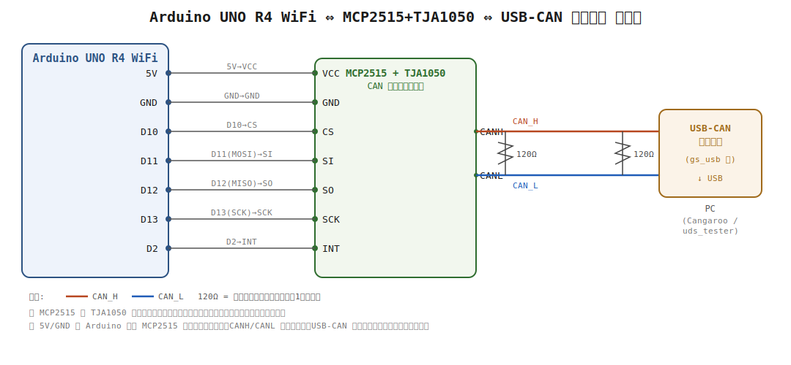

# arduino-autosar-my-study

Arduino UNO R4 WiFi + MCP2515 + TJA1050 を用いて 
AUTOSAR CP の BSW CAN スタックを学習目的で実装したプロジェクトです。
ARXML や設定ツールは使用せず、コードで階層構造・型定義・設定テーブルを再現しています。

## 概要

本プロジェクトは、学習目的で AUTOSAR の ASW / RTE / BSW の 3 層アーキテクチャを
Arduino UNO 上に最小構成で再現し、その上でメータ ECU（インストルメントクラスタ）相当の
アプリケーションを動作させることを目的としています。

システムは、エンジン ECU（CAN 0x100）と ABS ECU（CAN 0x110）の 2 つの周辺 ECU から
CAN バス経由でデータを受信し、BSW（CanDrv / CanIf / PduR / Com）が信号を抽象化します。

抽象化されたデータは RTE を介して 2 つの ASW SW-Component に提供されます。
SW-C は RTE の Client/Server ポート経由で IoHwAb（I/O Hardware Abstraction）を呼び出し、
SW-C がピン番号などのハードウェア詳細を知ることなく警告灯（LED）を制御します。

これにより、実車のメータ ECU が持つ
「CAN 受信（複数 ECU）→ 状態判定 → 優先度付き警告灯制御」
という典型的な処理フローを、Arduino 上で簡易的に再現します。

- **RX（CAN ID 0x100）**: エンジン ECU から回転数・水温・ON フラグを受信（AUTOSAR E2E Profile 01 保護付き）
- **RX（CAN ID 0x110）**: ABS ECU から車速・ブレーキ作動・ABS 作動フラグを受信
- **TX（CAN ID 0x200）**: エンジン状態（OFF / STARTING / RUNNING / FAULT）を変化時送信＋周期フロア（ComFilterAlgorithm、E2E 保護なし）
- **TX（CAN ID 0x210）**: 3 本の警告灯状態（RUNNING/FAULT/ABS）を Com Signal Group として一括送信
- **TX（CAN ID 0x220）**: E2E 検証エラーの累積カウンタ（CRC不一致/シーケンス異常）を Com の PERIODIC 送信モードで 6000ms 周期送信（E2EMon、独自 CDD 相当、AUTOSAR E2E Profile 01 保護付き）
- **診断 RX（CAN ID 0x7E0）**: UDS 診断要求を受信（ISO 14229-1 / ISO 15765-2）
- **診断 TX（CAN ID 0x7E8）**: UDS 診断応答を送信（マルチフレーム対応）
- **RUNNING LED（D6）**: ENGINE_STATE_RUNNING のとき点灯
- **FAULT LED（D7）**: ENGINE_STATE_FAULT のとき 500ms 周期で点滅
- **ABS LED（D8）**: ABS 作動（AbsActive=1）のとき点灯
- **警告確認ボタン（D9）**: FAULT 状態でボタンを押すと FAULT→OFF に遷移（ドライバーが警告を確認したことを通知）
- **ボランタリスリープ/ウェイクアップ**: エンジン OFF が一定時間継続すると CAN バスを実際にスリープさせ、バス活動を検知すると自律的に復帰する

## ハードウェア・ビルド

### ハードウェア構成

| 機器 | 用途 |
|------|------|
| Arduino UNO R4 WiFi | マイコン本体 |
| MCP2515 + TJA1050 | CAN コントローラ + トランシーバ |
| LED + 抵抗（220〜470 Ω）× 3 | RUNNING 灯（D6）/ FAULT 灯（D7）/ ABS 灯（D8）各 1 本 |
| プッシュボタン | 警告確認ボタン（D9 と GND を接続・内部プルアップ使用） |
| USB-CAN アダプタ | PC との CAN バス接続（解析用） |
| Cangaroo 等 | CAN フレーム送受信ツール |
| tools/uds_tester（本リポジトリ同梱） | UDS コマンドのボタン送信・FC 自動応答（後述） |

#### 配線図



#### MCP2515 接続（Arduino UNO）

| MCP2515 ピン | Arduino ピン | 備考 |
|-------------|-------------|------|
| CS | D10 | SPI チップセレクト |
| INT | D2 | 受信割り込み（ポーリング）|
| SCK | D13 | SPI クロック |
| SI (MOSI) | D11 | SPI データ出力 |
| SO (MISO) | D12 | SPI データ入力 |

> **D13 は MCP2515 の SCK と共用されるため LED には使用できません。**
> LED は D6（RUNNING）・D7（FAULT）・D8（ABS）それぞれに 220〜470 Ω の抵抗を直列に挿入して接続してください。

> **警告確認ボタン（D9）** は D9 と GND の間にプッシュボタンを接続するだけです。
> Port が `INPUT_PULLUP` で初期化するため、外部プルアップ抵抗は不要です。
> ボタン押下時に D9 が GND と接続され `DIO_LOW` となり、`IoHwAb_Button_GetLevel()` 内で論理反転して「押下=1」に変換されます。

> CAN バスには両端に終端抵抗（120 Ω）が必要です。

### ビルド環境・設定

| 項目 | 値 |
|------|-----|
| プラットフォーム | PlatformIO + Renesas RA (`platform = renesas-ra`) |
| ボード | Arduino UNO R4 WiFi (`board = uno_r4_wifi`) |
| フレームワーク | Arduino |
| 外部ライブラリ | coryjfowler/mcp_can @ ^1.5.1 |
| CAN ボーレート | 500 kbps |
| シリアルモニタ | 115200 bps |

### ビルドと書き込み

```bash
# ビルド
pio run

# 書き込み
pio run --target upload

# シリアルモニタ
pio device monitor
```

## アーキテクチャ

### 層構造

```
ASW ─── App_EngineManager / App_WarningIndicator
RTE ─── Rte（ポートベース S/R API + E2E Transformer 呼び出しグルー）
OS  ─── Os（タイムトリガスケジューラ）
BSW ─── EcuM / BswM / WdgM / ComM / CanSM / Nm / E2EXf / E2E / Com / PduR / CanIf / Can
        CanTp / Dcm / Dem / NvM / IoHwAb / Dio / Port / Adc / SchM / Det
HAL ─── Can_Hw / Dio_Hw / Port_Hw / Adc_Hw / Mcu_Hw / NvM_Hw / WdgM_Hw（src/Hal/ に集約）
```

各層は上位層のヘッダのみに依存し、下位層の実装詳細を知りません。

### モジュール一覧

| 層 | モジュール | AUTOSAR 仕様 | 本プロジェクトでの役割 |
|---|---|---|---|
| ASW | App_EngineManager | — | エンジン状態遷移（OFF / STARTING / RUNNING / FAULT）・DTC 登録・CAN TX 要求。OFF 継続を検知して ComM へ通信不要（NO_COM）を要求するボランタリスリープ判断も担う |
|  | App_WarningIndicator | — | 3 LED 独立制御（D6=RUNNING / D7=FAULT 点滅 / D8=ABS） |
| RTE | Rte | — | ポートベース S/R API。複数 SW-C が同一シグナルを独立ポートで受信。E2E Transformer を持つ Read ポートは `Std_ReturnType` ではなく `Rte_IStatusType` を返し、E2E チェック結果（OK/ハードエラー/ソフトエラー）と Com タイムアウトを区別して SWC へ伝える |
| OS | Os | SWS_Os | タイムトリガスケジューラ。タスクごとに周期を設定し `Os_SchedulerStep()` で到来タスクを順次実行 |
| BSW | EcuM | SWS_EcuStateManager | ECU ライフサイクルを STARTUP → RUN → POST_RUN → SHUTDOWN の状態マシンで管理。`EcuM_RequestRUN` / `EcuM_ReleaseRUN` で RUN フェーズを調停。SHUTDOWN は CAN バスのウェイクアップにより常に RUN へ復帰可能（実機リセットが必要な終端状態は存在しない） |
|  | BswM | SWS_BswM | EcuM / ComM のモード変化をルールテーブルで受け取り `Os_SetTaskActive()` でタスクを有効・無効化するルールエンジン。POST_RUN 中はアプリタスクのみ停止し BSW タスクは継続 |
|  | WdgM | SWS_WdgM | Supervised Entity の Alive Supervision（呼び出し回数を6000msごとに評価）・Logical Supervision（チェックポイント順序）・Deadline Supervision（チェックポイント間の経過時間）を独立したステータスで管理。判定は6000ms周期、実HWウォッチドッグへのリフレッシュは別途1000ms周期（WdgM_TriggerHwWatchdog）で行い、異常時はリフレッシュを止めて実際にMCUをリセットする |
|  | ComM | SWS_ComM | CAN バスの通信モード（NO_COM / SILENT_COM / FULL_COM）を管理し CanSM へ要求。`ComM_BusSMIndication` で EcuM の RUN 要求を操作。複数ユーザ（App_EngineManager=COMM_USER_0, Dcm=COMM_USER_1）の要求を最も通信レベルの高いモードへ集約する調停ロジックを持つ。両ユーザが NO_COM を要求したときのみ実際にボランタリスリープへ落ちる |
|  | CanSM | SWS_CanSM | Bus-Off 検出直後（回復試行の前）に `ComM_BusSMIndication(SILENT_COMMUNICATION)` を呼び、ComM のチャネル状態が回復完了まで FULL_COM のまま古い情報として残ることを防ぐ（SWS_CanSM_00521。SILENT_COM は EcuM の RUN を維持するため回復中も RUN は落ちない）。回復シーケンスは L1/L2 バックオフ（SWS_CanSM_00514/00515 準拠）で実施し、試行回数が `CANSM_BUSOFF_L1_TO_L2_COUNT` を超えるまでは短い周期（L1）でリトライし、超えたら Dem へ DTC を報告（limit=1 のため即座に確定）した上で長い周期（L2）へ切り替えて無期限にリトライを継続する（回復を諦めて停止する状態は存在しない）。再起動試行のたびに `ComM_BusSMIndication(FULL_COM)` を呼ぶ。ComM の NO_COM 要求によるボランタリスリープでは `Can_SetControllerMode(CAN_T_SLEEP)` で実 HW を実際にスリープさせ、`CanSM_ControllerWakeup()` による復帰経路を持つ。復帰は即座に確定せず、ウェイクアップ検証（Wakeup Validation Protocol 相当）により有効な CAN フレーム受信を確認してから FULL_COM へ確定する |
|  | Nm | SWS_CANNM | ネットワークマネジメント。ComM が FULL_COM の間、1000ms 周期（MeterStatus の 3000ms より高頻度）で NM フレーム (CAN 0x400) を送信し生存を示す。PduR/Com を経由せず `CanIf_Transmit` を直接呼ぶ点が実車の CanNm と同じ。シグナル値を運ばないため E2E 保護は付与しない |
|  | E2E | SWS_E2E | AUTOSAR E2E Profile 01 保護の実処理。DataID・CRC8 (SAE J1850)・4bit カウンタの 3 要素で、`E2E_P01Check` はデータ破壊・フレーム脱落・重複・誤ルーティングを検出、`E2E_P01Protect` は Counter・CRC8 を付加。Com/Rte のどちらにも依存しない純粋な検証/付与ライブラリ |
|  | E2EXf | SWS_E2ELibrary 12.4 (E2E Transformer) | Com と E2E の間を仲介する統合層。RX は `E2EXf_InverseTransform` が `E2E_P01Check` を呼び、EngineInfo (CAN 0x100)・AbsInfo (CAN 0x110) のデータ破壊・フレーム脱落・重複・誤ルーティングを検出して Dem へそれぞれ DTC 0x00010A・0x000109 を報告。TX は `E2EXf_Transform` が `E2E_P01Protect` を呼び、E2EHealthStatus (CAN 0x220、E2EMon が発行するネットワーク健全性テレメトリ) に Counter・CRC8 を付加。呼び出し元は Rte 層のグルー関数（`Rte_COMCbk_*`/`Rte_COMTransform_*`）で、Com 自身はこの層の存在を知らない |
|  | E2EMon | — (独自 CDD 相当) | 標準 AUTOSAR モジュールには存在しない、実務でよく見る「独自 CDD」パターンの例。EngineInfo/AbsInfo の E2E 検証結果を `E2EMon_NotifyCheckResult()` 経由で購読し、CRC 不一致・シーケンス異常の累積回数（RAM のみ、0xFF 飽和）を集計して `Com_SendSignal()` で公開する。E2EXf/Rte/Com 自体は無改造のまま、標準モジュールの通知フック経由で配線するだけの独立モジュールとして実装している |
|  | Com | SWS_Com | シグナルのビット単位パック／アンパックと受信デッドライン監視（タイムアウト検出）のみを担い、E2E には一切関知しない（E2E Transformer 方式）。I-PDU ごとの `RxIndicationCbk`/`TxTransformCbk`（`Com_IPduConfigType` の汎用フック、`Com_PBCfg.c` で設定）を通じて Rte 層のグルー関数を呼ぶだけで、中身が E2E であることも Com.c 本体には埋め込まれない。TX I-PDU ごとに `TxModeMode`（DIRECT/MIXED/PERIODIC）を設定でき、DIRECT/MIXED は `Com_SendSignal()`/`Com_SendSignalGroup()` が ComFilterAlgorithm を通過した変化を検知すると `Com_TxPending[]` を立てて次回 `Com_MainFunction()`（Os の 100ms タスク）で送信、MIXED はさらに変化がなくても一定間隔で再送する周期フロアを併せ持つ、PERIODIC は変化に関わらず `Com_MainFunction()` の中で実時間ベースに送信タイミングを判断する。実際に `PduR_Transmit()`（→ MCP2515 への SPI 送信）を呼ぶのは常に `Com_MainFunction()` のみであり、`Com_SendSignal()`/`Com_SendSignalGroup()` を呼ぶ ASW Runnable のスタックフレーム内で SPI 送信がブロッキングすることはない（バス輻輳時の送信遅延が WdgM の Deadline Supervision に影響しないようにするための設計）。いずれも ASW/CDD は値を更新するだけで送信タイミングには一切関与しない。WarningStatus (0x210) は Signal Group として複数シグナルを `Com_SendSignalGroup()` でシャドウバッファから一括コミットする |
|  | PduR | SWS_PduR | 受信 PDU を Com へ、送信 PDU を CanIf へルーティング。通信スタックの配管役 |
|  | CanIf | SWS_CanIf | CAN ID ↔ 論理 PDU のマッピング。上位層は CAN ID を知らず PDU ID で通信。設定 DLC 未満の受信 L-PDU は上位層へ渡さず棄却する（SWS_CANIF_00026 のデータ長チェック） |
|  | Can | SWS_Can | MCP2515 の送受信・Bus-Off 検出・CAN バス活動によるウェイクアップ検出を担う MCAL 最下層。HW を直接操作する唯一のモジュール |
|  | CanTp | SWS_CanTp | ISO 15765-2 のフレーム分割（FF/CF）と再組立。8 バイトを超える UDS 応答を実現 |
|  | Dcm | SWS_Dcm | UDS 診断サービス処理（SID 0x10 / 0x11 / 0x14 / 0x19 / 0x22 / 0x27 / 0x28 / 0x2E / 0x2F / 0x31 / 0x3E）。S3 タイマでセッションを自動失効。SID×セッション許可テーブルで 0x14/0x27/0x28/0x2E/0x2F/0x31 を extendedSession 限定とし、SecurityAccess (0x27) でシード・キー認証保護。0x2E は要求が7バイト超のため CanTp の複数フレーム要求受信を実機検証。0x2F (IOControl) は Rte 層でランプ出力を ASW から奪って強制する診断専用オーバーライド。0x28 (CommunicationControl) は Com/Nm の送受信を個別に有効/無効化する |
|  | Dem | SWS_Dem | 診断イベントを DTC として管理。カウンタベースのデバウンスで確定し、NvM 経由で EEPROM に永続化。デバウンス確定 FAILED 時に FreezeFrame（RAM のみ）を記録し、ExtendedData（故障確定回数、NvM 永続化）を+1。クリーンな操作サイクルを1回経過すると PendingDTC を自動解除し、再故障せず複数回の操作サイクルを経ると経年回復（Aging）で CONFIRMED を自動解除 |
|  | FiM | SWS_FiM | Dem が確定（CONFIRMED）した DTC をもとにアプリ機能（FID）の実行許可を判定。100ms 周期で再評価し、結果を ASW へ `Rte_Call_FiM_GetFunctionPermission` で公開 |
|  | NvM | SWS_NvM | EEPROM の読み書きを抽象化。Dem は EEPROM アドレスを直接知らない。各ブロックに CRC8 を付加して破損を検出し、不一致時は ROM デフォルト値（NvM_RestoreBlockDefaults）へ自動復元 |
|  | IoHwAb | AUTOSAR 抽象化層 | Dio チャネル番号を隠蔽し SW-C に論理的な LED / ボタン / ADC API を提供。10ms 周期でデバウンス（40ms 確定）・ボタン固着検出・ADC 電圧低下を Dem 報告 |
|  | Dio | SWS_Dio | `Dio_WriteChannel` / `Dio_ReadChannel` で GPIO 値を読み書きする MCAL |
|  | Port | SWS_Port | `Port_Init` でピン方向（OUTPUT / INPUT_PULLUP）を設定する MCAL |
|  | Adc | SWS_Adc | `Adc_ReadChannel` で 10-bit アナログ生値（0–1023）を読み取る MCAL |
|  | SchM | SWS_SchM | 排他エリアマクロ（`SchM_Enter` / `SchM_Exit`）で共有リソースを保護。実体は `SchM_Hw`（`noInterrupts()`/`interrupts()`）で、Can の割り込みペンディングフラグを実際に保護する |
|  | Det | SWS_Det | `DET_LOG*` マクロ経由でタイムスタンプ付きログを Serial に出力するデバッグ用ブリッジ |
| HAL | Can_Hw | — | MCP2515 / mcp_can C++ ラッパー（RX 割り込み登録 `Can_Hw_AttachRxIsr` を含む） |
|  | Dio_Hw | — | Arduino `digitalWrite` / `digitalRead` ラッパー |
|  | Port_Hw | — | Arduino `pinMode` ラッパー |
|  | Adc_Hw | — | Arduino `analogRead` ラッパー |
|  | SchM_Hw | — | Arduino `noInterrupts()`/`interrupts()` ラッパー |
|  | Mcu_Hw | — | リセット要因の読み取り（AVR MCUSR / Renesas RA RSTSR0-1）・起動時ウォッチドッグ無効化 |
|  | NvM_Hw | — | EEPROM 読み書き（AVR `avr/eeprom.h` / Renesas RA `EEPROM` ライブラリ）ラッパー |
|  | WdgM_Hw | — | 実 HW ウォッチドッグの Enable / Disable / Refresh ラッパー |

> 各モジュールの詳細（フレーム構造・状態マシン・設定値）は後続セクションを参照してください。

## ディレクトリ構成

```
├── src/
│   ├── main.cpp                  # EcuM_Init / EcuM_MainFunction を呼ぶだけのエントリポイント
│   ├── Asw/
│   │   ├── App_EngineManager.h
│   │   ├── App_EngineManager.c      # エンジン状態遷移・ボランタリスリープ判断（OFF継続でComMへNO_COM要求）
│   │   ├── App_WarningIndicator.h
│   │   └── App_WarningIndicator.c   # 3 LED 独立制御（D6=RUNNING / D7=FAULT 点滅 / D8=ABS）
│   ├── Rte/
│   │   ├── Rte_Type.h            # アプリ型エイリアス（ARXML 自動生成相当）
│   │   ├── Rte.h
│   │   └── Rte.c                 # ポート API（周期管理は Os へ移管済み）・ランプ IOControl 調停・ComM_USER_0 要求ポート
│   ├── Os/
│   │   ├── Os_Cfg.h              # タスク数定数
│   │   ├── Os.h / Os.c           # タイムトリガスケジューラ（Os_SchedulerStep）
│   │   ├── Os_PBCfg.h
│   │   └── Os_PBCfg.c            # タスクテーブル（周期・関数ポインタ）
│   ├── Bsw/
│   │   ├── Can/                  # CAN ドライバ（AUTOSAR SWS_Can 準拠 API）
│   │   │   ├── Can.h             # 公開インタフェース
│   │   │   └── Can.c             # AUTOSAR Can モジュール（純粋 C、Can_Hw へ委譲。境界は src/Hal/Can_Hw.h）。Can_Isr は真の割り込みでペンディングフラグを立てるのみ、実処理は Can_MainFunction_Read/BusOff/Wakeup
│   │   ├── CanIf/                # CAN インタフェース
│   │   │   ├── CanIf_Types.h     # 型定義（Can_PduType 等）
│   │   │   ├── CanIf_Cfg.h       # TX/RX PDU テーブル数定数
│   │   │   ├── CanIf_PBCfg.h     # ポストビルド設定宣言（CanIf_Config）
│   │   │   ├── CanIf_PBCfg.c     # TX/RX PDU ルーティングテーブル実体
│   │   │   ├── CanIf.h           # 公開インタフェース（CanIf_Transmit / CanIf_RxIndication）
│   │   │   └── CanIf.c           # CAN ID ↔ 論理 PDU マッピング・Can/PduR 間の仲介・ControllerBusOff/Wakeup 通知の中継・全受信フレームを CanSM_RxIndication へ転送（ウェイクアップ検証用）
│   │   ├── CanTp/                # CAN トランスポートプロトコル（ISO 15765-2）
│   │   │   ├── CanTp_Cfg.h       # ブロックサイズ・STmin・タイムアウト設定
│   │   │   ├── CanTp.h           # 公開インタフェース（CanTp_Transmit / CanTp_RxIndication）
│   │   │   └── CanTp.c           # SF/FF/CF/FC 状態機械・マルチフレーム組立分割
│   │   ├── E2E/                  # AUTOSAR E2E Profile 01 保護（CRC8 SAE J1850 + 4bit カウンタ）
│   │   │   ├── E2E_P01.h         # 設定型・状態型・API 宣言（Check: E2E_P01Check/CheckInit、Protect: E2E_P01Protect/ProtectInit）
│   │   │   └── E2E_P01.c         # CRC8 計算・受信検証（カウンタデルタ判定）・送信保護（Counter更新+CRC付加）実装
│   │   ├── E2EXf/                # E2E Transformer（Com から E2E ロジックを切り離す統合層）
│   │   │   ├── E2EXf.h           # 汎用 API 宣言（E2EXf_Init/E2EXf_InverseTransform/E2EXf_Transform、E2E_P01 への薄いラッパー）
│   │   │   ├── E2EXf.c           # 上記実装（Dem_ReportErrorStatus への報告・モジュール自身の初期化状態ガードも含む）
│   │   │   ├── E2EXf_PBCfg.h     # ポストビルド設定宣言（E2EXf_*RxCfg/TxCfg、E2EXf_PBCfg_Init）
│   │   │   └── E2EXf_PBCfg.c     # I-PDU ごとの E2E P01 設定/状態実体（EngineInfo/AbsInfo/E2EHealthStatus）
│   │   ├── E2EMon/                # 独自 CDD 相当（標準 AUTOSAR モジュールではない、E2E 健全性監視の例）
│   │   │   ├── E2EMon.h          # 公開インタフェース（E2EMon_Init/E2EMon_NotifyCheckResult）
│   │   │   └── E2EMon.c          # E2E 検証結果の累積カウンタ・Com_SendSignal() での公開
│   │   ├── Com/                  # COM（シグナル管理、E2E には一切関知しない）
│   │   │   ├── Com_Types.h       # 型定義（Com_SignalIdType / Com_IPduIdType / Com_IPduConfigType の RxIndicationCbk/TxTransformCbk 等）
│   │   │   ├── Com_Cfg.h         # I-PDU・シグナル数定数・シグナル ID
│   │   │   ├── Com_PBCfg.h       # ポストビルド設定宣言（Com_Config）
│   │   │   ├── Com_PBCfg.c       # I-PDU/シグナルレイアウトテーブル実体（RxIndicationCbk/TxTransformCbk で Rte 層のグルー関数を紐付けるのみ、E2E の詳細は持たない）
│   │   │   ├── Com.h             # 公開インタフェース（Com_SendSignal / Com_ReceiveSignal / Com_ReceiveSignalGroupArray / Com_IsRxTimedOut）
│   │   │   └── Com.c             # シグナルパック/アンパック・受信デッドライン監視・ComFilterAlgorithm（送信要否判定）・Signal Group（Com_SendSignalGroup）
│   │   ├── PduR/                 # PDU ルーター
│   │   │   ├── PduR_Types.h      # 型定義
│   │   │   ├── PduR_Cfg.h        # RX/TX ルーティングパス数定数
│   │   │   ├── PduR_PBCfg.h      # ポストビルド設定宣言（PduR_Config）
│   │   │   ├── PduR_PBCfg.c      # ルーティングテーブル実体
│   │   │   ├── PduR_COM.h        # COM 向けコールバック型定義
│   │   │   ├── PduR_CanIf.h      # CanIf 向けコールバック型定義
│   │   │   ├── PduR.h            # 公開インタフェース
│   │   │   └── PduR.c            # PDU マルチキャスト配信・送信完了通知の転送
│   │   ├── Det/                  # Default Error Tracer（Serial ブリッジ）
│   │   │   ├── Det.h             # ログマクロ定義（DET_LOGI/W/E/D）
│   │   │   └── Det.cpp           # Arduino Serial 出力実装（Arduino API を呼ぶ唯一の場所）
│   │   ├── Dio/                  # デジタル I/O 値読み書き（MCAL・方向設定は Port が担う）
│   │   │   ├── Dio_Cfg.h         # チャネル ID 定義（D6=RUNNING / D7=FAULT / D8=ABS / D9=ボタン）
│   │   │   ├── Dio.h             # 公開インタフェース（Dio_WriteChannel / Dio_ReadChannel）
│   │   │   └── Dio.c             # AUTOSAR Dio モジュール（純粋 C、Dio_Hw へ委譲。境界は src/Hal/Dio_Hw.h）
│   │   ├── Port/                 # ピン方向設定（MCAL・Dio と責務を分離）
│   │   │   ├── Port_Cfg.h        # ピン番号定義（D6/D7/D8 OUTPUT / D9 INPUT_PULLUP）
│   │   │   ├── Port.h            # 公開インタフェース（Port_Init / Port_SetPinDirection）
│   │   │   └── Port.c            # AUTOSAR Port モジュール（純粋 C、Port_Hw へ委譲。境界は src/Hal/Port_Hw.h）
│   │   ├── Adc/                  # ADC ドライバ（AUTOSAR SWS_Adc 準拠 API）
│   │   │   ├── Adc_Cfg.h         # チャネル定義・分解能・基準電圧
│   │   │   ├── Adc.h             # 公開インタフェース（Adc_ReadChannel）
│   │   │   └── Adc.c             # AUTOSAR Adc モジュール（純粋 C、Adc_Hw へ委譲。境界は src/Hal/Adc_Hw.h）
│   │   ├── IoHwAb/               # I/O ハードウェア抽象化（MCAL と SW-C の境界）
│   │   │   ├── IoHwAb.h          # 公開インタフェース（RTE が参照）
│   │   │   └── IoHwAb.c          # Dio/Adc へ委譲・デバウンス（40ms）・固着検出・ADC 電圧低下検出（Dem 報告）
│   │   ├── SchM/                 # スケジュールマネージャ（排他エリアマクロ）
│   │   │   └── SchM.h            # SchM_Enter/Exit マクロ定義（全モジュール共通、実体は src/Hal/SchM_Hw.h）
│   │   ├── EcuM/                 # ECU ステートマネージャ（ライフサイクル管理）
│   │   │   ├── EcuM_Cfg.h        # RUN ユーザ定義・POST_RUN タイムアウト
│   │   │   ├── EcuM.h            # 公開インタフェース・EcuM_StateType 定義
│   │   │   └── EcuM.c            # 状態マシン・EcuM_RequestRUN / EcuM_ReleaseRUN（SHUTDOWN→RUNのCANウェイクアップ復帰対応）
│   │   ├── BswM/                 # BSW モードマネージャ（ルール駆動タスク制御）
│   │   │   ├── BswM_Cfg.h        # タスク ID 定数・タスクマスク定義
│   │   │   ├── BswM_PBCfg.h      # ルール構造体型定義・BswM_Config 宣言
│   │   │   ├── BswM_PBCfg.c      # ルールテーブル実体（3 ルール）
│   │   │   ├── BswM.h            # 公開インタフェース（Init / EcuM通知 / ComM通知）
│   │   │   └── BswM.c            # ルールエンジン実装・Os_SetTaskActive 呼び出し
│   │   ├── WdgM/                 # ウォッチドッグマネージャ（Alive + Logical Supervision）
│   │   │   ├── WdgM_Cfg.h        # エンティティ ID・チェックポイント ID・監視サイクル・期待回数定義
│   │   │   ├── WdgM_PBCfg.h      # エンティティ/遷移設定構造体型定義・WdgM_Config 宣言
│   │   │   ├── WdgM_PBCfg.c      # エンティティテーブル・許可遷移テーブル実体（App_EngineManager_Run / App_WarningIndicator_Run）
│   │   │   ├── WdgM.h            # 公開インタフェース（Init / CheckpointReached / MainFunction）
│   │   │   └── WdgM.c            # Alive/Logical/Deadline 判定(6000ms) + HW WDT trigger(1000ms、WdgM_Hw へ委譲。境界は src/Hal/WdgM_Hw.h)
│   │   ├── ComM/                 # 通信マネージャ（CAN バス通信モード管理）
│   │   │   ├── ComM_Cfg.h        # チャネル数・ユーザ数定数
│   │   │   ├── ComM.h            # 公開インタフェース（NO_COM/SILENT_COM/FULL_COM）
│   │   │   └── ComM.c            # 複数ユーザ要求の集約（調停）・CanSM_RequestComMode へ委譲
│   │   ├── CanSM/                # CAN ステートマネージャ（Bus-Off 回復シーケンス、L1/L2 バックオフ）
│   │   │   ├── CanSM_Cfg.h       # L1/L2 回復待機時間・L1→L2 切替閾値
│   │   │   ├── CanSM.h           # 公開インタフェース・CanSM_ControllerBusOff コールバック
│   │   │   └── CanSM.c           # 状態機械・Bus-Off L1/L2 バックオフ回復タイマ管理・NO_COM要求時に CAN コントローラを実際にスリープ・ウェイクアップ検証（CanSM_ControllerWakeup/CanSM_RxIndication/検証タイムアウト）
│   │   ├── Nm/                   # ネットワークマネジメント（NM フレーム送信）
│   │   │   ├── Nm_Cfg.h          # NM フレーム周期・DLC・ノード ID 定数
│   │   │   ├── Nm.h              # 公開インタフェース（Nm_Init / Nm_MainFunction）
│   │   │   └── Nm.c              # ComM FULL_COM 中のみ CanIf_Transmit を直接呼び出す（PduR/Com 非経由）
│   │   ├── Dcm/                  # 診断通信マネージャ（UDS ISO 14229-1）
│   │   │   ├── Dcm_Cfg.h         # SID/NRC/DID 定数・セッション・S3 タイマ・SecurityAccess 設定
│   │   │   ├── Dcm_Cbk.h         # PduR から呼ばれる受信コールバック宣言（Dcm_ComIndication）
│   │   │   ├── Dcm.h             # 公開インタフェース（Dcm_Init / Dcm_MainFunction）
│   │   │   └── Dcm_Cbk.c         # UDS サービスディスパッチ実装・S3 タイマ監視・SecurityAccess/RoutineControl 状態機械
│   │   ├── Dem/                  # 診断イベントマネージャ（DTC 管理）
│   │   │   ├── Dem_Cfg.h         # イベント ID・DTC コード・ステータスビットマスク・デバウンス閾値
│   │   │   ├── Dem.h             # 公開インタフェース（ReportErrorStatus / GetAllDTCs / FreezeFrame）
│   │   │   └── Dem.c             # DTC ライフサイクル・デバウンス・FreezeFrame 記録・NvM 永続化
│   │   ├── FiM/                  # 機能抑止マネージャ（DTC→機能抑止）
│   │   │   ├── FiM_Cfg.h         # 機能 ID (FID) 定義
│   │   │   ├── FiM_PBCfg.h       # FID×イベント設定構造体型定義・FiM_Config 宣言
│   │   │   ├── FiM_PBCfg.c       # FID×イベント対応テーブル実体
│   │   │   ├── FiM.h             # 公開インタフェース（FiM_Init / FiM_MainFunction / GetFunctionPermission）
│   │   │   └── FiM.c             # 許可状態の再評価・キャッシュ
│   │   └── NvM/                  # Non-Volatile Memory Manager（EEPROM 抽象化）
│   │       ├── NvM_Cfg.h         # ブロック ID・EEPROM アドレス・ブロックサイズ定義
│   │       ├── NvM_PBCfg.h       # ブロック設定構造体型定義・NvM_Config 宣言
│   │       ├── NvM_PBCfg.c       # ブロック設定テーブル実体（DEM_MAGIC / DEM_STATUS）
│   │       ├── NvM.h             # 公開インタフェース（NvM_ReadBlock / NvM_WriteBlock / NvM_MainFunction / NvM_GetErrorStatus）
│   │       └── NvM.c             # RAM ミラー・非同期書き込みジョブキュー（1バイト/呼び出し。NvM_Hw へ委譲。境界は src/Hal/NvM_Hw.h）
│   └── Hal/                      # ハードウェア依存層（Bsw 各モジュールの純粋 C 実装から分離）
│       ├── Can_Hw.h / Can_Hw.cpp        # MCP2515 / mcp_can C++ ラッパー（旧 Mcp2515_Wrapper.cpp）。SLEEP時にウェイクアップ割り込みを有効化
│       ├── Dio_Hw.h / Dio_Hw.cpp        # Arduino digitalWrite / digitalRead ラッパー
│       ├── Port_Hw.h / Port_Hw.cpp      # Arduino pinMode ラッパー
│       ├── Adc_Hw.h / Adc_Hw.cpp        # Arduino analogRead ラッパー
│       ├── Mcu_Hw.h / Mcu_Hw.c          # リセット要因読み取り（AVR MCUSR / RA RSTSR0-1）・起動時 WDT 無効化
│       ├── NvM_Hw.h / NvM_Hw.cpp        # EEPROM 読み書き（AVR avr/eeprom.h / RA EEPROM.h）
│       ├── WdgM_Hw.h / WdgM_Hw.cpp      # 実 HW ウォッチドッグ Enable / Disable / Refresh(AVR wdt_* / RA WDTライブラリ)
│       └── SchM_Hw.h / SchM_Hw.cpp      # noInterrupts()/interrupts() ラッパー（SchM 排他エリアの実体）
├── dbc/
│   └── engine_manager.dbc        # CAN シグナル定義（Cangaroo 等で使用）
└── platformio.ini
```

## CAN 通信スタック（Can / CanIf / PduR / Com）

CAN ドライバ（Can / Can_Hw）から CanIf・PduR を経由して COM モジュールへ至るデータパスを担うスタックです。
RX フレームは MCP2515 → Can_Hw → Can → CanIf → PduR → Com の順に上がり、TX フレームは逆順に下ります。

**受信長チェックの多層防御**: 設定 DLC に満たない短小フレームは、まず `CanIf_RxIndication()`
が棄却する（SWS_CANIF_00026 相当、本来この責務は CanIf 層にある）。仮に何らかの理由で
ここを通過しても、`Com_RxIndication()`・`CanTp_RxIndication()`（SF/FF/CF/FC 各フレーム）
がそれぞれ独立に自分の期待長を検証する。1 箇所だけに頼らず各層が自分の責務として
検証するのは、本プロジェクトで実際に発生した「短いフレームで上位層バッファに
新旧混在の破損データが残る」バグ（Com のシグナル固定長アクセス等）を踏まえた設計判断
である。なお `Com_RxIndication()` の受信長チェックは AUTOSAR 本来の仕様（SWS_Com_00574/
00575/00870、シグナル単位の部分受理）とは異なり、I-PDU 全体を丸ごと棄却する、より
単純で安全側の簡略化を採用している（詳細は `Com.c` のコメント参照）。

#### TX 確認の非同期化（`Can_MainFunction_Write`）

**なぜ非同期化したか**: AUTOSAR の仕様 [SWS_Can_00016] は、`CanIf_TxConfirmation()` を
「TX 割り込みハンドラから」または「ポーリングモードでは `Can_MainFunction_Write()` の
中から」呼ぶことを求めている。しかし当初の実装では、`Can_Write()` が送信成功直後、
呼び出し元と同一スタックフレーム内でそのまま `CanIf_TxConfirmation()` を呼んでいた。

```
（修正前）
Com_MainFunction() → Com_DoTransmit() → PduR_Transmit() → CanIf_Transmit() → Can_Write()
                                                                                → CanIf_TxConfirmation()
                                                                                  → PduR_CanIfTxConfirmation()
                                                                                    → Com_TxConfirmation()
（すべて 1 回の呼び出しチェーン内で完結）
```

これ自体は現状害がないが、将来 `Com_TxConfirmation()` の延長線上（あるいは他の
`TxConfirmFct`）に「送信失敗を検知したら即座に再送する」ような処理が足された場合、
その再送呼び出しがそのまま `Can_Write()` の再帰呼び出しになってしまう。NvM の
非同期書き込みジョブキュー（[DEVLOG参照](docs/DEVLOG.md#nvm-非同期書き込みジョブキューへの変更経緯)）
と同じ「今は実害がないが将来の変更で踏み抜きやすいスタック深化の地雷」を避ける
考え方で、この結合を断ち切った。

**設計**:

```
Can_Write(Hth, PduInfo):
  Can_Hw_Send() が成功したら、PduInfo->swPduHandle を TX 確認保留キューへ積むだけで
  即座に E_OK 相当（CAN_OK）を返す（CanIf_TxConfirmation() はまだ呼ばない）

Can_MainFunction_Write()（1ms 周期、Os_PBCfg.c Task 13）:
  保留キューが空になるまで、投入順に CanIf_TxConfirmation() を呼び出す
```

NvM の非同期ジョブキュー（1 呼び出し 1 バイトずつ）とは異なり、こちらは
`CanIf_TxConfirmation()` 自体がハードウェアをブロックしないソフトウェア的な
コールバック転送のみのため、1 回の `Can_MainFunction_Write()` 呼び出しで
保留分を全件処理してよい。

**動作への影響**: `CanIf_TxConfirmation()` の呼び出しタイミングが `Can_Write()` から
最大 1ms（Task 13 の周期）遅延するようになるが、`Com_TxConfirmation()`・
`CanTp_TxConfirmation()` のいずれも受け取った結果を使わない no-op のため、
体感できる動作変化はない（この経路は常に E_OK 固定でもある。詳細は CanTp
セクションの N_As タイムアウトの説明を参照）。

#### RX の割り込み化（`Can_Isr` / `Can_MainFunction_Read/BusOff/Wakeup`）

**なぜ割り込み化したか**: 従来 `Can_Isr()` は Os スケジューラから 1ms ごとにポーリング
呼び出しされる「疑似 ISR」で、INT ピンを `digitalRead()` で確認していた。これは
「割り込み」と名乗りながら実態はポーリングであり、AUTOSAR OS が本来持つ「タスクと
ISR は実際にプリエンプトし合う」という関係を体験できていなかった。また、SchM の
排他エリアマクロ（`SchM_Enter_Com_SIGNAL_EXCLUSIVE_AREA()` 等）も「協調スケジューリング
なので NOP でよい」という理由でずっと未使用のまま残っていた。

本変更で `Can_Hw_AttachRxIsr()`（`Can_Init()` 内）が `attachInterrupt()` で INT ピンの
立ち下がりエッジに `Can_Isr()` を真のハードウェア割り込みとして登録し、Os スケジューラの
周期とは無関係に即座に起動されるようにした。

**ISR を最小限に保つ設計判断**: 素直に実装するなら「ISR の中で `CanIf_RxIndication()` まで
呼んでしまう」のが最も単純だが、本実装ではあえてそうしていない。`Can_Isr()` は
ペンディングフラグ（`Can_RxIrqPending` / `Can_WakeupIrqPending`）を立てるだけに留め、
SPI 通信・Serial ログ・CanIf 呼び出しは一切行わない。理由は 2 つ:

1. **SPI バス排他**: MCP2515 は SPI 接続のため、CS ピン制御を伴う複数バイトの読み書きが
   1 トランザクションとして完結する必要がある。メインループ側の `Can_Write()`（TX、SPI
   経由）がトランザクション途中で割り込みにプリエンプトされ、割り込み側が同じ SPI バスへ
   別トランザクションを割り込ませると、双方が破壊されうる。ISR 側で SPI を使わなければ
   この競合はそもそも発生しない。
2. **処理時間の上限**: `CanIf_RxIndication()` から先は PduR/Com/CanTp/Dcm まで連鎖し、
   UDS SID 処理（RoutineControl 等）まで含まれ得る。これを割り込みハンドラの中で行うと、
   ISR の実行時間が事実上無制限になりかねない（本 README で繰り返し出てくる「同期呼び出し
   連鎖のスタック/ブロッキングリスク」と同種の問題）。

実際の SPI 読み出しと `CanIf_RxIndication()` 呼び出しは、ペンディングフラグを見てメイン
ループのタスクが行う（AUTOSAR `SWS_Can_00396`・`SWS_Can_00012` 参照:「呼び出しコンテキストが
ISR か `Can_MainFunction_Read` かは実装依存であり、コールバックはいずれの場合も ISR から
呼ばれたかのように実装してよい」）。これは TX 確認の非同期化（`Can_MainFunction_Write`）と
対になる設計で、CAN モジュールの RX/TX 双方が「イベントは即座に検知するが、重い処理は
専用タスクへ委譲する」という同じパターンに統一されたことになる。

**関数の分離**: 旧 `Can_Isr()` は「RX ポーリング」「Bus-Off ポーリング」「SLEEP 中の
ウェイクアップ検出」の 3 役を 1 つの関数にまとめていたが、AUTOSAR は元々これらを
独立した `Can_MainFunction_xxx` として定義している。これに合わせて分離した。

```
Can_Isr()                     ← 真の割り込み。フラグを立てるだけ
Can_MainFunction_Read()       ← Can_RxIrqPending をドレインし RX 処理 (SWS_Can_00108)
Can_MainFunction_BusOff()     ← EFLG.TXBO を毎回ポーリング (SWS_Can_00109、割り込み非依存)
Can_MainFunction_Wakeup()     ← Can_WakeupIrqPending をドレインしウェイクアップ通知 (SWS_Can_00112)
```

`Can_MainFunction_Read()` のドレインループはフラグではなく `Can_Hw_CheckReceive()` が
NOT_OK を返すまで継続する。MCP2515 の INT はレベル方式（未読フレームが残る限り
アサートされ続ける）ため、連続到着した 2 フレーム目には新たなエッジが立たないことが
あるが、フラグは「立った」ことだけを覚えていれば十分で、実際に何件処理するかは
ドレインループがハードウェアの状態から判断する。

**SchM が初めて意味を持つ**: `Can_Isr()`（割り込みコンテキスト）と
`Can_MainFunction_Read()`/`Can_MainFunction_Wakeup()`（メインループのタスク）は、
ペンディングフラグを介して実際に競合しうる関係になった。フラグの読み出しとクリアを
アトミックに行わないと、その間に割り込みが発生した場合にフラグのセットが失われ、
受信フレーム・ウェイクアップ通知を取りこぼす。これを防ぐため `SchM.h` に新しい排他エリア
`SchM_Enter/Exit_Can_IRQFLAG_EXCLUSIVE_AREA()` を追加し、実体を
`SchM_Hw_EnterExclusiveArea()`/`ExitExclusiveArea()`（`src/Hal/SchM_Hw.cpp`、
`noInterrupts()`/`interrupts()` を呼ぶだけ）とした。既存の `Rte_MIRROR`・`Com_SIGNAL`
排他エリアも同じ実体を指すように変更し、NOP のままだった `SchM.h` が実際に機能するように
なった（Com の RX/TX バッファ自体は現状 `Can_MainFunction_Read()` というメインループの
タスクからのみ触られる設計にしたため、まだ割り込みと競合しないが、Rte 側と同様
将来のための保険として Enter/Exit を残してある）。

> **意図的な二重化**: `Can_MainFunction_Read()`/`Can_MainFunction_Wakeup()` は
> 「割り込みが本当に発火するか」に正しさを依存させない設計にしている。
> - `Can_MainFunction_Read()` は `Can_RxIrqPending` の有無に関わらず、毎回
>   無条件に `Can_Hw_CheckReceive()`（SPI 経由のステータスレジスタ読み出し。
>   INT ピンの実際の状態には依存しない）でドレインする。
> - `Can_MainFunction_Wakeup()` は `Can_WakeupIrqPending` に加えて
>   `digitalRead(intPin)` の直接ポーリングも併用する（旧実装と同じ
>   フォールバック）。
>
> `Can_Isr()`・ペンディングフラグ・`SchM_Enter/Exit_Can_IRQFLAG_EXCLUSIVE_AREA()`
> の構造はそのまま残り、割り込みが発火すればより低遅延に反応できる
> 「ボーナス経路」として機能するが、たとえ割り込みが何らかの理由で発火
> しなくてもポーリング側だけで正しく動作する。単一の検出経路（割り込みのみ）に
> 正しさを委ねず、独立したポーリングでも動作を保証する設計にした経緯は
> [DEVLOG: Can RX 割り込み化の実機検証で得られた教訓](docs/DEVLOG.md#can-rx-割り込み化の実機検証で得られた教訓) を参照。

### CAN フレーム仕様

エンディアンはすべてビッグエンディアン（Motorola / CAN 標準）。
ビット 0 = byte[0] の MSB、ビット 7 = byte[0] の LSB。

**Tx/Rx フレーム一覧**

| Tx/Rx | フレーム | CAN ID | DLC | ビット位置 | サイズ | シグナル | 単位・値域 |
|-------|---------|--------|-----|-----------|--------|---------|----------|
| Tx | MeterStatus | 0x200 | 1 | ↓ | ↓ | ↓ | ↓ |
|  |  |  |  | 0–7 | 8 bit | EngineState | 0=OFF<br>1=STARTING<br>2=RUNNING<br>3=FAULT<br>（E2E 保護なし） |
| Tx | WarningStatus | 0x210 | 1 | ↓ | ↓ | ↓ | ↓ |
|  |  |  |  | 0 | 1 bit | RunLamp | 0=消灯<br>1=点灯<br>（RUNNING LED D6 と同値） |
|  |  |  |  | 1 | 1 bit | FaultLamp | 0=消灯<br>1=点灯<br>（FAULT LED D7 と同値、点滅中は 500ms ごとに反転） |
|  |  |  |  | 2 | 1 bit | AbsLamp | 0=消灯<br>1=点灯<br>（ABS LED D8 と同値） |
| Tx | E2EHealthStatus | 0x220 | 4 | ↓ | ↓ | ↓ | ↓ |
|  |  |  |  | 0–7 | 8 bit | E2E CRC | CRC8 SAE J1850<br>（DataID=0x0220 + byte[1-3] を対象に計算。AUTOSAR 標準バリアント 1A 準拠でCRCは先頭バイト） |
|  |  |  |  | 12–15 | 4 bit | E2E Counter | 0–15 のリングカウンタ（送信のたびに +1） |
|  |  |  |  | 16–23 | 8 bit | E2ECrcErrCount | 0–255（飽和）<br>EngineInfo/AbsInfo受信のE2E CRC不一致累積数 |
|  |  |  |  | 24–31 | 8 bit | E2ESeqErrCount | 0–255（飽和）<br>EngineInfo/AbsInfo受信のE2Eシーケンス異常累積数 |
| Rx | EngineInfo | 0x100 | 6 | ↓ | ↓ | ↓ | ↓ |
|  |  |  |  | 0–7 | 8 bit | E2E CRC | CRC8 SAE J1850<br>（DataID=0x0100 + byte[1-5] を対象に計算。AUTOSAR 標準バリアント 1A 準拠でCRCは先頭バイト） |
|  |  |  |  | 12–15 | 4 bit | E2E Counter | 0–15 のリングカウンタ（フレーム脱落・重複検出用） |
|  |  |  |  | 16–31 | 16 bit | EngineSpeed | rpm（0–15000） |
|  |  |  |  | 32–39 | 8 bit | CoolantTemp | ℃（0–255） |
|  |  |  |  | 40 | 1 bit | EngineOnFlag | 0=OFF / 1=ON |
| Rx | AbsInfo | 0x110 | 5 | ↓ | ↓ | ↓ | ↓ |
|  |  |  |  | 0–7 | 8 bit | E2E CRC | CRC8 SAE J1850<br>（DataID=0x0110 + byte[1-4] を対象に計算。AUTOSAR 標準バリアント 1A 準拠でCRCは先頭バイト） |
|  |  |  |  | 12–15 | 4 bit | E2E Counter | 0–15 のリングカウンタ<br>（フレーム脱落・重複検出用） |
|  |  |  |  | 16–31 | 16 bit | VehicleSpeed | 0.01 km/h（raw 0x0064 = 1.00 km/h） |
|  |  |  |  | 32 | 1 bit | BrakeActive | 0=解除 / 1=作動 |
|  |  |  |  | 33 | 1 bit | AbsActive | 0=非作動 / 1=ABS 作動中 |

#### RX フレーム（外部 → Arduino）

**EngineInfo（エンジン ECU / CAN ID 0x100 / DLC=6 / AUTOSAR E2E Profile 01 保護）**

**RUNNING 状態に入るフレーム例（Speed=500rpm, Temp=0℃, EngineOnFlag=1, Counter=0）：**
```
byte[0] byte[1] byte[2] byte[3] byte[4] byte[5]
  XX      00      01      F4      00      80
  │       │       └─────┘         └──┘   └──── EngineOnFlag=1（bit40 = byte[5] の MSB）
  │       └─ Counter=0             Speed=500rpm    Temp=0℃
  └───────── CRC8（XX は自動計算）
```
**AbsInfo（ABS ECU / CAN ID 0x110 / DLC=5）**

**ABS 作動フレーム例（VehicleSpeed=100km/h, BrakeActive=1, AbsActive=1, Counter=0）：**
```
byte[0] byte[1] byte[2] byte[3] byte[4]
  XX      00      27      10      C0
  │       │       └─────┘         └──── BrakeActive=1（bit32）, AbsActive=1（bit33）
  │       └─ Counter=0             Speed=10000 (0x2710) → 100.00 km/h
  └───────── CRC8（XX は自動計算）
```

（AUTOSAR 標準バリアント 1A、SWS_E2E_00227 に準拠し、CRC を先頭バイト・Counter をそれに
続く 1 バイトの下位 4bit に配置している）

> E2E Counter と CRC は uds_tester ツールが自動計算して付加します。
> Cangaroo から手動送信する場合は byte[0]=CRC8 の計算値、byte[1]=Counter 値を手動で付加してください。

#### TX フレーム（Arduino → 外部）

**MeterStatus（メータ ECU / CAN ID 0x200 / DLC=1 / E2E 保護なし / TxModeMode=MIXED）**

`App_EngineManager_Run()`（3000ms 周期）は `Rte_Write_EngineStatus_EngineState()` で
値を書き込むだけで、送信自体は Com が判断します。`EngineState` が変化すると Com が
次回 `Com_MainFunction()`（Os の 100ms タスク）で送信し、変化がなくても一定間隔
（周期フロア、後述）で再送し続けます。実際の CAN 送信（SPI 通信）は必ず
`Com_MainFunction()` 側で行われるため、`App_EngineManager_Run()` 自身が SPI
送信でブロッキングすることはありません（詳細は次項）。E2E 保護は
付与していません（EngineInfo/AbsInfo を Com が既に検証した**後**にメータ ECU 自身が
導出する二次データであり、実車でも一次センサ値ほど厳密な保護が付与されないことが
多いため、素の（E2E 保護なしの）シグナル送信の実装例として意図的に残しています。
詳細は「E2E P01 保護」セクション参照）。MIXED を選んだ理由: `EngineState` は他 ECU
（盗難防止・ボディ制御等）が判断材料に使いうるデータのため、起動直後の受信側や
瞬断から復帰した受信側がいつまでも古い値を握り続けないよう、周期フロアによる
再送を残しています。

**WarningStatus（メータ ECU / CAN ID 0x210 / DLC=1 / Com Signal Group / TxModeMode=DIRECT）**

`App_WarningIndicator_Run()`（500ms 周期）が 3 本の LED レベルを計算した直後、同じ値を
Signal Group としてまとめて Com へコミットします。コミットで変化が検知されると
次回 `Com_MainFunction()` で送信され、周期フロアは持ちません。E2E 保護は付与していません
（ダッシュボード表示用の LED ミラー情報であり、他 ECU の制御判断に使う想定がないため）。
DIRECT を選んだ理由: 他 ECU が制御判断に使わない表示専用データのため、フレームを
1 回取りこぼしても実害が小さく（次の変化で追いつける）、周期フロアを持たせる
必要性が薄いと判断しました。同じメータ ECU の 2 つの TX フレームで、データの
役割の違いに応じてあえて異なる `TxModeMode` を選んでいる点が実務的な設計判断の例です。

**E2EHealthStatus（メータ ECU / CAN ID 0x220 / DLC=4 / AUTOSAR E2E Profile 01 保護 / PERIODIC）**

`E2EMon`（CDD 相当モジュール）が EngineInfo/AbsInfo 受信側の E2E 検証エラー累積数を
集計し、Com の PERIODIC 送信モードにより 6000ms 周期で自動送信されるネットワーク
健全性テレメトリです。テレメトリ自体の破損を監視ツールが検出できるよう、AbsInfo と
同じ構成（データ＋Counter＋CRC）で E2E 保護しています。詳細は「E2E P01 保護」
セクションおよび「ECU 管理層」の E2EMon サブセクションを参照してください。

#### ComFilterAlgorithm と TxModeMode（送信要否・タイミングを Com 自身が判断する）

実車の AUTOSAR Com は、ASW が値をセットする（`Com_SendSignal`）ことと、実際に CAN へ
いつ送信すべきかを判断すること（`ComFilterAlgorithm` + `ComTxModeMode`）を分離しています。
本プロジェクトでも `EngineState` にこの分離を適用しました。

```
ComFilterAlgorithm = MASKED_NEW_DIFFERS_MASKED_OLD（Mask = 0xFF、8bit 全体を比較）
TxModeMode         = MIXED（MeterStatus）

Com_SendSignal(ENGINE_STATE, value):
  TX バッファへ value をパック（常に実行、ASW から見た値は常に最新）
  (value & Mask) != (前回のフィルタ比較値 & Mask) ?
    YES → Com_RequestTxOnChange(MeterStatus) を呼ぶ
            → Com_TxPending[MeterStatus] = 1 を立てるだけ
              （PduR_Transmit は呼ばない。呼び出し元の Runnable は
              ここで一切ブロッキングしない）
    NO  → 何もしない（バッファは更新済みだが送信要求は立たない）

Com_MainFunction()（Os の 100ms タスクから周期的に呼ばれる。WdgM 非監視）:
  MeterStatus について、
    Com_TxPending[MeterStatus] == 1 、
    または最終送信からの経過時間 >= TxPeriodMs（周期フロア間隔）？
      YES → CommunicationControl 抑制中でなければ送信する
              （TxTransformCbk があれば呼んだ上で PduR_Transmit
              → CanIf_Transmit → Can_Write の SPI 送信まで完了する）
      NO  → 何もしない
```

**なぜ実送信を `Com_MainFunction()` に一元化したか**: `Com_SendSignal()` の
呼び出し元は `App_EngineManager_Run()` であり、WdgM の Deadline Supervision
（実行時間の上限監視）対象の Runnable です。もし `Com_SendSignal()` の中で
`PduR_Transmit()`（→ MCP2515 への SPI 送信）まで同期的に呼び切ると、バス輻輳等で
SPI 送信が想定より長引いた場合に Runnable 自体の実行時間が伸び、Deadline
Supervision の誤検出につながりかねません。`Com_MainFunction()` は WdgM の
監視対象外のタスクのため、実送信をそちらへディスパッチすることで、SPI 送信の
所要時間が ASW Runnable の実行時間に影響しない設計にしています（SWS_Com_00734
等が要求する「次回メイン関数までに送信を開始する」という猶予の範囲内）。

**なぜ周期フロアが必要か**: 単純に「変化時のみ送信」（DIRECT）にすると、`EngineState` が
長時間同じ値（例: RUNNING が続く）のときフレームが完全に途絶えてしまいます。
実車でも同様の理由（新規に起動した受信 ECU や、直前のフレームを取りこぼした
受信 ECU への配慮）で、変化がなくても一定周期で再送し続ける「MIXED 送信モード」が
一般的です。本プロジェクトでは `COM_TX_PERIOD_METERSTATUS_FLOOR_MS`（既定 9000ms）で
これを実時間ベースに再現しています。

**責務分離の効果**: 以前は「変化したら送る」という判断を ASW（`App_EngineManager`）が
毎サイクル無条件に送信トリガ API を呼ぶことで暗黙的に実現していました
（実際には無条件に送信していただけで、判断はしていませんでした）。今は ASW は
「値をセットする」だけを行い（送信をトリガする API 自体が存在しない）、実際に
いつ送るかは Com 層が `ComFilterAlgorithm`/`TxModeMode` の設定だけで完結して決めます。
将来 ASW のロジックを変更しても Com の設定（`Com_PBCfg.c`）だけで送信頻度のポリシーを
調整できます。

#### Com 設定（`Com_Cfg.h`）

| 定数 | 既定値 | 意味 |
|------|--------|------|
| `COM_TX_PERIOD_METERSTATUS_FLOOR_MS` | 9000 | MeterStatus（MIXED）の周期フロア間隔 [ms]。変化がなくてもこの間隔で強制送信する |
| `COM_TX_PERIOD_E2EHEALTH_MS` | 1000 | E2EHealthStatus（PERIODIC）の送信周期 [ms] |

#### Com Signal Group（複数シグナルの一括コミット）

`MeterStatus` の `EngineState` は 1 I-PDU に 1 シグナルしかありませんが、実車の Com には
「1 つの I-PDU に属する複数シグナルを、ASW が個別に `Com_SendSignal()` した瞬間ではなく、
すべて揃った時点でまとめて確定させたい」というニーズがあります（Signal Group、
SWS_Com_00050 相当）。バラバラのタイミングで実 TX バッファへ反映すると、途中経過の
不整合な組み合わせ（例: RunLamp だけ新しい値、FaultLamp は古い値のまま）が一瞬でも
CAN へ送信されうるためです。本プロジェクトでは `WarningStatus`（3 本の警告灯）で
これを実装しました。

```
Com_IPduConfigType.IsSignalGroup = 1（WarningStatus, IPduId=1、TxModeMode=DIRECT）

Com_SendSignal(RUN_LAMP/FAULT_LAMP/ABS_LAMP, value)  ← App_WarningIndicator が 3 回呼ぶ
  所属 I-PDU の IsSignalGroup を検索
    == 1 → Com_TxShadowBuffer[1] へパックするのみ（実 TX バッファは変更しない、
            ComFilterAlgorithm 判定もしない）
    == 0 → 従来どおり Com_TxBuffer へ直接パック（MeterStatus はこちら）

Com_SendSignalGroup(GroupId=1)   ← 3 シグナルすべて設定し終えた後に 1 回呼ぶ
  Com_TxShadowBuffer[1] を Com_TxBuffer[1] へバイト単位でコピー（確定コミット）
  前回コミット値（Com_GroupFilterLastBuffer[1]）とバイト比較
    変化あり → Com_RequestTxOnChange(WarningStatus) を呼ぶ
                → Com_TxPending[WarningStatus] = 1 を立てるだけ
                  （次回 Com_MainFunction() で送信、周期フロアなし）
    変化なし → 何もしない
```

**MeterStatus の ComFilterAlgorithm との違い**: ComFilterAlgorithm はシグナル単位（1 シグナル
= 1 I-PDU）の変化判定ですが、Signal Group はコミット単位（複数シグナルのスナップショット）の
変化判定です。個々のメンバーが変化したかではなく、「コミットされたバイト列全体」が前回と
違うかどうかで送信要否を決めます。これにより、3 本のうちどれか 1 本でも変わればフレームが
送信され、かつ 3 本を同時に整合性を保ったまま送信できます。

**なぜシャドウバッファが必要か**: `Com_SendSignal()` を 3 回呼ぶ間、CAN 送信タスクが
（この実装は非プリエンプティブなので実際には割り込まれませんが）割り込んで
送信を行ってしまうと、3 本のうち更新済みのものと未更新のものが混在した状態で
送信されてしまいます。シャドウバッファへ一旦貯めてから `Com_SendSignalGroup()`
で一括コピーすることで、この不整合な中間状態が実 TX バッファ（延いては CAN バス）
へ現れることはありません。

### 受信デッドライン監視（COM Deadline Monitoring）

COM モジュールが各 RX I-PDU の受信間隔を監視し、設定タイムアウト内にフレームが届かない場合に
上位層へエラーを通知します（AUTOSAR SWS_COM_00398 準拠）。

```
エンジン ECU がフレームを送り続けている間
  ↓ 受信のたびに
  Com_RxIndication() → Com_RxLastMs[0] = millis()   ← タイマリセット

100 ms ごとに（Task 5）
  Com_MainFunction()
    now - Com_RxLastMs[0] >= 5000 ms?
      YES → Com_RxTimedOut[0] = 1
             WARN ログ出力

3000 ms ごとに（Task 2）
  App_EngineManager_Run()
    Rte_Read_SpeedSensor_EngineSpeed()
      → Com_ReceiveSignal()
          Com_RxTimedOut[0] == 1 → return E_NOT_OK
    E_NOT_OK を検知
      → DEM_EVENT_COMM_TIMEOUT FAILED 報告
      → ENGINE_STATE_FAULT 遷移
      → LED 点滅（App_WarningIndicator がそのまま動く）
```

#### タイムアウト設定値（`Com_Cfg.h`）

| I-PDU | 定数 | 既定値 | フォールバック動作 |
|-------|------|--------|-----------------|
| EngineInfo (0x100) | `COM_TIMEOUT_ENGINE_INFO_MS` | 5000 ms | STARTING/RUNNING → FAULT |
| AbsInfo (0x110) | `COM_TIMEOUT_ABS_INFO_MS` | 5000 ms | AbsActive が 0 に戻り ABS 警告消灯 |

#### タイムアウト確認手順

1. RUNNING 状態に遷移させてから EngineInfo の送信を止める
2. 5 秒後：`WARN Com: RX timeout iPdu=0 (5000ms)` が出力される
3. さらに最大 3 秒後（次の Runnable 起動時）：`WARN AppEng: ->FAULT comm timeout` が出力される
4. LED が点滅に変わる
5. UDS SID 0x19 で DTC 0x000105 (COMM_TIMEOUT) が取得できる
6. EngineInfo を再送すると Com_RxTimedOut がリセットされ、次の Runnable サイクルで復帰する

## E2E P01 保護（EngineInfo/AbsInfo 受信 / E2EHealthStatus 送信）

AUTOSAR E2E (End-to-End) Profile 01 による保護です。CAN バスの電気的エラーでは検出できない
**データ破壊・フレーム脱落・フレーム重複・誤ルーティング**を、CRC と送信カウンタの 2 種類の
保護要素で検出します。本プロジェクトでは 3 方向に適用しています。

> **統合方式（E2E Transformer）:** Com は E2E の存在を一切関知しません。AUTOSAR が定義する
> 3 通りの E2E 統合方式のうち「E2E Transformer」（`docs/AUTOSAR_SWS_E2ELibrary.pdf` 12.4 節、
> R4.2.1 以降）を模しており、CRC/Counter の検証・付与は Com の外側（`Rte` 層 +
> `src/Bsw/E2EXf/`）が担います。以前は Com 自身が I-PDU ごとに E2E ロジックを直接埋め込む
> 「COM E2E Callout」に近い設計でしたが、Com から BSW 層をまたいだ責務を切り離すために
> 移行しました（詳細は本セクション内の「Com モジュールとの統合」を参照）。
>
> **E2EXf 自身の初期化状態ガード（SWS_E2EXf_00130/00133/00151）:** E2EXf は下位の
> `E2E_P01CheckStateType`/`E2E_P01ProtectStateType`（フレームごとの Check/Protect 状態）
> とは別に、「E2EXf_Init() が呼ばれたか」というモジュール自身の初期化状態を
> `E2EXf.c` の静的フラグで保持します。`E2EXf_PBCfg_Init()`（`EcuM_Init()` から
> `Com_Init()` の直後に呼ばれる）が各 I-PDU の State を初期化した最後に
> `E2EXf_Init()` を呼んでこのフラグを立てます。`E2EXf_InverseTransform()`/
> `E2EXf_Transform()` はこのフラグが立つ前に呼ばれると安全側（E_NOT_OK／no-op）で
> 早期 return するため、将来 `EcuM_Init()` の呼び出し順序が変わって初期化前に
> フレーム受信経路が有効になっても、未初期化 State（ゼロクリアされた BSS のまま）
> を使って誤判定することがありません。

- **EngineInfo（CAN 0x100、受信）**: エンジン ECU から受信するフレームを`E2E_P01Check`で検証
  （本セクション前半）。EngineSpeed（回転数）は実車ではメータ表示だけでなく変速制御・
  トラクションコントロール・オーバーレブ保護等、複数の機能が参照しうる値のため、
  一般的なエンジン ECU の周期送信フレームを模して保護を付与しています
- **AbsInfo（CAN 0x110、受信）**: ABS ECU から受信するフレームを`E2E_P01Check`で検証（本セクション前半）
- **E2EHealthStatus（CAN 0x220、送信）**: 本 ECU（メータ ECU）が送信する、EngineInfo/AbsInfo
  受信側の E2E 検証エラー累積数を伝えるネットワーク健全性テレメトリに `E2E_P01Protect`で
  Counter・CRC8 を付加（本セクション後半、詳細は「ECU 管理層」の E2EMon サブセクション参照）。
  監視ツールがこのテレメトリ自体の破損を検出できるようにするためです

> MeterStatus（CAN 0x200、送信）・WarningStatus（CAN 0x210、送信）には E2E 保護を
> 付与していません。MeterStatus は EngineInfo/AbsInfo を Com が既に検証した**後**に
> メータ ECU 自身が導出する二次データ（エンジン状態の要約）、WarningStatus も同様に
> 警告灯の点灯状態という二次データであり、実車でも一次センサ値ほど厳密な保護が
> 付与されないことが多いため、素の（E2E 保護なしの）シグナル送信の実装例として
> 意図的に残しています。

### E2E が保護する故障モデル

| 故障モデル | 検出方法 | 対応 E2E フィールド |
|-----------|---------|------------------|
| データ破壊（ビット化け等） | 受信 CRC ≠ 計算 CRC | byte[0] CRC8 |
| フレーム脱落 | カウンタが 2 以上飛ぶ | byte[1] 下位 4bit Counter |
| フレーム重複 | カウンタが前回と同じ | byte[1] 下位 4bit Counter |
| 誤ルーティング（他 ECU のフレームが混入） | DataID が違うため CRC が一致しない | DataID（EngineInfo=0x0100 / AbsInfo=0x0110）を CRC 計算に含む |

### 受信側（Check）— EngineInfo / AbsInfo

E2E チェックの仕組み自体は両フレームで完全に共通（`E2E_P01Check` の同一実装を
設定テーブルだけ変えて使い回す）のため、以下では区別せず一つの仕組みとして説明し、
フレームレイアウトと設定値のみ個別に示します。

#### フレームレイアウト

**EngineInfo（CAN 0x100）:**
```
byte[0]   : CRC8 SAE J1850（多項式 0x1D、初期値 0x00、最終 XOR 0x00、SWS_E2E_00083 準拠）
            計算対象: DataID_low(0x00), DataID_high(0x01), byte[1], byte[2], byte[3], byte[4], byte[5]
            （CRC バイト自身を除く全バイト。CRC バイトより前の区間は 0 バイト）
byte[1]   : 上位 4bit=未使用、下位 4bit=Counter（0→1→…→14→0 のリングカウンタ、15 はスキップ）
byte[2-5] : シグナルデータ（EngineSpeed / CoolantTemp / EngineOnFlag）
```

**AbsInfo（CAN 0x110）:**
```
byte[0]   : CRC8 SAE J1850（多項式 0x1D、初期値 0x00、最終 XOR 0x00、SWS_E2E_00083 準拠）
            計算対象: DataID_low(0x10), DataID_high(0x01), byte[1], byte[2], byte[3], byte[4]
            （CRC バイト自身を除く全バイト。CRC バイトより前の区間は 0 バイト）
byte[1]   : 上位 4bit=未使用、下位 4bit=Counter（0→1→…→14→0 のリングカウンタ、15 はスキップ）
byte[2-4] : シグナルデータ（VehicleSpeed / BrakeActive / AbsActive）
```

CRC を先頭バイト・Counter をそれに続く 1 バイトの下位 4bit に配置するこのレイアウトは、
AUTOSAR 標準バリアント 1A（SWS_E2E_00227）にそのまま準拠している
（詳細は [`docs/E2E_Profile1_Notes.md`](docs/E2E_Profile1_Notes.md) 参照）。

#### カウンタデルタ判定と 8 状態フル state machine（`E2E_P01Check`）

受信カウンタと前回有効カウンタの差分 `delta` を軸に、AUTOSAR `E2E_P01CheckStatusType`
（SWS_E2E_00022）準拠の 8 状態で判定します。Profile 1 のカウンタは 0〜14 の 15 値を
循環する（15=0xF は予約値でスキップ、SWS_E2E_00075）ため、折り返しの補正は
`received >= lastValid ? received - lastValid : 15 + received - lastValid`
という mod-15 の式（E2ELibrary Figure 7-7）で計算します。
例: received=0, lastValid=14（カウンタが 0 に折り返した直後）→ `15 + 0 - 14 = 1`（正常）。
（`& 0x0F` によるビットマスク＝mod-16 の補正は Profile 2 側の式であり、Profile 1 に
適用すると折り返しのたびに delta を 1 大きく誤算出してしまうため使用しない）。

```
CRC 不一致                          → WRONGCRC（Counter 側は判定しない）
初回受信                            → INITIAL（カウンタ基準を確立）
delta == 0                          → REPEATED（フレーム重複）
delta > MaxDeltaCounter             → WRONGSEQUENCE（許容超過。再ロック開始、SyncCounter = SyncCounterInit）
0 < delta <= MaxDeltaCounter かつ
  SyncCounter > 0（再ロック中）      → SYNC（CRC/Counter は正常範囲内だが継続性未確定。SyncCounter--）
delta == 1 かつ SyncCounter == 0    → OK（正常）
1 < delta <= MaxDeltaCounter かつ
  SyncCounter == 0                  → OKSOMELOST（正常だが一部消失、許容範囲内）
```

**SyncCounter による再ロック機構**（`E2E_P01CheckStateType.SyncCounter`）:
一度 WRONGSEQUENCE（カウンタ飛びが許容超過）を検知すると、すぐに「正常」へ復帰するのではなく、
`SyncCounterInit` 回分（EngineInfo/AbsInfo とも 2 回）連続して正常範囲内のカウンタを受信するまで
状態を SYNC として報告し続けます。「異常を検知したら即座に信用を回復しない」という
安全側の設計です。SYNC 中の各フレーム自体は CRC・カウンタとも正常範囲内なので、
データそのものは使用可能と判断し Com バッファは更新します（後述）。

※ 公式仕様にはこのほか `NONEWDATA`（前回呼び出し以降、新規データなし）がありますが、
本実装は `Com_RxIndication()` からフレーム受信時にのみ `E2E_P01Check` を呼び出す設計のため、
「呼ばれたが新規データがない」状況が発生せず、この状態は実装していません
（詳細は [`docs/E2E_Profile1_Notes.md`](docs/E2E_Profile1_Notes.md) 参照）。

#### Com モジュールとの統合（E2E Transformer 方式）

Com は EngineInfo/AbsInfo のペイロード内容を一切検証しません。`Com_RxIndication()` は
受信の都度、CRC/Counter の妥当性にかかわらず**無条件に** RX バッファ・タイムアウトタイマを
更新した上で、`Com_IPduConfigType.RxIndicationCbk`（I-PDU ごとに `Com_PBCfg.c` で設定する
汎用フック、Com 本体は中身を関知しない）を呼び出すだけです。

実際の検証は `Rte` 層に置かれたグルー関数（`Rte_COMCbk_EngineInfo()` /
`Rte_COMCbk_AbsInfo()`、`src/Rte/Rte.c`）が担い、`Com_ReceiveSignalGroupArray()` で
I-PDU の生バイト列を取得した上で `E2EXf_InverseTransform()`（`src/Bsw/E2EXf/E2EXf.c`、
中身は `E2E_P01Check()` への薄いラッパー）へ渡します。検証に合格した場合のみ、Rte 内部の
ミラー変数（`Rte_EngineInfoMirror` / `Rte_AbsInfoMirror`）へ最新値を反映します。
検証に失敗した場合はミラーを更新せず、直前の正常値がシグナルとして残り続けます
（＝これが E2E 違反時のフェイルセーフの実体）。

```
Com_RxIndication() (RxIndicationCbk が設定された I-PDU。現状 IPduId=0/1 が対象):
  RX バッファ・タイムアウトタイマを無条件に更新（Com は E2E を関知しない）
  RxIndicationCbk() を呼び出す
    = Rte_COMCbk_EngineInfo() / Rte_COMCbk_AbsInfo() （Rte.c）
        Com_ReceiveSignalGroupArray() で生バイト列を取得
        E2EXf_InverseTransform() を呼び出す（CheckStatus 出力引数で生の8状態も受け取る）
          → E2E_P01Check() を実行
            OK / OKSOMELOST / SYNC / INITIAL
                      → Dem_ReportErrorStatus(DemEventId, PASSED)
                        E_OK を返す → Rte ミラーを更新
            REPEATED / WRONGCRC / WRONGSEQUENCE / ERROR
                      → DET_LOGW(TAG="E2EXf", "InverseTransform NG DemEvent=%u st=%u")
                        Dem_ReportErrorStatus(DemEventId, FAILED)
                        E_NOT_OK を返す → Rte ミラー非更新（前回値を維持）
        CheckStatus を Rte_MapE2EStatus() で Rte_IStatusType へ写像し
        Rte_EngineInfoStatus / Rte_AbsInfoStatus（静的変数）へ保存
          → 次回以降の Rte_Read_*() 呼び出しがこれを返す（詳細は次項）
```

OK/OKSOMELOST/SYNC/INITIAL はいずれも CRC が正しく検証されているため「データとしては信頼できる」
と判断し受理します。SYNC は再ロック中でシーケンスの継続性こそ未確定ですが、個々のフレームの
CRC・カウンタ自体は正常範囲内のため、ミラーは更新します。
E2E エラー（REPEATED/WRONGCRC/WRONGSEQUENCE/ERROR）時はミラーを更新しないため、
直前の正常値がシグナルとして残り続けます。一方、Com 側のタイムアウトタイマは
（Com が E2E を関知しないため）フレーム到達だけでリセットされ続けます。したがって
E2E 違反が続く間の古い値保持は「E2E フェイルセーフ」（Rte ミラー非更新）が担い、
物理的にフレームそのものが途絶えた場合は別軸の「Com 受信デッドライン監視」
（`Com_IsRxTimedOut()` → `E_NOT_OK`）がフェイルセーフを担う、という 2 段構えです。

> なぜフレーム受信の都度チェックするのか: E2E Counter によるシーケンス追跡は、
> 物理フレームが届くたびに 1 回検証しないと delta 計算の基準がずれる。ASW の Runnable が
> 読みに来るタイミング（本プロジェクトでは 3000ms 周期）までチェックを遅延させる設計には
> できない。そのため RxIndicationCbk はアプリ層の読み出し頻度とは独立に、
> 物理フレーム到着のたびに呼ばれる。

#### E2E 検証ステータスの Rte 経由での公開（`Rte_IStatusType`）

上記の通り、E2E 違反時は Rte ミラーを更新しないことで「直前の正常値を使い続ける」
というフェイルセーフを実現していますが、これだけでは **SWC（ASW）自身は E2E 違反が
起きたことを一切知る手段がありません**。`Rte_Read_SpeedSensor_EngineSpeed()` 等の
戻り値は、以前は `Com_IsRxTimedOut()` によるタイムアウト判定のみを反映する
`Std_ReturnType`（E_OK/E_NOT_OK の二値）でした。

実際の AUTOSAR では、データ変換（Transformer チェーン）を持つポートの
`Rte_Read`/`Rte_Receive` は `Std_ReturnType` ではなく `Rte_IStatusType` を返し、
`RTE_E_HARD_TRANSFORMER_ERROR`（チェーン中のいずれかが致命的エラー）・
`RTE_E_SOFT_TRANSFORMER_ERROR`（致命的ではないが軽微なエラー）・`RTE_E_COM_STOPPED`
等を区別できるようになっています（`[SWS_Rte_08576]`/`[SWS_Rte_08577]`/
`[SWS_Rte_01106]` 等。複数要因が「同一呼び出しで同時に新規発生した」場合の
優先順位は `[SWS_Rte_08594]` で `RTE_E_HARD_TRANSFORMER_ERROR` >
`RTE_E_COM_STOPPED` > `RTE_E_SOFT_TRANSFORMER_ERROR` の順と定義されています）。
本プロジェクトもこれを簡略化した `Rte_IStatusType`（`src/Rte/Rte_Type.h`）として
導入し、EngineInfo/AbsInfo 由来の 6 つの Read ポート
（`Rte_Read_SpeedSensor_EngineSpeed` 等）がこれを返すようにしています。

```
E2E_P01Check() の8状態          Rte_MapE2EStatus() による分類    Rte_IStatusType
OK / INITIAL / SYNC        ─────────────────────────────→  RTE_E_OK
OKSOMELOST                 ─────────────────────────────→  RTE_E_SOFT_TRANSFORMER_ERROR
REPEATED / WRONGCRC /
WRONGSEQUENCE / ERROR      ─────────────────────────────→  RTE_E_HARD_TRANSFORMER_ERROR

Rte_Read_SpeedSensor_EngineSpeed() 等（Rte.c）:
  *data は常に Rte_EngineInfoMirror の現在値を書き込む（戻り値に関わらず）
    ← 本実装の意図的な簡略化。実 AUTOSAR は HARD_TRANSFORMER_ERROR 時に
       出力引数を更新しないと定めるが（[SWS_Rte_08576] 等）、本プロジェクトは
       「E2E フェイルセーフ = 前回の正常値を使い続ける」という既存の設計方針
       （E2EXf セクション冒頭）を優先し、あえてこの点だけ逸脱している
  戻り値の合成（[SWS_Rte_08594] の優先順位をそのまま適用しない。下記注記参照）:
    Com_IsRxTimedOut(0) ? → RTE_E_COM_STOPPED
    それ以外              → Rte_EngineInfoStatus（OK / SOFT / HARD のいずれか）
```

> **なぜ `[SWS_Rte_08594]` の優先順位（HARD > COM_STOPPED）をそのまま
> 適用しないか**: `Rte_EngineInfoStatus` は「最後にフレームを受信した瞬間」の
> E2E チェック結果を保持するラッチであり、`Com_IsRxTimedOut()` は Com が
> 周期的に評価する「今まさに生きているか」という独立した軸です。実 AUTOSAR
> の優先順位規定は「同一呼び出しで複数要因が同時に新規発生した」場面を
> 想定していますが、本実装のようにラッチを先に見てしまうと、E2E ハード
> エラーを起こしたフレームを最後に通信が本当に途絶えた場合（配線断は
> E2E 異常と通信途絶を同時に招きやすい）、ラッチされた
> `RTE_E_HARD_TRANSFORMER_ERROR` が `Com_IsRxTimedOut()` の変化後も
> 永久に優先され続け、`DEM_EVENT_COMM_TIMEOUT` の FAULT 遷移が二度と
> 起きなくなってしまいます（コードレビューで発見・修正済み）。そのため
> 常に「現在も継続する物理層の状態」である `Com_IsRxTimedOut()` を先に
> 判定します。

**呼び出し元（SWC）はこの情報を無視してもよい**: 例えば `App_WarningIndicator_Run()`
は `(void)Rte_Read_AbsSensor_AbsActive(&absActive);` のように戻り値を捨てており、
これは実 AUTOSAR でも許される正当な使い方です（データ変換ポートであっても、
呼び出し側がステータスを見ずにベストエフォートの値だけを使う設計は珍しくありません）。
一方 `App_EngineManager_Run()` は `RTE_E_COM_STOPPED` のみを見て
`DEM_EVENT_COMM_TIMEOUT` の FAULT 遷移を判定し（E2E エラーは既に
`DEM_EVENT_E2E_ENGINEINFO`/`_ABSINFO` として別途 Dem に報告されるため、ここで
二重に COMM_TIMEOUT として扱わない）、`RTE_E_HARD_TRANSFORMER_ERROR` は状態遷移に
影響させず観測用の WARN ログのみ出力します。SWC が受け取った詳細ステータスを
実際にどう使うか（ログに留めるか、独自のフェールオペレーショナル判断に使うか）は
呼び出し元の設計次第であることを示す例です。

#### E2E モジュール設定（`src/Bsw/E2EXf/E2EXf_PBCfg.c` の E2E 設定テーブル）

E2E P01 の設定・状態実体は Com から独立し、`E2EXf_PBCfg.c` で保持しています
（`E2EXf_EngineInfoRxCfg` / `E2EXf_AbsInfoRxCfg` / `E2EXf_E2EHealthStatusTxCfg` として
`E2EXf_RxConfigType`/`E2EXf_TxConfigType` にまとめ、`Rte.c` のグルー関数から参照）。

**EngineInfo（`E2EXf_EngineInfoRxCfg`）:**

| 設定 | 値 | 意味 |
|------|----|------|
| DataID | 0x0100 | CRC 計算に含む ID（誤ルーティング検出） |
| DataLength | 6 | フレーム全体のバイト長 |
| MaxDeltaCounter | 1 | 許容する最大カウンタ飛び量 |
| CounterOffset | 1 | Counter を格納する byte インデックス |
| CRCOffset | 0 | CRC を格納する byte インデックス（AUTOSAR 標準バリアント 1A） |
| SyncCounterInit | 2 | WRONGSEQUENCE 検知後、OK へ戻るまでに必要な連続正常受信回数 |

**AbsInfo（`E2EXf_AbsInfoRxCfg`）:**

| 設定 | 値 | 意味 |
|------|----|------|
| DataID | 0x0110 | CRC 計算に含む ID（誤ルーティング検出） |
| DataLength | 5 | フレーム全体のバイト長 |
| MaxDeltaCounter | 1 | 許容する最大カウンタ飛び量 |
| CounterOffset | 1 | Counter を格納する byte インデックス |
| CRCOffset | 0 | CRC を格納する byte インデックス（AUTOSAR 標準バリアント 1A） |
| SyncCounterInit | 2 | WRONGSEQUENCE 検知後、OK へ戻るまでに必要な連続正常受信回数 |

#### ログ例

**正常受信時（初回は INITIAL、以降は OK）:**
```
（E2E 正常時はログなし — バッファが静かに更新される）
```

**CRC 不一致発生時（AbsInfo）:**
```
[7001ms] WARN  E2EXf: InverseTransform NG DemEvent=8 st=2  ← st=2: WRONGCRC（CRC 不一致）
[7002ms] DEBUG Dem: ev=8 debounce=1 (PREFAILED)  ← limit=1 のため次回確定
[7003ms] WARN  Dem: FAILED ev=8 dtc=0x000109     ← 即座に確定・EEPROM に保存
```

**CRC 不一致発生時（EngineInfo）:**
```
[8001ms] WARN  E2EXf: InverseTransform NG DemEvent=9 st=2  ← st=2: WRONGCRC（CRC 不一致）
[8002ms] DEBUG Dem: ev=9 debounce=1 (PREFAILED)  ← limit=1 のため次回確定
[8003ms] WARN  Dem: FAILED ev=9 dtc=0x00010A     ← 即座に確定・EEPROM に保存
```

**カウンタ飛び超過 → SYNC 再ロック → OK 復帰の一連の流れ（実機ログ、uds_tester で意図的にカウンタを飛ばして送信）:**

`E2E_P01.c`の`SyncCounter > 0`分岐に`DET_LOGW(TAG, "st=%u sync=%u", ...)`を追加することで、
ログレベルを変更せずに常時 SyncCounter の遷移を観測できるようにしている
（`E2E_P01STATUS_OK`は意図的に無ログのままなので、ログが出ないこと自体が「静かに OK へ復帰した」証拠になる）。

```
[30824ms] WARN  E2EXf: InverseTransform NG DemEvent=8 st=64  ← WRONGSEQUENCE（カウンタ飛び検知、SyncCounter=2 セット）
[30827ms] WARN  Dem: FAILED ev=8 dtc=0x000109      ← このフレームは不採用（ミラー非更新）
[33038ms] WARN  E2E_P01: st=3 sync=1       ← 1回目の正常カウンタ受信、再ロック中（SyncCounter 2→1）
[34205ms] WARN  E2E_P01: st=3 sync=0       ← 2回目の正常カウンタ受信、再ロック完了直前（SyncCounter 1→0）
                                            ← 3回目の正常カウンタ受信は無ログ = OK に復帰
```

**動作確認方法（意図的な E2E エラー）:**

uds_tester ツールの EngineInfo/AbsInfo データ入力欄で byte[0]（CRC バイト）を誤った値に
書き換えてから送信ボタンを押すと、Rte 層の E2E Transformer フックが CRC エラーを検出して
それぞれ DEM_EVENT_E2E_ENGINEINFO / DEM_EVENT_E2E_ABSINFO が報告されます。

**動作確認方法（WRONGSEQUENCE → SYNC 再ロック → OK 復帰）:**

uds_tester は送信するたびに Counter を自動で +1 するため、通常操作では delta は常に 1 に
なり WRONGSEQUENCE は発生しません。意図的にカウンタを飛ばすには、データ入力欄の byte[1]
下位 4bit（Counter）を手動で前回送信値+2 以上の値へ書き換えてから送信します
（CRC は送信直前に自動再計算されるため、Counter だけを書き換えれば十分です）。
これにより WRONGSEQUENCE → （以降 2 回連続正常送信で）SYNC × 2 回 → OK という
一連の遷移を実機ログで確認できます（EngineInfo/AbsInfo いずれも同じ手順）。

### 送信側（Protect）— E2EHealthStatus

E2E 保護の対象は、実際にはエンジン状態フレーム（MeterStatus）ではなく、
`E2EMon`（後述の独立した CDD 相当モジュール）が発行するネットワーク健全性
テレメトリ `E2EHealthStatus`（CAN 0x220）です。監視ツールが「E2E エラー累積数」
自体の破損を検出できるようにする狙いで、MeterStatus ではなくこちらへ E2E 保護を
適用しています（MeterStatus は E2E 保護なしの単純な直接送信に単純化しています）。

#### フレームレイアウト

```
byte[0]   : CRC8 SAE J1850（多項式 0x1D、初期値 0x00、最終 XOR 0x00、SWS_E2E_00083 準拠）
            計算対象: DataID_low(0x00), DataID_high(0x20), byte[1], byte[2], byte[3]
            （CRC バイト自身を除く全バイト。CRC バイトより前の区間は 0 バイト）
byte[1]   : 上位 4bit=未使用、下位 4bit=Counter（0→1→…→14→0 のリングカウンタ、15 はスキップ）
byte[2]   : シグナルデータ（E2ECrcErrCount）
byte[3]   : シグナルデータ（E2ESeqErrCount）
```

AbsInfo（受信）と同じ「CRC→Counter→データ」の並びを踏襲しています
（AUTOSAR 標準バリアント 1A、SWS_E2E_00227 準拠）。

#### エンコード処理（`E2E_P01Protect`）

`E2E_P01Check`（受信検証）と対になる、送信側のエンコード処理です。検証すべき前回値がないため、
状態は次に送信する Counter 値だけを保持します。

```
E2E_P01Protect() 呼び出しごと:
  1. Data[CounterOffset] = 現在の Counter（下位 4bit）を書き込む
  2. Counter = (Counter >= 14) ? 0 : Counter + 1   ← 次回送信用に進める（15 はスキップ、SWS_E2E_00075）
  3. DataID_low, DataID_high,
     Data[0..CRCOffset-1]（CRC より前、CRC が先頭なら 0 バイト）,
     Data[CRCOffset+1..DataLength-1]（CRC より後）
     から CRC8 を計算し Data[CRCOffset] へ書き込む
```

Counter は `E2E_P01ProtectInit()` で 0 に初期化されるため、起動後最初に送信される
E2EHealthStatus フレームは Counter=0 です。

#### Com モジュールとの統合（E2E Transformer 方式）

Com は E2EHealthStatus のペイロードにも一切関知しません。E2EHealthStatus は
`COM_TX_MODE_PERIODIC` のため、`Com_MainFunction()` が自分の周期タイマで
送信を決定した際に `Com_IPduConfigType.TxTransformCbk`（`Com_PBCfg.c` で
`Rte_COMTransform_E2EHealthStatus` を設定）を実 TX バッファへのポインタと
長さ付きで呼び出すだけです（DIRECT/MIXED I-PDU の変化時送信も同じ
`Com_MainFunction()` から呼ばれるため、「送信直前の最終変換」の仕組みを
そのまま再利用しています）。実際に Counter・
CRC8 を書き込むのは `Rte_COMTransform_E2EHealthStatus()`（`src/Rte/Rte.c`）で、
中身は `E2EXf_Transform()`（`E2E_P01Protect()` への薄いラッパー）を呼ぶだけです。
AbsInfo の Check とは逆に、失敗や再送は発生しません（送信側なので検証すべき
前提がないため）。E2EMon（データの生産者）はこの E2E 保護の存在を一切知りません。

```
Com_MainFunction()（PERIODIC モードの I-PDU。現状 IPduId=2 が対象）:
  TxTransformCbk(Com_TxBuffer[PduId], DLC) を呼び出す
    = Rte_COMTransform_E2EHealthStatus() （Rte.c）
        E2EXf_Transform() を呼び出す
          → E2E_P01Protect() を実行
            Counter を書き込み +1、CRC8 を計算して書き込む
  PduR_Transmit() で送信
```

#### E2E モジュール設定（`src/Bsw/E2EXf/E2EXf_PBCfg.c` の `E2EXf_E2EHealthStatusTxCfg`）

| 設定 | 値 | 意味 |
|------|----|------|
| DataID | 0x0220 | CRC 計算に含む ID（CAN ID と一致） |
| DataLength | 4 | フレーム全体のバイト長 |
| MaxDeltaCounter | 0 | Protect 側では未使用 |
| CounterOffset | 1 | Counter を格納する byte インデックス |
| CRCOffset | 0 | CRC を格納する byte インデックス（AUTOSAR 標準バリアント 1A） |

#### ログ例

```
[1019ms] INFO  Can_Hw: TX OK id=0x220 dlc=4 [XX 00 00 00]
                                              └┘  └┘ └┘ └┘ └── E2ESeqErrCount=0
                                              │   │  └──────── E2ECrcErrCount=0
                                              │   └─────────── Counter=0（初回送信）
                                              └─────────────── CRC8（自動計算）
[2019ms] INFO  Can_Hw: TX OK id=0x220 dlc=4 [YY 01 00 00]  ← Counter が 1 に進む
```

### E2EMon（ネットワーク健全性モニタ、独自 CDD 相当）

`E2EXf_InverseTransform()`（本セクション前半）が検出した E2E エラーは、
これまで Dem への DTC 報告にしか使われていませんでした。これとは別に、
EngineInfo/AbsInfo 受信の E2E 検証結果を集計し、CAN バス上へブロードキャストする
「ネットワーク健全性テレメトリ」を独立したモジュール `E2EMon`（`src/Bsw/E2EMon/`）
として実装しています。

**なぜ E2EXf や Rte に直接手を入れないのか**: 実際の AUTOSAR 開発では、RTE・
E2E Transformer（E2EXf）はいずれも ARXML 設定からコード生成ツールが生成する
成果物であり、生成後のファイルを手で書き換えても次回生成で上書きされます
（E2E の検証・保護アルゴリズム自体も、Vector 等が提供する認証済みライブラリで
あることが多く、ソース改変は現実的ではありません）。COM スタックに独自要件を
足したい場合、実務では標準モジュール自体を無改造のまま、**独自の CDD
（Complex Device Driver）を新規に書き、標準モジュールが持つ設定可能な通知フック
経由で配線する**のが一般的なパターンです。本プロジェクトにはコード生成ツールが
無いため Rte.c/E2EXf.c は「生成コードの手書き代用品」ですが、E2EMon はその代用品
すら改変せず、独立した CDD 相当のモジュールとして追加しています。

```
Rte_COMCbk_EngineInfo()/AbsInfo()（Rte.c、E2EXf_InverseTransform() 呼び出し直後）:
  E2EMon_NotifyCheckResult(checkStatus) を呼ぶ
    ← 実 AUTOSAR で言う「ARXML で設定した OnDataReceived 通知フックが RTE から
       生成され、独自 CDD の関数を呼ぶ」という接続方式を模したもの

E2EMon_NotifyCheckResult()（E2EMon.c）:
  status == WRONGCRC ?
    YES → E2EMon_CrcErrorCount++（0xFF で飽和）
  status == WRONGSEQUENCE または REPEATED ?
    YES → E2EMon_SequenceErrorCount++（0xFF で飽和）
  Com_SendSignal(COM_SIGNAL_E2E_CRC_ERR_COUNT, &E2EMon_CrcErrorCount)
  Com_SendSignal(COM_SIGNAL_E2E_SEQ_ERR_COUNT, &E2EMon_SequenceErrorCount)
    ← 値をセットするだけで、送信タイミングには一切関与しない
```

**送信スケジューリングは Com 自身の責務（PERIODIC 送信モード）**: 当初は
MeterStatus フレームに相乗りさせる案も検討しましたが、実務では「オペレーショナルな
ステータスフレームに診断テレメトリを混ぜない」「周期送信のスケジューリングは
CDD 自身ではなく Com モジュールの責務」という判断が一般的なため、専用の新規
I-PDU（`E2EHealthStatus`、CAN ID 0x220）として分離しました。Com には新たに
`ComTxModeMode` 相当の `TxModeMode` 設定（`COM_TX_MODE_DIRECT` / `_MIXED` / `_PERIODIC`）
を追加し、`E2EHealthStatus` は `COM_TX_MODE_PERIODIC` として `Com_MainFunction()`
が自分の周期タイマ（既定 6000ms、`COM_TX_PERIOD_E2EHEALTH_MS`）で自動送信します。
E2EMon は `Com_SendSignal()` を呼ぶだけで、送信タイミングには一切関与しません
（詳細は「CAN 通信スタック」セクションの Com モジュール説明を参照）。
テレメトリ自体の破損を監視ツールが検出できるよう、この `E2EHealthStatus` には
E2E P01 保護を付与しています（詳細は前項「送信側（Protect）— E2EHealthStatus」参照。
E2EMon 自身は E2E 保護の存在を一切知りません）。

**Dem の ExtendedData（故障確定回数）との違い**: Dem の ExtendedData
（UDS SID 0x19/06 で読み出せる、DTC ごとの確定 FAILED 回数）は NvM 永続化される
「デバウンス確定後」の累積回数です。一方この E2E エラーカウンタは、デバウンスを
介さない生の検証結果（1 フレームごとの WRONGCRC/WRONGSEQUENCE/REPEATED）を
そのまま数えており、UDS でポーリングせずとも CAN バス上の他 ECU・監視ツールが
`E2EHealthStatus` を受信するだけでリアルタイムに観測できる、という違いがあります。

#### E2EHealthStatus フレームレイアウト（CAN ID 0x220 / DLC=4 / PERIODIC / E2E P01 保護）

```
byte[0] : E2E CRC8（AUTOSAR 標準バリアント 1A、SWS_E2E_00227 準拠）
byte[1] : E2E Counter（下位 4bit）
byte[2] : E2ECrcErrCount（EngineInfo/AbsInfo 受信の E2E CRC 不一致累積数、0-255 で飽和）
byte[3] : E2ESeqErrCount（EngineInfo/AbsInfo 受信の E2E シーケンス異常累積数、0-255 で飽和）
```

**動作確認方法**: uds_tester で EngineInfo/AbsInfo の byte[0]（CRC）を意図的に
誤った値にして送信すると、`E2EHealthStatus` の byte[2]（crcErr）が実機ログ・
uds_tester の受信モニター双方で 1 ずつ増えることが確認できます（uds_tester の
「E2EHealthStatus (0x220)」受信モニターは `crcErr=N seqErr=M` の形式で表示します）。
カウンタ飛びを起こすと byte[3]（seqErr）が増えます。6000ms 周期で自動送信される
ため、値が変化していなくても定期的にフレームが流れ続けることも確認できます
（1000ms だとシリアルログの出力量が多く流れてしまうため 6000ms を既定値としています）。

```
[1019ms] INFO  Com: TX iPdu=2 [XX 00 00 00]  # E2EHealthStatus、6000ms 周期で自動送信
[7019ms] INFO  Com: TX iPdu=2 [YY 01 00 00]  # Counter が 1 に進む

# EngineInfo の CRC を意図的に誤らせて送信した直後
[8501ms] WARN  E2EXf: InverseTransform NG DemEvent=9 st=2  ← st=2: WRONGCRC
[8502ms] INFO  E2EMon: (内部カウンタ更新、次回 PERIODIC 送信まではログなし)
[13019ms] INFO  Com: TX iPdu=2 [ZZ 02 01 00]  # crcErr が 0→1 に増加
```

## 診断スタック（CanTp / Dcm / Dem / FiM / NvM）

UDS 診断（ISO 14229-1）を処理するスタックです。
CanTp が ISO 15765-2 のフレーム分割・組立を担い、Dcm が UDS サービスを処理します。
Dem は故障情報を DTC として管理し、NvM 経由で EEPROM に永続化します。
FiM は Dem が確定した DTC をもとにアプリ機能の実行許可を判定します。
診断フレームはアプリデータ（0x100 / 0x110 / 0x200）とは独立した CAN ID（0x7E0 / 0x7E8）で通信します。

### UDS 診断通信（ISO 14229-1 / ISO 15765-2）

Dcm (Diagnostic Communication Manager) が UDS サービスを処理し、
CanTp (CAN Transport Protocol) が ISO 15765-2 のフレーム分割・組立を担います。

#### 診断フレームルーティング

```
外部テスター（Cangaroo 等）
  │  CAN 0x7E0  [UDS 要求 / FC]
  ↓
MCP2515 → Can → CanIf（CanId=0x7E0 → RxPduId=1）
                  ↓
                PduR（パス 1: CanTp 専用ルート）
                  ↓
                CanTp_RxIndication()
                  SF → UDS ペイロードを即時渡し
                  FF → FC 送信、CF 待ち
                  CF → バッファ組立、完成後に渡し
                  FC → TX 側の CF 送信を再開
                  ↓
                Dcm_ComIndication() → UDS サービス処理
                  ↓
                CanTp_Transmit()
                  ≤7B → SF 送信
                  ≥8B → FF 送信 → FC 待ち → CF 送信
                  ↓
                PduR_Transmit(SrcPduId=1) → CanIf → Can
  │  CAN 0x7E8  [UDS 応答 / FC]
  ↓
外部テスター
```

CAN 0x100（EngineInfo）・0x110（AbsInfo）・0x7E0（診断要求）は PduR でルートが分離されており、互いに干渉しません。

#### 対応 UDS サービス

テスト時に毎回フレーム構造を探し回らずに済むよう、SID×SubFunc 単位で送信フレームの
固定バイト・可変バイトをまとめます。byte0 は CanTp の SF PCI（UDS ペイロード長）です。
0x2E（後述）以外の要求ペイロードは 7 バイト以内のため SF で送信できます
（応答が長くなるケースは個別に後述します）。
**正応答 SID は ISO 14229-1 の共通規則により常に「要求 SID + 0x40」**
（例: 0x10→0x50、0x27→0x67）のため、表には記載しない。

| SID<br>サービス名 | Def | Ext | SubFunc | 要求フレーム（byte0=PCI） | 可変バイト・備考 |
|---|---|---|---|---|---|
| 0x10<br>DiagnosticSessionControl | ○ | ○ | 0x01<br>(Default) | `02 10 01 00 00 00 00 00` | — |
|  |  |  | 0x03<br>(Extended) | `02 10 03 00 00 00 00 00` | S3タイマ起動 |
| 0x11<br>ECUReset | ○ | ○ | 0x01<br>(hardReset) | `02 11 01 00 00 00 00 00` | — |
|  |  |  | 0x03<br>(softReset) | `02 11 03 00 00 00 00 00` | — |
| 0x14<br>ClearDiagnosticInformation | × | ○ | — | `04 14 FF FF FF 00 00 00` | byte2-4=groupOfDTC<br>・0xFFFFFF=全クリア<br>・DTCコード指定=1件クリア<br>**SecurityAccess Level1 必須**（未認証は NRC 0x33） |
| 0x19<br>ReadDTCInformation | ○ | ○ | 0x01<br>(件数取得) | `03 19 01 MM 00 00 00 00` | byte3=statusMask |
|  |  |  | 0x02<br>(DTC一覧取得) | `03 19 02 MM 00 00 00 00` | byte3=statusMask |
|  |  |  | 0x04<br>(FreezeFrame取得) | `06 19 04 HH MM LL RR 00` | byte3-5=DTCコード<br>byte6=recordNumber（固定0x01） |
|  |  |  | 0x06<br>(ExtendedData取得) | `06 19 06 HH MM LL RR 00` | byte3-5=DTCコード<br>byte6=recordNumber（固定0x01） |
| 0x22<br>ReadDataByIdentifier | ○ | ○ | — | `03 22 HH LL 00 00 00 00` | byte2-3=DID（0x0101/0x0102/0x0103/0x0104） |
| 0x27<br>SecurityAccess | × | ○ | 0x01<br>(requestSeed) | `02 27 01 00 00 00 00 00` | seed 2 バイト |
|  |  |  | 0x02<br>(sendKey) | `04 27 02 HH LL 00 00 00` | byte2-3=key（big-endian） |
| 0x2E<br>WriteDataByIdentifier | × | ○ | — | FF+CF（後述、SF 不可） | DID=0x0104 (TestPattern) 固定 8 バイトのみ対応<br>**SecurityAccess Level1 必須**（未認証は NRC 0x33） |
| 0x2F<br>InputOutputControlByIdentifier | × | ○ | 0x00-0x03<br>(controlOptionRecord) | `04 2F HH LL OO 00 00 00`<br>(shortTermAdjustment のみ `05 2F HH LL 03 SS 00 00`) | byte2-3=DID（0x0105/0x0106/0x0107）<br>byte4=controlOptionRecord<br>byte5=controlState（shortTermAdjustmentのみ、0/1）<br>**SecurityAccess 不要**（0x14/0x2E と異なり車両制御・NVM書換を伴わないため） |
| 0x28<br>CommunicationControl | × | ○ | 0x00-0x03<br>(controlType) | `03 28 CC TT 00 00 00 00` | byte2=controlType（0x00 enableRxAndTx/0x01 enableRxAndDisableTx/0x02 disableRxAndEnableTx/0x03 disableRxAndTx）<br>byte3=communicationType（0x01 通常通信/0x02 NM通信/0x03 両方）<br>拡張アドレス指定(0x04/0x05)・サブネット指定は非対応<br>**SecurityAccess 不要**（0x2F と同じ理由） |
| 0x31<br>RoutineControl | × | ○ | 0x01<br>(startRoutine) | `04 31 01 02 03 00 00 00` | RID=0x0203 (EngineHealthCheck) のみ対応<br>**SecurityAccess 不要**（センサ読み取りのみで車両制御・NVM書換を伴わないため） |
|  |  |  | 0x02<br>(stopRoutine) | `04 31 02 02 03 00 00 00` | 未開始 (IDLE) で呼ぶと NRC 0x24 |
|  |  |  | 0x03<br>(requestRoutineResults) | `04 31 03 02 03 00 00 00` | 実行中は結果未確定 (RUNNING)、完了後は PASS/FAIL を返す（後述） |
| 0x3E<br>TesterPresent | ○ | ○ | 0x00 | `02 3E 00 00 00 00 00 00` | S3タイマ維持 |

Def/Ext 列は `Dcm_SidSessionTable[]`（Dcm_Cbk.c）の設定そのもので、SID 単位
（SubFunc 単位ではない）の制約のため SID 行にのみ記載する。×の場合、該当セッションで
要求すると各ハンドラに到達する前に NRC 0x7F（serviceNotSupportedInActiveSession）で拒否される。
非対応サービスは NRC 0x11（serviceNotSupported）で応答します。
statusMask の代表値: `0x08`=confirmedDTC のみ / `0xFF`=全件。
0x19/04 の応答は 18 バイトと SF の 7 バイト制限を超えるため CanTp が FF+CF に分割します
（詳細は後述の「FreezeFrame」節）。0x19/02 も 2 件以上ヒットすると同様にマルチフレームになります。

#### DID 一覧（0x22 ReadDataByIdentifier）

| DID    | データ      | 型                                            | 単位 |
|--------|------------|-----------------------------------------------|------|
| 0x0101 | EngineSpeed | uint16, big-endian                           | rpm  |
| 0x0102 | CoolantTemp | uint8                                        | ℃   |
| 0x0103 | EngineState | uint8（0=OFF / 1=STARTING / 2=RUNNING / 3=FAULT） | —  |

#### DID 一覧（0x2F InputOutputControlByIdentifier）

0x22/0x2E とは別の DID 空間として扱う（`Dcm_ReadDid()` には含まれず、0x22 で読み出すことはできない）。

| DID    | データ    | 型            | 対応する物理出力 |
|--------|----------|---------------|-----------------|
| 0x0105 | RunLamp   | uint8 (0/1)  | RUNNING LED (D6) |
| 0x0106 | FaultLamp | uint8 (0/1)  | FAULT LED (D7)   |
| 0x0107 | AbsLamp   | uint8 (0/1)  | ABS LED (D8)     |

#### フレーム例（シングルフレーム）

**セッション切替（ExtendedDiagnosticSession）:**
```
送信 → 0x7E0: [02 10 03 00 00 00 00 00]
受信 ← 0x7E8: [06 50 03 00 19 01 F4 00]
```

**EngineSpeed 読み出し（DID 0x0101）:**
```
送信 → 0x7E0: [03 22 01 01 00 00 00 00]
受信 ← 0x7E8: [05 62 01 01 HH LL 00 00]  ← HH:LL が rpm 値（big-endian）
```

**ECUReset（hardReset）:**
```
送信 → 0x7E0: [02 11 01 00 00 00 00 00]
受信 ← 0x7E8: [02 51 01 00 00 00 00 00]
```

**RunLamp を強制点灯（shortTermAdjustment, DID 0x0105）:**
```
送信 → 0x7E0: [05 2F 01 05 03 01 00 00]
受信 ← 0x7E8: [05 6F 01 05 03 01 00 00]  ← byte5=controlStatusRecord（適用後の実際のレベル）
```

**RunLamp の診断制御を解除して ASW に戻す（returnControlToECU）:**
```
送信 → 0x7E0: [04 2F 01 05 00 00 00 00]
受信 ← 0x7E8: [04 6F 01 05 00 LL 00 00]  ← LL は解除直後にまだ出力されていた値
```

#### ランプ IOControl の実現方式（Rte でのオーバーライド調停）

`App_WarningIndicator_Run()`（500ms 周期）は、Dcm の存在を知らないまま従来どおり
`Rte_Call_LedRunning_SetLevel()` 等を毎サイクル呼び続けます。Dcm が診断制御中の間、
この呼び出しの引数を「無視」して固定値を出力し続けることで IOControl を実現しています。

```
Rte_Call_LedRunning_SetLevel(aswLevel)  ← ASW が 500ms ごとに呼ぶ（Dcm の存在を知らない）
  Rte_Lamp_ArbitrateAndWrite(RTE_LAMP_RUN, aswLevel):
    Rte_LampOverrideActive[RUN] == 0 (通常) ?
      YES → effectiveLevel = aswLevel               ← ASW の値がそのまま反映される
      NO  → effectiveLevel = Rte_LampOverrideValue[RUN]  ← Dcm が固定した値を優先
    IoHwAb_LedRunning_SetLevel(effectiveLevel)

Dcm_HandleIoControl(RunLamp, shortTermAdjustment, level=1):
  Rte_IoControl_Lamp_ShortTermAdjustment(RTE_LAMP_RUN, 1)
    Rte_LampOverrideActive[RUN] = 1
    Rte_LampOverrideValue[RUN]  = 1
    IoHwAb_LedRunning_SetLevel(1)   ← 応答を返す前に即座に物理出力へ反映

Dcm_HandleIoControl(RunLamp, returnControlToECU):
  Rte_IoControl_Lamp_ReturnControlToEcu(RTE_LAMP_RUN)
    Rte_LampOverrideActive[RUN] = 0
    ← 次回の App_WarningIndicator_Run() 呼び出し（最大500ms後）で ASW の計算値に復帰
```

**なぜ ASW ではなく Rte で調停するか**: ASW（SW-C）に「Dcm が制御中かどうか」を
判定させると、SW-C が BSW モジュール（Dcm）の存在を知ることになり、AUTOSAR の
層分離原則に反します。本プロジェクトでは Com の `ComFilterAlgorithm`（値が変化した
ときだけ送信するかどうかを Com 自身が決める）や Signal Group（複数シグナルの
コミットタイミングを Com 自身が決める）と同じ設計判断を、CAN 送信ではなく
物理出力の調停に適用しました。「ASW は要求するだけ、実際に反映するかどうかは
BSW/RTE が決める」という責務分離を、通信スタックだけでなく I/O 制御にも
一貫して適用したことになります。

**4つの controlOptionRecord の使い分け**:
- `returnControlToECU`（0x00）: オーバーライド解除のみ。物理出力への書き込みは行わず、
  次の ASW サイクルに委ねる（レイテンシは最大 500ms）。
- `resetToDefault`（0x01）: デフォルト値（消灯）に固定し、制御は診断側が保持し続ける
  （`returnControlToECU` を呼ぶまで ASW には戻らない）。ISO 14229-1 上は解釈に幅がある
  パラメータのため、本実装ではこの方針を採用したことをコメントに明記している。
- `freezeCurrentState`（0x02）: 新しい値を指定せず、「今まさに出力されている値」
  （`Rte_LampLastLevel`）をそのまま固定する。FAULT LED が点滅中に発行すると、
  その瞬間の点灯/消灯状態で止まる。
- `shortTermAdjustment`（0x03）: `controlState`（1 バイト、0/1）で明示的に値を指定する。

#### CommunicationControl（SID 0x28）

診断セッション中に通信の送受信そのものを無効化する UDS サービスです。実車では
リプログラミング（フラッシュ書き換え）の直前など、通常のバス通信が診断作業の
邪魔になる場面で使われます。

**controlType（サブ機能）と communicationType の組み合わせ**:

```
要求: [0x28, controlType, communicationType]
応答: [0x68, controlType]

controlType（Rx/Tx の有効/無効）:
  0x00 enableRxAndTx           rx=1 tx=1（既定状態への復帰）
  0x01 enableRxAndDisableTx    rx=1 tx=0
  0x02 disableRxAndEnableTx    rx=0 tx=1
  0x03 disableRxAndTx          rx=0 tx=0
  0x04/0x05（拡張アドレス指定）は非対応 → NRC 0x12 (subFunctionNotSupported)
  （本 ECU はゲートウェイではなく単一ネットワークのみのため、サブネット別の
   制御は行わない）

communicationType（対象。ビット0=通常通信、ビット1=NM通信）:
  0x01 通常通信（Com）のみ
  0x02 ネットワークマネジメント通信（Nm）のみ
  0x03 両方
  上記以外（サブネット指定を含む）→ NRC 0x31 (requestOutOfRange)
```

**対象と非対象**: `communicationType` の bit0（通常通信）は Com モジュール
（EngineInfo/AbsInfo 受信、MeterStatus/WarningStatus 送信）を、bit1（NM通信）は
Nm モジュール（CAN 0x400 送信）を制御します。診断通信そのもの（CanTp/Dcm）は
対象外です。これは仕様上も本質的な要件です — もし診断通信まで無効化してしまうと、
テスターが再度 CommunicationControl を送って復帰させる手段そのものを失ってしまいます。

**Rx 無効時の挙動**: `Com_RxIndication()` が受信フレームを無視します（バッファ・
タイムアウトタイマとも更新しません）。**Tx 無効時の挙動**: DIRECT/MIXED/PERIODIC
いずれの I-PDU も、実送信（`PduR_Transmit()`）は `Com_MainFunction()` 内で行われ、
`Com_TxEnabled==0` の間はここで抑制されます（詳細は次項）。TX バッファの値自体は
`Com_SendSignal()` が既に更新済みのため失われず、再開後に実際に値が変化した時、
または通常の周期フロアに新たに達した時に初めて送信されます。

**Rx 無効中の受信デッドライン監視**: `Com_MainFunction()`（受信デッドライン監視、
100ms 周期）は `Com_RxEnabled==0` の間、監視自体を評価しない
（SWS_Com_00684/SWS_Com_00685: `Com_IpduGroupStop` により I-PDU が止められた
間は受信処理だけでなくデッドライン監視自体も無効化する要求への対応）。
意図的に CommunicationControl で受信を止めているだけなのに、無効化を続けたことで
`Com_RxTimedOut` が誤って立ち「通信異常」と判定されることはない。

あわせて、再度有効化（`RxEnabled` が 0→1）した瞬間に全 RX I-PDU の
`Com_RxLastMs`（最終受信時刻）と `Com_RxTimedOut` をリセットする
（SWS_Com_00787: `Com_IpduGroupStart` 時にデッドライン監視タイマを
再始動する要求に対応）。これにより、無効化前の古いタイマのまま再有効化直後に
即座にタイムアウト判定される、ということは起きない。

**Tx 無効中の送信トリガー破棄**: DIRECT/MIXED I-PDU の変化検知は `Com_TxPending[]`
（「次回 `Com_MainFunction()` で送信すべき変化あり」フラグ）に記録されます。
`Com_MainFunction()` はこのフラグが立っている（または周期フロアに達した）I-PDU を
見つけるたび、`Com_TxEnabled` の値によらず無条件に `Com_TxPending[]` をクリアし
`Com_TxLastSentMs` を更新した**上で**、`Com_TxEnabled==0` なら実送信をスキップします。
つまり Tx 抑制中に変化があっても、そのフラグは Com_MainFunction() の次回巡回で
消費されて捨てられるだけで、後から蒸し返されることはありません
（SWS_Com_00777「停止中の I-PDU の送信要求はキャンセルしなければならない」、
SWS_Com_00334「停止中に発生した送信トリガーは保持されず、再開しても古い
トリガーで即座に送信されることはない」への対応）。再開後に実際に値が変化した時、
または通常の周期フロアに新たに達した時に初めて送信される（＝仕様どおり「即座には
送信されない」）。

**セキュリティ方針**: 0x2F と同様に SecurityAccess は要求しません（車両制御や
NVM 書き換えを伴わないため）。ただし通信を止めるという操作的な影響の大きさから、
0x2F/0x31 と同じく extendedSession 限定とします。

**セッション復帰時のリセット**: `Dcm_CommControlReset()` が defaultSession への
遷移（明示要求・S3 タイムアウト・ECUReset のいずれも）で Rx/Tx を enableRxAndTx へ
自動的に戻します。`Dcm_SecurityLock()`・`Dcm_RoutineAbort()` と同じ「セッションが
変われば診断側の一時状態は破棄する」という方針です。これを怠ると、通信を無効化した
まま診断ツールが切断された場合、ECU が二度と正常に通信できなくなってしまいます。

**動作確認方法**: uds_tester の「CommunicationControl (0x28)」ボタンで
`disableRxAndTx / normal (03/01)` を送信すると、MeterStatus/WarningStatus の送信と
EngineInfo/AbsInfo の受信が止まることが CAN ログで確認できます。
`enableRxAndTx / normal (00/01)` で元に戻ります。

#### RoutineControl（SID 0x31、EngineHealthCheck）

0x2F（IOControl）が要求受信と同時に結果を確定するのに対し、0x31（RoutineControl）は
「開始（startRoutine）」と「結果取得（requestRoutineResults）」が別々のサービス呼び出しに
分かれる、UDS で頻出の非同期処理パターンを実装しています。本実装で対応する唯一の
RoutineID `0x0203`（`DCM_RID_ENGINE_HEALTH_CHECK`、実車の RID ではなく学習用の独自定義）は、
「EngineSpeed/CoolantTemp が正常範囲内かを判定する自己診断」を模しており、開始から
3 秒（`DCM_ROUTINE_DURATION_MS`）経過して初めて結果が確定します。

**状態機械（IDLE / RUNNING / COMPLETED）:**

```
startRoutine (31 01)
  IDLE/COMPLETED → RUNNING（開始時刻を記録）
  RUNNING 中の再要求 → NRC 0x22 conditionsNotCorrect（多重起動不可）

Dcm_MainFunction()（1000ms 周期）:
  RUNNING かつ経過時間 >= 3000ms ?
    YES → EngineSpeed <= 8000rpm かつ CoolantTemp <= 100℃ を判定
          RUNNING → COMPLETED（結果を確定）

requestRoutineResults (31 03)
  IDLE            → NRC 0x24 requestSequenceError（未開始）
  RUNNING         → routineStatusRecord=[0x00]（実行中、結果未確定）
  COMPLETED       → routineStatusRecord=[0x01, PASS(0x01)/FAIL(0x00)]
                    （結果は次の startRoutine まで何度でも取得可能）

stopRoutine (31 02)
  IDLE            → NRC 0x24（開始していないものは停止できない）
  RUNNING/COMPLETED → IDLE に戻す
```

defaultSession への遷移（明示要求・S3 タイムアウト・ECUReset のいずれも）で
実行中・完了済みのルーチンは破棄され IDLE に戻ります（SecurityAccess の
再ロックと同じ「セッションが変われば診断側の一時状態は破棄する」という方針）。

**フレーム例:**
```
startRoutine:
送信 → 0x7E0: [04 31 01 02 03 00 00 00]
受信 ← 0x7E8: [04 71 01 02 03 00 00 00]

requestRoutineResults（実行中）:
送信 → 0x7E0: [04 31 03 02 03 00 00 00]
受信 ← 0x7E8: [05 71 03 02 03 00 00 00]   ← byte5=0x00 (RUNNING)

requestRoutineResults（完了後、PASS）:
送信 → 0x7E0: [04 31 03 02 03 00 00 00]
受信 ← 0x7E8: [06 71 03 02 03 01 01 00]   ← byte5=0x01 (COMPLETED), byte6=0x01 (PASS)
```

**動作確認方法**: uds_tester の「EngineHealthCheck (RID 0203)」ボタンで
startRoutine プリセットを送信後、3 秒待たずに requestRoutineResults を送ると
「実行中 (running)」、3 秒経過後に送ると「完了 (PASS/FAIL)」と表示されます。

#### S3 タイマ（セッションタイムアウト）

ISO 14229-1 では、defaultSession 以外（本実装では ExtendedDiagnosticSession）の間に
診断要求が一定時間（S3、既定 5000ms）途絶えると、テスターが離脱したとみなして
ECU が自動的に defaultSession へ復帰します。SID 0x3E（TesterPresent）は、
他に送るべき要求がないときにこの自動失効を防ぐためだけに存在するサービスです。

```
Dcm_ComIndication（要求受信時、SID を問わず毎回）:
  Dcm_LastActivityMs = millis()        ← S3 タイマをリセット

Dcm_MainFunction（1000ms 周期、Os Task 8）:
  session != Default かつ
  millis() - Dcm_LastActivityMs >= 5000ms (DCM_S3_TIMEOUT_MS) ?
    YES → session = Default
          INFO: "S3 timeout -> session=Default"
```

ExtendedDiagnosticSession に切り替えた後、5 秒以上どの診断要求も送らずに放置すると、
セッションが自動的に Default に戻ります。SID 0x22 等のセッション依存サービスは
本実装ではセッションを問わず応答するため動作に影響しませんが、シリアルログで
S3 タイマの遷移を確認できます。

#### SecurityAccess（SID 0x27、Level1）

ClearDiagnosticInformation（0x14、DTC 履歴の消去）は誤操作・悪用の影響が大きいため、
SecurityAccess の Level1（subFunc 0x01/0x02）でアンロックしないと NRC 0x33
（securityAccessDenied）で拒否されます。requestSeed → sendKey の 2 段階チャレンジ
レスポンス方式は ISO 14229-1 標準の認証フローです。

```
1. requestSeed (27 01)
     ECU が seed（millis() 由来、毎回変化）を発行し、
     「seed 発行済み・key 未受信」状態にする。
     既にアンロック済みなら ISO 14229-1 の作法通り allZeroSeed (0x0000) を返す
     （sendKey は不要、テスター側はこれを見てアンロック済みと判断する）。

2. sendKey (27 02 <keyH> <keyL>)
     テスターは seed から key を計算して送信する。
     本実装の変換式（学習用の単純な例）:
         key = seed XOR DCM_SECURITY_KEY_MASK (0xA55A)
     一致 → Level1 アンロック、0x67 正応答。
     不一致 → NRC 0x35 (invalidKey)。
     3 回連続失敗 → NRC 0x36 (exceededNumberOfAttempts) を返し、
       以後 10 秒間 (DCM_SECURITY_DELAY_MS) requestSeed 自体を
       NRC 0x37 (requiredTimeDelayNotExpired) で拒否する（ブルートフォース対策）。

3. defaultSession へ遷移（明示要求・S3 タイムアウト・ECUReset のいずれも）すると
   Level1 は再ロックされる。ただし連続失敗回数・ロックアウト中フラグは
   セッションをまたいで保持する（セッション往復の繰り返しでロックアウトを
   回避できないようにするため）。
```

**注意:** `key = seed XOR 固定マスク` は仕組みを学ぶための最小限の例です。
量産 ECU は OEM 固有の非公開アルゴリズムや暗号学的アルゴリズムを使用するため、
本実装のロジックを実運用に転用しないでください。

#### SID × セッション許可テーブル

`SecurityAccess は extendedSession 限定`という制約は、当初
`Dcm_HandleSecurityAccess` の中に個別にハードコードされていました。
他のサービス（ClearDTC 等）にも同種のセッション制約が増えていくと、
「どの SID がどのセッションで使えるか」が各ハンドラに分散して見通しにくくなります。
そこで AUTOSAR の `DcmDspSessionRow` コンフィグに相当する一覧テーブルへ一般化し、
`Dcm_ComIndication()` が SID ディスパッチの**前**に全 SID 共通で判定するようにしました。

```c
/* Dcm_Cbk.c */
static const Dcm_SidSessionRowType Dcm_SidSessionTable[] =
{
    { DCM_SID_CLEAR_DTC,        DCM_SESSION_MASK_EXTENDED },
    { DCM_SID_SECURITY_ACCESS,  DCM_SESSION_MASK_EXTENDED },
    { DCM_SID_WRITE_DATA,       DCM_SESSION_MASK_EXTENDED },
    { DCM_SID_IO_CONTROL,       DCM_SESSION_MASK_EXTENDED },
    { DCM_SID_COMM_CONTROL,     DCM_SESSION_MASK_EXTENDED },
    { DCM_SID_ROUTINE_CONTROL,  DCM_SESSION_MASK_EXTENDED },
};
```

テーブルに掲載のない SID はセッション制約なしとみなされ、defaultSession でも応答します。
0x14・0x27・0x28・0x2E・0x2F・0x31 のみ extendedSession 限定とし、defaultSession で要求すると各ハンドラに
到達する前に NRC 0x7F（serviceNotSupportedInActiveSession）で拒否されます
（各 SID の制約は前述の「対応 UDS サービス」表の Def/Ext 列を参照）。

このテーブルはセッション制約のみを一元管理し、SecurityAccess（追加の認証）が
必要かどうかは各ハンドラが個別に判定します（`Dcm_HandleClearDtc` / `Dcm_HandleWriteDataById`
先頭の `Dcm_SecurityLevel == 0U` チェック）。0x2F はテーブルには載るが
SecurityAccess チェックは行わないため、extendedSession でありさえすれば
認証なしで実行できます。これは「セッション制約」と「認証要求」が独立した
直交する保護軸であることを示す例でもあります。0x14/0x2E（車両データの恒久的な
消去・書き換え）は両方必須、0x2F（ダッシュボードランプの一時的な出力オーバーライド）
はセッションのみで十分、という判断です。

新しいサービスにセッション制約を追加する場合は、ハンドラ内に判定を書き足すのではなく
`Dcm_SidSessionTable[]` に行を追加するだけで済みます。

### CanTp（ISO 15765-2 トランスポートプロトコル）

CanTp モジュールが ISO 15765-2 のフレーム処理を担い、
DCM は PCI バイトを意識せず生 UDS ペイロードのみを扱います。

#### ISO 15765-2 フレーム構造

| フレーム種別 | PCI (byte[0]) | 内容 |
|------------|--------------|------|
| SF (Single Frame) | `0x0N` N=ペイロード長 | UDS ペイロード ≤ 7 バイト |
| FF (First Frame)  | `0x1H 0xLL` HL=総長 | UDS ペイロード ≥ 8 バイト の先頭 6 バイト |
| CF (Consecutive Frame) | `0x2n` n=シーケンス番号 | 続きのデータ（最大 7 バイト/フレーム） |
| FC (Flow Control) | `0x3X` X=FS | CTS(0)/WAIT(1)/OVFLW(2)、BS、STmin |

#### RX 状態マシン（Arduino 受信側）

```
IDLE ──── SF 受信 ──────────────────→ Dcm_ComIndication → IDLE
     ──── FF 受信 → FC(CTS) 送信 ──→ WAIT_CF
WAIT_CF ─ CF 受信(未完) ────────────→ WAIT_CF
        ─ CF 受信(完成) ────────────→ Dcm_ComIndication → IDLE
        ─ N_Cr タイムアウト(1000ms) ─→ IDLE (中断)
        ─ 別の SF/FF 受信 ──────────→ 進行中の受信を中断し、新規受信として処理（後述）
```

#### WAIT_CF 中に別の SF/FF を受信した場合（SWS_CanTp_00124）

複数フレームの再組立中（`WAIT_CF`）に、別の新しい SF/FF を受信した場合は、
進行中の受信を**即座に中断し、受信したフレームを新規受信の開始として処理**します
（SWS_CanTp_00124: 同一コネクションで受信中に SF/FF を受信したら、進行中の受信を
中断して新規受信として処理しなければならない）。本プロジェクトは診断 RX N-SDU が
1 系統のみのため、常にこの「同一コネクション」に該当します。

古い再組立中のデータ（それまで受信していた CF の断片）は失われますが、これは
仕様上正しい挙動です。新しい SF/FF を無視して古いセッションの完了・タイムアウトを
待たせる設計は、テスターが再送したフレームを最大 N_Cr（1000ms）も無駄に待たせて
しまい、診断ツール側からは原因不明の遅延・タイムアウトに見えてしまいます。

```
[1000ms] INFO  CanTp: RX FF len=20                              ← 1 つ目の FF (WAIT_CF へ)
[1010ms] WARN  CanTp: RX FF aborts in-progress reception, starting new  ← 2 つ目の FF が届いた
[1010ms] INFO  CanTp: RX FF len=15                               ← 2 つ目を新規受信として即座に受理
```

#### TX 状態マシン（Arduino 送信側）

```
IDLE ──── ≤7 バイト → SF 送信 ──────────────────────────→ IDLE
     │                     └─ 送信失敗 ────────────────→ E_NOT_OK を返し IDLE のまま
     ──── ≥8 バイト → FF 送信 ──────────────────────────→ WAIT_FC
     │                     └─ 送信失敗 ────────────────→ E_NOT_OK を返し中断
WAIT_FC ─ FC(CTS) 受信 ─────────────→ SEND_CF
        ─ N_Bs タイムアウト(5 秒) ──→ IDLE (中断)
SEND_CF ─ CF 送信(MainFunction 毎) ─→ 完了 → IDLE
        ─ 送信失敗が続き N_As タイムアウト(1 秒) ─→ IDLE (中断)
```

**N_As タイムアウト（CF 送信、SWS_CanTp_00075 相当）**: 本実装は非同期の
TX 確認経路（`Can.c`/`CanIf.c`）が常に成功固定で真の送信失敗を表現できないため、
`CanTp_SendFrame()` の同期的な戻り値が失敗し続けた時間を計測し、
`CANTP_N_AS_TIMEOUT_MS`（既定 1000ms）を超えたらセッションを中断する。
これが無いと、バス障害等で CF 送信が失敗し続ける間 `CanTp_MainFunction()` が
無期限にリトライを続け、`CanTp_Transmit()` の busy 判定により新規送信が
永久に拒否され続けてしまう。SF/FF は送信失敗が同期的にその場で判明するため、
タイムアウトを待たず即座に中断・`E_NOT_OK` を返す。

#### フロー制御パラメータ（BS / STmin）

FC フレームの byte[1] が BS（Block Size）、byte[2] が STmin（Separation Time minimum）です。

| パラメータ | 本プロジェクト設定値 | 意味 |
|-----------|-------------------|------|
| **BS = 0** | `CANTP_BLOCK_SIZE 0U` | FF の後に FC を **1 回だけ** 送れば残り全 CF を連続送信してよい |
| BS = N (N≥1) | — | CF を N 枚送るごとに次の FC を待つ（本プロジェクトでは未使用） |
| STmin = 0 | `CANTP_ST_MIN 0U` | CF 間の最小待機時間なし |

**受信した STmin のデコード（`CanTp_DecodeStMin()`）**: 自 ECU が長い応答を CF に
分割送信する際、相手（テスター）から受け取る FC フレームの STmin バイトは
ISO 15765-2 の規約に従いデコードする。0x00-0x7F はそのまま ms。0xF1-0xF9 は
100-900µs 刻みだが、本実装は ms 分解能でしか CF 送信タイミングを制御できない
ため（`CanTp_MainFunction()` の駆動周期が 1ms）、追加待機なし（0ms）として扱う。
0x80-0xF0（予約値）は、誤った短い遅延で送信が詰まってしまわないよう安全側に
倒して 127ms（規格上の直接値レンジの最大値）にクランプする。

**BS=0 の動作イメージ:**

```
テスター                     Arduino
  │── FF ──────────────────→│   (FF 受信で FC 送信)
  │←─ FC (BS=0, STmin=0) ──│
  │                          │── CF1 ──→  ← FC 追加不要
  │                          │── CF2 ──→  ← FC 追加不要
  │                          │   ...
  │                          │── CFn ──→
```

CF1 と CF2 の間に追加 FC を送る必要はありません。
FC が 1 回届いた時点で「最後の CF まで送ってよい」という許可が出ているためです。

#### マルチフレーム応答例（2 DTC の場合）

2 件以上の DTC が一致すると応答が 8 バイトを超え、FF + CF に分割されます。

```
# 要求（SF）
送信 → 0x7E0: [03 19 02 FF 00 00 00 00]

# 応答 FF（総長 11 バイト = 3 ヘッダ + 2 DTC × 4 バイト）
受信 ← 0x7E8: [10 0B 59 02 2D 00 01 03]
               └──┘ └──────────────────┘
               FF    59=応答SID 02=subFunc 2D=availMask
               総長  00 01 03 = DTC1コード(ENGINE_SPEED_NO_FLAG)

# FC 送信（Cangaroo 等で手動送信 / 自動応答）
送信 → 0x7E0: [30 00 00 00 00 00 00 00]
               └┘ └┘ └┘
               FC  BS  STmin（すべて 0 = 即時全 CF 送信）

# 応答 CF（シーケンス番号 1）
受信 ← 0x7E8: [21 2C 00 01 04 2C 00 00]
               └┘ └┘ └──────┘ └┘
               CF SN=1        DTC2コード   DTC2ステータス
                  DTC1ステータス(ENGINE_SPEED_NO_FLAG=0x2C)
                              (STARTING_TIMEOUT=0x000104)
                                           (0x2C=FAILED_history)
```

**ステータス 0x2C（FAILED_history）:**
```
0x2C = 0b00101100
  bit5 (TFSLC) = 1  クリア後に一度は失敗した
  bit3 (CDTC)  = 1  確定済み（EEPROM 保存）
  bit2 (PDTC)  = 1  保留中
  bit0 (TF)    = 0  現在は失敗中でない（電源 OFF/ON 後にクリア）
```

#### Cangaroo で FC を手動送信する方法

Arduino が FF を送信すると WAIT_FC 状態になります。
5 秒以内に Cangaroo から FC を送信してください。

```
Plugins → RawSender で新しいフレームを作成:
  ID:   0x7E0
  Data: 30 00 00 00 00 00 00 00
        └┘ └┘ └┘
        FC CTS  BS=0  STmin=0ms
```

> **BS=0 のため、CF1・CF2 の間に追加 FC を送る必要はありません。**
> FC をこの 1 回送るだけで、Arduino は最後の CF まで連続して送信します。
> Cangaroo で CF1（`0x21`）が見えにくい場合は、CF1 と CF2 の間隔が約 25ms と短いためです
>（MCP2515 への SPI 通信 + TxConfirmation コールバックによる遅延）。

#### 0x2E WriteDataByIdentifier — 複数フレーム要求 (FF+CF) の実機検証

`CanTp_RxIndication()` の FF/CF 受信パス（複数フレーム**要求**の組立）は
実装こそされていましたが、対応する全 UDS サービスの要求が 7 バイト以内に
収まるため、これまで一度も実機を通っていませんでした。

DID 0x0104 (TestPattern, 固定 8 バイト) への書き込みは、要求ペイロードが
`SID(1) + DID(2) + data(8) = 11 バイト` となり SF の 7 バイト制限を超えるため、
このコードパスを実際に検証できる唯一の UDS サービスです。

```
要求: [0x2E, 0x01, 0x04, data0..data7]  (11 バイト、SF 不可)
  → FF: [0x1B, 0x0B, 0x2E, 0x01, 0x04, data0, data1, data2]  (PCI=0x1, len=0x00B, 先頭6バイト)
  → ECU が FC(CTS, BS=0, STmin=0) を返す
  → CF: [0x21, data3, data4, data5, data6, data7, 00, 00]    (SN=1, 残り5バイト)
応答: [0x6E, 0x01, 0x04]  (SF, 3 バイト)
```

extendedSession かつ SecurityAccess Level1 アンロック済みでなければ NRC 0x33
（0x14 ClearDiagnosticInformation と同じ保護方針）。書き込んだ値は 0x22 で
DID 0x0104 を読み出すことで読み戻し確認できます（読み出し応答も
`0x62 + DID(2) + 8バイト = 11バイト` となり、こちらは既存の 0x19/04 等と同じ
応答方向の FF+CF で送られます）。

実際の車両データではなく、CanTp のトランスポート層を実機で確かめるための
学習用 DID です。

#### UDS ボタン送信ツール（tools/uds_tester）

セッション制御・SecurityAccess・複数フレーム応答の FC 送信など、手動操作する
項目が増えて Cangaroo での都度のフレーム手入力が煩雑になってきたため、
よく使う UDS コマンドをボタン 1 つで送信できる Python/Tkinter 製の補助ツールを
`tools/uds_tester/` に用意しています。

| 機能 | 説明 |
|------|------|
| ボタン送信 | `config.json` に定義した SF フレームをそのまま送信 |
| E2E P01 自動付加 | `config.json` の `"e2e"` フィールドを持つボタン（AbsInfo 等）は、Counter（0–15 のリングカウンタ）と CRC8 SAE J1850 を自動計算して付加。Counter は送信のたびにインクリメントされ、データ入力欄にもリアルタイム反映。入力欄の値を手動編集してから送信した場合はその値をそのまま送信（E2E バイトを上書きして送信 = 意図的な E2E エラーテストが可能） |
| 複数フレーム要求の送信 | `type: "multiframe"` のボタンは FF 送信 → ECU からの FC(CTS) 待ち → CF 送信、という ISO-TP 送信側を自前で実装（0x2E WriteDataByIdentifier 用） |
| 複数フレーム応答の自動 FC | 応答が FF で始まったら `30 00 00 00 00 00 00 00` を自動送信し、CF を再結合（上記の Cangaroo 手動 FC 送信が不要になる） |
| SecurityAccess Level1 自動実行 | requestSeed → `key = seed XOR 0xA55A`（`Dcm_ComputeSecurityKey()` と同一式）を計算 → sendKey を 1 クリックで実行 |
| 応答の簡易デコード | 0x22 の DID 値、0x19 の DTC 名・FreezeFrame、0x2F の controlOptionRecord 名・適用後レベル、0x31 の routineStatusRecord（実行中/PASS/FAIL）、0x7F の NRC 名を人間が読める形式で表示 |
| ランプ IOControl (0x2F) | RunLamp/FaultLamp/AbsLamp ごとに returnControlToECU / resetToDefault / freezeCurrentState / shortTermAdjustment(ON/OFF) をプリセットから送信 |
| RoutineControl (0x31) | EngineHealthCheck (RID 0203) の startRoutine / requestRoutineResults / stopRoutine をプリセットから送信 |
| Tester Present 自動送信 | チェックボックスで 2 秒毎に送信し S3 タイマ（60 秒）を維持 |
| Session/Security 状態の参考表示 | 送受信したフレームから推測した現在のセッション・ロック状態を表示（ECU 内部の正式な状態ではない点に注意） |

```
cd tools/uds_tester
pip install -r requirements.txt
python app.py
```

接続先は GUI 上の `interface` / `channel` / `bitrate` で指定します
（既定値は `config.json` の `can` セクション）。CANable / candleLight 互換
アダプタの場合は `interface=gs_usb`, `channel=0`。SLCAN 系の COM ポートアダプタ
の場合は `interface=slcan`, `channel=COM3` のように変更してください。

> **Cangaroo と同時に同じアダプタへ接続することはできません。** 干渉する場合は
> どちらか一方を切断してください。

ボタンの追加・変更はコードを触らず `config.json` の `buttons` 配列に項目を
追加するだけで行えます（本プロジェクトの `*_PBCfg.c` と同じ「コードと設定の分離」
の考え方です）。

### NvM（Non-Volatile Memory Manager）

NvM は Dem が使う EEPROM ブロックを抽象化するモジュールです。
Dem は EEPROM アドレスを一切知らず、`NvM_BlockIdType`（NVM_BLOCK_ID_*）でのみ
ブロックを指定して `NvM_ReadBlock()` / `NvM_WriteBlock()` を呼び出します。

#### CRC によるデータ破損検出

EEPROM はビット化けや書き込み中の電源断で内容が壊れることがあります。
壊れたデータをそのまま信用すると、例えば Dem の経年回復カウンタ
(`NVM_BLOCK_ID_DEM_AGING`) が化けて閾値を超えた値になり、確定 DTC が誤って
早期に自動解除されてしまう、といった実害につながります。

これを検出するため、各ブロックはデータ本体直後の 1 バイトに
**AUTOSAR Crc8 (SAE J1850: 多項式 0x1D、初期値 0xFF、最終 XOR 0xFF)** を
付加して保存します。

```
NvM_Init()（起動時、各ブロックごとに）:
  EEPROM からデータ本体を RAM ミラーへロード
  storedCrc = EEPROM[BaseNumber + Length] から読み出し
  calcCrc   = RAM ミラーから再計算
  storedCrc == calcCrc ?
    YES → そのまま使用
    NO  → ERROR ログ + デフォルト値へ自動復元（後述）

NvM_WriteBlock() 呼び出し時:
  データを RAM ミラーへ即座に反映（同期）
  EEPROM への実書き込みは「保留」とマークするだけ（非同期、後述）

NvM_MainFunction()（周期呼び出し、1 呼び出し 1 バイトずつ）:
  保留中のデータ本体を 1 バイト書き込み → ... → 最後に CRC を 1 バイト書き込み
```

#### NvM_RestoreBlockDefaults — デフォルト値への復元

CRC 不一致を検出すると、ブロックごとに設定された **ROM デフォルト値**
（`NvM_PBCfg.c` の `NvM_BlockDescriptorType.RomBlockDataAddress`、未設定なら
全 0）を RAM ミラーへコピーし、CRC を付け直して EEPROM へ書き戻します。
この処理は `NvM_Init()` が破損検出時に内部的に呼ぶほか、
`NvM_RestoreBlockDefaults(BlockId)` として明示的にも呼び出せます
（AUTOSAR の `NvM_RestoreBlockDefaults()` 相当）。

| ブロック | デフォルト値 | 理由 |
|---|---|---|
| DEM_MAGIC | `0x00`（`DEM_NVM_MAGIC_BYTE`=0xDE とは異なる値） | MAGIC が破損から復元されても、Dem_Init() 自身の「マジック不一致 = 初回起動扱い」ロジックがそのまま働き、STATUS/AGING を含めて一貫した初期化になる |
| DEM_STATUS | 全イベント `DEM_STATUS_NOT_COMPLETED_SINCE_CLEAR \| DEM_STATUS_NOT_COMPLETED_THIS_CYCLE` | Dem_Init() の初回起動時と同じ値。MAGIC は無事だが STATUS だけ破損したケースでも Dem が想定する初期状態と一致させる |
| DEM_AGING | 未設定（NULL）→ 全 0 で代替 | 経年回復カウンタの初回起動値はそもそも全イベント 0 であり、NvM の汎用フォールバックと完全に一致するため専用テーブル不要 |
| DEM_EXTENDED | 未設定（NULL）→ 全 0 で代替 | 故障確定回数 (ExtendedData) の初回起動値もそもそも全イベント 0 であり、同様に専用テーブル不要 |

DEM_STATUS のデフォルト値定義に `Dem_Cfg.h` の定数を使っているのは
`NvM_PBCfg.c` だけです。NvM 本体 (`NvM.c`) は Dem の存在を一切知りません
（PBCfg はモジュール間の配線を行うコンフィグ層であり、複数モジュールの
定義を参照してよい、という本プロジェクトの確立された方針）。

#### ログ例（EEPROM を直接書き換えて DEM_AGING ブロックを破損させた場合）

```
[19ms] ERROR NvM: block=2 CRC mismatch (stored=0xA3 calc=0x7F)
[19ms] WARN  NvM: block=2 defaults restored (zero-fill)
[19ms] INFO  NvM: Init ok blocks=4
```

#### 動作確認方法（CRC 不一致からの自動復元）

既存の UDS コマンドには EEPROM を直接破壊する手段がないため、`main.cpp` の
`setup()` 内に動作確認用のコード（コメントアウト済み）を用意しています。

```c
// eeprom_write_byte((uint8_t*)0x0CU, 0xFFU);
```

> **動作確認の前に**: コメントを外して再アップロードすると、`NvM_Init()` が
> EEPROM を読み込む直前に DEM_AGING ブロックの先頭バイトを直接破壊します。
> 起動直後のシリアルログに `CRC mismatch` → `defaults restored` が出れば
> 動作確認完了です。**確認後は必ずコメントアウトに戻して再アップロード**
> してください（破壊用コードを有効なまま運用すると毎回 DEM_AGING が
> リセットされてしまいます）。

#### 非同期書き込みジョブキュー

**なぜ非同期化したか**: Renesas RA の EEPROM ライブラリ（内蔵フラッシュの
エミュレーション）は 1 バイトの書き込みでも消去・書き込みサイクルを伴うため、
9 バイト超のブロック（DEM_STATUS 等）をまとめて同期的に書くと数百 ms
協調スケジューラ全体が停止します。この停止を放置すると `Dem_ReportErrorStatus()`
が新規 DTC 確定のたびに WdgM の Deadline Supervision を巻き込んで HW
ウォッチドッグリセットを引き起こしうるため（経緯は
[DEVLOG](docs/DEVLOG.md#nvm-非同期書き込みジョブキューへの変更経緯) 参照）、
ブロッキングそのものを解消する、実際の AUTOSAR NvM と同じ非同期ジョブキュー
方式を採用しています。

**設計**:

```
NvM_WriteBlock(id, data) / NvM_RestoreBlockDefaults(id):
  RAM ミラーを即座に更新（同期）
  該当ブロックを「保留」としてマークする（NvM_BlockPending[id] = 1）
  → 即座に E_OK を返す（書き込み完了を意味しない）

NvM_MainFunction()（10ms 周期、Os_PBCfg.c Task 12）:
  現在処理中のブロックがない ?
    YES → 保留中のブロックを FIFO キューの先頭から 1 つ取り出し処理開始
          （投入順。ブロック ID 昇順ではない — 下記参照）
    NO  → 処理を継続
  1 回の呼び出しで書き込むのは 1 バイトだけ:
    データ本体がまだ残っている → 次の 1 バイトを EEPROM へ書く
    データ本体を書き終えた     → CRC を計算して 1 バイト書く
    CRC も書き終えた           → このブロックの保留フラグを下ろし、次のブロックへ
```

最大 11 バイト（データ本体 10 バイト + CRC 1 バイト）のブロックでも、
1 回の `NvM_MainFunction()` 呼び出しでブロッキングするのは EEPROM 1 バイト分の
書き込み時間のみです。DTC 確定から永続化完了までは最大 11 サイクル
（10ms 周期なので 110ms 程度）かかりますが、Dem や呼び出し元は結果を待たない
fire-and-forget 設計（`(void)NvM_WriteBlock(...)`）のため、この遅延は実用上
問題になりません。

**ちぎれ書き対策**: 処理中のブロックに対して新たに `NvM_WriteBlock()` が
呼ばれた場合（例: 短時間に連続して DTC が確定した場合）、RAM ミラーは
最新値へ即座に上書きされる一方、書き込み位置は byte 0 へ巻き戻されます。
巻き戻さずに続行すると、EEPROM 上に「古いバイトと新しいバイトが混在した」
不整合な内容が残ってしまうためです。

**投入順 (FIFO) を維持する理由**: Dem は複数ブロックを連続して書く際、
書き込み順序そのものに電源断時の整合性を持たせている（例: 初回起動時の
STATUS→AGING→EXTENDED→MAGIC の順。有効性マーカーである MAGIC を最後に
書くことで、途中で電源が落ちてもマーカー不一致から「未初期化」と
再判定できる設計、[Dem.c](src/Bsw/Dem/Dem.c) 参照）。`NvM_MainFunction()`
がブロック ID 昇順で保留ブロックを拾ってしまうと、`NVM_BLOCK_ID_DEM_MAGIC=0`
が最小 ID のため、最後に投入したはずの MAGIC が真っ先に物理書き込みされ、
この整合性設計が壊れてしまう。そのため保留ブロックは ID 順ではなく、
投入順を記録した FIFO キューから取り出す。

**完了確認 API**: `NvM_GetErrorStatus(BlockId)` で `NVM_REQ_OK` /
`NVM_REQ_PENDING` / `NVM_REQ_NOT_OK` を取得できます（AUTOSAR
`NvM_GetErrorStatus()` 相当）。現状の呼び出し元はいずれも結果を確認しない
fire-and-forget ですが、API としては提供しています。

#### AUTOSAR 実装との主な違い (学習用簡略化)

- 冗長ブロック（ミラー/2重化）なし。CRC による破損検出とデフォルト復元のみ対応
- Crc モジュールへの委譲なし（CRC8 計算を NvM.c 内に直接実装）
- ジョブは常に 1 個ずつ、投入順 (FIFO) に順次処理（優先度なし、複数ジョブの並行処理なし）
- `NvM_Init()` 自体（起動時の EEPROM 読み込み・CRC 不一致時の復元）は
  Os スケジューラ開始前のため同期処理のまま（他タスクを巻き込まないため無害）

### DEM 診断イベント管理（AUTOSAR SWS_DEM）

Dem (Diagnostic Event Manager) モジュールがエンジン管理の故障を DTC として管理します。
DTC の永続化は NvM (Non-Volatile Memory Manager) 経由で行い、
Dem は EEPROM アドレスを直接知りません（NvM_WriteBlock / NvM_ReadBlock のみ使用）。
電源オフ後もクリア操作（SID 0x14）が行われない限り DTC が保持されます。

#### イベントと DTC コード

| EventId | イベント名 | 検出条件 | DTC コード |
|---------|-----------|---------|-----------|
| 0 | ENGINE_OVERHEAT | CoolantTemp ≥ 100 ℃（RUNNING 中） | 0x000101 |
| 1 | ENGINE_STALL | EngineSpeed < 100 rpm（RUNNING 中） | 0x000102 |
| 2 | ENGINE_SPEED_NO_FLAG | speed > 0 かつ flag = 0（OFF 中） | 0x000103 |
| 3 | STARTING_TIMEOUT | 起動から 5 秒超過（STARTING 中） | 0x000104 |
| 4 | COMM_TIMEOUT | EngineInfo 受信が 5 秒以上途絶（STARTING/RUNNING 中） | 0x000105 |
| 5 | BUTTON_STUCK | 警告確認ボタン（D9）が 5 秒以上押しっぱなし（IoHwAb 検出） | 0x000106 |
| 6 | ADC_VOLT_LOW | ADC センサ電圧（A0）が 1000mV 未満（IoHwAb が 10ms 周期で検出） | 0x000107 |
| 7 | CAN_BUSOFF | CAN Bus-Off が持続（L1 リトライ超過、L2 へ降格、CanSM が検出。回復試行自体は継続） | 0x000108 |
| 8 | E2E_ABSINFO | AbsInfo (CAN 0x110) の E2E エラー（CRC 不一致・カウンタ異常）（Rte 層の E2E Transformer が検出） | 0x000109 |
| 9 | E2E_ENGINEINFO | EngineInfo (CAN 0x100) の E2E エラー（CRC 不一致・カウンタ異常）（Rte 層の E2E Transformer が検出） | 0x00010A |

#### デバウンス (Counter-based Debouncing)

各イベントは `Dem_Cfg.h` の `DEM_DEBOUNCE_LIMIT_*` で**イベントごとに個別設定**する
デバウンスカウンタを持ちます（実車の `DemDebounceAlgorithmClass` — イベントごとに
別アルゴリズム/閾値を持てる — に相当）。FAILED 報告でカウンタ +1、PASSED 報告で -1
し（上下限でクランプ）、カウンタが **±limit に達した瞬間にのみ** DTC ステータス
（TF/PDTC/CDTC/TFSLC）を確定します。

```
FAILED 報告  → counter が負（確定 PASSED 側）なら 0 にリセットしてから ++  (上限 +limit でクランプ)
PASSED 報告  → counter が正（確定 FAILED 側）なら 0 にリセットしてから --  (下限 -limit でクランプ)

counter == +limit に達した瞬間のみ → 確定 FAILED（TF/PDTC/CDTC/TFSLC セット・FreezeFrame 記録・NvM 書込）
counter == -limit に達した瞬間のみ → 確定 PASSED（TF クリア。CDTC は SID 0x14 でのみクリア）
それ以外（中間値）                 → PRE-FAILED/PRE-PASSED。DTC ステータスは変更しない（DEBUG ログのみ）

カウンタが ±limit で飽和した後（既に確定済みの状態）に同じ方向の報告が続いても、
カウンタの値自体は変化しないため、このログは出力されない（毎サイクル報告するイベントでの
ログ多発を防ぐ）。
```

> **報告の方向が反転したら中立 (0) からやり直す理由**: 単純に counter++/-- だけだと、
> 既に確定 PASSED（counter=-limit）の状態から FAILED を 1 回報告しても counter は
> -limit+1 にしかならず、+limit に届くまで実質 2×limit 回分の反対方向の報告が必要に
> なってしまう。特に limit=1（BUTTON_STUCK / CAN_BUSOFF）ではこれが原因で確定に
> 到達できない不具合があったため、IoHwAb のボタンデバウンス（生レベルが確定値と
> 一致すればカウンタをリセットする）と同じ「割り込まれたら最初からやり直す」方式に
> 合わせている（経緯は [DEVLOG](docs/DEVLOG.md#dem-デバウンスカウンタの反転バグ) 参照）。

#### 閾値 (limit) の決め方

モニタ（報告元）が Dem に報告する前に、**既に十分な持続性チェックを行っているか**で
閾値を変えています。

| limit | 対象イベント | 理由 |
|---|---|---|
| 1（即確定） | BUTTON_STUCK, CAN_BUSOFF, E2E_ABSINFO, E2E_ENGINEINFO | IoHwAb の 5 秒固着判定／CanSM の 3 回リトライ後の断念は、それ自体が「十分粘った結果」。E2E は CRC 計算自体がエラー判定のため単発で確定。Dem 側で重ねてデバウンスすると二重チェックになり、確定が不必要に遅れる（または構造的に確定不可能になる） |
| 2（複数回要求） | ENGINE_OVERHEAT, ENGINE_STALL, ENGINE_SPEED_NO_FLAG, STARTING_TIMEOUT, COMM_TIMEOUT, ADC_VOLT_LOW | モニタは瞬時のしきい値超え（temp≥100 等）をそのまま報告するだけで、持続性チェックを行っていない。単発の誤検出で確定させないために Dem 側でデバウンスする |

> イベントごとの閾値にした経緯（当初は全イベント共通の単一閾値だった）は
> [DEVLOG](docs/DEVLOG.md#dem-デバウンス閾値を単一値からイベントごとに変更した経緯) を参照。

イベントごとの報告パターンによって、確定までにかかる実時間が異なります。

| イベント | 報告パターン | 確定までの目安 |
|---|---|---|
| ENGINE_OVERHEAT / STALL / SPEED_NO_FLAG / STARTING_TIMEOUT | 状態遷移の瞬間に単発報告（limit=2） | 同じ故障が**別々の機会に 2 回**発生する必要あり |
| COMM_TIMEOUT | 故障継続中は毎 Runnable サイクル（3000ms）報告（limit=2） | 2 サイクル分＝約 3000〜6000ms 追加 |
| ADC_VOLT_LOW | 故障継続中は毎 10ms サイクル報告（limit=2） | 数十 ms（実質的に即時） |
| BUTTON_STUCK / CAN_BUSOFF | 持続性チェック後に 1 回だけ報告（limit=1） | 即時確定 |

#### 複数 DTC を発生させる手順

各操作後は 3〜4 秒待ってシリアルモニタで状態遷移を確認してください（Runnable は 3 秒周期）。
フレーム表記は `<CAN ID>#<byte0>.<byte1>...`（Cangaroo 等の送信フォーマット）。

デバウンス（前述）により、ENGINE_OVERHEAT / ENGINE_STALL / ENGINE_SPEED_NO_FLAG / STARTING_TIMEOUT は
**同じ故障を別々の機会に 2 回**発生させないと DTC が確定（CDTC セット）しません。
1 回目は PRE-FAILED（カウンタ 1）に留まり、SID 0x19/02 にはまだ現れません。

| 順序 | 操作 | 状態 | デバウンス進行・登録 DTC |
|-----|------|------|------------------------|
| 1 | `100#01.F4.19.00` 送信（speed=500, flag=0） | OFF→FAULT | SPEED_NO_FLAG: cnt 0→1（PRE-FAILED） |
| 2 | `100#00.00.19.00` 送信（flag=0） | FAULT→OFF | — |
| 3 | `100#01.F4.19.00` 再送信（speed=500, flag=0） | OFF→FAULT | SPEED_NO_FLAG: cnt 1→2 → **確定** |
| 4 | `100#00.00.19.00` 送信（flag=0） | FAULT→OFF | — |
| 5 | `100#00.64.19.80` 送信（speed=100, flag=1）→ 6 秒待つ | OFF→STARTING→FAULT | STARTING_TIMEOUT: cnt 0→1（PRE-FAILED） |
| 6 | `100#00.00.19.00` 送信（flag=0） | FAULT→OFF | — |
| 7 | `100#00.64.19.80` 再送信（speed=100, flag=1）→ 6 秒待つ | OFF→STARTING→FAULT | STARTING_TIMEOUT: cnt 1→2 → **確定** |
| 8 | `100#00.00.19.00` 送信（flag=0） | FAULT→OFF | — |
| 9 | `100#03.E8.19.80` 送信（speed=1000, flag=1） | OFF→STARTING→RUNNING | — |
| 10 | EngineInfo の送信を止めて 8〜11 秒待つ（Runnable 周期との位相次第） | RUNNING→FAULT | COMM_TIMEOUT: 毎サイクル報告のため 2 サイクル目で自然に**確定** |
| 11 | `100#00.00.00.00` 送信（flag=0, speed=0）で復帰→ OFF へ | FAULT→OFF | — |
| 12 | `100#03.E8.19.80` 送信（speed=1000, flag=1） | OFF→STARTING→RUNNING | — |
| 13 | `100#03.E8.64.80` 送信（temp=100, flag=1） | RUNNING→FAULT | ENGINE_OVERHEAT: cnt 0→1（PRE-FAILED） |
| 14 | `100#00.00.19.00` 送信（flag=0） | FAULT→OFF | — |
| 15 | `100#03.E8.19.80` 送信（speed=1000, flag=1） | OFF→STARTING→RUNNING | — |
| 16 | `100#03.E8.64.80` 再送信（temp=100, flag=1） | RUNNING→FAULT | ENGINE_OVERHEAT: cnt 1→2 → **確定** |
| 17 | `100#00.00.19.00` 送信（flag=0） | FAULT→OFF | — |
| 18 | `100#03.E8.19.80` 送信（speed=1000, flag=1） | OFF→STARTING→RUNNING | — |
| 19 | `100#00.32.19.80` 送信（speed=50, flag=1） | RUNNING→FAULT | ENGINE_STALL: cnt 0→1（PRE-FAILED） |
| 20 | `100#00.00.19.00` 送信（flag=0） | FAULT→OFF | — |
| 21 | `100#03.E8.19.80` 送信（speed=1000, flag=1） | OFF→STARTING→RUNNING | — |
| 22 | `100#00.32.19.80` 再送信（speed=50, flag=1） | RUNNING→FAULT | ENGINE_STALL: cnt 1→2 → **確定** |

#### ABS LED 動作確認手順

RUNNING 状態で以下の AbsInfo フレームを 0x110 で送信して LED 動作を確認します。

AbsInfo は E2E P01 保護付きのため、**Counter（byte[3] 下位 4bit）と CRC8（byte[4]）を正しく付加**しないと
Com が E2E エラーと判定してフレームを破棄し、LED は反応しません。
uds_tester の「AbsInfo (0x110)」ボタンは Counter と CRC を自動計算して送信します。

| シグナル設定 | AbsActive | BrakeActive | D6 RUNNING | D7 FAULT | D8 ABS |
|-------------|-----------|-------------|:----------:|:--------:|:------:|
| `data: [0x27, 0x10, 0x00]` | 0 | 0 | 点灯 | 消灯 | 消灯 |
| `data: [0x27, 0x10, 0x40]` | 0 | 1 | 点灯 | 消灯 | 消灯（BrakeActive は LED に影響しない） |
| `data: [0x27, 0x10, 0xC0]` | 1 | 1 | 点灯 | 消灯 | **点灯** |
| `data: [0x27, 0x10, 0x80]` | 1 | 0 | 点灯 | 消灯 | **点灯** |

FAULT 状態で AbsActive=1 のフレームを送信すると、D7 が点滅しつつ D8 も同時に点灯します（3 LED は独立制御）。

#### DTC ステータスバイト（ISO 14229-1 Annex B）

SID 0x19 の応答に含まれるステータスバイトの各ビットの意味。

| ビット | マスク | 略称 | 意味 |
|-------|--------|------|------|
| bit0 | 0x01 | TF | testFailed — 今現在壊れている |
| bit2 | 0x04 | PDTC | pendingDTC — 今の電源サイクルで失敗した |
| bit3 | 0x08 | CDTC | confirmedDTC — 確定済み・EEPROM 保存済み |
| bit4 | 0x10 | TNCLC | testNotCompletedSinceLastClear — クリア後未テスト |
| bit5 | 0x20 | TFSLC | testFailedSinceLastClear — クリア後に失敗あり |

statusAvailabilityMask = **0x2D**（本実装がサポートするビットの OR）。

#### DTC ライフサイクル

| フェーズ | TF | PDTC | CDTC | TFSLC | TNCLC | ステータス値 |
|---------|:--:|:----:|:----:|:-----:|:-----:|:-----------:|
| 初回起動（EEPROM 未初期化） | 0 | 0 | 0 | 0 | **1** | `0x10` |
| PASSED 報告 2 回でデバウンス確定 | 0 | 0 | 0 | 0 | 0 | `0x00` |
| FAILED 報告 1 回目（PRE-FAILED, 未確定） | 0 | 0 | 0 | 0 | 0 | `0x00`（変化なし） |
| **FAILED 報告 2 回目でデバウンス確定** | **1** | **1** | **1** | **1** | 0 | **`0x2D`** |
| 電源再投入後（TF のみリセット。故障はこのサイクル中に起きたため PDTC はまだクリアされない） | **0** | 1 | **1** | 1 | 0 | **`0x2C`** |
| クリーンな操作サイクルを 1 回経過（**PDTC 自動クリア**） | 0 | **0** | 1 | 1 | 0 | `0x28` |
| さらにクリーンな操作サイクルを経過し経年回復完了（**CDTC 自動クリア**） | 0 | 0 | **0** | 1 | 0 | `0x20` |
| SID 0x14 実行後 | 0 | 0 | 0 | **0** | **1** | `0x10` |

> デバウンスカウンタ自体は RAM のみで保持するため、電源再投入時に中立 (0) へリセットされます。
> PRE-FAILED の途中で電源が切れた場合、その「あと1回」の進行はリセットされます。

- **CDTC（bit3）が永続化の本体**。電源再投入後も保持されるため、整備ツールで過去の故障を確認できる。
- TF（bit0）は電源再投入時にクリア。「今は動いているが過去に壊れた」を表現できる。
- **PDTC（bit2）は CDTC より早く消える**: SWS_Dem_00390 (Figure 7.19) 準拠で、
  「そのサイクル中に FAILED 確定なし・テスト済み」というクリーンな操作サイクルを
  **1 回**経過するだけで自動クリアされる（`Dem_EvaluatePendingClear()`、`Dem_Init()` から
  呼び出し）。CDTC のような複数サイクルのエージングカウンタは介さない。
- CDTC を消すには SID 0x14 による明示的なクリア、または経年回復（再故障せず複数回の操作サイクルを経過）のいずれか。

#### フレーム例（DTC 操作）

**DTC 件数を確認（confirmedDTC のみ = statusMask 0x08）:**
```
送信 → 0x7E0: [03 19 01 08 00 00 00 00]
受信 ← 0x7E8: [06 59 01 2D 01 00 NN 00]
                                   ↑ byte[5] が DTC 件数
```

**DTC 一覧を取得（全ステータス = statusMask 0xFF）:**

1 件の場合（SF 応答）:
```
送信 → 0x7E0: [03 19 02 FF 00 00 00 00]
受信 ← 0x7E8: [07 59 02 2D D1 D2 D3 SS]
                            └────────┘ └── byte[7]: DTC ステータス
                            byte[4-6]: DTC コード (例: 00 01 01 = EngineOverheat)
```

2 件以上の場合（マルチフレーム応答 → FC 要）:
```
送信 → 0x7E0: [03 19 02 FF 00 00 00 00]
受信 ← 0x7E8: [10 0B 59 02 2D D1 D2 D3]  FF（総長 0x0B=11 バイト）
送信 → 0x7E0: [30 00 00 00 00 00 00 00]  FC(CTS)
受信 ← 0x7E8: [21 SS D1 D2 D3 SS 00 00]  CF（残りの DTC）
```

**全 DTC クリア:**
```
送信 → 0x7E0: [04 14 FF FF FF 00 00 00]
受信 ← 0x7E8: [01 54 00 00 00 00 00 00]
```

**特定 DTC のみクリア（groupOfDTC に DTC コードを指定）:**

ENGINE_OVERHEAT（DTC 0x000101）だけをクリアする例:
```
送信 → 0x7E0: [04 14 00 01 01 00 00 00]
受信 ← 0x7E8: [01 54 00 00 00 00 00 00]
```
内部では `Dem_GetEventIdOfDTC(0x000101, &eventId)` で該当イベントを逆引きし、
`Dem_ClearDTC(eventId)` でそのイベントだけをステータス・デバウンスカウンタ・
FreezeFrame ともに未記録状態へ戻す（他の DTC には影響しない）。
一致する DTC が存在しない場合は NRC 0x31（requestOutOfRange）を返す。

#### PendingDTC の自動クリア

PDTC（pendingDTC, bit2）は SID 0x14 によるクリア以外に、**クリーンな操作サイクルを
1 回経過するだけで自動的に解除される**仕組みを持っています（SWS_Dem_00390,
Figure 7.19）。CDTC（confirmedDTC）が複数サイクルのエージングカウンタを介して
徐々に回復するのに対し、PDTC は「直前の操作サイクル中に一度も FAILED 確定が
無く、かつテスト済みだった」という条件さえ満たせば即座にクリアされる、より
軽量な保留フラグです。

判定は `Dem_Init()` が起動ごとに「直前の操作サイクルの最終状態」を見て行います
（`Dem_EvaluatePendingClear()`、経年回復の評価と同じタイミング・同じ理由で
TF/TFTOC/TNCTC を新サイクル用にリセットする直前の値を見る必要があります）。

```
Dem_Init()（起動時、TF/TFTOC/TNCTC を新サイクル用にリセットする直前）:
  PDTC=0                          → 対象外
  PDTC=1 かつ TFTOC=0 かつ TNCTC=0 → 「クリーンな操作サイクル」として即座に PDTC クリア
  PDTC=1 かつ (TFTOC=1 または TNCTC=1) → クリアしない（このサイクル中に FAILED 確定
                                          があった、またはテストされなかった）
```

**ログ例（ENGINE_OVERHEAT が FAILED 確定した翌サイクルが PASSED でクリーンだった場合）：**
```
[60ms] INFO  Dem: ev=0 pendingDTC cleared (clean operation cycle)
```

#### 経年回復（Aging）

CDTC（confirmedDTC）は SID 0x14 によるクリアだけでなく、**再故障せずに複数回の
操作サイクル（起動〜次回起動）を経過すると自動的に解除される**仕組みも持っています。
「一度故障した部品は永久にDTCが残り続ける」のではなく「故障が再発しなければ
時間とともに記録が薄れていく」という、実車の診断システムが持つ考え方です。

判定は `Dem_Init()` が起動ごとに「直前の操作サイクルの最終状態」を見て行います。

```
Dem_Init()（起動時、TF/TFTOC/TNCTC を新サイクル用にリセットする直前）:
  CDTC=0                        → エージング対象外、カウンタ=0
  CDTC=1 かつ TF=1（再故障）      → 連続性が途切れたためカウンタ=0
  CDTC=1 かつ TNCTC=1（未テスト）  → このサイクルは数えない（カウンタ維持）
  CDTC=1 かつ TF=0 かつ TNCTC=0   → 「クリーンな操作サイクル」としてカウンタ+1
    → Dem_AgingThresholdTable[EventId]（イベントごとの閾値）に達したら CDTC を自動クリア
```

カウンタは NvM (`NVM_BLOCK_ID_DEM_AGING`) で永続化するため、電源を切っても進行度が
失われません。実車では数十サイクル単位が一般的ですが、本プロジェクトでは電源の
再投入を数回行うだけで動作確認できるよう小さい値にしています。

回復のしやすさはデバウンス閾値と同様にイベントごとに個別設定します
（`Dem_Cfg.h` の `DEM_AGING_THRESHOLD_*`）。重大・誤回復のリスクが大きいイベント
ほど大きく（回復に時間がかかる）、一過性の可能性が高いイベントほど小さく
（早く回復する）設定しています。

| イベント | 閾値 | 理由 |
|---------|:---:|------|
| ENGINE_OVERHEAT / ENGINE_STALL / CAN_BUSOFF | 5 | 重大故障・通信路の重大故障。誤って早期回復しないよう慎重に |
| ENGINE_SPEED_NO_FLAG / COMM_TIMEOUT / BUTTON_STUCK / ADC_VOLT_LOW / E2E_ABSINFO / E2E_ENGINEINFO | 3 | 標準 |
| STARTING_TIMEOUT | 2 | 起動時の一過性要因の可能性が高い |

**ログ例（ENGINE_OVERHEAT は閾値 5。再故障せず 5 回起動した場合）：**
```
# 1～4 回目の再起動（FAILED 確定済み、直前サイクルはクリーン）
[60ms] INFO  Dem: ev=0 aging=1/5
[60ms] INFO  Dem: ev=0 aging=2/5
[60ms] INFO  Dem: ev=0 aging=3/5
[60ms] INFO  Dem: ev=0 aging=4/5

# 5 回目の再起動 → 経年回復完了、CDTC が自動クリア
[60ms] INFO  Dem: ev=0 healed (aging complete) dtc=0x000101

# もし途中の起動で再度 FAILED が確定していたら
[60ms] INFO  Dem: ev=0 aging reset (re-failed)
```

#### EEPROM レイアウト

Arduino UNO の内蔵 EEPROM 先頭 36 バイトを使用します（NvM の CRC バイトを含む。
詳細は後述の「NvM（Non-Volatile Memory Manager）」参照）。
アドレス割り当ては NvM_Cfg.h (`NVM_BLOCK_DEM_*_EEPROM_ADDR`) で一元管理しています。
Dem は NvM_BlockIdType (NVM_BLOCK_ID_DEM_MAGIC / _DEM_STATUS / _DEM_AGING / _DEM_EXTENDED)
でのみアクセスします。

| アドレス | NvM ブロック | 内容 |
|---------|-------------|------|
| 0x00 | NVM_BLOCK_ID_DEM_MAGIC (1 byte) | マジックバイト（0xDE = 有効データあり） |
| 0x01 | 〃 CRC (1 byte) | MAGIC ブロックの CRC8 |
| 0x02 | NVM_BLOCK_ID_DEM_STATUS (10 bytes) | EVENT_ENGINE_OVERHEAT ステータス |
| 0x03 | 〃 | EVENT_ENGINE_STALL ステータス |
| 0x04 | 〃 | EVENT_ENGINE_SPEED_NO_FLAG ステータス |
| 0x05 | 〃 | EVENT_STARTING_TIMEOUT ステータス |
| 0x06 | 〃 | EVENT_COMM_TIMEOUT ステータス |
| 0x07 | 〃 | EVENT_BUTTON_STUCK ステータス |
| 0x08 | 〃 | EVENT_ADC_VOLT_LOW ステータス |
| 0x09 | 〃 | EVENT_CAN_BUSOFF ステータス |
| 0x0A | 〃 | EVENT_E2E_ABSINFO ステータス |
| 0x0B | 〃 | EVENT_E2E_ENGINEINFO ステータス |
| 0x0C | 〃 CRC (1 byte) | STATUS ブロックの CRC8 |
| 0x0D | NVM_BLOCK_ID_DEM_AGING (10 bytes) | EVENT_ENGINE_OVERHEAT 経年回復カウンタ |
| 0x0E | 〃 | EVENT_ENGINE_STALL 経年回復カウンタ |
| 0x0F | 〃 | EVENT_ENGINE_SPEED_NO_FLAG 経年回復カウンタ |
| 0x10 | 〃 | EVENT_STARTING_TIMEOUT 経年回復カウンタ |
| 0x11 | 〃 | EVENT_COMM_TIMEOUT 経年回復カウンタ |
| 0x12 | 〃 | EVENT_BUTTON_STUCK 経年回復カウンタ |
| 0x13 | 〃 | EVENT_ADC_VOLT_LOW 経年回復カウンタ |
| 0x14 | 〃 | EVENT_CAN_BUSOFF 経年回復カウンタ |
| 0x15 | 〃 | EVENT_E2E_ABSINFO 経年回復カウンタ |
| 0x16 | 〃 | EVENT_E2E_ENGINEINFO 経年回復カウンタ |
| 0x17 | 〃 CRC (1 byte) | AGING ブロックの CRC8 |
| 0x18 | NVM_BLOCK_ID_DEM_EXTENDED (10 bytes) | EVENT_ENGINE_OVERHEAT 故障確定回数 |
| 0x19 | 〃 | EVENT_ENGINE_STALL 故障確定回数 |
| 0x1A | 〃 | EVENT_ENGINE_SPEED_NO_FLAG 故障確定回数 |
| 0x1B | 〃 | EVENT_STARTING_TIMEOUT 故障確定回数 |
| 0x1C | 〃 | EVENT_COMM_TIMEOUT 故障確定回数 |
| 0x1D | 〃 | EVENT_BUTTON_STUCK 故障確定回数 |
| 0x1E | 〃 | EVENT_ADC_VOLT_LOW 故障確定回数 |
| 0x1F | 〃 | EVENT_CAN_BUSOFF 故障確定回数 |
| 0x20 | 〃 | EVENT_E2E_ABSINFO 故障確定回数 |
| 0x21 | 〃 | EVENT_E2E_ENGINEINFO 故障確定回数 |
| 0x22 | 〃 CRC (1 byte) | EXTENDED ブロックの CRC8 |

### FreezeFrame（故障時スナップショット）

DTC が FAILED に遷移した瞬間の車両状態（EngineSpeed / CoolantTemp / EngineState）を Dem が記録し、
UDS SID 0x19 subFunc 0x04（reportDTCSnapshotRecordByDTCNumber）で読み出せます。
本実装は **RAM のみに保持**し EEPROM へは永続化しません（電源 OFF で消去される学習用簡略化）。
イベントごとに保持するレコードは 1 件（recordNumber=0x01）のみです。

#### 記録の仕組み

```
App_EngineManager_Run（3000ms 周期、毎回呼ばれる）:
  speed/temp/flag を RTE から読み取った直後に
  Dem_SetFreezeFrameContext(speed, temp, s_state)
    → Dem_CurrentContext を更新するだけ（まだイベントには紐付かない）

Dem_ReportErrorStatus(EventId, FAILED) が呼ばれ、ステータスが変化した場合のみ:
  Dem_FreezeFrameTable[EventId] = Dem_CurrentContext   ← この瞬間のスナップショットを確定
  Dem_FreezeFrameValid[EventId] = 1

すでに FAILED 中の再報告（status == prev）はスナップショットを上書きしない。
→ 「最初に故障した瞬間」の値が保持される。
```

ボタン固着（BUTTON_STUCK）や ADC 電圧低下（ADC_VOLT_LOW）など、エンジン状態と直接関係しないイベントでも、
その時点の `Dem_CurrentContext`（直近の Runnable サイクルでの車両状態）がスナップショットされます。
これは実車 OBD-II の FreezeFrame が「DTC 固有のデータ」ではなく「DTC 検出時点の車両全体のスナップショット」を
記録する考え方と同じです。

#### フレーム例（SID 0x19/04）

ENGINE_OVERHEAT（DTC 0x000101）が温度 101℃・回転数 1000rpm・RUNNING 中に FAILED した場合:

```
# 要求: [19 04 DTC_H DTC_M DTC_L recordNumber]
送信 → 0x7E0: [06 19 04 00 01 01 01 00]

# 応答 18 バイト(0x12) → FF + CF×2 に分割（CanTp の CF は 7 データバイト固定、不足分は 0x00 パディング）
受信 ← 0x7E8: [10 12 59 04 00 01 01 2D]   FF（総長 0x12=18 バイト）
               └──┘ └──────────────────┘
               FF    59=応答SID 04=subFunc
               総長  00 01 01=DTC  2D=status

送信 → 0x7E0: [30 00 00 00 00 00 00 00]   FC(CTS)

受信 ← 0x7E8: [21 01 03 01 01 03 E8 01]   CF（SN=1）
               └┘ └┘ └┘ └───┘ └───┘ └┘
               CF recNo=1 numDID=3 DID1=0x0101 EngineSpeed=0x03E8(=1000) DID2_H=01(続く)

受信 ← 0x7E8: [22 02 65 01 03 02 00 00]   CF（SN=2、末尾 2 バイトは 0 パディング）
               └┘ └┘ └┘ └───┘ └┘
               CF DID2_L=02 CoolantTemp=0x65(=101) DID3=0x0103 EngineState=0x02(RUNNING)
```

未記録（一度も FAILED していない DTC）またはレコード番号不一致の場合は NRC 0x31
（requestOutOfRange）で応答します。

### ExtendedData（故障確定回数）

FreezeFrame が「故障した瞬間の車両状態のスナップショット」（1 件のみ、上書きされる）
であるのに対し、ExtendedData は「これまでに何回確定 FAILED したか」を表す
**累積カウンタ**です。UDS SID 0x19 subFunc 0x06（reportExtendedDataRecordByDTCNumber）
で読み出せます。

| 観点 | FreezeFrame (subFunc 0x04) | ExtendedData (subFunc 0x06) |
|---|---|---|
| 内容 | 故障時点の車両状態（3 DID） | 確定 FAILED の累積回数（1 バイト） |
| 更新タイミング | 最初の確定 FAILED 時のみ（再報告では上書きしない） | 確定 FAILED の度に +1（0xFF で飽和） |
| 永続化 | RAM のみ（電源 OFF で消去） | NvM 経由で EEPROM に永続化 |
| SID 0x14 クリア時 | 未記録状態に戻る | 0 にリセット（経年回復カウンタと同じ扱い） |
| 応答サイズ | 18 バイト（CanTp が FF+CF に分割） | 8 バイト（SF で収まる） |

#### 記録の仕組み

```
Dem_ReportErrorStatus(EventId, FAILED) が呼ばれ、確定 FAILED に遷移した瞬間
（FreezeFrame 更新と同じ箇所）に:
  Dem_OccurrenceCounter[EventId]++   （0xFF で飽和、それ以上は増えない）
  NvM_WriteBlock(NVM_BLOCK_ID_DEM_EXTENDED, Dem_OccurrenceCounter)

SID 0x14（全クリア／DTC 指定クリア）で対象イベントの Dem_OccurrenceCounter も 0 に戻る
（CDTC 自体や経年回復カウンタとは独立した値だが、クリア操作のタイミングは共通）。
```

#### フレーム例（SID 0x19/06）

ENGINE_OVERHEAT（DTC 0x000101）がこれまでに 3 回確定 FAILED した場合:

```
# 要求: [19 06 DTC_H DTC_M DTC_L recordNumber]
送信 → 0x7E0: [06 19 06 00 01 01 01 00]

# 応答 8 バイト → SF で収まる（FreezeFrame と異なり複数フレーム化不要）
受信 ← 0x7E8: [07 59 06 00 01 01 2D 01 03]
               └┘ └──────────────────┘ └┘ └┘
               SF 59=応答SID 06=subFunc   recNo=1
                  00 01 01=DTC 2D=status      occurrenceCounter=3
```

未記録（一度も FAILED していない DTC は occurrenceCounter=0 を返す。FreezeFrame と異なり
「未記録」という特別な NRC にはならない）またはレコード番号不一致の場合は NRC 0x31
（requestOutOfRange）で応答します。

### FiM（機能抑止マネージャ）

FiM (Function Inhibition Manager) は、Dem が確定（CONFIRMED）した DTC を根拠に、
関連するアプリ機能の実行を抑止するルールエンジンです。
「DTC を記録する」（Dem の責務）と「DTC を理由に機能を止める」（FiM の責務）を
分離するのが AUTOSAR の設計思想で、ASW は Dem の内部実装を一切知らずに
`Rte_Call_FiM_GetFunctionPermission()` だけで「この機能は今実行してよいか」を判定できます。

#### 機能 ID (FID) とイベントの対応

| FID | 機能 | 抑止条件 | 抑止時の挙動 |
|---|---|---|---|
| `FIM_FID_RUNNING_LED` | RUNNING LED (D6) の点灯 | `DEM_EVENT_CAN_BUSOFF` が CONFIRMED | D6 を強制消灯（EngineState は CAN 受信由来のため、Bus-Off 確定中は信頼できない） |
| `FIM_FID_BUTTON_ACK` | 警告確認ボタンによる FAULT 解除 | `DEM_EVENT_BUTTON_STUCK` が CONFIRMED | ボタン押下を無視（固着確定中の押下は物理的固着による偽信号の可能性がある） |

対応表は `FiM_PBCfg.c` の `FiM_Functions[]` で定義する（AUTOSAR の `FiMFunction` コンテナに相当）。
新しい FID を追加する場合は、ここに 1 行追加するだけで済む。

#### 判定の流れ

```
FiM_MainFunction（100 ms 周期、Os Task 9）:
  FiM_Functions[] を先頭から走査:
    status = Dem_GetStatusOfEvent(EventId)
    (status & InhibitStatusMask) != 0 ?
      YES → 該当 FID を「抑止」
      NO  → 該当 FID を「許可」
    （許可状態が変化した瞬間にのみログ出力）

ASW (App_WarningIndicator_Run / App_EngineManager_Run):
  Rte_Call_FiM_GetFunctionPermission(FID, &status)
  status == 0 (抑止) なら、当該機能の実行を見送る
```

FiM は Dem の状態だけを参照し、ASW は FiM の判定結果だけを参照します。
ASW が Dem を直接参照しないことで、「どの DTC が確定したら何を止めるか」という
ルールを FiM 側に閉じ込め、ASW のロジックを単純に保てます。

#### ログ例

```
# CAN Bus-Off が確定（3 回のリトライ断念）→ RUNNING LED が抑止される
[30313ms] WARN  Dem: FAILED ev=7 dtc=0x000108
[30400ms] WARN  FiM: FID0 inhibited (ev=7 status=0x2D)
[30900ms] INFO  WarnInd: [RUN:0 FAULT:0 ABS:0]   # state=RUNNING でも D6 は消灯のまま

# UDS 0x14 で全 DTC クリア → 抑止解除
[31000ms] INFO  Dcm: 14 ClearAllDTC
[31100ms] INFO  FiM: FID0 permitted again
[31600ms] INFO  WarnInd: [RUN:1 FAULT:0 ABS:0]   # state=RUNNING なら D6 が再点灯

# 警告確認ボタンが 5 秒以上押されたまま固着確定 → FAULT 解除ボタンが無効化
[40000ms] WARN  IoHwAb: Button stuck dtc=0x000106
[40100ms] WARN  FiM: FID1 inhibited (ev=5 status=0x2D)
[40500ms] WARN  AppEng: FAULT->OFF btn=1 inhibited (FiM)   # 押下を受理しない
```

#### 呼び出し側（ASW）のフェールセーフ既定値

`FiM_GetFunctionPermission()` 自体は、FID が不正・FiM 未初期化などで判定できない
場合に `Status` を安全側（0 = 抑止）にしてから `E_NOT_OK` を返す契約になっています
（`FiM.h` 参照）。

ASW 側（`App_EngineManager_Run` / `App_WarningIndicator_Run`）の呼び出しも、
この契約に依存しきらず、呼び出し前のローカル変数の既定値そのものを
`0`（抑止）にし、戻り値が `E_NOT_OK` の場合も明示的に `0` へ上書きしています。

```c
uint8 ackPermitted = 0U;  /* 既定値は「抑止」(許可ではない) */
if (Rte_Call_FiM_GetFunctionPermission(FIM_FID_BUTTON_ACK, &ackPermitted) != E_OK)
{
    ackPermitted = 0U;
}
```

呼び出し先の実装が将来変わって `Status` を書き込まない失敗経路が増えても、
呼び出し側のローカルな既定値だけで安全側に倒れる（fail-safe）ようにする狙いです。
「許可判定が確認できないときは許可しない」という既定値の選び方は、
セキュリティ・機能安全の定石（fail-safe defaults）そのものです。

## ECU 管理層（EcuM / BswM / WdgM / ComM / CanSM / Nm）

ECU の起動・シャットダウンのライフサイクルと、タスク制御・ソフトウェア監視を担うモジュール群です。
EcuM が状態遷移を決定し、BswM がその状態に応じたタスクの有効・無効を制御し、WdgM がタスク内部の動作を監視します。

### EcuM（ECU ステートマネージャ）

EcuM (ECU State Manager) は BSW スタック全体のライフサイクルを管理するモジュールです。
`main.cpp` は `EcuM_Init()` と `EcuM_MainFunction()` を呼ぶだけでよく、
個々の BSW モジュールを直接参照しません。

#### EcuM 状態マシン

```
          EcuM_Init() 完了
STARTUP ──────────────────→ RUN ── 全 RUN ユーザが解放 ──→ POST_RUN
                             ↑                                  │
                    EcuM_RequestRUN が来たら ←──────────────────┘
                    (POST_RUN 中の場合のみ)       ECUM_POST_RUN_TIMEOUT_MS (5秒) 経過
                                                               ↓
                                                           SHUTDOWN
                            (WdgM_TriggerHwWatchdog / Can_MainFunction_Read /
                             Can_MainFunction_Wakeup / CanSM_MainFunction 以外は停止)
                             ↑                                  │
                    CAN バスのウェイクアップ ←──────────────────┘
                    (EcuM_RequestRUN 経由)
```

| 状態 | `Os_SchedulerStep()` | 遷移条件 |
|------|:-------------------:|---------|
| STARTUP | 停止 | `EcuM_Init()` 末尾で RUN へ自動遷移 |
| RUN | **実行** | 全 RUN ユーザが `EcuM_ReleaseRUN` → POST_RUN |
| POST_RUN | **実行**（後処理継続） | タイムアウト → SHUTDOWN / `EcuM_RequestRUN` → RUN |
| SHUTDOWN | **実行**（`WdgM_TriggerHwWatchdog` / `Can_MainFunction_Read` / `Can_MainFunction_Wakeup` / `CanSM_MainFunction` のみ有効） | Arduino では電源断不可のためアイドル待機するが、`EcuM_RequestRUN` が来れば RUN へ復帰できる（CAN バスのウェイクアップ経由）。`Os_SchedulerStep()` 自体は呼ばれ続けるが、BswM Rule 2 がこの 4 タスク以外を無効化するため実質アイドル。HW ウォッチドッグ維持のため `WdgM_TriggerHwWatchdog`、CAN ウェイクアップ検出・検証中フレーム処理のため `Can_MainFunction_Read`/`Can_MainFunction_Wakeup`、ウェイクアップ検証タイムアウト監視のため `CanSM_MainFunction` だけは動き続ける（CAN 受信自体は真のハードウェア割り込み `Can_Isr()` のため、この無効化に関わらず常に起動する） |

SHUTDOWN は CAN バスのウェイクアップにより常に RUN へ復帰できます。実機リセットが
必要な終端状態は存在しません（Bus-Off 回復は後述の通り L1/L2 バックオフで無期限に
継続するため、Bus-Off が原因で ComM が NO_COM を通知することはなく、SHUTDOWN は
ComM の NO_COM 要求による正常系（ボランタリ）スリープからのみ到達します）。

#### RUN ユーザ

RUN フェーズを継続するために「誰かが使っている」ことを宣言するしくみです。
ユーザが全員解放したときに POST_RUN へ遷移します。

| ユーザ | 定数 | `EcuM_RequestRUN` タイミング | `EcuM_ReleaseRUN` タイミング |
|-------|------|--------------------------|--------------------------|
| ComM | `ECUM_USER_COMM` | CAN バスが FULL_COM になったとき（起動時 / Bus-Off 回復試行時 / ボランタリスリープからのウェイクアップ時） | CAN バスが NO_COM になったとき（エンジン OFF 継続によるボランタリスリープ突入時。Bus-Off 回復は L1/L2 バックオフで無期限に継続するため NO_COM にはならない） |

**重複要求・対応しない解放の検知（SWS_EcuM_04125/04127）:**
`EcuM_RequestRUN()`/`EcuM_ReleaseRUN()` は、AUTOSAR の実 EcuM と同様に
「同一ユーザからの要求はネストできない」ことを検知します。各ユーザの RUN 要求は
`EcuM_RunUsers` のビットマスクで管理しており、既に立っているビットへ重ねて
`EcuM_RequestRUN()` を呼ぶと DET 相当のログ（`ECUM_E_MULTIPLE_RUN_REQUESTS`）を
出力して `E_NOT_OK` を返します。同様に、立っていないビットに対して
`EcuM_ReleaseRUN()` を呼ぶと `ECUM_E_MISMATCHED_RUN_RELEASE` 相当のログを
出力して `E_NOT_OK` を返します。呼び出し元は必ず `void` キャストで戻り値を
捨てているため、この検知は実行時の挙動には影響しません（開発時の診断用途）。

この検知の追加に伴い、`ComM_BusSMIndication()` 側も、実際にチャネルモードが
変化した時のみ `EcuM_RequestRUN()`/`EcuM_ReleaseRUN()` を呼ぶよう変更しました。
CanSM の Bus-Off L1/L2 バックオフはリトライ成功のたびに本関数を FULL_COM で
呼びますが、モードが変化していなければ EcuM へは再通知しないため、通常の
Bus-Off 回復中に重複要求のログが不必要に頻発することはありません。

#### コールチェーン（上下双方向）

AUTOSAR では「上から下への要求 (Request)」と「下から上への通知 (Indication)」が分離されています。

```
【起動時】
EcuM_Init → ComM_RequestComMode(FULL_COM)   ← EcuM が ComM へ要求（上→下）
              └→ CanSM_RequestComMode(FULL_COM)
                   └→ ComM_BusSMIndication(FULL_COM)  ← CanSM が ComM へ通知（下→上）
                        └→ EcuM_RequestRUN(ECUM_USER_COMM)

【Bus-Off 検出時（回復試行の前、SWS_CanSM_00521）】
CanIf_ControllerBusOff → CanSM_ControllerBusOff
  └→ Can_SetControllerMode(CAN_T_STOP)
       └→ ComM_BusSMIndication(SILENT_COM)  ← CanSM が ComM へ通知（下→上）
            （SILENT_COM は EcuM_RequestRUN/ReleaseRUN いずれも呼ばない → RUN 維持）

【Bus-Off 回復試行時（L1/L2 バックオフで無期限に継続、RUN 解放はしない）】
CanSM_MainFunction（10ms タスク）
  └→ Can_SetControllerMode(CAN_T_START) で再起動を試行
       └→ ComM_BusSMIndication(FULL_COM)    ← CanSM が ComM へ通知（下→上）
            └→ チャネルモードが直前と同じ FULL_COM なら EcuM_RequestRUN() は呼ばない
               （直前が SILENT_COM 等から変化した場合のみ呼ぶ。SWS_EcuM_04125 の
                「同一ユーザからの重複要求」を ComM 側で極力避けるため）
  （L1 リトライ超過時は Dem へ FAILED を報告するのみで、RUN 解放は発生しない）

【ボランタリスリープ突入時（エンジン OFF 継続、復帰経路あり）】
App_EngineManager_Run（3000ms タスク、ENGINE_STATE_OFF が5周期継続）
  └→ Rte_Call_ComM_RequestComMode(NO_COM)   ← ASW が ComM へ要求（上→下）
       └→ ComM_RequestComMode(COMM_USER_0, NO_COM)
            └→ 集約結果が NO_COM（Dcm も extendedSession でない場合のみ）
                 └→ CanSM_RequestComMode(NO_COM) → Can_SetControllerMode(CAN_T_SLEEP)
                      └→ ComM_BusSMIndication(NO_COM)
                           └→ EcuM_ReleaseRUN(ECUM_USER_COMM)
                                └→ EcuM: RUN → POST_RUN → (5秒後) → SHUTDOWN

【ボランタリスリープからのウェイクアップ時 — 1st phase: 検知（CAN バス活動を検知）】
Can_Isr（INT ピン立ち下がりの真のハードウェア割り込み。SHUTDOWN 中も常に有効）
  └→ Can_WakeupIrqPending フラグをセットするのみ（SPI/Serial は行わない）
       └→ Can_MainFunction_Wakeup（1ms タスク、SHUTDOWN 中もこのタスクだけは動き続ける）
            がフラグをドレインし CanIf_ControllerWakeup(0)  ← Can が CanIf へ通知（下→上）
                 └→ CanSM_ControllerWakeup(0)
                      └→ Can_SetControllerMode(CAN_T_WAKEUP)   ← SLEEP→STOPPED (Listen-Only) のみ
                           └→ CanSM: NO_COM → WAKEUP_VALIDATING（ComM/EcuM へはまだ何も通知しない）

【2nd phase-a: 検証成功（検証タイマ内に有効な CAN フレームを受信）】
Can_MainFunction_Read（Listen-Only になったため通常の RX ドレインが有効。
                        SHUTDOWN 中もこのタスクだけは動き続ける）
  └→ CanIf_RxIndication()                     ← 受信フレームを検出
       └→ CanSM_RxIndication(0)                ← 全受信フレームで無条件に呼ばれる
            └→ CanSM: WAKEUP_VALIDATING → FULL_COM（Can_SetControllerMode(CAN_T_START)）
                 └→ ComM_BusSMIndication(FULL_COM)
                      └→ EcuM_RequestRUN(ECUM_USER_COMM)
                           └→ EcuM: SHUTDOWN → RUN（全タスク再有効化）
       └→ （同じフレームがそのまま PduR/Com/Dcm 等へも配信される）

【2nd phase-b: 検証失敗（検証タイマ超過、ノイズによる誤ウェイクアップ）】
CanSM_MainFunction（10ms タスク、SHUTDOWN 中も動き続ける）
  └→ CANSM_WAKEUP_VALIDATION_MS 超過を検出
       └→ Can_SetControllerMode(CAN_T_SLEEP)   ← STOPPED→SLEEP、ウェイクアップ割り込み再武装
            └→ CanSM: WAKEUP_VALIDATING → NO_COM（ComM/EcuM は一切関与せず、静かに再スリープ）
```

#### EcuM 設定（`EcuM_Cfg.h`）

| 定数 | 既定値 | 意味 |
|------|--------|------|
| `ECUM_USER_COUNT` | 1 | RUN 要求できるユーザ数 |
| `ECUM_USER_COMM` | 0 | ComM のユーザ ID |
| `ECUM_POST_RUN_TIMEOUT_MS` | 5000 ms | POST_RUN タイムアウト |

### BswM（BSW モードマネージャ）

BswM (BSW Mode Manager) は、EcuM や ComM からのモード変化通知を受け取り、
ルールテーブルに従って Os タスクの有効・無効を切り替えるルールエンジンです。

EcuM が「今どのフェーズか」を決めるのに対し、BswM は「そのフェーズで何をするか」を決めます。
この責任分離により、フェーズごとの振る舞いをコードを書かずにルールテーブルの変更だけで調整できます。

#### ルールテーブル（`BswM_PBCfg.c`）

| No | モード源 | モード値 | アクション | 対象タスクマスク |
|----|---------|---------|-----------|----------------|
| 0 | EcuM | RUN | ACTIVATE | 全タスク（0xFFFF） |
| 1 | EcuM | POST_RUN | DEACTIVATE | アプリタスクのみ（0x00C） |
| 2 | EcuM | SHUTDOWN | DEACTIVATE | 全タスク中 WdgM_TriggerHwWatchdog・Can_MainFunction_Read・Can_MainFunction_Wakeup・CanSM_MainFunction・NvM_MainFunction を除く（0x6BEE） |

#### タスク ID とマスク（`BswM_Cfg.h`）

タスク数が 8 を超えるため、`TaskMask` は uint16（bits 0〜15）です。

| タスク ID | 定数 | 対応関数 | 周期 |
|---------|------|---------|------|
| 0 | `BSWM_OS_TASK_CAN_READ` | `Can_MainFunction_Read` | 1 ms |
| 1 | `BSWM_OS_TASK_CANTP_MAIN` | `CanTp_MainFunction` | 1 ms |
| 2 | `BSWM_OS_TASK_RTE_ENGINE` | `Rte_ScheduleRunnables` | 3000 ms |
| 3 | `BSWM_OS_TASK_RTE_WARNING` | `Rte_ScheduleWarningIndicator` | 500 ms |
| 4 | `BSWM_OS_TASK_CANSM_MAIN` | `CanSM_MainFunction` | 10 ms |
| 5 | `BSWM_OS_TASK_COM_MAIN` | `Com_MainFunction` | 100 ms |
| 6 | `BSWM_OS_TASK_IOHWAB_MAIN` | `IoHwAb_MainFunction` | 10 ms |
| 7 | `BSWM_OS_TASK_WDGM_MAIN` | `WdgM_MainFunction` | 6000 ms |
| 8 | `BSWM_OS_TASK_DCM_MAIN` | `Dcm_MainFunction` | 1000 ms |
| 9 | `BSWM_OS_TASK_FIM_MAIN` | `FiM_MainFunction` | 100 ms |
| 10 | `BSWM_OS_TASK_WDGM_TRIGGER` | `WdgM_TriggerHwWatchdog` | 1000 ms |
| 11 | `BSWM_OS_TASK_NM_MAIN` | `Nm_MainFunction` | 1000 ms |
| 12 | `BSWM_OS_TASK_NVM_MAIN` | `NvM_MainFunction` | 10 ms |
| 13 | `BSWM_OS_TASK_CAN_TX_CONF` | `Can_MainFunction_Write` | 1 ms |
| 14 | `BSWM_OS_TASK_CAN_BUSOFF` | `Can_MainFunction_BusOff` | 1 ms |
| 15 | `BSWM_OS_TASK_CAN_WAKEUP` | `Can_MainFunction_Wakeup` | 1 ms |

`BSWM_TASK_MASK_APP = 0x00C`（bit2=Rte_Engine, bit3=Rte_Warning）がアプリタスクマスクです。
POST_RUN ではこの 2 タスクだけを停止し、BSW タスク（Can_MainFunction_Read/BusOff/Wakeup・CanTp・CanSM・Com・IoHwAb・WdgM・Dcm・FiM・WdgM_TriggerHwWatchdog・Nm・NvM・Can_MainFunction_Write）は継続させます。
Dcm を継続させることで、POST_RUN 中も S3 タイマ監視（セッションの自動失効）が動作し続けます。
Nm は POST_RUN 中も動き続けますが、POST_RUN へ遷移する経路（エンジン OFF 継続による
ボランタリスリープ突入。Bus-Off は L1/L2 バックオフで無期限に回復を試みるため
POST_RUN 遷移の原因にはならない）では ComM は既に NO_COM になっているため、
実際には送信を行いません。

`BSWM_TASK_MASK_SHUTDOWN = 0x6BEE`（`BSWM_TASK_MASK_ALL` から bit10=WdgM_TriggerHwWatchdog・
bit0=Can_MainFunction_Read・bit15=Can_MainFunction_Wakeup・bit4=CanSM_MainFunction・
bit12=NvM_MainFunction を除いたもの）が SHUTDOWN 時の無効化対象マスクです。
Can_MainFunction_Write（bit13）・Can_MainFunction_BusOff（bit14）はこの 5 タスクに
含まれないため、他の通常タスクと同様に SHUTDOWN 中は停止します。BusOff ポーリングは
`CanState==CAN_CS_STARTED` が条件のため SHUTDOWN 中（SLEEP か Listen-Only）はどのみち
無意味であり、TX 確認も SHUTDOWN 中は新規送信が発生しないため停止して問題ありません
（詳細は Can セクションの「TX 確認の非同期化」参照）。
WdgM_TriggerHwWatchdog は、Renesas RA の IWDT が一度有効化すると無効化する手段がないため、
SHUTDOWN 後も動かし続けて `WdgM_SupervisionSuppressed` により無条件にリフレッシュを継続する
必要があります（詳細は WdgM セクションの「HW ウォッチドッグ連携」を参照）。
Can_MainFunction_Read・Can_MainFunction_Wakeup は、CAN バスのボランタリスリープからの
ウェイクアップ検出（Wakeup）、およびウェイクアップ検証中に届く診断フレームの受信処理（Read）
のために SHUTDOWN 後も動かし続けます（`Can_Isr()` は BswM の無効化に関わらず常に起動する
真のハードウェア割り込みだが、正しさをこの割り込みの成否だけに委ねない設計にしているため、
実際の SPI 読み出しと上位層への通知を担うこの 2 タスク自体を無効化するわけにはいかない。
詳細は Can セクションの「RX の割り込み化」を参照）。CanSM_MainFunction は、ウェイクアップ検証（後述）の検証タイムアウトを
監視するために SHUTDOWN 後も動かし続けます（詳細は後述の「CAN コントローラの実スリープ」参照）。
NvM_MainFunction は、SHUTDOWN 直前に Dem が新規 DTC を確定して書き込みジョブが保留中の
まま残る可能性があるため、SHUTDOWN 後も動かし続けて永続化を完了させます
（詳細は後述の「NvM（Non-Volatile Memory Manager）」の非同期書き込みジョブキュー参照）。
この 5 タスクの存在により、SHUTDOWN は HW ウォッチドッグを維持しつつ CAN バス活動
（ボランタリスリープからのウェイクアップ）で常に RUN へ復帰できる状態になっています。

#### POST_RUN でアプリタスクのみ停止する理由

POST_RUN 中も BSW タスクを動かし続けることで、以下のグレースフルシャットダウンが実現されます。

```
POST_RUN 中も動き続けるタスク:
  Can_MainFunction_Read / CanTp_Main → 受信中の診断フレームを最後まで処理
  CanSM_Main          → 回復シーケンスの完了まで管理
  Com_MainFunction    → デッドライン監視の最終確認
  IoHwAb_Main        → ボタンのデバウンス状態を正常終了
  WdgM_Main          → Alive Supervision のソフト評価は継続するが判定結果は無視される
                        （WdgM_SupervisionSuppressed が立っているため）
  WdgM_TriggerHwWatchdog → HW ウォッチドッグのリフレッシュは継続（判定結果を無視して
                        無条件にリフレッシュするため、実際のリセットは発生しない）
  Dcm_Main           → S3 タイマ監視を継続（拡張セッションも正しく失効する）
  Nm_MainFunction    → タスク自体は動き続けるが、ComM が既に NO_COM のため送信しない

POST_RUN 中に停止するタスク:
  Rte_ScheduleRunnables          → エンジン状態更新・DTC 登録を停止
  Rte_ScheduleWarningIndicator   → LED 制御を停止（消灯状態で固定）
```

#### 通知チェーン

```
ボランタリスリープ突入（エンジン OFF 継続）
  CanSM → Can_SetControllerMode(CAN_T_SLEEP)  ← MCP2515 を実際にスリープさせる
       → ComM_BusSMIndication(NO_COM)
            ├→ EcuM_ReleaseRUN(ECUM_USER_COMM)
            │     └→ EcuM: RUN → POST_RUN
            │               └→ BswM_EcuM_CurrentState(POST_RUN)
            │                     └→ Rule 1 発火: Os_SetTaskActive(Rte_Engine, OFF)
            │                                     Os_SetTaskActive(Rte_Warning, OFF)
            └→ BswM_ComM_CurrentMode(0, NO_COM)   ← ComM モード変化も通知（将来の拡張用）

POST_RUN 5秒後
  EcuM: POST_RUN → SHUTDOWN
    └→ BswM_EcuM_CurrentState(SHUTDOWN)
          └→ Rule 2 発火: Os_SetTaskActive(WdgM_TriggerHwWatchdog / Can_MainFunction_Read /
                                          Can_MainFunction_Wakeup / CanSM_MainFunction 以外, OFF)
                          （この 4 タスクだけは HW ウォッチドッグ維持 / CAN ウェイクアップ検出・
                            検証中フレーム処理 / ウェイクアップ検証タイムアウト監視のため動き続ける）
```

#### CAN コントローラの実スリープ（`Can_SetControllerMode(CAN_T_SLEEP)`）

`Can.c` には `CAN_T_SLEEP`/`CAN_T_WAKEUP` 遷移（MCP2515 を実際にスリープさせる
`Can_Hw_SetMode(CAN_HW_MODE_SLEEP)`）が以前から実装されていましたが、当初は
呼び出し元がなく死んだコードパスでした。現在は唯一の経路として、ComM の NO_COM
要求によるボランタリスリープから実際にスリープします。

`App_EngineManager_Run()` が `ENGINE_STATE_OFF` の継続を検知して
`ComM_RequestComMode(COMM_USER_0, NO_COM)` を要求し、ComM の集約結果が実際に
NO_COM になった場合（`Dcm` も extendedSession でないことが条件）にスリープします。
MCP2515 の CAN バス活動によるウェイクアップ割り込み（`mcp_can` の
`setSleepWakeup()`）を事前に有効化してからスリープするため、バス活動があれば
自律的に起床できます。詳細は次項「ボランタリスリープとウェイクアップ」を
参照してください。

`Nm` モジュールが「`ComM` が `FULL_COM` の間だけ NM フレームを送信する」という形で
実装した「通信が不要になったことを示す」判断を、ここでハードウェアの実際の
低消費電力状態へと一段階進めた形になっています。

> Bus-Off 回復（後述の「Bus-Off 回復シーケンス」参照）は L1/L2 バックオフで
> 無期限にリトライを継続する設計のため、CAN コントローラを実際にスリープさせる
> ことはありません（`Can_T_STOP`/`Can_T_START` の間を往復するのみ）。AUTOSAR
> 仕様（SWS_CanSM_00514/00515/00636）には「回復を諦めて二度と復帰しない」状態は
> 存在せず、この無期限リトライ設計に至った経緯は
> [DEVLOG](docs/DEVLOG.md#cansm-bus-off-回復断念設計の撤去) を参照してください。

#### ボランタリスリープとウェイクアップ

CAN コントローラを実際にスリープさせる唯一の経路（ボランタリスリープ）について、
スリープ判断からウェイクアップまでの一連の流れを詳しく説明します。

**スリープ判断（`App_EngineManager.c`）**

```
App_EngineManager_Run()（3000ms 周期）:
  ENGINE_STATE_OFF が続いている ?
    YES → s_offCycles++
           s_offCycles >= APP_ENGINE_SLEEP_OFF_CYCLES (既定 5、実質15秒) ?
             YES → Rte_Call_ComM_RequestComMode(NO_COM)
    NO  → s_offCycles = 0、Rte_Call_ComM_RequestComMode(FULL_COM)
```

`ComM_RequestComMode(COMM_USER_0, NO_COM)` は、Dcm（`COMM_USER_1`）が
extendedSession で FULL_COM を要求し続けている間は無効化されます
（ComM の複数ユーザ調停、前述の「ComM（通信マネージャ）」セクション参照）。
つまり「エンジンが止まっていて、かつ診断ツールも繋がっていない」ときだけ
実際にスリープします。

**ウェイクアップ検出とウェイクアップ検証（`Can_Isr()` / `Can_MainFunction_Read/Wakeup()` / `CanSM.c`）**

MCP2515 はスリープ中に CAN バス活動を検知すると、ソフトウェアの関与なしに
自律的に Listen-Only モードへ遷移し INT ピンをアサートします
（`setSleepWakeup(1)` で事前に有効化済み）。しかしこの WAKIF は電気的ノイズ等
でも誤って立ちうるため、INT アサートを検出しただけで即座に FULL_COM へ復帰
せず、AUTOSAR EcuM の **Wakeup Validation Protocol** に相当する 2 段階の
手順を踏みます。

```
Can_Isr()（INT ピン立ち下がりの真のハードウェア割り込み、SHUTDOWN 中も常に有効）:
  CAN_CS_SLEEP 中 ?
    YES → Can_WakeupIrqPending フラグをセットするのみ
    NO  → Can_RxIrqPending フラグをセットするのみ
  （SPI 通信・Serial ログ・CanIf 呼び出しはここでは一切行わない。理由は
   Can.c ファイル冒頭のコメントを参照）

Can_MainFunction_Wakeup()（1ms 周期、SHUTDOWN 中も動作）:
  CAN_CS_SLEEP 中 かつ Can_WakeupIrqPending ?
    YES → フラグをクリアし CanIf_ControllerWakeup(0) → CanSM_ControllerWakeup(0)
            → Can_SetControllerMode(CAN_T_WAKEUP)   ← SLEEP→STOPPED (Listen-Only) のみ
            → CanSM: NO_COM → WAKEUP_VALIDATING（ComM/EcuM へはまだ通知しない）

Can_MainFunction_Read()（1ms 周期、SHUTDOWN 中も動作）:
  CAN_CS_SLEEP 中でない かつ Can_RxIrqPending ?
    YES → フラグをクリアし、受信バッファが空になるまでドレイン
          （Listen-Only になった直後からは、この関数が受信フレームを処理する）
       → 受信フレームがあれば CanIf_RxIndication() → CanSM_RxIndication(0)
            CANSM_STATE_WAKEUP_VALIDATING 中 ?
              YES → 検証成功: Can_SetControllerMode(CAN_T_START) → CANSM_STATE_FULL_COM
                     → ComM_BusSMIndication(FULL_COM) → EcuM_RequestRUN
              NO  → 通常運用中は何もしない

CanSM_MainFunction()（10ms 周期、SHUTDOWN 中も動作）:
  CANSM_STATE_WAKEUP_VALIDATING 中 ?
    YES → CANSM_WAKEUP_VALIDATION_MS (既定 2000ms) 超過 ?
            YES → 検証失敗: Can_SetControllerMode(CAN_T_SLEEP)（再スリープ、割り込み再武装）
                   → CANSM_STATE_NO_COM（ComM/EcuM は一切関与しない）
```

`CanSM_RxIndication()` は AUTOSAR SWS_CanSM の `CanSMRxIndicationUsed` 設定に相当し、
CanIf が受信したフレーム**すべて**について（特定の PDU に一致するかどうかに
関わらず）呼び出されます。「何らかの構造的に正しい CAN フレームを実際に
受信できた」こと自体が、直前のウェイクアップが本物のバス活動だった証拠になる
という考え方です。

**旧設計からの改善: ウェイクアップ契機フレームの取りこぼしが解消された**

検証前の実装では、ウェイクアップ検出と同じ `Can_Isr()` 呼び出しの中で即座に
`CAN_T_START` まで遷移させていたため、ウェイクアップの引き金になった
フレーム自体は正しく受信される保証がありませんでした。今回、検証成功の
判定を「実際に受信できたフレーム」に基づかせる設計に変更したことで、
検証を成功させたフレームは `CanSM_RxIndication()` の直後に続く
`CanIf_RxIndication()` の通常の PDU 振り分け処理でそのまま PduR/Com/Dcm 等へ
配信されます。ウェイクアップの契機になったフレームが失われるという制約は
この設計変更で解消されました。

**想定されるログ例（スリープ突入 → ウェイクアップ検証成功）**

以下は設計上想定される一連のログです（実機での確認結果ではなく、コードから
導かれる期待値である点に注意してください）。

```
[エンジン OFF が15秒 (5周期) 継続]
INFO AppEng: OFF continued 5 cycles -> release COMM_USER_0 (voluntary sleep)
INFO ComM: User0 req=0 -> aggregated=0 (channel=2)
INFO CanSM: ->NO_COM (CAN controller SLEEP)
INFO ComM: ch0 ->mode=0
INFO EcuM: ->POST_RUN timeout=5000ms
INFO EcuM: ->SHUTDOWN

[CAN バスに何らかのフレームが送信される（INT アサート検出）]
INFO Can: Wakeup detected (INT asserted during SLEEP)
INFO CanIf: ControllerWakeup ch=0
INFO CanSM: Wakeup detected -> validating (Listen-Only, waiting for confirmed RX)

[検証タイマ内 (既定2000ms) に実際にフレームを受信 → 検証成功]
INFO CanSM: Wakeup validated (RX confirmed) -> FULL_COM
INFO ComM: ch0 ->mode=2
INFO EcuM: SHUTDOWN ->RUN (wakeup) user=0

[App_EngineManager_Run が再開（最大3000ms後）]
INFO AppEng: ComM FULL_COM resumed -> sleep countdown reset (grace cycle)
```

**想定されるログ例（ノイズによる誤ウェイクアップ、検証失敗）**

```
INFO Can: Wakeup detected (INT asserted during SLEEP)
INFO CanIf: ControllerWakeup ch=0
INFO CanSM: Wakeup detected -> validating (Listen-Only, waiting for confirmed RX)

[検証タイマ超過、有効なフレームを1つも受信できなかった]
WARN CanSM: Wakeup validation timeout (2000ms, no confirmed RX) -> back to SLEEP
（ComM/EcuM には何も通知されないため、SHUTDOWN 状態はそのまま維持される）
```

#### BswM 設定の変更方法

| 変更内容 | 編集ファイル |
|---------|------------|
| POST_RUN で停止するタスクの追加・変更 | `BswM_Cfg.h` の `BSWM_TASK_MASK_APP` |
| ルール追加（例: ComM モードに反応する） | `BswM_PBCfg.c` にルールを追記し `BSWM_RULE_COUNT` を更新 |
| タスク追加 | `BswM_Cfg.h` に ID 定数を追加し `Os_PBCfg.c` にも追記 |

### ComM（通信マネージャ）

ComM (Communication Manager) は、複数の「ユーザ」からの通信モード要求を集約し、
CAN バスの通信モード（NO_COM / SILENT_COM / FULL_COM）を決定するモジュールです。
実際の CAN コントローラ操作は CanSM (`CanSM_RequestComMode`) に委譲します。

#### 複数ユーザの調停（AUTOSAR SWS_ComM_00069）

当初は EcuM（`COMM_USER_0`）だけが起動時に一度 FULL_COM を要求し、以後誰も要求を
変えない「実質1ユーザ」の実装でした。Dcm の SID 0x2F (IOControl) 実装を機に、
Dcm を2人目のユーザ（`COMM_USER_1`）として追加し、`ComM_RequestComMode()` に
複数ユーザの要求を実際に集約するロジックを実装しました。

```
ComM_RequestComMode(User, ComMode):
  ComM_UserRequest[User] = ComMode            ← このユーザの要求を記録
  aggregated = max(ComM_UserRequest[0..N-1])  ← 全ユーザの要求のうち最も通信レベルの
                                                高いモードを採用
                                                (FULL_COM(2) > SILENT_COM(1) > NO_COM(0))
  aggregated == 現在のチャネルモード ?
    YES → 何もしない（要求は記録されたがチャネルへの反映は不要）
    NO  → CanSM_RequestComMode(0, aggregated) ← チャネルへ実際に反映
```

「誰か一人でも通信を必要としていればバスは落とさない」という考え方で、
1人が NO_COM を要求しても他のユーザが FULL_COM を要求していればチャネルは
FULL_COM のまま維持されます。

#### Dcm との連携（`COMM_USER_1`）

`Dcm_Cbk.c` は診断セッションの状態に応じて `COMM_USER_1` の要求を更新します
（`Dcm_UpdateComMRequest()`、セッション遷移が起こるすべての経路から呼ばれる）。

| タイミング | 要求するモード |
|-----------|---------------|
| extendedSession に入ったとき（SID 0x10/0x03） | `COMM_FULL_COMMUNICATION` |
| defaultSession へ戻ったとき（明示要求・S3タイムアウト・ECUReset のいずれも） | `COMM_NO_COMMUNICATION` |

「診断ツールが繋がっている間はバスを落とさない」という実車でもよくある要件を、
EcuM（`COMM_USER_0`）とは独立したユーザ要求として表現しています。

#### App_EngineManager との連携（`COMM_USER_0`）

当初は EcuM が起動時に要求した FULL_COM を一度も解放しない「実質固定」でしたが、
`App_EngineManager_Run()` が `ENGINE_STATE_OFF` の継続（既定 5 周期、実質15秒）を
検知すると `Rte_Call_ComM_RequestComMode(NO_COM)` 経由で `COMM_USER_0` の要求を
実際に解放するようになりました（ボランタリスリープ。詳細は「CAN 通信スタック」
セクションの「ボランタリスリープとウェイクアップ」を参照）。

これにより、複数ユーザ調停が実際に意味を持つ場面が生まれました。
「エンジンが止まっていて（`COMM_USER_0` が NO_COM 要求）、かつ診断ツールも
繋がっていない（`COMM_USER_1` も NO_COM 要求）」ときだけ集約結果が NO_COM になり、
どちらか一方でも通信を必要としていればチャネルは FULL_COM のまま維持されます。

```
[Extended Session 突入中にエンジン OFF が継続した場合]
INFO AppEng: OFF continued 5 cycles -> release COMM_USER_0 (voluntary sleep)
INFO ComM: User0 req=0 -> aggregated=2 (channel=2)   ← User1(Dcm)がFULL_COM(2)要求中のため変化なし

[Extended Session 終了後、なおエンジン OFF が継続していた場合]
INFO Dcm: S3 timeout -> session=Default
INFO ComM: User1 req=0 -> aggregated=0 (channel=2)   ← User0も既にNO_COM要求済みのため今度こそ集約結果が変化
INFO CanSM: ->NO_COM (CAN controller SLEEP)
```

#### ウェイクアップ時の User0 要求の再同期

CanSM がウェイクアップ検証成功時に `ComM_BusSMIndication(FULL_COM)` を呼んで
チャネル状態を更新するのは、どのユーザの要求でもない自動的な変化です。これを
放置すると `ComM_UserRequest[COMM_USER_0]` がスリープ突入時の古い値（`NO_COM`）
のまま残り、`App_EngineManager_Run()` がまだ 1 周期も再評価していない
（Task 2 が次に実行されるのは最大3000ms後）わずかな間に他ユーザ（Dcm）が
要求を変化させただけで、User0 の古い要求と誤って再集約され、ウェイクアップ
直後に意図せず即座に再スリープしてしまいます。

これを防ぐため `ComM_BusSMIndication()` は `FULL_COM`/`NO_COM` を通知するとき、
`ComM_UserRequest[COMM_USER_0]` もその値へ同期します。CanSM 側の自動的な状態変化を
「User0 の暫定的な要求」とみなすことで、App_EngineManager が次に実際のエンジン
状態に基づいて要求し直すまでの間、矛盾のない値を保持できます。Dcm
（`COMM_USER_1`）の要求はセッション状態に基づく独立した判断のため、これには
同期させません（実機で発見された経緯は
[DEVLOG](docs/DEVLOG.md#comm-ウェイクアップ直後の再集約による即座の再スリープ) 参照）。

#### ComM 設定（`ComM_Cfg.h`）

| 定数 | 既定値 | 意味 |
|------|--------|------|
| `COMM_USER_COUNT` | 2 | 通信モードを要求できるユーザ数 |
| `COMM_USER_0` | 0 | EcuM/App_EngineManager（エンジン運転中は FULL_COM、OFF 継続時は NO_COM を要求） |
| `COMM_USER_1` | 1 | Dcm（extendedSession の間だけ FULL_COM を要求） |

### WdgM（ウォッチドッグマネージャ）

WdgM (Watchdog Manager) は「ソフトウェアが本当に動いているか」を監視するモジュールです。
EcuM や BswM がフェーズ管理・タスク制御を担うのに対し、WdgM はタスク内部の実行を監視します。

CAN バスが正常でも、タスクが無限ループやスタック破壊で停止することがあります。
WdgM は監視対象（Supervised Entity）に「生存報告」を埋め込み、報告が途絶えたとき（Alive Supervision）、
報告が想定外の順序で来たとき（Logical Supervision）、報告の間隔が異常に長い・短いとき
（Deadline Supervision）に異常と判断します。AUTOSAR が定める 3 つの監視アルゴリズムです。

異常時の最終アクションは **実ハードウェアウォッチドッグによる本当の MCU リセット**です
（後述）。ログ出力だけのシミュレーションではなく、実機上で実際に再起動が発生します。

#### Alive Supervision の仕組み

`App_EngineManager_Run()` は 1 回の実行で `WdgM_CheckpointReached` を 2 回呼ぶため
（後述の START/END チェックポイント）、AliveCount は 3000ms 周期の Run() 呼び出しごとに 2 ずつ増えます。

```
監視対象 Runnable が呼ぶ:
  App_EngineManager_Run()  (3000ms 周期)
    ├→ WdgM_CheckpointReached(WDGM_ENTITY_ENGINE, WDGM_CP_ENGINE_START)  ← 開始
    └→ WdgM_CheckpointReached(WDGM_ENTITY_ENGINE, WDGM_CP_ENGINE_END)    ← 終了（"私は正常に完了した"）

WdgM_MainFunction (6000ms 周期) が評価:
  AliveCount >= WDGM_ENGINE_EXPECTED_ALIVE_INDICATIONS (1) ?
    YES → LOCAL_STATUS_OK  → "SE0 OK alive=4"   ← 6000ms の間に Run() が 2 回 × 2 チェックポイント
    NO  → LOCAL_STATUS_FAILED → "SE0 FAILED alive=0 [HW WDT reset pending]"

評価後: AliveCount = 0 にリセットして次サイクル開始
  （HW ウォッチドッグへのリフレッシュはここでは行わない。別タスクの
   WdgM_TriggerHwWatchdog が 1000ms 周期で判定結果を見て行う。後述）
```

#### Logical Supervision の仕組み

チェックポイントが「来たかどうか」だけでなく「正しい順序で来たか」を検査します。
`WdgM_CheckpointReached()` が呼ばれた瞬間に、直前のチェックポイントから今回のチェックポイントへの
遷移が許可遷移テーブル（`WdgM_PBCfg.c` の `WdgM_EngineTransitions[]`）に含まれるかを即座に確認するため、
`WdgM_MainFunction` の周期を待たずに違反を検出できます。

Entity 0（App_EngineManager_Run）で許可される遷移グラフ:

```
(起動直後)
    │ WDGM_CP_INITIAL → WDGM_CP_ENGINE_START
    ▼
┌─────────┐  START→END   ┌───────┐
│  START  │ ────────────→│  END  │
└─────────┘               └───────┘
    ▲                          │
    └────── END→START ─────────┘
          (次サイクル)
```

上記以外の遷移（例: START の連続呼び出し、起動直後に END が来る等）は順序違反として
即座に `LOCAL_STATUS_FAILED` にし、WARN ログを出力します。

#### Deadline Supervision の仕組み

Alive（来たかどうか）・Logical（正しい順序か）に続く、AUTOSAR の 3 つ目の監視
アルゴリズムです。チェックポイント間の**実際の経過時間**が許容範囲内かを検査します。

`WdgM_CheckpointReached()` が呼ばれた瞬間に、直前のチェックポイントからの経過時間
(`millis()` の差分) を計算し、許容テーブル（`WdgM_PBCfg.c` の `WdgM_EngineDeadlines[]`）
に設定された `[MinMs, MaxMs]` と比較します。範囲外（遅すぎる、または速すぎる）なら
`Logical Supervision` と同様に `WdgM_MainFunction` の周期を待たず即座に検出します。

Entity 0（App_EngineManager_Run）で監視する 2 区間:

| 区間 | 許容範囲 | 検出する異常 |
|---|---|---|
| START→END | 0〜500ms | `Run()` 1 回分の処理が異常に遅い（無限ループ・ブロッキング処理） |
| END→START | 2500〜3500ms | 次サイクルの `Run()` 呼び出しがタスク周期 3000ms から大きくズレている |

START→END は通常 RTE 読み取り・状態遷移・CAN 送信トリガのみで数 ms 程度のはずなので、
下限 (MinMs) は実質的な意味を持たず 0 にしています。一方 END→START はタスク周期
3000ms を中心に ±500ms の許容幅を持たせており、協調スケジューラ（他タスクの実行で
多少のジッタが生じる）を前提にした現実的な範囲です。

> Alive Supervision との違い: Alive は「6000ms の間に 1 回以上呼ばれたか」という
> 粗い判定しかできませんが、Deadline は「正確に何 ms かかったか」を見るため、
> Alive では検出できない「動いてはいるが異常に遅い」状態を検出できます。

#### 複数 Supervised Entity（Entity 0: ENGINE / Entity 1: WARNING）

これまで WdgM は `App_EngineManager_Run()`（Entity 0）1 つしか監視しておらず、
「エンティティごとの独立したローカル判定 → 全エンティティを見たグローバル判定」
という WdgM 本来の構成が実機で一度も動いていませんでした。`WdgM.c` のコアロジック
（`WdgM_MainFunction` / `WdgM_TriggerHwWatchdog` / `WdgM_CheckpointReached`）は
最初から `WdgM_Cfg->EntityCount` を見て汎用的にループする作りだったため、
`App_WarningIndicator_Run()`（500ms 周期の警告灯タスク）を Entity 1 として
追加登録するだけで、この構成を確認できます。

| | Entity 0 (ENGINE) | Entity 1 (WARNING) |
|---|---|---|
| 監視対象 Runnable | `App_EngineManager_Run` | `App_WarningIndicator_Run` |
| 周期 | 3000ms | 500ms |
| Alive 判定サイクル | 6000ms（共通） | 6000ms（共通） |
| サイクル内の期待呼び出し回数 | 期待値 約2回中 最小1回 | 期待値 約12回中 最小6回 |
| Deadline (START→END) | 0〜500ms | 0〜200ms |
| Deadline (END→START) | 2500〜4500ms | 300〜1500ms |

2 つのエンティティは周期もチェックポイント ID も完全に独立しており
（`WdgM_LastCheckpoint[]` 等はエンティティごとの配列）、どちらか一方の
Alive/Logical/Deadline Supervision が FAILED になっても、もう一方の判定には
一切影響しません。一方で **グローバル判定**（実際に HW ウォッチドッグを
リフレッシュするかどうか）は両エンティティの結果を集約します。

```
WdgM_TriggerHwWatchdog()（1000ms 周期）:
  for each entity (ENGINE, WARNING):
    WdgM_GetLocalStatus(entity) != OK ?
      YES → allOk = false; break
  allOk == true ?
    YES → WdgM_Hw_Refresh()   ← ENGINE・WARNING 両方が OK の場合のみリフレッシュ
    NO  → 何もしない           ← どちらか一方でも FAILED ならリフレッシュを止める
```

> **END→START の許容上限には他モジュール由来の遅延を見込んだ余裕がある**:
> NvM の EEPROM 書き込み（`Dem_ReportErrorStatus()` からの DTC 確定時）は
> ブロッキング処理のため、DTC 確定のたびに協調スケジューラが数百ms 単位で
> 止まりえます。これは WARNING タスク自身の異常ではなく他 BSW モジュール
> （Dem/NvM）由来の遅延のため、ENGINE・WARNING 双方の END→START 上限
> （下表参照）に実測値の約2倍の余裕を持たせています。
> 500ms 周期の WARNING は 3000ms 周期の ENGINE よりチェックポイント報告の
> 間隔が短いため、この種の一時的なブロッキングの影響を相対的に受けやすい点に
> 留意してください。
>
> `Os_SchedulerStep()` は各タスクの周期判定のたびに `millis()` を都度取得し
> 直します（ループ先頭で 1 回だけ取得して使い回す実装だと、同一スキャン内で
> 他タスクがブロッキングした際に後続タスクの `Os_LastRunMs[]` へ不正確な
> 時刻が記録され、Deadline 判定を誤らせます）。また `Os_SetTaskActive()` は
> タスクを無効→有効へ切り替える瞬間に `Os_LastRunMs[]` を現在時刻へリセット
> します。これにより、長時間無効化されていたどのタスク（SHUTDOWN 中に
> 停止していた `WdgM_MainFunction` を含む）も、再開直後は必ずフルの周期を
> 待ってから初めて実行・評価されます。これらの設計に至った実機不具合の経緯は
> [DEVLOG](docs/DEVLOG.md#wdgm-deadline-supervision-上限緩和と-os_schedulerstep-のバグ) を参照。

#### HW ウォッチドッグ連携（実際の MCU リセット）

WdgM は実ハードウェアウォッチドッグ（`WdgM_Hw` 層。AVR は `<avr/wdt.h>`、
Renesas RA は `WDT` ライブラリ）と連携しています。シミュレーションではなく、
実機上で実際にリセットが発生します。

判定（Alive/Logical/Deadline Supervision）とリフレッシュ（trigger）は
**意図的に別々の周期**で動きます。

```
WdgM_Init()（起動シーケンス末尾、Os_Init の直前）:
  WdgM_Hw_Enable()   ← HW ウォッチドッグを 4000ms タイムアウトで有効化

WdgM_MainFunction()（6000ms 周期、判定のみ）:
  各エンティティの Alive/Logical/Deadline を評価し WdgM_AliveStatus 等に反映する。
  1 つでも FAILED な判定サイクルが続くたびに WdgM_ExpiredCycleCount を進め、
  WDGM_EXPIRED_SUPERVISION_CYCLE_TOL（既定 2）回を超えて初めて
  WdgM_GlobalStopped を立てる（詳細は次項）。ここでは HW ウォッチドッグに触れない。

WdgM_TriggerHwWatchdog()（1000ms 周期、リフレッシュのみ）:
  WdgM_GlobalStopped が立っていない ?
    YES → WdgM_Hw_Refresh()      ← リフレッシュ。タイマが 0 から再カウント開始
    NO  → 何もしない              ← リフレッシュされず、カウントが進み続ける

リフレッシュされないまま 4000ms 経過 → HW が MCU を強制リセット
  → setup() から再起動（DET ログも最初から出力される）
```

**なぜ判定サイクルとリフレッシュ周期を分けているか:**
当初は AVR の `wdt_enable(WDTO_8S)`（8000ms）を前提に、`WdgM_MainFunction`
（6000ms 周期）が判定とリフレッシュを両方担っていました（タイムアウトが
監視サイクルより長ければそれで十分機能する）。しかし Arduino Uno R4 WiFi
（Renesas RA4M1）移行時、RA の IWDT（独立ウォッチドッグ）は最大タイムアウトが
約 5592ms しかなく、6000ms の判定サイクルに直接リフレッシュを同期させることが
仕様上不可能でした（判定が終わる前にタイムアウトしてしまう）。

これは実車の AUTOSAR WdgM が、Wdg への trigger 周期と `WdgMSupervisionCycle`
（判定周期）を別々に設定できる設計になっているのと同じ理由です。そこで本実装も
リフレッシュ専用の軽量タスク `WdgM_TriggerHwWatchdog`（1000ms 周期、判定結果を
参照するだけ）を新設し、判定は従来通り 6000ms 周期のまま、リフレッシュだけを
HW タイムアウト（4000ms）に対して十分短い周期で行うようにしました。
副次効果として、Logical/Deadline 違反発生からリフレッシュ停止までの遅延も
最大 6000ms → 最大 1000ms に縮まっています。

#### グローバルレベルの EXPIRED 許容サイクル

AUTOSAR 仕様（`[SWS_WdgM_00119]`〜`[SWS_WdgM_00121]`）は、Global Supervision
Status が `WDGM_GLOBAL_STATUS_OK`・`FAILED`・`EXPIRED` のいずれであっても
`WdgIf_SetTriggerCondition`（リフレッシュ相当）を同一に呼び続けることを要求して
おり、リフレッシュを 0（停止）にしてよいのは `[SWS_WdgM_00122]`
`WDGM_GLOBAL_STATUS_STOPPED` に到達したときだけです。STOPPED に到達するには
`WdgMExpiredSupervisionCycleTol`（グローバルレベルの EXPIRED 許容サイクル数）
分の判定サイクルを消費する必要があり（`[SWS_WdgM_00216]`/`[SWS_WdgM_00217]`
等）、単発の異常でいきなりリフレッシュを止めることは想定されていません。

これを表現するため、`WdgM_ExpiredCycleCount`（グローバルレベルの連続 FAILED
判定サイクル数）と `WdgM_GlobalStopped`（AUTOSAR の `WDGM_GLOBAL_STATUS_STOPPED`
相当）を持たせています。本実装は Local Supervision Status を OK/FAILED の
2 値に簡略化しており（仕様本来の FAILED/EXPIRED の区別や、per-SE の
`WdgMFailedAliveSupervisionRefCycleTol` は実装していません）、その代わりに
この 1 段のグローバル許容サイクル数（`WDGM_EXPIRED_SUPERVISION_CYCLE_TOL`、
既定 2）だけを持たせています（この機構を追加するに至った実機不具合の経緯は
[DEVLOG](docs/DEVLOG.md#wdgm-グローバル-expired-許容サイクルの追加) 参照）。

```
WdgM_MainFunction()（6000ms 周期）:
  いずれかのエンティティが FAILED ?
    YES → WdgM_ExpiredCycleCount < TOL ?
            YES → WdgM_ExpiredCycleCount++          （猶予中、リフレッシュ継続）
            NO  → WdgM_GlobalStopped = 1             （猶予を使い切った）
    NO  → WdgM_ExpiredCycleCount = 0, WdgM_GlobalStopped = 0   （全回復）

WdgM_TriggerHwWatchdog()（1000ms 周期）:
  WdgM_GlobalStopped ?
    YES → リフレッシュしない（HW タイムアウト後に実際にリセット）
    NO  → リフレッシュする（FAILED 判定中でも、猶予の範囲内なら継続）
```

`WdgM_GetLocalStatus()` 自体（各エンティティの真の Supervision 結果）は
この猶予とは無関係に、これまで通り即座に正確な値を返します。変わるのは
「その判定結果を受けて実際に HW ウォッチドッグのリフレッシュを止めるまでの
猶予」だけです。

#### グローバル猶予カウンタは resume でリセットしない

Logical/Deadline Supervision のステータスはそもそも `WdgM_Init` まで回復しない
ラッチ式の設計です。それを評価するグローバル猶予カウンタ
（`WdgM_ExpiredCycleCount`/`WdgM_GlobalStopped`）を RUN 復帰のたびに回復させて
しまうと、本プロジェクトのようにボランタリスリープが数十秒おきに発生する環境では、
恒久的な違反があっても `WdgM_GlobalStopped` に到達する前に必ず次のスリープが来て
猶予がリセットされ続け、フェイルセーフが実質的に機能しなくなります（この
非対称性が引き起こした実機不具合の経緯は
[DEVLOG](docs/DEVLOG.md#wdgm-グローバル猶予カウンタを-resume-でリセットしてはいけなかった) 参照）。

そのため `WdgM_ResumeSupervision()` はこの 2 つをリセットせず、真に全エンティティが
OK に戻ったとき（`WdgM_MainFunction()` 末尾の自然な回復判定）にのみクリアします。
これにより、恒久的な違反は何回スリープ/ウェイクアップを挟んでも判定サイクル換算で
着実に猶予を消費し続け、いずれ確実に `WdgM_GlobalStopped` に到達します。

あわせて、`WdgM_SupervisionSuppressed`（POST_RUN 中の想定内の Alive 不足を無視する
フラグ）が立っている間は、グローバル猶予カウンタの判定自体を凍結します（進めも
回復させもしない）。POST_RUN 中の Rte_Engine/Rte_Warning 停止による想定内の
Alive 不足が、POST_RUN の頻度や長さ次第でグローバル猶予を無関係に消費してしまう
ことを防ぐためです。

```
WdgM_ResumeSupervision()（RUN 復帰のたびに呼ばれる）:
  AliveCount/AliveStatus  ← リセットする（POST_RUN 中の想定内の不足のため）
  ExpiredCycleCount/GlobalStopped ← リセットしない（恒久的な違反を見逃さないため）

WdgM_MainFunction()（6000ms 周期の判定サイクル）:
  いずれかのエンティティが FAILED ?
    かつ WdgM_SupervisionSuppressed 中 → 猶予カウンタは凍結（進めない）
    かつ 抑制されていない            → 猶予カウンタを消費（上記の通常フロー）
    （全 OK）                        → 猶予カウンタをクリア
```

#### ブートローダ起因の無限リセットループ対策

MCU によっては、短いタイムアウトで WDT が有効なまま再起動すると、ブートローダの
待機中に再度タイムアウトしてスケッチに到達できない「無限リセットループ」に陥る
既知の問題があります（AVR で顕著）。これを防ぐため `main.cpp` の `setup()` の
最初で `Mcu_Hw_ReadAndClearResetReason()`（リセット原因取得、レジスタはクリア
される）→ `Mcu_Hw_DisableWatchdogAtBoot()`（WDT 無効化）を実行し、
`WdgM_Init()` が後から安全なタイムアウトで再度有効化します。
Renesas RA は WDT が `WDT.begin()` を呼ぶまで動作しないため、
`Mcu_Hw_DisableWatchdogAtBoot()` は RA では no-op です。

#### 意図的な POST_RUN 移行での無効化／RUN 復帰での再有効化

EcuM が RUN から POST_RUN へ遷移する際、`WdgM_DisableHwWatchdog()` を呼んで
HW ウォッチドッグを無効化します。POST_RUN では BswM Rule 1 によって Rte_Engine /
Rte_Warning タスク（WdgM の監視対象、Entity 0/1 双方）が意図的に停止するため、
両エンティティとも Alive Supervision は必ず FAILED になります。

無効化するタイミングを **SHUTDOWN ではなく POST_RUN 移行時**にしているのには理由が
あります。WdgM はタスクとしては POST_RUN 中も継続するため（CanTp/Com/IoHwAb と同じ
BSW タスク）、無効化しないと POST_RUN 中（最大 `ECUM_POST_RUN_TIMEOUT_MS`=5000ms）に
Alive Supervision が FAILED を検出し続け、リフレッシュが止まったままになります。
HW ウォッチドッグのタイムアウト（4000ms）は SHUTDOWN への遷移
（POST_RUN 開始から最大 5000ms 後）より短いため、無効化しなければほぼ確実に
「正常なシャットダウン処理中」のはずが予期しないリセットを起こしてしまいます。
POST_RUN への移行そのものを無効化のタイミングにすることで、この競合を避けています。

ボランタリスリープからのウェイクアップ等で POST_RUN/SHUTDOWN から RUN へ復帰した
場合は、`WdgM_EnableHwWatchdog()` で再度有効化し、Alive Supervision による監視を
再開します（Bus-Off 回復は L1/L2 バックオフで無期限に継続し RUN を解放しないため、
この経路で POST_RUN に入ることはありません）。

#### RUN 復帰時のリセット（`WdgM_ResumeSupervision()`）

POST_RUN 中は Rte_Engine / Rte_Warning タスクが意図的に停止するため、この間の
チェックポイント未到達・Alive 不足はいずれも「想定内」です。しかし SHUTDOWN や
POST_RUN からそのまま RUN へ復帰した直後にこれを正しく扱わないと、停止していた
だけの期間を実際の違反と誤検出してしまいます。そのため `EcuM_RequestRUN()` が
POST_RUN/SHUTDOWN→RUN へ遷移する際に `WdgM_ResumeSupervision()` を呼び、
以下をリセットします。

```
WdgM_ResumeSupervision():
  WdgM_LastCheckpoint[]       ← WDGM_CP_INITIAL にリセット
                                （再開後最初の遷移を「基準なし」として扱い、
                                 POST_RUN の停止時間を Deadline 違反と誤検出しない）
  WdgM_LastCheckpointTimeMs[] ← 現在時刻にリセット
  WdgM_AliveCount[]           ← 0 にリセット
  WdgM_AliveStatus[]          ← WDGM_LOCAL_STATUS_OK にリセット
                                （POST_RUN 中に付いた FAILED ラッチを RUN 復帰後まで
                                 持ち越さない）
  WdgM_SkipNextAliveJudgment  ← 1
                                （次回の WdgM_MainFunction 呼び出し 1 回分だけ
                                 Alive 判定自体をスキップする。POST_RUN が
                                 WDGM_SUPERVISION_CYCLE_MS より大幅に短いと、
                                 各エンティティがまだ一度もチェックインできて
                                 いないうちに判定サイクルが来てしまうため）
```

Logical/Deadline のラッチ済み FAILED 状態、およびグローバル猶予カウンタ
（前述）はリセットしません。前者は「停止前に本当に違反していた事実」を、
後者は「恒久的な違反を見逃さない」ことをそれぞれ優先するためです。

この一連のリセット処理は、Deadline Supervision 追加時・CommunicationControl
実機検証時・短時間 POST_RUN のシナリオそれぞれで実際に HW ウォッチドッグ
リセットを引き起こした 3 件の不具合を経て現在の形になりました。詳しい経緯は
[DEVLOG: POST_RUN→RUN 復帰時の Deadline Supervision 誤検出](docs/DEVLOG.md#wdgm-post_runrun-復帰時の-deadline-supervision-誤検出)、
[Alive Supervision 誤検出](docs/DEVLOG.md#wdgm-post_runrun-復帰時の-alive-supervision-誤検出)、
[短時間 POST_RUN での誤検出](docs/DEVLOG.md#wdgm-短時間-post_run-での-alive-supervision-誤検出)
を参照してください。

#### 本プロジェクトでの失敗アクション

| 環境 | 失敗時のアクション |
|---|---|
| 本プロジェクト（Arduino Uno R4 WiFi） | HW ウォッチドッグのリフレッシュが止まり、最大 4000ms 後に実際に MCU がリセットされる |
| 実機製品 | 同様に HW ウォッチドッグがリフレッシュを停止し、タイムアウト後にシステムリセット（本実装と同じ仕組み） |

Alive・Logical・Deadline の 3 つの Supervision は、それぞれ独立したステータス
（`WdgM_AliveStatus[]` / `WdgM_LogicalStatus[]` / `WdgM_DeadlineStatus[]`）で
管理されます。`WdgM_GetLocalStatus()` と HW ウォッチドッグの refresh 判定は、
いずれか一つでも FAILED なら FAILED として扱います。

- `WdgM_AliveStatus` は周期ごとに再評価され、Alive 条件を満たせば OK に戻ります。
- `WdgM_LogicalStatus` / `WdgM_DeadlineStatus` は `WdgM_Init()` までラッチされ、
  `WdgM_MainFunction` の周期処理では自動的に OK へ戻りません（違反が起きたという
  事実は、その後 Alive 条件を満たしても消えないため）。

Alive・Logical・Deadline を独立したステータス配列に分けているのは、単一の
統合ステータスにすると「Logical 違反の直後に Alive 条件さえ満たせば違反が
消えてしまう」問題が起こるためです（経緯は
[DEVLOG](docs/DEVLOG.md#wdgm-alive-と-logical-のステータス統合バグ) 参照）。
なお HW ウォッチドッグが有効な今は、いずれの FAILED も前述の通り通常
MainFunction の次サイクルを待たずにリセットに至るため、ステータスの遷移
そのものをログで観測できる場面は限られます。

#### シリアルログ確認例

**正常時（6000ms ごと）:**
```
[19ms]    INFO  WdgM: HW watchdog enabled (4000ms)   ← WdgM_Init 内（起動時）
[1019ms]  DEBUG WdgM: HW watchdog refreshed          ← WdgM_TriggerHwWatchdog（1000ms 周期）
[2019ms]  DEBUG WdgM: HW watchdog refreshed
[3019ms]  DEBUG WdgM: HW watchdog refreshed
[4019ms]  DEBUG WdgM: HW watchdog refreshed
[6017ms]  DEBUG WdgM: SE0 alive OK alive=4   ← 3000ms 周期で Run() が 2 回、各 2 チェックポイント（WdgM_MainFunction、6000ms 周期）
```

**POST_RUN 移行時（意図的な停止。HW ウォッチドッグは無効化されるため実際のリセットは発生しない）:**
```
[30312ms] INFO  EcuM: ->POST_RUN timeout=5000ms
[30313ms] INFO  WdgM: HW watchdog disabled
[36312ms] WARN  WdgM: SE0 alive FAILED alive=0 (exp>=1) [HW WDT reset pending]  ← ソフト的には FAILED と記録されるが
                                                                                ← 無効化済みのため実際にはリセットしない
```

**Alive 失敗検知（RUN 中に実際の異常が起きた場合 — 後述の動作確認方法）:**
```
[5019ms]  DEBUG WdgM: HW watchdog refreshed          ← 最後に成功したリフレッシュ
[6017ms]  WARN  WdgM: SE0 alive FAILED alive=0 (exp>=1) [HW WDT reset pending]
[6018ms]  ERROR WdgM: HW watchdog NOT refreshed - reset imminent
                        ↑ 6000ms は 1000ms の倍数のため、同じ Os_SchedulerStep 内で
                          WdgM_MainFunction(Task7) → WdgM_TriggerHwWatchdog(Task10)
                          の順に実行され、直後に検知される
（最後の成功リフレッシュ(5019ms)から HW ウォッチドッグのタイムアウト 4000ms 後に到達）
[9019ms]  INFO  NvM: Init ok blocks=2     ← MCU が実際にリセットされ、setup() から再起動
[9020ms]  INFO  Port: Init pins=4
...
```

**Logical 失敗検知（後述の動作確認方法で START 呼び出しを止めた場合）:**
```
[3010ms] WARN  WdgM: SE0 logical FAILED cp 1->1 (unexpected) [HW WDT reset pending]
                                  └┘  └┘
                                  前回END  今回END（START がスキップされ END→END になった）
[4019ms] ERROR WdgM: HW watchdog NOT refreshed - reset imminent
            ↑ 次の WdgM_TriggerHwWatchdog（1000ms 周期）が最短 1000ms 以内に FAILED を
              検知して停止する（WdgM_MainFunction の 6000ms 周期を待たない）
（最後の成功リフレッシュから HW ウォッチドッグのタイムアウト 4000ms 後に MCU が実際に
 リセットされる。もし MainFunction の次サイクルがその前に実行されれば
 [6017ms] WARN WdgM: SE0 logical still FAILED (latched since violation) [HW WDT reset pending]
 も見えることがあるが、リフレッシュ停止の判定自体は WdgM_TriggerHwWatchdog が行う）
```

**Deadline 失敗検知（後述の動作確認方法で START→END に人為的な遅延を入れた場合）:**
```
[3011ms] WARN  WdgM: SE0 deadline FAILED cp 0->1 elapsed=1003 (exp 0..500) [HW WDT reset pending]
                                                  └┘            └──────┘
                                                  実際の経過時間   許容範囲 (START_TO_END)
（以降は Logical 失敗検知と同様、次の WdgM_TriggerHwWatchdog（最短 1000ms 以内）で
 リフレッシュが止まり、そこから HW ウォッチドッグのタイムアウト 4000ms 後に
 MCU が実際にリセットされる）
```

> **動作確認の前に**: 以下のテストは実機を**実際にリセット**させます。
> シリアルモニタには `EcuM: ->RUN` 等の起動ログが再び表示され、リセットされたことが
> わかります（EEPROM の DTC は NvM 経由で保持されるため消えません）。元に戻すには
> コメントを外して再度アップロードしてください。

**動作確認方法（Alive Supervision）:** `App_EngineManager.c` の END 側 `WdgM_CheckpointReached` をコメントアウト。
```c
/* (void)WdgM_CheckpointReached(WDGM_ENTITY_ENGINE, WDGM_CP_ENGINE_END); */
```
起動後 6000ms で `alive=0` の FAILED ログが出てリフレッシュが止まり、最後の成功
リフレッシュから HW ウォッチドッグのタイムアウト（最大 4000ms）後に実際に MCU が
リセットされる。

**動作確認方法（Logical Supervision）:** START 側だけをコメントアウトすると、END→END の
順序違反が次の Run() 実行時に即座に検出される（MainFunction の周期を待たない）。
```c
/* (void)WdgM_CheckpointReached(WDGM_ENTITY_ENGINE, WDGM_CP_ENGINE_START); */
```

**動作確認方法（Deadline Supervision）:** START チェックポイントの直後に `delay(1000)`
を追加すると、START→END の許容上限 500ms を超え、Run() 終了時の END チェックポイントで
即座に検出される（MainFunction の周期を待たない）。
```c
(void)WdgM_CheckpointReached(WDGM_ENTITY_ENGINE, WDGM_CP_ENGINE_START);
delay(1000);  /* 動作確認用: 500ms の許容上限を超えさせる */
```

#### WdgM 設定（`WdgM_Cfg.h`）

| 定数 | 既定値 | 意味 |
|------|--------|------|
| `WDGM_SUPERVISED_ENTITY_COUNT` | 2 | 監視対象エンティティ数（ENGINE/WARNING） |
| `WDGM_ENTITY_ENGINE` / `WDGM_ENTITY_WARNING` | 0 / 1 | App_EngineManager_Run / App_WarningIndicator_Run のエンティティ ID |
| `WDGM_SUPERVISION_CYCLE_MS` | 6000 ms | Alive Supervision サイクル（WdgM_MainFunction 周期と一致、両エンティティ共通） |
| `WDGM_EXPECTED_ALIVE_INDICATIONS` (ENGINE) / `WDGM_WARNING_EXPECTED_ALIVE_INDICATIONS` | 1 / 6 | サイクル内の最小 CheckpointReached 呼び出し回数 |
| `WDGM_CP_ENGINE_START` / `_END` | 0 / 1 | ENGINE の Run() 開始直後・終了直前のチェックポイント ID |
| `WDGM_CP_WARNING_START` / `_END` | 0 / 1 | WARNING の Run() 開始直後・終了直前のチェックポイント ID |
| `WDGM_CP_INITIAL` | 0xFF | 起動直後（まだチェックポイント未報告）を示す特別な遷移元 ID |
| `WDGM_DEADLINE_START_TO_END_MIN_MS` / `_MAX_MS`（ENGINE） | 0 / 500 ms | START→END（Run() 1 回分）の許容経過時間 |
| `WDGM_DEADLINE_END_TO_START_MIN_MS` / `_MAX_MS`（ENGINE） | 2500 / 4500 ms | END→START（次サイクルまでの間隔）の許容経過時間 |
| `WDGM_WARNING_DEADLINE_START_TO_END_MIN_MS` / `_MAX_MS` | 0 / 200 ms | WARNING の START→END 許容経過時間 |
| `WDGM_WARNING_DEADLINE_END_TO_START_MIN_MS` / `_MAX_MS` | 300 / 1500 ms | WARNING の END→START 許容経過時間 |
| `WDGM_EXPIRED_SUPERVISION_CYCLE_TOL` | 2 | グローバルレベルの連続 FAILED 判定サイクル許容回数（超過で `WdgM_GlobalStopped`） |
| `WDGM_HW_TRIGGER_CYCLE_MS` | 1000 ms | HW ウォッチドッグへの実際のリフレッシュ周期（WdgM_TriggerHwWatchdog 周期と一致）。判定サイクル（`WDGM_SUPERVISION_CYCLE_MS`）とは意図的に分離 |
| `WDGM_HW_WATCHDOG_TIMEOUT_MS` | 4000 ms | 実 HW ウォッチドッグのタイムアウト目安（AVR は `WDTO_4S`、Renesas RA は `WDT.begin(4000)` を `WdgM_Hw.cpp` で指定）。`WDGM_HW_TRIGGER_CYCLE_MS` より十分長く設定すること（RA4M1 の IWDT 最大タイムアウト ≒5592ms 未満という制約もある） |

許可遷移グラフは `WdgM_PBCfg.c` の `WdgM_EngineTransitions[]`、Deadline 許容範囲テーブルは
同ファイルの `WdgM_EngineDeadlines[]`（いずれもポストビルド設定）で管理します。

### Nm（ネットワークマネジメント）

Nm (Network Management) は、実車の各 ECU がバス上に周期的な生存確認フレームを送信し、
全 ECU が送信を止めたときにバススリープへ移行できる、という合意形成の仕組みです。
本プロジェクトの `Nm.c` は「ComM が FULL_COM の間だけ生存を示し続ける」という
役割のみを簡易的に再現しており、複数 ECU 間の合意形成（他 ECU の生存確認・
Repeat Message Request 等）までは実装していません。バススリープ自体は
CanSM（`CAN_SetControllerMode(CAN_T_SLEEP)`）が担い、App_EngineManager が
「エンジン OFF 継続 = 通信不要」と判断したときに ComM 経由で実際にスリープします
（詳細は「CAN 通信スタック」セクションの「ボランタリスリープとウェイクアップ」参照）。

#### MeterStatus との違い（なぜ Com を経由しないか）

`MeterStatus` は ASW → RTE → Com → PduR → CanIf → Can という
通常のシグナル送信経路を通ります。一方 `Nm` はシグナル値を運ばず、実車の `CanNm` も
Com スタックを経由せず直接 `CanIf_Transmit()` を呼ぶため、本プロジェクトの `Nm.c` も
同じ構造にしています。

```
MeterStatus: App_EngineManager → Com_SendSignal → Com_RequestTxOnChange（フラグのみ）
               … 次回 Com_MainFunction() → PduR_Transmit → CanIf_Transmit → Can_Write

Nm:          Nm_MainFunction → CanIf_Transmit → Can_Write
             （PduR・Com を経由しない）
```

#### フレームレイアウト（CAN ID 0x400 / DLC=2）

```
byte[0] : Control Bit Vector（本プロジェクトでは未使用、常に 0x00）
byte[1] : Source Node Identifier（本 ECU は 0x01）
```

シグナル値ではなく生存確認そのものが目的のため、E2E 保護は付与していません
（実車でも NM フレームは通常 E2E 保護の対象にしません）。

#### ComM との連携

```
Nm_MainFunction()（1000ms 周期）:
  ComM_GetCurrentComMode(COMM_USER_0, &mode) を取得
    mode == COMM_FULL_COMMUNICATION ?
      YES → CanIf_Transmit() で NM フレーム送信
      NO  → 何もしない（NO_COM の間は送信しない）
```

CAN バスが正常な間（ComM が FULL_COM を維持している間）は 1000ms ごとに NM フレームが
送信され続けます。ComM が NO_COM に落ちると（エンジン OFF 継続によるボランタリ
スリープ突入時。Bus-Off は L1/L2 バックオフで無期限に回復を試みるため NO_COM には
ならない）、NM フレームの送信も即座に止まります——実車で「もう通信を必要として
いない」ことをバスに示すのと同じ意味です。

#### Nm 設定（`Nm_Cfg.h`）

| 定数 | 既定値 | 意味 |
|------|--------|------|
| `NM_CYCLE_MS` | 1000 ms | NM フレーム送信周期（MeterStatus の 3000ms より高頻度。WdgM_TriggerHwWatchdog と同じ「中頻度の BSW ハウスキーピング」周期） |
| `NM_DLC` | 2 | NM PDU のバイト長 |
| `NM_SOURCE_NODE_ID` | 0x01 | 本 ECU（メータ ECU）の NM ノード識別子 |
| `NM_CANIF_TX_PDU_ID` | 2 | `CanIf_PBCfg.c` の TxPduId と一致させる（CanIf_TxPduConfigData の配列インデックス） |

#### ログ例

```
[19ms]   INFO  Nm: Init ok node=0x01
[1019ms] INFO  CanIf: TX id=2 can=0x400
[1022ms] INFO  Can_Hw: TX OK id=0x400 dlc=2 [00 01]
[1027ms] INFO  Can: TX id=0x400 [00 01]
...（1000ms ごとに継続）

# ボランタリスリープ突入（ComM が NO_COM へ）→ NM フレーム送信が止まる
[30315ms] INFO  ComM: ch0 ->mode=0        # ComM_BusSMIndication(NO_COM)
（以降 Nm_MainFunction は ComM_GetCurrentComMode() が FULL_COM でないため何もしない）
```

## IO スタック（IoHwAb / Dio / Port / Adc）

SW-C はピン番号を直接知りません。RTE の Client/Server ポートを通じて IoHwAb の論理 API を呼び出し、
IoHwAb が Dio / Adc チャネルへ変換します。ピン方向の初期設定は Port が担い、Dio は値の読み書きのみ、
Adc はアナログ入力の読み取りのみを行います。

```
SW-C (App_EngineManager / App_WarningIndicator)
  │ Rte_Call_LedRunning_SetLevel / Rte_Call_Button_GetLevel / Rte_Call_Adc_GetValue_mV 等
  ↓
IoHwAb（論理 API：LED / ボタン / ADC）
  │ Dio_WriteChannel / Dio_ReadChannel          │ Adc_ReadChannel
  ↓                                              ↓
Dio（値の読み書き）                             Adc（生値読み取り）
  │ Dio_Hw_WriteChannel / Dio_Hw_ReadChannel      │ Adc_Hw_ReadChannel
  ↓                                              ↓
Dio_Hw（Arduino digitalWrite / digitalRead）    Adc_Hw（Arduino analogRead）

Port_Init（起動時 1 回のみ）
  └→ Port_Hw_SetPinDirection(D6/D7/D8, OUTPUT)
     Port_Hw_SetPinDirection(D9, INPUT_PULLUP)
     (A0 はアナログ専用ピンのため Port 設定不要)
```

### チャネル割り当て（`Dio_Cfg.h`）

| 定数 | Dio チャネル | Arduino ピン | 機能 | Port 方向 |
|------|------------|-------------|------|----------|
| `DIO_CHANNEL_LED_RUNNING` | 6 | D6 | RUNNING 灯（RUNNING 中点灯） | OUTPUT |
| `DIO_CHANNEL_LED_FAULT` | 7 | D7 | FAULT 灯（FAULT 中 500ms 点滅） | OUTPUT |
| `DIO_CHANNEL_LED_WARNING` | 8 | D8 | ABS 警告灯（AbsActive=1 で点灯） | OUTPUT |
| `DIO_CHANNEL_BUTTON` | 9 | D9 | 警告確認ボタン（FAULT→OFF 遷移） | INPUT_PULLUP |

ピン番号の変更は `Dio_Cfg.h` の定数を変えるだけで完了します（IoHwAb や SW-C の変更不要）。

### デバウンス（積分カウンタ方式）

`IoHwAb_MainFunction` が 10ms 周期で `Dio_ReadChannel` を呼び出し、生レベルを積算します。

```
10ms ごとに (IoHwAb_MainFunction):
  rawLevel = (Dio_ReadChannel(D9) == LOW) ? 1 : 0   ← INPUT_PULLUP 反転

  if rawLevel == s_confirmedLevel:
    s_debounceCounter = 0                             ← 安定、リセット
  else:
    s_debounceCounter++
    if s_debounceCounter >= 4:                        ← 4 × 10ms = 40ms 連続変化
      s_confirmedLevel = rawLevel
      INFO: "Button confirmed level=1"

App_EngineManager_Run が読み取る:
  Rte_Call_Button_GetLevel(&btn)
    → IoHwAb_Button_GetLevel()
        → s_confirmedLevel を返す（Dio_ReadChannel は呼ばない）
```

`Dio_ReadChannel` の呼び出しは `IoHwAb_MainFunction` に集中しているため、
`IoHwAb_Button_GetLevel` は静的変数を返すだけです。

### ボタン固着検出

確定押下状態（`s_confirmedLevel == 1`）が 5000ms（= 500 × 10ms）継続すると Dem にエラーを報告します。
この 5 秒間の固着判定そのものが十分な持続性チェックのため、Dem 側は
`DEM_DEBOUNCE_LIMIT_BUTTON_STUCK=1` で 1 回の報告を即座に確定します。

```
確定押下が継続するたびに (IoHwAb_MainFunction):
  s_stuckCounter++
  s_stuckCounter == 500?
    → Dem_ReportErrorStatus(DEM_EVENT_BUTTON_STUCK, FAILED)
    → WARN: "Button stuck dtc=0x000106"      ← DTC 0x000106 が即座に確定・EEPROM に保存

ボタン解放時:
  if s_stuckCounter >= 500:
    → Dem_ReportErrorStatus(DEM_EVENT_BUTTON_STUCK, PASSED)
    → INFO: "Button stuck cleared"            ← TF が即座にクリア（CDTC は残る）
  s_stuckCounter = 0
```

固着判定後にボタンを解放すると PASSED が報告され、TF ビットはクリアされます（CDTC は残る）。

### ADC センサ電圧監視

`IoHwAb_MainFunction` が 10ms 周期で `Adc_ReadChannel` を呼び出し、10-bit 生値を mV へ変換して
電圧低下を Dem へ報告します。`Dio_ReadChannel` と同様に、ADC アクセスも `IoHwAb_MainFunction` に
集約し、`IoHwAb_Adc_GetValue_mV` は変換済みの静的変数を返すだけにしています。

#### チャネル設定（`Adc_Cfg.h`）

| 定数 | 値 | 意味 |
|------|-----|------|
| `ADC_CHANNEL_SENSOR` | 0（A0） | アナログセンサ入力チャネル |
| `ADC_RESOLUTION_MAX` | 1023 | 10-bit ADC の最大生値 |
| `ADC_REF_VOLTAGE_MV` | 5000 | 基準電圧（5V） |

#### スケーリングと電圧低下検出

```
10ms ごとに (IoHwAb_MainFunction):
  raw = Adc_ReadChannel(ADC_CHANNEL_SENSOR)        ← 0〜1023
  mv  = (uint32)raw * ADC_REF_VOLTAGE_MV / ADC_RESOLUTION_MAX

  mv < 1000 (IOHWAB_ADC_LOW_VOLT_THRESHOLD_MV)?
    YES → Dem_ReportErrorStatus(DEM_EVENT_ADC_VOLT_LOW, FAILED)
    NO  → Dem_ReportErrorStatus(DEM_EVENT_ADC_VOLT_LOW, PASSED)

App_EngineManager_Run が読み取る:
  Rte_Call_Adc_GetValue_mV(&mv)
    → IoHwAb_Adc_GetValue_mV()
        → s_adcMv を返す（Adc_ReadChannel は呼ばない）
```

`(uint32)raw * ADC_REF_VOLTAGE_MV` は最大 1023 × 5000 = 5,115,000 となり uint16 を超えるため、
乗算前に uint32 へキャストしてオーバーフローを防いでいます。

毎サイクル FAILED/PASSED いずれかを報告するため、Dem 側のデバウンス確定（カウンタ 2 回分）は
電圧低下発生から数十 ms 以内に完了します。

### IoHwAb API 一覧（`IoHwAb.h`）

| 関数 | 呼び出し元（RTE 経由） | 動作 |
|------|----------------------|------|
| `IoHwAb_Init()` | EcuM_Init | 全 LED を消灯、カウンタをリセット |
| `IoHwAb_LedRunning_SetLevel(level)` | App_WarningIndicator | D6 を点灯 / 消灯 |
| `IoHwAb_LedFault_SetLevel(level)` | App_WarningIndicator | D7 を点灯 / 消灯 |
| `IoHwAb_Led_SetLevel(level)` | App_WarningIndicator | D8 (ABS LED) を点灯 / 消灯 |
| `IoHwAb_MainFunction()` | Os Task 6 (10ms) | デバウンスサンプリング・固着検出・ADC サンプリング |
| `IoHwAb_Button_GetLevel(&level)` | App_EngineManager | デバウンス済み押下状態を返す |
| `IoHwAb_Adc_GetValue_mV(&mv)` | App_EngineManager | 変換済み ADC 電圧値 [mV] を返す |

## アプリケーション（App_EngineManager / App_WarningIndicator）

ASW（Application Software）層の SW-C（Software Component）2 つで構成されます。
各 SW-C は RTE ポート経由でシグナルを受け取り、IoHwAb ポート経由で LED / ボタンを操作します。
EcuM の POST_RUN 遷移時に Rte_Engine タスクと Rte_Warning タスクが停止し、SW-C も停止します。

### エンジン状態遷移

```
          flag=1
  [OFF] ──────────> [STARTING]
    ^                  │  │  │  │
    │ flag=0           │  │  │  └── comm timeout ──> [FAULT]
    │                  │  │  └───── timeout(5s) ────> [FAULT]
    │                  │  └──────── flag=0 ──────────> [OFF]
    │        speed≥500 │
    │                  v
    │              [RUNNING]
    │                  │  │  │
    │    flag=0 ─────  ┘  │  └── comm timeout ──────> [FAULT]
    │                      └── temp≥100℃ or speed<100rpm
    │                                   ↓
    └──────── flag=0 ────────────── [FAULT]
                                      │
                              flag=0 or btn=1
                                      │
                                    [OFF]
```

| 状態 | 遷移条件 | 遷移先 |
|------|---------|--------|
| OFF | EngineOnFlag = 1 | STARTING |
| STARTING | EngineSpeed ≥ 500 rpm | RUNNING |
| STARTING | 5 秒経過 | FAULT |
| STARTING | EngineOnFlag = 0 | OFF |
| STARTING | EngineInfo 受信タイムアウト（5 秒） | FAULT（通信断） |
| RUNNING | CoolantTemp ≥ 100 ℃ | FAULT（過熱） |
| RUNNING | EngineSpeed < 100 rpm | FAULT（エンスト） |
| RUNNING | EngineOnFlag = 0 | OFF |
| RUNNING | EngineInfo 受信タイムアウト（5 秒） | FAULT（通信断） |
| FAULT | EngineOnFlag = 0 | OFF |
| FAULT | 警告確認ボタン押下（D9） | OFF（`FIM_FID_BUTTON_ACK` 抑止中は無視） |

### App_WarningIndicator（警告灯 SW-C）

`Rte_ScheduleWarningIndicator` タスクが 500ms 周期で `App_WarningIndicator_Run` を起動します。
3 つの LED は互いに独立して制御され、状態の組み合わせを同時に表現できます。

| LED | ピン | 点灯条件 | 制御 API |
|-----|------|---------|---------|
| RUNNING 灯 | D6 | `EngineState == RUNNING` かつ `FIM_FID_RUNNING_LED` 許可中 | `IoHwAb_LedRunning_SetLevel` |
| FAULT 灯 | D7 | `EngineState == FAULT`（500ms 点滅） | `IoHwAb_LedFault_SetLevel`（毎 Runnable でトグル） |
| ABS 灯 | D8 | `AbsActive == 1` | `IoHwAb_Led_SetLevel` |

FAULT 中に AbsActive=1 のフレームを受信すると D7 が点滅しつつ D8 も同時に点灯します。
POST_RUN 遷移後は Rte_Warning タスクが停止し、LED は消灯状態で固定されます。

## シリアルモニタ出力例

出力フォーマット: `[<起動からの経過ms>ms] LEVEL TAG: メッセージ`
LEVEL は ERROR / WARN  / INFO  / DEBUG の 5 文字固定幅で列が揃います。

```
# 起動シーケンス（2 回目以降）
[1ms] INFO  NvM: Init ok blocks=2
[2ms] INFO  Port: Init pins=4             # ピン方向設定（D6/D7/D8 を OUTPUT、D9 を INPUT_PULLUP に）
[3ms] INFO  Can: Init ok
[4ms] INFO  CanIf: Init ok TX=3 RX=3
[5ms] INFO  PduR: Init ok RX=3 TX=2
[6ms] INFO  Com: Init ok RX=2 TX=1 sig=7
[7ms] INFO  CanTp: Init ok
[8ms] INFO  Dcm: Init ok
[9ms] INFO  Dem: Init NvM restored ev=9   # 前回の DTC を EEPROM から復元
[10ms] INFO  CanSM: Init                  # NO_COM 状態で初期化
[11ms] INFO  ComM: Init ch=1
[12ms] INFO  CanSM: ->FULL_COM            # CanSM_RequestComMode 成功
[12ms] INFO  ComM: ch0 ->mode=2           # ComM_BusSMIndication(FULL_COM) → EcuM_RequestRUN
[13ms] INFO  Nm: Init ok node=0x01
[14ms] INFO  AppEng: Init->OFF
[15ms] INFO  IoHwAb: Init                 # LED 消灯（ピン方向は Port_Init 済み）
[16ms] INFO  WarnInd: Init
[17ms] INFO  BswM: Init ok rules=3        # ルールエンジン初期化
[18ms] INFO  WdgM: Init ok entities=2     # Alive Supervision 初期化（監視対象 2 エンティティ: ENGINE/WARNING）
[18ms] INFO  WdgM: HW watchdog enabled (4000ms)  # 実ウォッチドッグ有効化（初期化完了後）
[19ms] INFO  Os: Init ok tasks=16         # タスクスケジューラ起動（全モジュール初期化後）
[19ms] INFO  EcuM: ->RUN                  # 全モジュール初期化完了 → RUN フェーズへ

# 0x100 受信時（EngineOnFlag=1, Speed=500rpm）
[102ms] INFO  Can_Hw: RX OK id=0x100 dlc=4 [01 F4 00 80]
[103ms] INFO  CanIf: RX can=0x100 pdu=0
[104ms] INFO  PduR: RxInd src=0 mod=0 dst=0
[105ms] INFO  Com: RX iPdu=0 [01 F4 00 80]

# 0x110 受信時（VehicleSpeed=100km/h, BrakeActive=0, AbsActive=0, Counter=0, E2E OK）
[110ms] INFO  Can_Hw: RX OK id=0x110 dlc=5 [XX 00 27 10 00]
[111ms] INFO  CanIf: RX can=0x110 pdu=2
[112ms] INFO  PduR: RxInd src=2 mod=0 dst=1
[113ms] INFO  Com: RX iPdu=1 [XX 00 27 10 00]

# 3 秒周期の Runnable 起動 → OFF→STARTING
[3010ms] INFO  AppEng: OFF->STARTING

# 500ms 周期の警告灯 Runnable（初期は OFF）
[500ms]  INFO  WarnInd: [RUN:0 FAULT:0 ABS:0]

# 次の 3 秒周期 → STARTING→RUNNING
[6010ms] INFO  AppEng: STARTING->RUNNING
[6011ms] INFO  Can: TX id=0x200 [02]              # byte[0]=EngineState(2=RUNNING)、E2E保護なし
[6012ms] INFO  Can_Hw: TX OK id=0x200 dlc=1 [02]
[6013ms] DEBUG AppEng: ADC=3260mV          # ADC 電圧（毎 Runnable サイクルで参考値ログ出力）
[6500ms] INFO  WarnInd: [RUN:1 FAULT:0 ABS:0]   # RUNNING → D6 点灯

# 6 秒周期の WdgM 評価（正常時）
[6017ms] DEBUG WdgM: SE0 OK alive=4              # Run() が 2 回 × START/END 2 チェックポイント
[7019ms] DEBUG WdgM: HW watchdog refreshed       # WdgM_TriggerHwWatchdog（1000ms 周期、別タスク）

# 0x110 受信時（AbsActive=1, Counter=1, E2E OK）→ ABS LED 点灯
[7000ms] INFO  Can_Hw: RX OK id=0x110 dlc=5 [XX 01 27 10 C0]
[7001ms] INFO  Com: RX iPdu=1 [XX 01 27 10 C0]
[7500ms] INFO  WarnInd: [RUN:1 FAULT:0 ABS:1]   # AbsActive=1 → D8 点灯（D6 も継続）

# EngineInfo 送信停止 → タイムアウト → FAULT
[5100ms] WARN  Com: RX timeout iPdu=0 (5000ms)   # Com_MainFunction が検出
[6010ms] WARN  AppEng: ->FAULT comm timeout       # 次の Runnable で E_NOT_OK を受け取り遷移
[6500ms] INFO  WarnInd: [RUN:0 FAULT:1 ABS:0]   # FAULT → D7 点滅（500ms ごとにトグル）

# FAULT 中にボタン押下 → デバウンス確定（40ms = 4 サンプル × 10ms）→ FAULT→OFF
[7010ms] INFO  IoHwAb: Button confirmed level=1  # 押下確定（IoHwAb_MainFunction が更新）
[9010ms] INFO  AppEng: FAULT->OFF btn=1          # App_EngineManager_Run が確定値を読み取り遷移
[9011ms] INFO  WarnInd: [RUN:0 FAULT:0 ABS:0]   # 3 LED すべて消灯
# ボタン解放後も同様に 40ms 後に level=0 が確定する
[9100ms] INFO  IoHwAb: Button confirmed level=0  # 解放確定

# ボタンを 5 秒以上押しっぱなし → 固着検出 → DTC 0x000106 記録（limit=1 のため即座に確定）
[1000ms] INFO  IoHwAb: Button confirmed level=1  # 押下確定（40ms 後）
[6000ms] WARN  IoHwAb: Button stuck dtc=0x000106 # 5000ms 経過で固着判定
[6001ms] WARN  Dem: FAILED ev=5 dtc=0x000106     # EEPROM に保存
# ボタン解放 → PASSED 報告（TF ビットクリア・CDTC は残る）
[8000ms] INFO  IoHwAb: Button confirmed level=0
[8001ms] INFO  IoHwAb: Button stuck cleared
[8002ms] INFO  Dem: PASSED ev=5                  # testFailed クリア

# ADC センサ電圧が 1000mV 未満に低下 → 毎サイクル報告で 2 回目にデバウンス確定 → DTC 0x000107 記録
[12010ms] DEBUG AppEng: ADC=820mV                # 閾値未満（10ms 周期の IoHwAb_MainFunction が検出）
[12010ms] DEBUG Dem: ev=6 debounce=1 (PREFAILED)
[12020ms] WARN  Dem: FAILED ev=6 dtc=0x000107     # 2 回目（10ms 後）でデバウンス確定・EEPROM に保存
# 電圧が復帰すると毎サイクル PASSED 報告 → 2 回目でデバウンス確定（TF ビットクリア・CDTC は残る）
[15010ms] DEBUG AppEng: ADC=3300mV
[15020ms] INFO  Dem: PASSED ev=6

# 過熱検出（CoolantTemp=101℃）→ RUNNING→FAULT（1 回目は PRE-FAILED、まだ DTC 未確定）
[9010ms] WARN  AppEng: RUNNING->FAULT overheat=101
[9500ms] INFO  WarnInd: [RUN:0 FAULT:1 ABS:0]   # D7 点滅開始
[10000ms] INFO  WarnInd: [RUN:0 FAULT:0 ABS:0]  # 500ms 後にトグル（D7 消灯）
[9011ms] DEBUG Dem: ev=0 debounce=1 (PREFAILED) # 単発報告のため確定には別機会でもう 1 回必要
# OFF→STARTING→RUNNING→再度過熱（2 回目）で初めてデバウンス確定
[18010ms] WARN  AppEng: RUNNING->FAULT overheat=101
[18011ms] WARN  Dem: FAILED ev=0 dtc=0x000101   # 2 回目でデバウンス確定・NvM 経由で EEPROM に保存
[18012ms] INFO  Dem: FreezeFrame ev=0 spd=1000 tmp=101 st=2  # 故障時のスナップショット（RAM のみ）

# UDS SID 0x19/04: 上記 ENGINE_OVERHEAT のFreezeFrame取得
[19500ms] INFO  CanTp: RX SF len=6
[19501ms] INFO  Dcm: req SID=0x19
[19502ms] INFO  Dcm: 19/04 dtc=0x000101 rec=1
[19503ms] INFO  CanTp: TX FF len=18        # 18 バイト → FF+CF×2 に分割
[19504ms] INFO  Can_Hw: TX OK id=0x7E8 dlc=8 [10 12 59 04 00 01 01 2D]

# Bus-Off 発生時（CAN バス切断 → TX エラー検出）
# TX 失敗のたびに EFLG 変化をログ出力（TXWAR→TXEP と TEC が積み上がる）
[15082ms] ERROR Can_Hw: TX FAIL id=0x200 eflg=0x05 (TXBO=0 TXEP=0 TXWAR=1)
[15083ms] DEBUG Can_Hw: EFLG=0x05 TXBO=0 TXEP=0 TXWAR=1 EWARN=1
# （3 秒ごとに TX 失敗が繰り返され TEC が積み上がる）
[15092ms] ERROR Can_Hw: TX FAIL id=0x200 eflg=0x15 (TXBO=0 TXEP=1 TXWAR=1)
[15093ms] DEBUG Can_Hw: EFLG=0x15 TXBO=0 TXEP=1 TXWAR=1 EWARN=1
# 5 回連続失敗でソフトウェア Bus-Off 検出（HW Bus-Off の補完）
[15094ms] WARN  Can: SW BusOff fallback: 5 consecutive TX failures
[15100ms] WARN  CanIf: ControllerBusOff ch=0
[15103ms] INFO  ComM: ch0 ->mode=1        # ComM_BusSMIndication(SILENT_COM)。RUN は維持（EcuM_RequestRUN/ReleaseRUN いずれも呼ばれない）
[15106ms] WARN  CanSM: BusOff detected! retry=0 (L1) recovery in 200ms
[15112ms] INFO  WarnInd: [RUN:0 FAULT:0 ABS:0]  # EngineState が不定に

# 200ms 後に回復試行（アダプタ再接続済みなら正常復帰）
[15312ms] INFO  CanSM: BusOff: restart attempt 1 (L1, next in 200ms)
[15313ms] INFO  Dem: PASSED ev=7          # 回復成功を報告。limit=1 のため即座に確定（TF クリア）
[15314ms] INFO  ComM: ch0 ->mode=2        # ComM_BusSMIndication(FULL_COM) → EcuM_RequestRUN → RUN 維持
# → TX 成功 → 通常動作に復帰

# アダプタ未接続のまま L1 リトライ回数（既定 3）を超過 → 持続的な Bus-Off と判断し
# DTC を確定した上で L2（既定 5000ms）へ降格するが、回復試行そのものは無期限に継続する
# （AUTOSAR 仕様には「回復を諦めて停止する」状態が存在しないため、給電を切るまで
#  通信不能のままになるようなことはない）
[15909ms] INFO  ComM: ch0 ->mode=1        # ComM_BusSMIndication(SILENT_COM)。再度 Bus-Off のたびに呼ばれる
[15912ms] WARN  CanSM: BusOff detected! retry=3 (L2) recovery in 5000ms
[15913ms] ERROR CanSM: BusOff: L1(3) exceeded, degrade to L2 (5000ms)
[15914ms] WARN  Dem: FAILED ev=7 dtc=0x000108  # limit=1 のため即座に確定・EEPROM に保存
[15915ms] INFO  Dem: FreezeFrame ev=7 spd=... tmp=... st=...  # L2 降格時点のスナップショット
[15916ms] INFO  CanSM: BusOff: restart attempt 4 (L2, next in 5000ms)
[15917ms] INFO  Dem: PASSED ev=7          # 楽観的な再起動試行報告（CDTC/PDTC は保持される）
[15918ms] INFO  ComM: ch0 ->mode=2
# → 依然としてアダプタ未接続なら 5000ms 後に再び BusOff detected！が繰り返され、
#   実際にバスが復旧するまで L2 周期でのリトライが無期限に続く（EcuM は RUN のまま）

# UDS 診断要求 0x7E0（ReadDataByIdentifier DID=0x0101）
[9500ms] INFO  Can_Hw: RX OK id=0x7E0 dlc=8 [03 22 01 01 00 00 00 00]
[9501ms] INFO  CanIf: RX can=0x7E0 pdu=1
[9502ms] INFO  CanTp: RX SF len=3
[9503ms] INFO  Dcm: req SID=0x22
[9504ms] INFO  Dcm: 22 did=0x0101 len=2
[9505ms] INFO  CanTp: TX SF len=5
[9506ms] INFO  Can_Hw: TX OK id=0x7E8 dlc=8 [05 62 01 01 01 F4 00 00]

# UDS SID 0x19/02: DTC 一覧取得（2 件以上 → マルチフレーム応答）
[10000ms] INFO  CanTp: RX SF len=4
[10001ms] INFO  Dcm: req SID=0x19
[10002ms] INFO  Dcm: 19/02 mask=0xFF found=2
[10003ms] INFO  CanTp: TX FF len=11        # 11 バイト → FF+CF に分割
[10004ms] INFO  Can_Hw: TX OK id=0x7E8 dlc=8 [10 0B 59 02 2D 00 01 03]
# (Cangaroo から FC を受信後)
[10200ms] INFO  CanTp: RX FC fs=0          # ContinueToSend
[10201ms] INFO  CanTp: TX CF sn=1 pos=6
[10202ms] INFO  Can_Hw: TX OK id=0x7E8 dlc=8 [21 2C 00 01 04 2C 00 00]
[10203ms] INFO  CanTp: TX done

# UDS SID 0x14: defaultSession のまま ClearAllDTC を試みる → NRC 0x7F で拒否
# （Dcm_SidSessionTable[] による一元判定。ハンドラ内の SecurityAccess チェックにすら到達しない）
[10800ms] INFO  Dcm: req SID=0x14
[10801ms] ERROR Dcm: NRC sid=0x14 nrc=0x7F        # serviceNotSupportedInActiveSession

# extendedDiagnosticSession へ切替
[10850ms] INFO  Dcm: req SID=0x10
[10851ms] INFO  Dcm: 10 session=0x03

# UDS SID 0x14: extendedSession だが未アンロックで ClearAllDTC を試みる → NRC 0x33 で拒否
[10900ms] INFO  Dcm: req SID=0x14
[10901ms] ERROR Dcm: NRC sid=0x14 nrc=0x33        # securityAccessDenied

# UDS SID 0x27: requestSeed → sendKey でアンロック
[10950ms] INFO  Dcm: req SID=0x27
[10951ms] INFO  Dcm: 27/01 seed=0x3A12            # seed は millis() 由来、毎回変化する
[10952ms] INFO  Can_Hw: TX OK id=0x7E8 dlc=8 [04 67 01 3A 12 00 00 00]
# テスター側で key = seed XOR 0xA55A = 0x9F48 を計算して送信
[10970ms] INFO  Dcm: req SID=0x27
[10971ms] INFO  Dcm: 27/02 unlocked               # key 一致 → Level1 アンロック
[10972ms] INFO  Can_Hw: TX OK id=0x7E8 dlc=8 [02 67 02 00 00 00 00 00]

# UDS SID 0x14: 全 DTC クリア（アンロック済みのため成功）
[11000ms] INFO  Dcm: 14 ClearAllDTC
[11001ms] INFO  Dem: ClearAll ok
[11002ms] INFO  CanTp: TX SF len=1
[11003ms] INFO  Can_Hw: TX OK id=0x7E8 dlc=8 [01 54 00 00 00 00 00 00]

# UDS SID 0x14: ENGINE_OVERHEAT (DTC 0x000101) のみクリア
[12000ms] INFO  Dcm: 14 ClearDTC dtc=0x000101    # Dem_GetEventIdOfDTC で ev=0 を逆引き
[12001ms] INFO  Dem: Clear ev=0 ok               # 他の DTC のステータスは変化しない
[12002ms] INFO  Can_Hw: TX OK id=0x7E8 dlc=8 [01 54 00 00 00 00 00 00]

# UDS SID 0x27: key を 3 回連続で間違えるとロックアウト
[13000ms] INFO  Dcm: req SID=0x27
[13001ms] WARN  Dcm: 27/02 invalid key attempt=3
[13002ms] WARN  Dcm: 27 lockout 10000ms
[13003ms] ERROR Dcm: NRC sid=0x27 nrc=0x36        # exceededNumberOfAttempts
[13050ms] INFO  Dcm: req SID=0x27                 # ロックアウト中の requestSeed は拒否
[13051ms] ERROR Dcm: NRC sid=0x27 nrc=0x37        # requiredTimeDelayNotExpired

# S3 タイマ: ExtendedDiagnosticSession へ切替後、5 秒以上どの要求も来なかった場合
[20000ms] INFO  Dcm: 10 session=0x03             # ExtendedDiagnosticSession へ切替（S3 タイマ起動）
[25000ms] INFO  Dcm: S3 timeout -> session=Default  # 1000ms 周期の Dcm_MainFunction が検出
```

## 設計上の注意点

### C / C++ 言語境界

| ファイル | 言語 | 理由 |
|---------|------|------|
| `Can_Hw.cpp` | C++ | MCP_CAN クラスのインスタンス化に placement new が必要 |
| `Det.cpp` | C++ | Arduino の `Serial` API を使用 |
| `Dio_Hw.cpp` | C++ | Arduino の `digitalWrite` API を使用 |
| `Port_Hw.cpp` | C++ | Arduino の `pinMode` API を使用 |
| `WdgM_Hw.cpp` | C++ | Renesas RA の WDT ライブラリ（`WDTimer` クラス、グローバルインスタンス `WDT`）を使用 |
| その他すべて | C | AUTOSAR CP の標準に準拠 |

C ファイルから C++ 関数を呼ぶすべてのヘッダに `extern "C"` ガードを設けています。

### AVR メモリ最適化

Arduino UNO の SRAM は 2 KB しかないため、文字列リテラルを Flash に配置します。
`DET_LOG*` マクロは `PSTR()` で文字列を Flash 領域に置き、`vsnprintf_P` で展開します。

```c
// TAG・フォーマット文字列は Flash に配置される（SRAM を消費しない）
#define TAG "AppEng"
DET_LOGI(TAG, "STARTING->RUNNING");
DET_LOGW(TAG, "RUNNING->FAULT overheat=%u", (unsigned)temp);
```

`Det.cpp` が唯一 `Serial.print()` を呼ぶファイルです。他の `.c` ファイルは `DET_LOG*` マクロのみを使います。

### ログレベルの抑制 (Det_Cfg.h)

`Det_Cfg.h` の `DET_LOG_LEVEL`（既定値 `LOG_I`）以下の重要度のログのみ出力されます
（`LogLevel` は数値が小さいほど重要度が高い: `LOG_E`=0 < `LOG_W` < `LOG_I` < `LOG_D`）。
既定では ERROR/WARN/INFO のみ出力し、DEBUG（例: IoHwAb の ADC 電圧低下デバウンス過程など、
毎サイクル出力されうる詳細ログ）を抑制します。全レベル出力したい場合は
`platformio.ini` の `build_flags` に `-D DET_LOG_LEVEL=LOG_D` を追加してください。

### 固定長バッファのサイズは設定定数から計算する

`Dcm_Cbk.c` の UDS 応答バッファ `Dcm_TxBuf` は、当初 `DEM_EVENT_COUNT`（その時点では 6）
から手計算した値に余裕を持たせた固定値 32 バイトで確保していました。
その後 `DEM_EVENT_COUNT` が 8 に増えた際、最大応答サイズの計算（SID 0x19/02 が
全イベント一致した場合 `3 + DEM_EVENT_COUNT×4` バイト）を更新し忘れ、
35 バイトの応答を 32 バイトのバッファへ書き込む実際に到達可能なバッファ
オーバーフローになっていました（DTC を 8 件同時に確定させると再現する）。

```c
/* 修正後: DEM_EVENT_COUNT に自動追従する数式で確保 */
#define DCM_TX_BUF_SIZE  (3U + (DEM_EVENT_COUNT * 4U))
static uint8 Dcm_TxBuf[DCM_TX_BUF_SIZE];
```

固定長バッファのサイズを「その時点で必要な値」を手計算した定数にすると、
後から参照先の設定定数（ここでは `DEM_EVENT_COUNT`）だけが増えてもコンパイラは
何も警告してくれません。サイズは可能な限り設定定数からの数式で導出し、
書き込みループにも防御的な境界チェックを入れる（`Dcm_HandleReadDtcByMask()`
参照）、という二重の対策にしています。

### RX/TX で対称な入力検証

`CanIf_Transmit()`（TX）は `PduInfoPtr == NULL || PduInfoPtr->SduDataPtr == NULL`
を検証してから送信データを参照していますが、対応する受信経路
`CanIf_RxIndication()` → `PduR_ComRxIndication()` → `Com_RxIndication()` は
`PduInfoPtr == NULL` だけを見て `SduDataPtr` を検証しないまま
`Com_RxIndication()` が `PduInfoPtr->SduDataPtr[b]` を直接参照していました。

現在の呼び出し元 (`Can.c` の RX 処理) は常にスタック上の有効なバッファを渡すため
今すぐ問題になるわけではありませんが、関数自身のドキュメント
（「SduDataPtr も NULL 禁止」）を実際にコードで保証していない状態でした。
TX 側と同じ検証を RX の各層境界（CanIf → PduR → Com）にも追加し、
「ドキュメントが約束している契約は、呼び出し元の現状に頼らず関数自身が
保証する」という、FiM のフェールセーフ修正のときと同じ考え方を踏襲しています。

### 設定テーブルの一元管理

各モジュールの設定は対応する `*_PBCfg.c` ファイルで管理しています。

| 変更したい内容 | 編集ファイル |
|---|---|
| CAN ID・DLC（EngineInfo / AbsInfo など） | `CanIf_PBCfg.c` + `CanIf_Cfg.h` |
| シグナルのビット位置・エンディアン | `Com_PBCfg.c` + `Com_Cfg.h` |
| PDU ルーティングパス（RX/TX の対応関係） | `PduR_PBCfg.c` + `PduR_Cfg.h` |
| RTE ポート API（SW-C から見えるシグナル名） | `Rte.h` / `Rte.c` / `Rte_Type.h` |
| E2E チェック結果を Rte_IStatusType へ写像する分類の変更 | `Rte.c` の `Rte_MapE2EStatus()` |
| Com TX I-PDU の送信モード変更（DIRECT/MIXED/PERIODIC）・周期変更 | `Com_PBCfg.c` の該当 IPdu の `TxModeMode`/`TxPeriodMs`、周期定数は `Com_Cfg.h` |
| E2EMon（ネットワーク健全性テレメトリ）の集計対象・カウンタ追加 | `E2EMon.c` の `E2EMon_NotifyCheckResult()` |
| EEPROM アドレス・ブロックサイズ | `NvM_PBCfg.c` / `NvM_Cfg.h` |
| Dem デバウンス閾値の変更（イベントごと） | `Dem_Cfg.h` の `DEM_DEBOUNCE_LIMIT_*` |
| Dem 経年回復（Aging）の閾値変更（イベントごと） | `Dem_Cfg.h` の `DEM_AGING_THRESHOLD_*` |
| **タスク周期・タスク追加/削除** | **`Os_PBCfg.c`** |
| EcuM POST_RUN タイムアウト・RUN ユーザ追加 | `EcuM_Cfg.h` |
| BswM ルール追加・タスクマスク変更 | `BswM_PBCfg.c` / `BswM_Cfg.h` |
| WdgM 監視サイクル・期待回数の変更 | `WdgM_Cfg.h` |
| WdgM 監視対象エンティティの追加 | `WdgM_PBCfg.c` に行を追加し `WDGM_SUPERVISED_ENTITY_COUNT` を更新 |
| WdgM 論理監視（許可されるチェックポイント順序）の変更 | `WdgM_PBCfg.c` の `WdgM_EngineTransitions[]` / チェックポイント ID は `WdgM_Cfg.h` |
| WdgM 時間監視（チェックポイント間の許容経過時間）の変更 | `WdgM_PBCfg.c` の `WdgM_EngineDeadlines[]` / 閾値は `WdgM_Cfg.h` の `WDGM_DEADLINE_*` |
| LED / ボタンのピン番号変更 | `Dio_Cfg.h`（`DIO_CHANNEL_LED_RUNNING` / `_LED_FAULT` / `_LED_WARNING` / `_BUTTON`） |
| ADC チャネル・分解能・基準電圧・電圧低下閾値 | `Adc_Cfg.h` / `IoHwAb.c`（`IOHWAB_ADC_LOW_VOLT_THRESHOLD_MV`） |
| Dcm S3 タイマのタイムアウト時間変更 | `Dcm_Cfg.h` の `DCM_S3_TIMEOUT_MS` |
| Dcm SecurityAccess の鍵・試行回数・ロックアウト時間変更 | `Dcm_Cfg.h` の `DCM_SECURITY_KEY_MASK` / `DCM_SECURITY_MAX_ATTEMPTS` / `DCM_SECURITY_DELAY_MS` |
| SecurityAccess で保護するサービスの追加 | `Dcm_Cbk.c` の各ハンドラ先頭で `Dcm_SecurityLevel == 0U` をチェック（`Dcm_HandleClearDtc` 参照） |
| SID にセッション制約を追加・変更 | `Dcm_Cbk.c` の `Dcm_SidSessionTable[]` に行を追加（`DCM_SESSION_MASK_DEFAULT` / `_EXTENDED` / `_ALL`） |
| IOControl (0x2F) 対象ランプの追加 | `Dcm_Cfg.h` に `DCM_DID_*` を追加、`Dcm_LampIdOfDid()` に分岐を追加、`Rte.h` の `Rte_LampIdType` に列挙値を追加し `Rte_Call_*_SetLevel()` を `Rte_Lamp_ArbitrateAndWrite()` 経由にする |
| ComM ユーザの追加 | `ComM_Cfg.h` に `COMM_USER_*` を追加し `COMM_USER_COUNT` を更新。要求元モジュールから `ComM_RequestComMode(新ユーザID, モード)` を呼ぶだけで `ComM_RequestComMode()` の集約ロジックが自動的に対応する |
| FiM の抑止対象機能・イベントの追加・変更 | `FiM_Cfg.h` に `FIM_FID_*` を追加し、`FiM_PBCfg.c` の `FiM_Functions[]` に行を追加 |
| CanSM Bus-Off L1/L2 バックオフの変更 | `CanSM_Cfg.h` の `CANSM_BUSOFF_RECOVERY_L1_MS` / `_L2_MS` / `CANSM_BUSOFF_L1_TO_L2_COUNT` |
| ウェイクアップ検証タイムアウトの変更 | `CanSM_Cfg.h` の `CANSM_WAKEUP_VALIDATION_MS`（既定 2000ms） |
| ボランタリスリープに入るまでのエンジン OFF 継続時間の変更 | `App_EngineManager.c` の `APP_ENGINE_SLEEP_OFF_CYCLES`（Run 周期3000ms×既定5=15秒） |

## 前提条件

- ARXML や設定ツールは使用しません
- MCP2515 クリスタルは 8 MHz を想定しています（`Can_CrystalFreqType` で変更可）
- CAN バスには終端抵抗（120 Ω）を両端に取り付けてください
