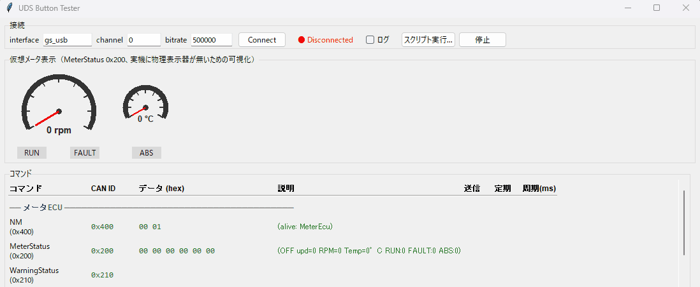

# arduino-autosar-my-study

Arduino UNO R4 WiFi + MCP2515 + TJA1050 を用いて 
AUTOSAR CP の BSW CAN スタックを学習目的で実装したプロジェクトです。
ARXML や設定ツールは使用せず、コードで階層構造・型定義・設定テーブルを再現しています。

## 目次

- [前文](#motivation)
- [概要](#overview)
- [ハードウェア](#hardware)
  - [ハードウェア構成](#hw-configuration)
    - [配線図](#wiring-diagram)
    - [MCP2515 接続（Arduino UNO）](#mcp2515-connection)
  - [ビルド環境・設定](#build-environment)
  - [ビルドと書き込み](#build-and-flash)
- [ソフトウェア](#software)
  - [アーキテクチャ](#architecture)
    - [層構造](#layer-structure)
    - [モジュール一覧](#module-list)
    - [ディレクトリ構成](#directory-structure)
  - [CAN 通信スタック（Can_Hw / Can / CanIf / PduR / Com / E2E / E2EXf / E2EMon / Rte）](#can-stack)
    - [Tx 処理（Com → PduR → CanIf → Can の順）](#tx-processing)
      - [通常（E2E なし）](#tx-processing-normal)
      - [E2E（E2EHealthStatus 送信）](#tx-processing-e2e)
    - [Rx 処理（Can → CanIf → PduR → Com の順）](#rx-processing)
      - [通常（E2E なし）](#rx-processing-normal)
      - [E2E（EngineInfo/AbsInfo 受信）](#rx-processing-e2e)
      - [デッドライン監視（受信タイムアウト）](#rx-processing-timeout)
      - [受信長チェックの多層防御](#rx-processing-length-check)
    - [E2E 保護（EngineInfo/AbsInfo 受信・E2EHealthStatus 送信ともに Profile05）](#e2e-p01)
      - [I-PDU Group（Com_IpduGroupStart/Stop、通信のライフサイクル制御）](#ipdu-group)
      - [呼び出し元は BswM（実 AUTOSAR の標準構成）](#ipdu-group-caller)
      - [Com_IpduGroupStart/Stop が実際に行うこと](#ipdu-group-behavior)
      - [動作確認方法](#ipdu-group-verification)
    - [CAN 通信状態管理（ComM / CanSM / Nm）](#can-comm-management)
      - [処理の流れ（コールチェーン）](#processing-flow-comm)
      - [CAN コントローラのスリープ制御（Can / CanSM / Nm 横断）](#can-controller-sleep)
  - [診断スタック（CanTp / Dcm / Dem / FiM / NvM）](#diag-stack)
    - [UDS ボタン送信ツール（tools/can_tool）](#uds-tester-tool)
  - [ECU 管理層（EcuM / BswM / WdgM）](#ecu-management)
  - [IO スタック（IoHwAb / Dio / Port / Adc）](#io-stack)
    - [処理の流れ（コールチェーン）](#processing-flow-io)
  - [アプリケーション（App_EngineManager / App_WarningIndicator）](#application)
- [テスト（動作確認）](#testing)
  - [単体テスト（ホスト上でのロジック検証）](#unit-test)
    - [コールチェーンのテスト（`[env:native_chain]`）](#unit-test-chain)
      - [Tx 処理（Com → PduR → CanIf → Can の順）](#unit-test-tx)
      - [Rx 処理（Can → CanIf → PduR → Com の順）](#unit-test-rx)
    - [単一モジュールのテスト（`[env:native]`）](#unit-test-single)
  - [CAPL 風スクリプト機能（tools/can_tool）](#capl-scripting)
  - [シリアルモニタ出力例](#serial-log-example)
- [補足](#appendix)
  - [CAN フレーム仕様](#can-frame-spec)
  - [設計上の注意点](#design-notes)
    - [C / C++ 言語境界](#c-cpp-boundary)
    - [ログレベルの抑制 (Det_Cfg.h)](#log-level)
    - [固定長バッファのサイズは設定定数から計算する](#fixed-buffer-size)
    - [RX/TX で対称な入力検証](#rx-tx-symmetry)
    - [設定テーブルの一元管理](#config-table-centralization)

<a id="motivation"></a>
## 前文

日本語話者が AUTOSAR Classic Platform (CP) を学ぼうとすると、
商用ツールの価格や学習環境の制約から、個人が実際に手を動かして理解することが難しい場面が多くあります。
本プロジェクトは、そうした学習コストを少しでも下げ、
安価なハードウェアで AUTOSAR CP の構造と CAN 通信を体験できる環境を提供するために作成しました。

<a id="overview"></a>
## 概要

本プロジェクトは、学習目的で AUTOSAR CP の ASW / RTE / BSW の 3 層アーキテクチャを
Arduino UNO 上に最小構成で再現しています。
その上でメータ ECU（インストルメントクラスタ）相当のアプリケーションを動作させることを目的としています。



> 上記は `tools/can_tool` の UDS Tester タブにある仮想メータ表示で、PC から CAN
> 経由で送信した EngineInfo/AbsInfo（本物の周辺 ECU が送信しているように
> E2E Profile05 で保護したフレーム）を Arduino が受信し、RPM・RUN/ABS 警告灯へ
> 反映している様子です
> （[デモ用スクリプト](tools/can_tool/capl_scripts/demo_realistic_engine.capl)）。

CAN 経由で受信するエンジン ECU（0x100）・ABS ECU（0x110）からの情報を警告灯制御へ
反映する、以下の入出力を持つメータ ECU です。

| フレーム | CAN ID | Tx<br>Rx | 内容 |
|---------|--------|----------|------|
| EngineInfo | 0x100 | Rx | エンジン ECU から回転数・水温・ON フラグを受信<br>（AUTOSAR E2E Profile 05 保護付き） |
| AbsInfo | 0x110 | Rx | ABS ECU から車速・ブレーキ作動・ABS 作動フラグを受信<br>（AUTOSAR E2E Profile 05 保護付き） |
| MeterStatus | 0x200 | Tx | エンジン状態（OFF / STARTING / RUNNING / FAULT）・回転数・3 本の警告灯状態（RUNNING/FAULT/ABS）を変化時送信＋周期フロア（ComFilterAlgorithm）<br>（AUTOSAR E2E 保護なし） |

<a id="hardware"></a>
## ハードウェア

<a id="hw-configuration"></a>
### ハードウェア構成

| 機器 | 用途 |
|------|------|
| Arduino UNO R4 WiFi | マイコン本体 |
| MCP2515 + TJA1050 | CAN コントローラ + トランシーバ |
| LED + 抵抗（220〜470 Ω）× 3 | RUNNING 灯（D6）/ FAULT 灯（D7）/ ABS 灯（D8）各 1 本 |
| プッシュボタン | 警告確認ボタン（D9 と GND を接続・内部プルアップ使用） |
| USB-CAN アダプタ | PC との CAN バス接続（解析用） |
| Cangaroo 等 | CAN フレーム送受信ツール |
| tools/can_tool（本リポジトリ同梱） | UDS コマンドのボタン送信・FC 自動応答（後述） |

<a id="wiring-diagram"></a>
#### 配線図


<a id="mcp2515-connection"></a>
#### MCP2515 接続（Arduino UNO）

| Arduino ピン | MCP2515 ピン | 備考 |
|-------------|-------------|------|
| D10 | CS | SPI チップセレクト |
| D2 | INT | 受信割り込み（ポーリング）|
| D13 | SCK | SPI クロック |
| D11 | SI (MOSI) | SPI データ出力 |
| D12 | SO (MISO) | SPI データ入力 |

> **D13 は MCP2515 の SCK と共用されるため LED には使用できません。**
> LED は D6（RUNNING）・D7（FAULT）・D8（ABS）それぞれに 220〜470 Ω の抵抗を直列に挿入して接続してください。

> **警告確認ボタン（D9）** は D9 と GND の間にプッシュボタンを接続するだけです。
> Port が `INPUT_PULLUP` で初期化するため、外部プルアップ抵抗は不要です。
> ボタン押下時に D9 が GND と接続され `DIO_LOW` となり、`IoHwAb_Button_GetLevel()` 内で論理反転して「押下=1」に変換されます。

> CAN バスには両端に終端抵抗（120 Ω）が必要です。

<a id="build-environment"></a>
### ビルド環境・設定

| 項目 | 値 |
|------|-----|
| プラットフォーム | PlatformIO + Renesas RA (`platform = renesas-ra`) |
| ボード | Arduino UNO R4 WiFi (`board = uno_r4_wifi`) |
| フレームワーク | Arduino |
| 外部ライブラリ | coryjfowler/mcp_can @ ^1.5.1 |
| CAN ボーレート | 500 kbps |
| MCP2515 クリスタル | 8 MHz（`Can_CrystalFreqType` で変更可） |
| シリアルモニタ | 115200 bps |

<a id="build-and-flash"></a>
### ビルドと書き込み

```bash
# ビルド
pio run

# 書き込み
pio run --target upload

# シリアルモニタ
pio device monitor
```

<a id="software"></a>
## ソフトウェア

<a id="architecture"></a>
### アーキテクチャ

<a id="layer-structure"></a>
#### 層構造

```
ASW ─── App_EngineManager / App_WarningIndicator / App_GptDemo
RTE ─── Rte（ポートベース S/R API + E2E Transformer 呼び出しグルー）
OS  ─── Os（タイムトリガスケジューラ）
BSW ─── EcuM / BswM / WdgM / WdgIf / Wdg / ComM / CanSM / Nm / E2EXf / E2E / Com / PduR / SecOC / Csm / CryIf / Crypto / KeyM / CanIf / Can
        CanTp / Dcm / Dem / NvM / MemIf / Fee / IoHwAb / Dio / Port / Adc / SchM / Det / Mcu / Gpt
HAL ─── Can_Hw / Dio_Hw / Port_Hw / Adc_Hw / Mcu_Hw / Fee_Hw / Wdg_Hw / Gpt_Hw（src/Hal/ に集約）
```

各層は上位層のヘッダのみに依存し、下位層の実装詳細を知りません。

<a id="module-list"></a>
#### モジュール一覧

| 層 | モジュール | Id | AUTOSAR 仕様<br>仕様準拠度 | 概要 |
|---|---|---|---|---|
| ASW | App_<br>EngineManager | — | — | エンジン状態遷移 SWC (RUNNING/FAULT 等)<br>（[詳細](docs/modules/App_EngineManager_Notes.md)） |
|  | App_<br>WarningIndicator | — | — | 警告灯制御 SWC (LED 3灯)<br>（[詳細](docs/modules/App_WarningIndicator_Notes.md)） |
| RTE | Rte | — | — | SWC 間シグナル仲介 (RTE ミラー)<br>（[詳細](docs/modules/Rte_Notes.md)） |
| OS | Os | — | SWS_Os<br>主要機能実装<br>(一部意図的に簡略化) | タイムトリガスケジューラ<br>（[詳細](docs/modules/Os_Notes.md)） |
| BSW | Adc | 123 | SWS_Adc<br>主要機能実装<br>(一部意図的に簡略化) | アナログ入力ドライバ<br>（[詳細](docs/modules/Adc_Notes.md)） |
|  | BswM | 42 | SWS_BswM<br>主要機能実装<br>(一部意図的に簡略化) | BSW モード管理・状態遷移の一元制御<br>（[詳細](docs/modules/BswM_Notes.md)） |
|  | Can | 80 | SWS_Can<br>主要機能実装 | CAN コントローラドライバ (MCP2515)<br>（[詳細](docs/modules/Can_Notes.md)） |
|  | CanIf | 60 | SWS_CanIf<br>主要機能実装 | CAN コントローラ抽象化層<br>（[詳細](docs/modules/CanIf_Notes.md)） |
|  | CanSM | 140 | SWS_CanSM<br>主要機能実装 | CAN ネットワーク状態管理 (Bus-Off 回復・Nm 連携)<br>（[詳細](docs/modules/CanSM_Notes.md)） |
|  | CanTp | 35 | SWS_CanTp<br>主要機能実装<br>(一部意図的に簡略化) | ISO 15765-2 トランスポートプロトコル<br>（[詳細](docs/modules/CanTp_Notes.md)） |
|  | Com | 50 | SWS_Com<br>主要機能実装 | シグナルベース通信管理<br>（[詳細](docs/modules/Com_Notes.md)） |
|  | ComM | 12 | SWS_ComM<br>主要機能実装 | 通信マネージャ (チャネル状態集約)<br>（[詳細](docs/modules/ComM_Notes.md)） |
|  | CryIf | 112 | SWS_CryptoInterface<br>パススルー<br>(下位が1個のため) | 暗号ドライバへのルーティング層<br>（[詳細](docs/modules/CryIf_Notes.md)） |
|  | Crypto | 114 | SWS_CryptoDriver<br>主要機能実装<br>(一部意図的に簡略化) | 暗号処理ドライバ (AES-128-CMAC)<br>（[詳細](docs/modules/Crypto_Notes.md)） |
|  | Csm | 110 | SWS_CryptoServiceManager<br>主要機能実装<br>(一部意図的に簡略化) | 暗号サービスマネージャ<br>（[詳細](docs/modules/Csm_Notes.md)） |
|  | Dcm | 53 | SWS_Dcm<br>主要機能実装<br>(一部意図的に簡略化) | UDS 診断通信マネージャ<br>（[詳細](docs/modules/Dcm_Notes.md)） |
|  | Dem | 54 | SWS_Dem<br>主要機能実装 | 診断イベント管理 (DTC)<br>（[詳細](docs/modules/Dem_Notes.md)） |
|  | Det | — | SWS_Det<br>主要機能実装<br>(一部意図的に簡略化) | 開発時エラー検出・ロギング<br>（[詳細](docs/modules/Det_Notes.md)） |
|  | Dio | — | SWS_Dio<br>主要機能実装<br>(一部意図的に簡略化) | デジタル入出力ドライバ<br>（[詳細](docs/modules/Dio_Notes.md)） |
|  | E2E | — | SWS_E2E<br>主要機能実装<br>(一部意図的に簡略化) | エンドツーエンド保護ライブラリ (Profile01/05)<br>（[詳細](docs/modules/E2E_Notes.md)） |
|  | E2EXf | 176 | SWS_E2ELibrary 12.4<br>(E2E Transformer)<br>主要機能実装<br>(一部意図的に簡略化) | E2E トランスフォーマ (Rte⇔E2E ライブラリ統合)<br>（[詳細](docs/modules/E2EXf_Notes.md)） |
|  | E2EMon | — | — (独自 CDD 相当) | ネットワーク健全性モニタ (独自 CDD)<br>（[詳細](docs/modules/E2EMon_Notes.md)） |
|  | EcuM | 10 | SWS_EcuStateManager<br>主要機能実装 | ECU ステートマネージャ (起動・シャットダウン制御)<br>（[詳細](docs/modules/EcuM_Notes.md)） |
|  | Fee | 21 | SWS_Fee<br>主要機能実装<br>(一部意図的に簡略化) | フラッシュエミュレーション EEPROM ドライバ<br>（[詳細](docs/modules/Fee_Notes.md)） |
|  | FiM | 11 | SWS_FiM<br>主要機能実装<br>(一部意図的に簡略化) | 機能抑止マネージャ<br>（[詳細](docs/modules/FiM_Notes.md)） |
|  | Gpt | 100 | SWS_Gpt<br>主要機能実装<br>(一部意図的に簡略化) | 汎用タイマドライバ<br>（[詳細](docs/modules/Gpt_Notes.md)） |
|  | IoHwAb | 254 | AUTOSAR 抽象化層 | ボタン入力・センサ電圧のハードウェア抽象化<br>（[詳細](docs/modules/IoHwAb_Notes.md)） |
|  | KeyM | 116<br>(仮) | SWS_KeyManager<br>(Release 4.4.0)<br>主要機能実装<br>(一部意図的に簡略化) | 鍵管理マネージャ<br>（[詳細](docs/modules/KeyM_Notes.md)） |
|  | Mcu | 101 | SWS_Mcu<br>主要機能実装<br>(一部意図的に簡略化) | マイコン初期化・リセット要因管理<br>（[詳細](docs/modules/Mcu_Notes.md)） |
|  | MemIf | 22 | SWS_MemIf<br>パススルー<br>(下位が1個のため) | 不揮発メモリ抽象化層<br>（[詳細](docs/modules/MemIf_Notes.md)） |
|  | Nm | 31 | SWS_CANNM<br>主要機能実装 | ネットワークマネジメント (CAN NM)<br>（[詳細](docs/modules/Nm_Notes.md)） |
|  | NvM | 20 | SWS_NvM<br>主要機能実装<br>(一部意図的に簡略化) | 不揮発メモリマネージャ<br>（[詳細](docs/modules/NvM_Notes.md)） |
|  | PduR | 51 | SWS_PduR<br>主要機能実装<br>(一部意図的に簡略化) | PDU ルーティング層<br>（[詳細](docs/modules/PduR_Notes.md)） |
|  | Port | — | SWS_Port<br>主要機能実装<br>(一部意図的に簡略化) | ピン設定管理<br>（[詳細](docs/modules/Port_Notes.md)） |
|  | SchM | — | SWS_SchM<br>主要機能実装<br>(一部意図的に簡略化) | 排他制御 (スケジューラマネージャ)<br>（[詳細](docs/modules/SchM_Notes.md)） |
|  | SecOC | 150 | SWS_SecureOnboard<br>Communication<br>主要機能実装<br>(一部意図的に簡略化) | メッセージ認証 (改ざん・なりすまし対策)<br>（[詳細](docs/modules/SecOC_Notes.md)） |
|  | Wdg | 102 | SWS_Wdg<br>主要機能実装<br>(一部意図的に簡略化) | ウォッチドッグドライバ<br>（[詳細](docs/modules/Wdg_Notes.md)） |
|  | WdgIf | 43 | SWS_WdgIf<br>パススルー<br>(下位が1個のため) | ウォッチドッグ抽象化層<br>（[詳細](docs/modules/WdgIf_Notes.md)） |
|  | WdgM | 13 | SWS_WdgM<br>主要機能実装 | ウォッチドッグマネージャ (生存監視)<br>（[詳細](docs/modules/WdgM_Notes.md)） |
| HAL | Can_Hw | — | — | MCP2515 SPI ドライバ<br>（[詳細](docs/modules/Can_Notes.md)） |
|  | Dio_Hw | — | — | Arduino `digitalWrite`/`digitalRead` ラッパー |
|  | Port_Hw | — | — | Arduino `pinMode` ラッパー |
|  | Adc_Hw | — | — | Arduino `analogRead` ラッパー |
|  | SchM_Hw | — | — | Arduino `noInterrupts`/`interrupts` ラッパー |
|  | Mcu_Hw | — | — | リセット要因読み取り・起動時ウォッチドッグ無効化 |
|  | Fee_Hw | — | — | フラッシュエミュレーション EEPROM 読み書き |
|  | Wdg_Hw | — | — | 実 HW ウォッチドッグ制御 |
|  | Gpt_Hw | — | — | Renesas RA `FspTimer` ラッパー |

> 「仕様準拠度」の凡例: **主要機能実装**=対象 SWS 仕様の主要要求を実質的に満たす／**主要機能実装(一部意図的に簡略化)**=中核機能は実装済みだが特定の API・モードを対応除外／**パススルー**=下位ドライバが1個のみのため実質的に素通し／**—**=対応する AUTOSAR 仕様が無い（ASW・RTE・HAL 層、または独自 CDD 相当）。各モジュールの具体的な簡略化内容は上表「概要」列のリンク先または各モジュール詳細節を参照。

ModuleId の出典は `docs/AUTOSAR_TR_BSWModuleList.pdf`（Release 4.3.1、「List of Basic Software Modules」表）。

<a id="directory-structure"></a>
#### ディレクトリ構成

```
├── src/
│   ├── main.cpp                  # EcuM_Init / EcuM_MainFunction を呼ぶだけのエントリポイント
│   ├── Asw/
│   │   ├── App_EngineManager.h
│   │   ├── App_EngineManager.c      # エンジン状態遷移・ボランタリスリープ判断（OFF継続でComMへNO_COM要求）
│   │   ├── App_WarningIndicator.h
│   │   └── App_WarningIndicator.c   # 3 LED 独立制御（D6=RUNNING / D7=FAULT 点滅 / D8=ABS）
│   ├── Rte/
│   │   ├── Rte_Type.h            # アプリ型エイリアス（ARXML 自動生成相当）
│   │   ├── Rte.h
│   │   └── Rte.c                 # ポート API（周期管理は Os へ移管済み）・ランプ IOControl 調停・ComM_USER_0 要求ポート
│   ├── Os/
│   │   ├── Os_Cfg.h              # タスク数定数
│   │   ├── Os.h / Os.c           # タイムトリガスケジューラ（Os_SchedulerStep）。時間源は専用 Gpt チャネル (GPT_CHANNEL_1)
│   │   ├── Os_PBCfg.h
│   │   └── Os_PBCfg.c            # タスクテーブル（周期・関数ポインタ）
│   ├── Bsw/
│   │   ├── Adc/                  # ADC ドライバ（AUTOSAR SWS_Adc 準拠 API）
│   │   │   ├── Adc_Cfg.h         # チャネル定義・分解能・基準電圧
│   │   │   ├── Adc.h             # 公開インタフェース（Adc_ReadChannel）
│   │   │   └── Adc.c             # AUTOSAR Adc モジュール（純粋 C、Adc_Hw へ委譲。境界は src/Hal/Adc_Hw.h）
│   │   ├── BswM/                 # BSW モードマネージャ（ルール駆動タスク制御）
│   │   │   ├── BswM_Cfg.h        # タスク ID 定数・タスクマスク定義
│   │   │   ├── BswM_PBCfg.h      # ルール構造体型定義・BswM_Config 宣言
│   │   │   ├── BswM_PBCfg.c      # ルールテーブル実体（6 ルール、うち2つは AND/OR 複合条件）
│   │   │   ├── BswM.h            # 公開インタフェース（Init / EcuM通知 / ComM通知）
│   │   │   └── BswM.c            # ルールエンジン実装・Os_SetTaskActive 呼び出し
│   │   ├── Can/                  # CAN ドライバ（AUTOSAR SWS_Can 準拠 API）
│   │   │   ├── Can.h             # 公開インタフェース
│   │   │   └── Can.c             # AUTOSAR Can モジュール（純粋 C、Can_Hw へ委譲。境界は src/Hal/Can_Hw.h）。Can_Isr は真の割り込みでペンディングフラグを立てるのみ、実処理は Can_MainFunction_Read/BusOff/Wakeup
│   │   ├── CanIf/                # CAN インタフェース
│   │   │   ├── CanIf_Types.h     # 型定義（Can_PduType 等）
│   │   │   ├── CanIf_Cfg.h       # TX/RX PDU テーブル数定数
│   │   │   ├── CanIf_PBCfg.h     # ポストビルド設定宣言（CanIf_Config）
│   │   │   ├── CanIf_PBCfg.c     # TX/RX PDU ルーティングテーブル実体
│   │   │   ├── CanIf.h           # 公開インタフェース（CanIf_Transmit / CanIf_RxIndication）
│   │   │   └── CanIf.c           # CAN ID ↔ 論理 PDU マッピング・Can/PduR 間の仲介・ControllerBusOff/Wakeup 通知の中継・全受信フレームを CanSM_RxIndication へ転送（ウェイクアップ検証用）
│   │   ├── CanSM/                # CAN ステートマネージャ（Bus-Off 回復シーケンス、L1/L2 バックオフ）
│   │   │   ├── CanSM_Cfg.h       # L1/L2 回復待機時間・L1→L2 切替閾値
│   │   │   ├── CanSM.h           # 公開インタフェース・CanSM_ControllerBusOff コールバック
│   │   │   └── CanSM.c           # 状態機械・Bus-Off L1/L2 バックオフ回復タイマ管理・NO_COM要求時に CAN コントローラを実際にスリープ・ウェイクアップ検証（CanSM_ControllerWakeup/CanSM_RxIndication/検証タイムアウト）
│   │   ├── CanTp/                # CAN トランスポートプロトコル（ISO 15765-2）
│   │   │   ├── CanTp_Cfg.h       # ブロックサイズ・STmin・タイムアウト設定
│   │   │   ├── CanTp.h           # 公開インタフェース（CanTp_Transmit / CanTp_RxIndication）
│   │   │   └── CanTp.c           # SF/FF/CF/FC 状態機械・マルチフレーム組立分割
│   │   ├── Com/                  # COM（シグナル管理、E2E には一切関知しない）
│   │   │   ├── Com_Types.h       # 型定義（Com_SignalIdType / Com_IPduIdType / Com_IPduConfigType の RxIndicationCbk/TxTransformCbk 等）
│   │   │   ├── Com_Cfg.h         # I-PDU・シグナル数定数・シグナル ID
│   │   │   ├── Com_PBCfg.h       # ポストビルド設定宣言（Com_Config）
│   │   │   ├── Com_PBCfg.c       # I-PDU/シグナルレイアウトテーブル実体（RxIndicationCbk/TxTransformCbk で Rte 層のグルー関数を紐付けるのみ、E2E の詳細は持たない）
│   │   │   ├── Com.h             # 公開インタフェース（Com_SendSignal / Com_ReceiveSignal / Com_ReceiveSignalGroupArray / Com_IsRxTimedOut）
│   │   │   └── Com.c             # シグナルパック/アンパック・受信デッドライン監視・ComFilterAlgorithm（送信要否判定）・Signal Group（Com_SendSignalGroup）
│   │   ├── ComM/                 # 通信マネージャ（CAN バス通信モード管理）
│   │   │   ├── ComM_Cfg.h        # チャネル数・ユーザ数定数
│   │   │   ├── ComM.h            # 公開インタフェース（NO_COM/SILENT_COM/FULL_COM）
│   │   │   └── ComM.c            # 複数ユーザ要求の集約（調停）・CanSM_RequestComMode へ委譲
│   │   ├── CryIf/                # Crypto Interface（Csm と Crypto Driver 間のルーティング層）
│   │   │   ├── CryIf_Cfg.h       # DET 定数・CRYIF_CHANNEL_ID
│   │   │   ├── CryIf.h           # 公開インタフェース（CryIf_ProcessJob）
│   │   │   └── CryIf.c           # 本プロジェクトは Crypto Driver が1個のみのため実質パススルー
│   │   ├── Crypto/                # Crypto Driver（Csm/CryIf/Crypto レイヤの最下層。鍵テーブルと実暗号計算を保持）
│   │   │   ├── Crypto_Types.h    # Crypto_JobType（簡略化フラット版）・Crypto_ServiceInfoType 等
│   │   │   ├── Crypto_Cfg.h      # DET 定数・CRYPTO_KEY_* 定数
│   │   │   ├── Crypto_PBCfg.h/.c # 鍵テーブル実体（元 SecOC_PBCfg.c から移設）
│   │   │   ├── Crypto.h          # 公開インタフェース（Crypto_ProcessJob）
│   │   │   ├── Crypto.c          # MAC 生成/検証の実処理（定数時間比較はここに実装）
│   │   │   ├── Crypto_Aes128.h/.c # AES-128 自前実装（FIPS-197 KAT セルフテスト付き。元 SecOC_Aes128.*）
│   │   │   └── Crypto_Cmac.h/.c   # AES-CMAC 自前実装（NIST SP 800-38B。元 SecOC_Cmac.*）
│   │   ├── Csm/                  # Crypto Service Manager（SecOC が唯一直接呼ぶ暗号スタックの入口）
│   │   │   ├── Csm_Cfg.h         # DET 定数・CSM_JOB_ID_* 定数
│   │   │   ├── Csm_PBCfg.h/.c    # CsmJob 設定テーブル（jobId → プリミティブ種別・鍵ID）
│   │   │   ├── Csm.h             # 公開インタフェース（Csm_MacGenerate/Csm_MacVerify、Csm_KeyElementSet/Csm_KeySetValid）
│   │   │   └── Csm.c             # ジョブ解決 → Crypto_JobType 組み立て → CryIf_ProcessJob 委譲。鍵操作 API は CryIf へパススルー
│   │   ├── KeyM/                 # Key Manager（鍵更新セッションを管理。Csm のみに依存）
│   │   │   ├── KeyM_Cfg.h        # DET 定数・鍵名定数（KEYM_CRYPTO_KEY_NAME_*）
│   │   │   ├── KeyM_PBCfg.h/.c   # 鍵名テーブル（鍵名 → Csm 側 keyId = CRYPTO_KEY_*）
│   │   │   ├── KeyM.h            # 公開インタフェース（KeyM_Start/KeyM_Update/KeyM_Finalize）
│   │   │   └── KeyM.c            # セッション状態管理 → 鍵名解決 → Csm_KeyElementSet/Csm_KeySetValid 呼び出し
│   │   ├── E2E/                  # AUTOSAR E2E 保護ライブラリ（Profile01: CRC8+4bitカウンタ、Profile05: CRC16+8bitカウンタ）
│   │   │   ├── E2E_P01.h/.c      # Profile01（Check: E2E_P01Check/CheckInit、Protect: E2E_P01Protect/ProtectInit）。呼び出し元ゼロの参考実装として維持
│   │   │   └── E2E_P05.h/.c      # Profile05（Check: E2E_P05Check/CheckInit、Protect: E2E_P05Protect/ProtectInit）。EngineInfo/AbsInfo(RX)・EngineHealthStatus(TX)いずれも使用
│   │   ├── E2EXf/                # E2E Transformer（Com から E2E ロジックを切り離す統合層）
│   │   │   ├── E2EXf.h           # 汎用 API 宣言（E2EXf_Init/E2EXf_DeInit/E2EXf_InverseTransform/E2EXf_InverseTransformP05/E2EXf_Transform/E2EXf_TransformP05/E2EXf_GetVersionInfo。E2E_P01/E2E_P05 それぞれへの薄いラッパー）
│   │   │   ├── E2EXf.c           # 上記実装（Dem_ReportErrorStatus への報告・モジュール自身の初期化状態ガードも含む）
│   │   │   ├── E2EXf_PBCfg.h     # ポストビルド設定宣言（E2EXf_*RxCfg/TxCfgP05、E2EXf_PBCfg_Init）
│   │   │   └── E2EXf_PBCfg.c     # I-PDU ごとの E2E 設定/状態実体（EngineInfo/AbsInfo/E2EHealthStatus いずれも Profile05）
│   │   ├── E2EMon/                # 独自 CDD 相当（標準 AUTOSAR モジュールではない、E2E 健全性監視の例）
│   │   │   ├── E2EMon.h          # 公開インタフェース（E2EMon_Init/E2EMon_NotifyCheckResult(P01)/E2EMon_NotifyCheckResultP05）
│   │   │   └── E2EMon.c          # E2E 検証結果の累積カウンタ・Com_SendSignal() での公開
│   │   ├── EcuM/                 # ECU ステートマネージャ（ライフサイクル管理）
│   │   │   ├── EcuM_Cfg.h        # RUN ユーザ定義・POST_RUN タイムアウト
│   │   │   ├── EcuM.h            # 公開インタフェース・EcuM_StateType 定義
│   │   │   └── EcuM.c            # 状態マシン・EcuM_RequestRUN / EcuM_ReleaseRUN（SHUTDOWN→RUNのCANウェイクアップ復帰対応）
│   │   ├── Dcm/                  # 診断通信マネージャ（UDS ISO 14229-1）
│   │   │   ├── Dcm_Cfg.h         # SID/NRC/DID 定数・セッション・S3 タイマ・SecurityAccess 設定
│   │   │   ├── Dcm_Cbk.h         # PduR から呼ばれる受信コールバック宣言（Dcm_ComIndication）
│   │   │   ├── Dcm.h             # 公開インタフェース（Dcm_Init / Dcm_MainFunction）
│   │   │   └── Dcm_Cbk.c         # UDS サービスディスパッチ実装・S3 タイマ監視・SecurityAccess/RoutineControl 状態機械
│   │   ├── Dem/                  # 診断イベントマネージャ（DTC 管理）
│   │   │   ├── Dem_Cfg.h         # イベント ID・DTC コード・ステータスビットマスク・デバウンス閾値
│   │   │   ├── Dem.h             # 公開インタフェース（ReportErrorStatus / GetAllDTCs / FreezeFrame）
│   │   │   └── Dem.c             # DTC ライフサイクル・デバウンス・FreezeFrame 記録・NvM 永続化
│   │   ├── Det/                  # Default Error Tracer（Serial ブリッジ）
│   │   │   ├── Det.h             # ログマクロ定義（DET_LOGI/W/E/D）
│   │   │   └── Det.c             # AUTOSAR Det モジュール（純粋 C、レベル判定・メッセージ整形。Det_Hw へ委譲。境界は src/Hal/Det_Hw.h）
│   │   ├── Dio/                  # デジタル I/O 値読み書き（MCAL・方向設定は Port が担う）
│   │   │   ├── Dio_Cfg.h         # チャネル ID 定義（D6=RUNNING / D7=FAULT / D8=ABS / D9=ボタン）
│   │   │   ├── Dio.h             # 公開インタフェース（Dio_WriteChannel / Dio_ReadChannel）
│   │   │   └── Dio.c             # AUTOSAR Dio モジュール（純粋 C、Dio_Hw へ委譲。境界は src/Hal/Dio_Hw.h）
│   │   ├── FiM/                  # 機能抑止マネージャ（DTC→機能抑止）
│   │   │   ├── FiM_Cfg.h         # 機能 ID (FID) 定義
│   │   │   ├── FiM_PBCfg.h       # FID×イベント設定構造体型定義・FiM_Config 宣言
│   │   │   ├── FiM_PBCfg.c       # FID×イベント対応テーブル実体
│   │   │   ├── FiM.h             # 公開インタフェース（FiM_Init / FiM_MainFunction / GetFunctionPermission / SetFunctionAvailable）
│   │   │   └── FiM.c             # 許可状態の再評価・キャッシュ
│   │   ├── Nm/                   # ネットワークマネジメント（CanNm 状態機械）
│   │   │   ├── Nm_Cfg.h          # DET 定数・NM フレーム周期/DLC/ノードID・状態機械タイマ値
│   │   │   ├── Nm.h              # 公開インタフェース（Nm_NetworkRequest/Release/RxIndication/TxConfirmation 等）
│   │   │   └── Nm.c              # Network Mode(Repeat Message/Normal Operation/Ready Sleep)/Prepare Bus-Sleep/Bus-Sleep の状態機械。PduR/Com 非経由で CanIf と直接やり取り
│   │   ├── NvM/                  # Non-Volatile Memory Manager（EEPROM 抽象化）
│   │   │   ├── NvM_Cfg.h         # ブロック ID・EEPROM アドレス・ブロックサイズ定義
│   │   │   ├── NvM_PBCfg.h       # ブロック設定構造体型定義・NvM_Config 宣言
│   │   │   ├── NvM_PBCfg.c       # ブロック設定テーブル実体（DEM_MAGIC/STATUS/AGING/EXTENDED、EXTENDED は冗長ブロック）
│   │   │   ├── NvM.h             # 公開インタフェース（NvM_ReadBlock / NvM_WriteBlock / NvM_MainFunction / NvM_GetErrorStatus）
│   │   │   └── NvM.c             # RAM ミラー・ブロック/CRC/冗長化のオーケストレーション。物理バイト書き込みの進行は持たず MemIf へ委譲（境界は src/Bsw/MemIf/MemIf.h）
│   │   ├── Mcu/                  # MCU Driver（リセット原因の読み取り。クロック/RAMセクション初期化は未対応）
│   │   │   ├── Mcu_Cfg.h         # DET 定数・ApiId（docs/4.3.1/AUTOSAR_SWS_MCUDriver.pdf を実測して確認済み）
│   │   │   ├── Mcu_PBCfg.h       # コンフィグ型定義（プレースホルダ）・Mcu_Config 宣言
│   │   │   ├── Mcu_PBCfg.c       # コンフィグ実体
│   │   │   ├── Mcu.h             # 公開インタフェース（Mcu_Init/Mcu_GetResetReason/Mcu_GetResetRawValue）
│   │   │   └── Mcu.c             # Mcu_Hw への委譲。Mcu_Init() が起動直後に一度だけリセット原因を読み取りキャッシュする
│   │   ├── MemIf/                # Memory Abstraction Interface（NvM と Fee の間のディスパッチ層）
│   │   │   ├── MemIf_Types.h     # 共通型（MemIf_StatusType/MemIf_JobResultType/MemIf_DeviceType）
│   │   │   ├── MemIf_Cfg.h       # DET 定数・ApiId（Fee_Cfg.h と共に SWS 実測値へ差し替え済み）
│   │   │   ├── MemIf.h           # 公開インタフェース（MemIf_Read/Write/WriteImmediate/Cancel/GetStatus/GetJobResult/MainFunction）
│   │   │   └── MemIf.c           # 唯一の下位ドライバ (Fee) へのディスパッチ。`#if defined(__AVR__)` 分岐は歴史的にこのファイルだけに置く設計（現在は Fee 固定）
│   │   ├── Fee/                  # Flash EEPROM Emulation（Renesas RA フラッシュエミュレーション EEPROM 向け下位ドライバ）
│   │   │   ├── Fee_Cfg.h         # DET 定数・ApiId（docs/4.3.1/AUTOSAR_SWS_FlashEEPROMEmulation.pdf を実測して確認済み）
│   │   │   ├── Fee.h             # 公開インタフェース（Fee_Read/Write/WriteImmediate/Cancel/GetStatus/GetJobResult/MainFunction）
│   │   │   └── Fee.c             # 非同期書き込みジョブ（Fee_Write は即座に返り、Fee_MainFunction が 1 呼び出し 1 バイトだけ進める。境界は src/Hal/Fee_Hw.h）
│   │   ├── PduR/                 # PDU ルーター
│   │   │   ├── PduR_Types.h      # 型定義
│   │   │   ├── PduR_Cfg.h        # RX/TX ルーティングパス数定数
│   │   │   ├── PduR_PBCfg.h      # ポストビルド設定宣言（PduR_Config）
│   │   │   ├── PduR_PBCfg.c      # ルーティングテーブル実体
│   │   │   ├── PduR_COM.h        # COM 向けコールバック型定義
│   │   │   ├── PduR_CanIf.h      # CanIf 向けコールバック型定義
│   │   │   ├── PduR_SecOC.h      # SecOC 向けインタフェース定義（PduR_SecOCTransmit）
│   │   │   ├── PduR.h            # 公開インタフェース
│   │   │   └── PduR.c            # PDU マルチキャスト配信・送信完了通知の転送・TX 経路の中間モジュール委譲（TransmitOverrideFct）
│   │   ├── SecOC/                # メッセージ認証（Csm_MacGenerate/Csm_MacVerify を呼ぶのみ。鍵/AES/CMAC は一切知らない）
│   │   │   ├── SecOC_Types.h     # 型定義（SecOC_RxPduConfigType/SecOC_TxPduConfigType、Key ではなく CsmJobId を持つ）
│   │   │   ├── SecOC_Cfg.h       # RX/TX Secured I-PDU 数定数
│   │   │   ├── SecOC_PBCfg.h     # ポストビルド設定宣言（SecOC_Config）
│   │   │   ├── SecOC_PBCfg.c     # RX/TX Secured I-PDU 設定実体（DataId/オフセット/CsmJobId）
│   │   │   ├── SecOC.h           # 公開インタフェース（SecOC_RxIndication/SecOC_IfTransmit/SecOC_MainFunctionTx）
│   │   │   └── SecOC.c           # フレッシュネス検証（RX）／Secured I-PDU 組み立て（TX）。MAC 自体は Csm 経由
│   │   ├── Port/                 # ピン方向設定（MCAL・Dio と責務を分離）
│   │   │   ├── Port_Cfg.h        # ピン番号定義（D6/D7/D8 OUTPUT / D9 INPUT_PULLUP）
│   │   │   ├── Port.h            # 公開インタフェース（Port_Init / Port_SetPinDirection）
│   │   │   └── Port.c            # AUTOSAR Port モジュール（純粋 C、Port_Hw へ委譲。境界は src/Hal/Port_Hw.h）
│   │   ├── Gpt/                  # General Purpose Timer Driver（Renesas RA FspTimer 向け HW タイマ抽象化）
│   │   │   ├── Gpt_Cfg.h         # DET 定数・ApiId・基本型（Gpt_ChannelType 等。docs/4.3.1/AUTOSAR_SWS_GPTDriver.pdf を実測して確認済み）
│   │   │   ├── Gpt_PBCfg.h       # チャネル設定構造体型定義・Gpt_Config 宣言
│   │   │   ├── Gpt_PBCfg.c       # チャネルテーブル実体（Channel 0: 1000Hz tick・App_GptDemo_OnTick 通知、Channel 1: 1000Hz tick・Os 専用・Notification なし）
│   │   │   ├── Gpt.h             # 公開インタフェース（Gpt_Init/StartTimer/StopTimer/GetTimeElapsed/GetTimeRemaining/Enable・DisableNotification）
│   │   │   └── Gpt.c             # チャネル状態機械。目標時間到達判定は HW コンペアマッチではなく Gpt_OnTick() 内のソフトウェア比較。境界は src/Hal/Gpt_Hw.h
│   │   ├── IoHwAb/               # I/O ハードウェア抽象化（MCAL と SW-C の境界）
│   │   │   ├── IoHwAb.h          # 公開インタフェース（RTE が参照）
│   │   │   └── IoHwAb.c          # Dio/Adc へ委譲・デバウンス（40ms）・固着検出・ADC 電圧低下検出（Dem 報告）
│   │   ├── SchM/                 # スケジュールマネージャ（排他エリアマクロ）
│   │   │   └── SchM.h            # SchM_Enter/Exit マクロ定義（全モジュール共通、実体は src/Hal/SchM_Hw.h）
│   │   ├── Wdg/                  # Watchdog Driver（Renesas RA 実 HW ウォッチドッグ向け下位ドライバ）
│   │   │   ├── Wdg_Cfg.h         # DET 定数・ApiId（docs/4.3.1/AUTOSAR_SWS_WatchdogDriver.pdf を実測して確認済み）
│   │   │   ├── Wdg_PBCfg.h       # コンフィグ型定義・Wdg_Config 宣言
│   │   │   ├── Wdg_PBCfg.c       # コンフィグ実体（WdgM_Cfg.h の WDGM_HW_WATCHDOG_TIMEOUT_MS を直接引用し二重管理を解消）
│   │   │   ├── Wdg.h             # 公開インタフェース（Wdg_Init/Wdg_SetMode/Wdg_SetTriggerCondition）
│   │   │   └── Wdg.c             # Wdg_SetMode(WDGIF_OFF_MODE) は HW 制約により常に E_NOT_OK。境界は src/Hal/Wdg_Hw.h
│   │   ├── WdgIf/                # Watchdog Interface（WdgM と Wdg の間のディスパッチ層）
│   │   │   ├── WdgIf_Types.h     # 共通型（WdgIf_ModeType/WdgIf_DeviceType）
│   │   │   ├── WdgIf_Cfg.h       # DET 定数・ApiId（docs/4.3.1/AUTOSAR_SWS_WatchdogInterface.pdf を実測して確認済み）
│   │   │   ├── WdgIf.h           # 公開インタフェース（WdgIf_SetMode/WdgIf_SetTriggerCondition）
│   │   │   └── WdgIf.c           # 唯一の下位ドライバ (Wdg) へのディスパッチ
│   │   └── WdgM/                 # ウォッチドッグマネージャ（Alive + Logical Supervision）
│   │       ├── WdgM_Cfg.h        # エンティティ ID・チェックポイント ID・監視サイクル・期待回数定義
│   │       ├── WdgM_PBCfg.h      # エンティティ/遷移設定構造体型定義・WdgM_Config 宣言
│   │       ├── WdgM_PBCfg.c      # エンティティテーブル・許可遷移テーブル実体（App_EngineManager_Run / App_WarningIndicator_Run）
│   │       ├── WdgM.h            # 公開インタフェース（Init / CheckpointReached / MainFunction）
│   │       └── WdgM.c            # Alive/Logical/Deadline 判定(6000ms) + HW WDT trigger(1000ms、WdgIf 経由で Wdg へ委譲)
│   └── Hal/                      # ハードウェア依存層（Bsw 各モジュールの純粋 C 実装から分離）
│       ├── Can_Hw.h / Can_Hw.cpp        # MCP2515 / mcp_can C++ ラッパー（旧 Mcp2515_Wrapper.cpp）。SLEEP時にウェイクアップ割り込みを有効化
│       ├── Dio_Hw.h / Dio_Hw.cpp        # Arduino digitalWrite / digitalRead ラッパー
│       ├── Port_Hw.h / Port_Hw.cpp      # Arduino pinMode ラッパー
│       ├── Adc_Hw.h / Adc_Hw.cpp        # Arduino analogRead ラッパー
│       ├── Det_Hw.h / Det_Hw.cpp        # Arduino Serial 出力実装（Arduino API を呼ぶ唯一の場所）。Det.c と Det_Hw.cpp 以外からインクルードしない内部境界
│       ├── Mcu_Hw.h / Mcu_Hw.c          # リセット要因読み取り（RA RSTSR0-1）・起動時 WDT 無効化
│       ├── Fee_Hw.h / Fee_Hw.cpp        # フラッシュエミュレーション EEPROM 読み書き（RA EEPROM.h）。Fee.c と Fee_Hw.cpp 以外からインクルードしない内部境界
│       ├── Wdg_Hw.h / Wdg_Hw.cpp        # 実 HW ウォッチドッグ Enable / Disable / Refresh(RA WDTライブラリ)。Wdg.c と Wdg_Hw.cpp 以外からインクルードしない内部境界
│       ├── Gpt_Hw.h / Gpt_Hw.cpp        # FspTimer による周期 HW 割り込み(AGT/GPT 空きチャネルを実行時に自動選択)。Gpt.c と Gpt_Hw.cpp 以外からインクルードしない内部境界
│       └── SchM_Hw.h / SchM_Hw.cpp      # noInterrupts()/interrupts() ラッパー（SchM 排他エリアの実体）
├── dbc/
│   └── engine_manager.dbc        # CAN シグナル定義（Cangaroo 等で使用）
└── platformio.ini
```

---
<a id="can-stack"></a>
### CAN 通信スタック（Can_Hw / Can / CanIf / PduR / Com / E2E / E2EXf / E2EMon / Rte）

CAN ドライバ（Can / Can_Hw）から CanIf・PduR を経由して COM モジュールへ至るデータパスを担うスタックです。

```
TX（Arduino → 外部、下り）
  Rte → (E2EXf/E2E) → Com → PduR → CanIf → Can → Can_Hw → MCP2515

RX（外部 → Arduino、上り）
  MCP2515 → Can_Hw → Can → CanIf → PduR → Com → (E2EXf/E2E/E2EMon) → Rte
```

このスタックを構成する各モジュール（Rte/E2EMon/E2EXf/E2E/Com/PduR/CanIf/Can/Can_Hw）の
本プロジェクトでの役割は、上記「[モジュール一覧](#module-list)」表の「概要」列（リンク先の
`docs/modules/` 配下の個別ノート）を参照してください。CAN フレームのバイトレイアウトは
「[CAN フレーム仕様](#can-frame-spec)」（補足）を参照してください。

<a id="tx-processing"></a>
#### Tx 処理（Com → PduR → CanIf → Can の順）

<a id="tx-processing-normal"></a>
##### 通常（E2E なし）

```
Com_SendSignal()/Com_SendSignalGroup()   ← ASW から呼ばれる。TX バッファへ pack するだけ
  ┊  (Com_TxPending 経由。次回 Com_MainFunctionTx() の 100ms tick まで非同期に待機)
  ↓
Com_MainFunctionTx()                        ← ここから下は同期呼び出し連鎖
  → PduR_Transmit()
    → TransmitOverrideFct 未設定（現状の全 TX I-PDU）:
        CanIf_Transmit() → Can_Write()（SPI 送信完了までここで同期完了）
```

> `TransmitOverrideFct`（PduR の TX 経路に SecOC 等の中間モジュールを挟む機構）を
> 使う TX I-PDU は現状ない。E2EHealthStatus は Profile05（CRC16）保護により DLC が
> classic CAN の 8byte 上限を超えるため、SecOC を介在させる余地がない（詳細は
> 「E2E 保護」「SecOC」の各セクション参照）。それでも `PduR_TxRoutingPathType.
> TransmitOverrideFct` フィールド・`SecOC_IfTransmit()` 自体は削除せず、
> 学習用リファレンス実装として残している。

<a id="tx-processing-e2e"></a>
##### E2E（E2EHealthStatus 送信）

`Com_MainFunctionTx()` の TxTransformCbk フック（[E2E 保護](#e2e-p01) 参照）を経由して、
Protect 処理が通常のチェーンへ割り込みます。TxTransformCbk を使う TX I-PDU は
現状 E2EHealthStatus のみです。

```
Com_MainFunctionTx()
  → TxTransformCbk があれば呼ぶ    ← Rte_COMTransform_E2EHealthStatus()
                                     → E2EXf_TransformP05() → E2E_P05Protect()
  → PduR_Transmit() → CanIf_Transmit() → Can_Write()   （以降は「通常」と同じ）
```

<a id="rx-processing"></a>
#### Rx 処理（Can → CanIf → PduR → Com の順）

<a id="rx-processing-normal"></a>
##### 通常（E2E なし）

```
Can_Isr()                        ← 真の割り込み。ペンディングフラグを立てるだけ
  ┊  (Can_RxIrqPending 経由。次回 Os スケジューラ tick まで非同期に待機)
  ↓
Can_MainFunction_Read()          ← フラグをドレイン、SPI 読み出し（ここから下は同期呼び出し連鎖）
  → CanIf_RxIndication()         ← CAN ID → PduId（論理 PDU）へ変換
    → PduR_CanIfRxIndication() (= PduR_ComRxIndication())
      → 宛先ごとにマルチキャスト:
          Com_RxIndication()         ← EngineInfo/AbsInfo（RxIndicationCbk 経由で E2E 検証、後述）
          CanTp_RxIndication()       ← UDS 診断要求（複数フレーム対応）
          SecOC_RxIndication()     ← ImmobilizerCmd
            → Csm_MacVerify() → Com_RxIndication()
```

> `SecOC_RxIndication()` → `Com_RxIndication()` は常に到達するわけではなく、
> `Csm_MacVerify()` による認証成功時のみ呼ばれる（失敗時はログのみで Com へは
> 転送しない）。この認証ゲート自体の詳細は
> [`docs/modules/SecOC_Notes.md`](docs/modules/SecOC_Notes.md#アーキテクチャ--e2e-transformer-方式とは異なる理由)
> を参照。

<a id="rx-processing-e2e"></a>
##### E2E（EngineInfo/AbsInfo 受信）

`Com_RxIndication()` の RxIndicationCbk フック（[E2E 保護](#e2e-p01) 参照）を経由して、
Check 処理が通常のチェーンへ割り込みます。EngineInfo/AbsInfo いずれも Profile05 です。

```
Com_RxIndication()                 ← EngineInfo/AbsInfo（RxIndicationCbk 経由）
  → Rte_COMRxInd_EngineInfo/AbsInfo()
    → E2EXf_InverseTransformP05() → E2E_P05Check()
```

<a id="rx-processing-timeout"></a>
##### デッドライン監視（受信タイムアウト）

上記2つは「フレームが届いた」ときのチェーンだが、こちらは逆に「フレームが
届かなくなった」ことを検知するチェーン（`AUTOSAR_SWS_COM.pdf` 7.3.6
「Deadline Monitoring」相当）。100ms 周期タスクが検知し、実際に値が
置き換わるのは次に `Com_ReceiveSignal()` が呼ばれたとき、という2段階に
なっている。

```
[100ms 周期タスク] Os_SchedulerStep() → Com_MainFunctionRx()
  → (now - Com_RxLastMs[iPdu]) がしきい値（ComTimeout/ComFirstTimeout）以上なら
      Com_SigTimedOut[signal] を立てる（WARN ログ、ここが検知点）
  ┊  (Com_SigTimedOut というフラグ経由。次に Com_ReceiveSignal() が
  ┊   呼ばれるまで非同期に待機)
  ↓
Com_ReceiveSignal()                ← Rte 等から呼ばれる（同期）
  → ComRxDataTimeoutAction に応じて返す値を決定:
      SUBSTITUTE : ComTimeoutSubstitutionValue で置換（例: VehicleSpeed→0xFFFF）
      REPLACE    : ComInitValue で置換
      NONE（既定）: E_NOT_OK（呼び出し元は自分の初期値を使う）
```

TX 処理の `Com_TxPending`（`Com_SendSignal()` が立てて `Com_MainFunctionTx()` が
読む）と同じ「立てる側／読む側が別々のタイミングで動く」非同期境界だが、
向きが逆になっている点に注意（こちらは周期タスクが立てて、on-demand 呼び出し
が読む）。`Com_MainFunctionRx()` はあくまで 100ms ごとのポーリングでしきい値
超過を確認するだけで、しきい値ちょうどの瞬間に発火する割り込みではない
（検知は最大約100ms 遅れうる）。

<a id="rx-processing-length-check"></a>
##### 受信長チェックの多層防御

設定 DLC に満たない短小フレームは、まず `CanIf_RxIndication()`
が棄却する（SWS_CANIF_00026 相当、本来この責務は CanIf 層にある）。仮に何らかの理由で
ここを通過しても、`Com_RxIndication()`・`CanTp_RxIndication()`（SF/FF/CF/FC 各フレーム）
がそれぞれ独立に自分の期待長を検証する。1 箇所だけに頼らず各層が自分の責務として
検証するのは、本プロジェクトで実際に発生した「短いフレームで上位層バッファに
新旧混在の破損データが残る」バグ（Com のシグナル固定長アクセス等）を踏まえた設計判断
である。`Com_RxIndication()` の受信長チェックは AUTOSAR 本来の仕様（SWS_Com_00574/
00575/00870）に準拠したシグナル単位の部分受理を実装している: Signal Group は
一貫性のないスナップショットを公開しないため受信できたバイト数が DLC 未満なら
グループ全体を棄却するが（SWS_Com_00575）、非 Signal Group の I-PDU は受信できた
バイト範囲に収まるシグナルのみを部分的に受理し、範囲外のシグナルは前回受信値の
まま据え置く（SWS_Com_00574/00870）。前述の「新旧混在の破損データ」バグは
Com_ReceiveSignal/Com_SendSignal が BitSize に関わらず常に 4 バイト読み書きして
呼び出し元のスタックを破壊していたことが根本原因であり、本対応（未受信バイトに
触れず前回値をそのまま保持する）とは別の問題である（詳細は `Com.c` のコメント参照）。
なお `CanIf_PBCfg.c` の各 RxPdu の `.Dlc` は現状 Com 側の `ipdu->DLC` と同じ値に
設定されているため、`Com_RxIndication()` の部分受理パスは短小フレームが CanIf 層で
先に棄却されることで実運用上到達しない（2026-07 時点で実機確認済み）。検証するには
CanIf 側の `.Dlc` を一時的に緩める必要がある。

<a id="e2e-p01"></a>
#### E2E 保護（EngineInfo/AbsInfo 受信・E2EHealthStatus 送信ともに Profile05）

AUTOSAR E2E (End-to-End) による保護です。CAN バスの電気的エラーでは検出できない
**データ破壊・フレーム脱落・フレーム重複・誤ルーティング**を、CRC と送信カウンタの 2 種類の
保護要素で検出します。本プロジェクトでは 3 方向に適用しており、EngineInfo/AbsInfo の受信・
E2EHealthStatus の送信いずれも `src/Bsw/E2E/E2E_P05.c` の CRC16+8bit カウンタ
**Profile05** を使用します。

> CRC8+4bit カウンタの **Profile01**（`src/Bsw/E2E/E2E_P01.c`）用の
> `E2EXf_RxConfigType`/`E2EXf_InverseTransform()`/`E2EMon_NotifyCheckResult()`/
> `Rte_MapE2EStatus()` は削除せず、学習用リファレンス実装として意図的に
> 残しています（現在は呼び出し元がゼロ）。

> **統合方式（E2E Transformer）:** Com は E2E の存在を一切関知しません。AUTOSAR が定義する
> 3 通りの E2E 統合方式のうち「E2E Transformer」（`docs/AUTOSAR_SWS_E2ELibrary.pdf` 12.4 節、
> R4.2.1 以降）を模しており、CRC/Counter の検証・付与は Com の外側（`Rte` 層 +
> `src/Bsw/E2EXf/`）が担います。Com から BSW 層をまたいだ責務を切り離す設計です
> （詳細は本セクション内の「Com モジュールとの統合」を参照）。
>
> **E2EXf 自身の初期化状態ガード（SWS_E2EXf_00130/00133/00151）:** E2EXf は下位の
> `E2E_P01CheckStateType`/`E2E_P01ProtectStateType`（フレームごとの Check/Protect 状態）
> とは別に、「E2EXf_Init() が呼ばれたか」というモジュール自身の初期化状態を
> `E2EXf.c` の静的フラグで保持します。`E2EXf_PBCfg_Init()`（`EcuM_Init()` から
> `Com_Init()` の直後に呼ばれる）が各 I-PDU の State を初期化した最後に
> `E2EXf_Init()` を呼んでこのフラグを立てます。`E2EXf_InverseTransform()`/
> `E2EXf_Transform()` はこのフラグが立つ前に呼ばれると安全側（E_NOT_OK／no-op）で
> 早期 return するため、将来 `EcuM_Init()` の呼び出し順序が変わって初期化前に
> フレーム受信経路が有効になっても、未初期化 State（ゼロクリアされた BSS のまま）
> を使って誤判定することがありません。

- **EngineInfo（CAN 0x100、受信）**: エンジン ECU から受信するフレームを`E2E_P05Check`で検証
  （本セクション前半）。EngineSpeed（回転数）は実車ではメータ表示だけでなく変速制御・
  トラクションコントロール・オーバーレブ保護等、複数の機能が参照しうる値のため、
  一般的なエンジン ECU の周期送信フレームを模して保護を付与しています
- **AbsInfo（CAN 0x110、受信）**: ABS ECU から受信するフレームを`E2E_P05Check`で検証（本セクション前半）
- **E2EHealthStatus（CAN 0x220、送信）**: 本 ECU（メータ ECU）が送信する、EngineInfo/AbsInfo
  受信側の E2E 検証エラー累積数を伝えるネットワーク健全性テレメトリに `E2E_P05Protect`で
  Counter・CRC16 を付加（本セクション後半の E2EMon サブセクション参照）。
  監視ツールがこのテレメトリ自体の破損を検出できるようにするため、検出能力の高い
  Profile05 単体保護を採用しています（詳細は「送信側（Protect）— E2EHealthStatus」参照）

> MeterStatus（CAN 0x200、送信）・WarningStatus（CAN 0x210、送信）には E2E 保護を
> 付与していません。MeterStatus は EngineInfo/AbsInfo を Com が既に検証した**後**に
> メータ ECU 自身が導出する二次データ（エンジン状態の要約）、WarningStatus も同様に
> 警告灯の点灯状態という二次データであり、実車でも一次センサ値ほど厳密な保護が
> 付与されないことが多いため、素の（E2E 保護なしの）シグナル送信の実装例として
> 意図的に残しています。

<a id="ipdu-group"></a>
##### I-PDU Group（Com_IpduGroupStart/Stop、通信のライフサイクル制御）

**個別の I-PDU 単位**で起動/停止できます。

```
[SWS_Com_00444] 既定では全 I-PDU Group は停止状態
[SWS_Com_00840] どの I-PDU Group にも属さない I-PDU は Com_Init() で常に
                起動済み扱いになり、二度と停止できない
```

`Com_IPduConfigType.IpduGroupId`（既定値 `COM_IPDU_GROUP_NONE`）で所属を設定します。
本プロジェクトでは **E2EHealthStatus（TX）**を「テレメトリ」I-PDU Group
（`COM_IPDU_GROUP_TELEMETRY`）に、**EngineInfo/AbsInfo（RX）**を「センサーRX」
I-PDU Group（`COM_IPDU_GROUP_SENSOR_RX`、2026-08 追加）に所属させています。
その他の I-PDU（MeterStatus/WarningStatus/ImmobilizerCmd/ImmobilizerStatus）は
どの I-PDU Group にも属させていません（＝常に有効、`Com_IpduGroupStart/Stop()` の影響を受けない）。

E2EHealthStatus は、診断監視用のネットワーク健全性テレメトリで、車両の基本動作には不要な「非重要」
通信であるため、独立して停止できる対象として選びました。EngineInfo/AbsInfo は、Bus-Sleep
（ComM が NO_COMMUNICATION へ離脱する真の物理スリープ）中も受信デッドライン監視が止まらず、
意図的な通信断のたびに「RX timeout」警告 + Dem FAILED DTC が誤って記録される問題があったため、
BswM が FULL_COM 到達で起動・NO_COMMUNICATION 到達で停止するよう分離しました
（SILENT_COMMUNICATION 中は受信自体が生きているため停止対象に含めていません。詳細は
[`Com_Notes.md`](docs/modules/Com_Notes.md) 参照）。

<a id="ipdu-group-caller"></a>
##### 呼び出し元は BswM（実 AUTOSAR の標準構成）

`docs/AUTOSAR_SWS_Com.pdf` [7.3.5.1] は次のように述べています。

```
Once again, the COM module does not know or handle any grouping of I-PDUs...
it is expected that the complete state handling of I-PDU groups is done
outside of the AUTOSAR COM module, e.g. within the Basic Software Mode Manager.
```

つまり「どの I-PDU がどの Group に属するか」は Com の設定（`Com_PBCfg.c`）が持ち、
「いつ Group を起動/停止するか」は **BswM が呼ぶ**、というのが実 AUTOSAR の標準的な
役割分担です。実際、`docs/AUTOSAR_SWS_BSWModeManager.pdf` にも
`BswMPduGroupSwitch` という専用の ActionList 項目種別が定義されています。

```
[SWS_BswM_00273] When a BswMPduGroupSwitch action is executed, the BswM
shall call Com_IpduGroupStart for each BswMEnabledPduGroupRef, and call
Com_IpduGroupStop for each BswMDisabledPduGroupRef.
```

これに倣い、`BswM_ActionType` に `BSWM_ACTION_PDU_GROUP_START`/`_STOP`
（既存の `BSWM_ACTION_ACTIVATE`/`_DEACTIVATE`——Os タスクの有効/無効化——とは別の
アクション種別）を用意し、以下のルールで I-PDU Group「テレメトリ」
（E2EHealthStatus）を制御しています（`src/Bsw/BswM/BswM_PBCfg.c`）。

| Rule | トリガ | アクション |
|---|---|---|
| Rule 3 | EcuM==RUN `AND` ComM==FULL_COMMUNICATION | `Com_IpduGroupStart(TELEMETRY, initialize=false)` |
| Rule 4 | EcuM → POST_RUN | `Com_IpduGroupStop(TELEMETRY)` |
| Rule 5 | ComM==SILENT_COMMUNICATION `OR` ComM==NO_COMMUNICATION | `Com_IpduGroupStop(TELEMETRY)` |

既存の Rule 0（RUN→全タスク有効化）・Rule 1（POST_RUN→アプリタスク無効化）への
変更はありません（`BswM_ExecuteRules()` は条件を満たす全ルールを実行するため、
Rule 0 と Rule 3 は RUN 遷移のたびに両方発火します）。Rule 3 が単一条件ではなく
AND 複合条件なのは、ComM のチャネルモードが EcuM の RUN/POST_RUN とは独立して
変化しうるため（Bus-Off 中の SILENT_COMMUNICATION 等）、CAN チャネルが実際に
FULL_COMMUNICATION でなければ E2EHealthStatus を送信してもバスに届かないから
です。Rule 5 はその対になる停止条件（ComM がチャネルを離脱したら即座にテレメトリ
を止める）です。

<a id="ipdu-group-behavior"></a>
##### Com_IpduGroupStart/Stop が実際に行うこと

- **Start**（[SWS_Com_00787]）: RX は受信デッドライン監視タイマを再始動
  （最終受信時刻を現在時刻へリセット）。TX は MDT/周期タイマの基準時刻を
  再始動し、update-bit をクリアし、現在のデータ内容から TMS を再評価する
  （[SWS_Com_00223]）。`initialize=true` の場合は追加で I-PDU バッファ・
  Signal Group のシャドウバッファをゼロ初期化する（[SWS_Com_00222]）。
- **Stop**（[SWS_Com_00684]/[SWS_Com_00685]）: RX は受信処理・デッドライン
  監視の両方を無効化する（`Com_RxIndication()` がフレームを受信してもバッファ
  を更新せずに棄却する）。TX は保留中の送信要求をキャンセルする
  （[SWS_Com_00777]）。停止中の TX 確認（`Com_TxConfirmation()`）も無視する
  （[SWS_Com_00800]）。
- **`Com_SendSignal()`/`Com_ReceiveSignal()` 自体は停止中でも内部バッファを
  更新・参照できる**（[SWS_Com_00334]）。「値をセットする」ことと「実際に
  送受信するタイミング」は独立した責務であり、E2EMon は E2EHealthStatus が
  現在起動中か停止中かを一切意識せず `Com_SendSignal()` を呼び続けます。

既存の `Com_SetCommunicationEnabled()`（診断 CommunicationControl 用）とは
**独立した、直交する抑制機構**です。実際に送受信処理が行われるのは両方が
有効な場合のみ（AND 条件）で、意図的に統合していません（本プロジェクトの
UDS 0x28 実装は「全 I-PDU 一括」のままの方が既存のテストが安全に保たれるため）。

<a id="ipdu-group-verification"></a>
##### 動作確認方法

実機ログで、EcuM が RUN → POST_RUN → SHUTDOWN → （ウェイクアップ）→ RUN と
遷移する際、I-PDU Group の開始/停止が連動する様子が確認できます。ログ例は
「[シリアルモニタ出力例](#serial-log-example)」の
「I-PDU Group 開始/停止（RUN/POST_RUN/SHUTDOWN 連動）」を参照してください。

<a id="can-comm-management"></a>
#### CAN 通信状態管理（ComM / CanSM / Nm）

CAN バス通信の有効・無効（NO_COM/FULL_COM）を管理する ComM、CAN コントローラの
状態遷移（Bus-Off 回復・スリープ/ウェイクアップ）を担う CanSM、ネットワーク
マネジメント（CanNm 相当）を担う Nm の3モジュールをまとめます。実 AUTOSAR でも
これらは Com/PduR と同じ「Communication Services」クラスタに属し、EcuM/BswM/WdgM
（System Services、[ECU 管理層](#ecu-management)参照）とは別グループです。

このスタックを構成する各モジュール（ComM/CanSM/Nm）の本プロジェクトでの役割は、
上記「[モジュール一覧](#module-list)」表の「概要」列（リンク先の `docs/modules/`
配下の個別ノート）を参照してください。CanSM は6状態・多数の条件分岐を持つ
状態機械のため、状態遷移図を
[`CanSM_Notes.md`（状態遷移）](docs/modules/CanSM_Notes.md#状態遷移)に用意しています。

<a id="processing-flow-comm"></a>
##### 処理の流れ（コールチェーン）

AUTOSAR では「上から下への要求 (Request)」と「下から上への通知 (Indication)」が分離されています。
Bus-Off 回復・ウェイクアップ検証は CanSM が中心となって EcuM/ComM/Nm/Can と連携するため、
特定の 1 モジュールに閉じた話ではなく、ここでモジュール横断のコールチェーンとしてまとめます。
EcuM/BswM が関わる箇所は「← EcuM が ComM へ要求」のように図中に個別注釈しています。

```
【起動時】
EcuM_Init → ComM_RequestComMode(FULL_COM)   ← EcuM が ComM へ要求（上→下）
              └→ CanSM_RequestComMode(FULL_COM)
                   └→ ComM_BusSM_ModeIndication(FULL_COM)  ← CanSM が ComM へ通知（下→上）
                        └→ EcuM_RequestRUN(ECUM_USER_COMM)

【Bus-Off 検出時（回復試行の前、SWS_CanSM_00521）】
CanIf_ControllerBusOff → CanSM_ControllerBusOff
  受け付けるのは CANSM_STATE_FULL_COM と CANSM_STATE_NO_COM_PENDING_SLEEP
  （Nm の Bus-Sleep Mode 到達待ちでコントローラがまだ稼働中の状態）の 2 つのみ
  （NO_COM_PENDING_SLEEP 中もコントローラは稼働中で Bus-Off が発生しうるため、
   FULL_COM だけを受け付ける設計では回復シーケンスが一切起動せず、
   コントローラが HW 的に Bus-Off し続けてしまう）
  └→ Can_SetControllerMode(CAN_T_STOP)
       └→ ComM_BusSM_ModeIndication(SILENT_COM)  ← CanSM が ComM へ通知（下→上）
            （SILENT_COM は EcuM_RequestRUN/ReleaseRUN いずれも呼ばない → RUN 維持）

【Bus-Off 回復試行時（L1/L2 バックオフで無期限に継続）】
CanSM_MainFunction（10ms タスク）
  └→ Can_SetControllerMode(CAN_T_START) で再起動を試行
       └→ 復帰先は Bus-Off 発生時点の状態で分岐する
          （CanSM_BusOffFromPendingSleep フラグ、CanSM.c 参照）
          ├─ 発生時 FULL_COM だった場合: CanSM state → FULL_COM
          │    └→ ComM_BusSM_ModeIndication(FULL_COM)  ← CanSM が ComM へ通知（下→上）
          │         └→ ComM_EcuMRunMode が既に FULL_COMMUNICATION のため
          │            EcuM_RequestRUN() は呼ばない（RUN は Bus-Off 中も維持
          │            されたまま）。Nm へは Nm_NetworkRequest() のみ送る
          └─ 発生時 NO_COM_PENDING_SLEEP だった場合: CanSM state →
               NO_COM_PENDING_SLEEP（FULL_COM へは戻さない。ComM は既に
               NO_COM を要求済みで、戻すと誰も再要求せず取り残されるため）
               └→ ComM_BusSM_ModeIndication(NO_COM)  ← CanSM が ComM へ通知（下→上）
                    └→ ComM_EcuMRunMode が既に NO_COMMUNICATION のため
                       EcuM_ReleaseRUN() は呼ばない（RUN は既にボランタリ
                       スリープ突入時点で解放済み）
  （L1 リトライ超過時は Dem へ FAILED を報告するのみで、RUN の状態には影響しない）

【ボランタリスリープ突入時（エンジン OFF 継続、復帰経路あり）】
App_EngineManager_Run（3000ms タスク、ENGINE_STATE_OFF が5周期継続）
  └→ Rte_Call_ComM_RequestComMode(NO_COM)   ← ASW が ComM へ要求（上→下）
       └→ ComM_RequestComMode(COMM_USER_0, NO_COM)
            └→ 集約結果が NO_COM（Dcm も extendedSession でない場合のみ）
                 └→ CanSM_RequestComMode(NO_COM) → Can_SetControllerMode(CAN_T_SLEEP)
                      └→ ComM_BusSM_ModeIndication(NO_COM)
                           └→ EcuM_ReleaseRUN(ECUM_USER_COMM)
                                └→ EcuM: RUN → POST_RUN → (5秒後) → SHUTDOWN

【ボランタリスリープからのウェイクアップ時 — 1st phase: 検知（CAN バス活動を検知）】
Can_Isr（INT ピン立ち下がりの真のハードウェア割り込み。SHUTDOWN 中も常に有効）
  └→ Can_WakeupIrqPending フラグをセットするのみ（SPI/Serial は行わない）
       └→ Can_MainFunction_Wakeup（1ms タスク、SHUTDOWN 中もこのタスクだけは動き続ける）
            がフラグをドレインし CanIf_ControllerWakeup(0)  ← Can が CanIf へ通知（下→上）
                 └→ CanSM_ControllerWakeup(0)
                      └→ Can_SetControllerMode(CAN_T_WAKEUP)   ← SLEEP→STOPPED (Listen-Only) のみ
                           └→ CanSM: NO_COM → WAKEUP_VALIDATING（ComM/EcuM へはまだ何も通知しない）

【2nd phase-a: 検証成功（検証タイマ内に有効な CAN フレームを受信）】
Can_MainFunction_Read（Listen-Only になったため通常の RX ドレインが有効。
                        SHUTDOWN 中もこのタスクだけは動き続ける）
  └→ CanIf_RxIndication()                     ← 受信フレームを検出
       └→ CanSM_RxIndication(0)                ← 全受信フレームで無条件に呼ばれる
            └→ CanSM: WAKEUP_VALIDATING → FULL_COM（Can_SetControllerMode(CAN_T_START)）
                 └→ ComM_BusSM_ModeIndication(FULL_COM)
                      └→ EcuM_RequestRUN(ECUM_USER_COMM)
                           └→ EcuM: SHUTDOWN → RUN（全タスク再有効化）
       └→ （同じフレームがそのまま PduR/Com/Dcm 等へも配信される）

【2nd phase-b: 検証失敗（検証タイマ超過、ノイズによる誤ウェイクアップ）】
CanSM_MainFunction（10ms タスク、SHUTDOWN 中も動き続ける）
  └→ CANSM_WAKEUP_VALIDATION_MS 超過を検出
       └→ Can_SetControllerMode(CAN_T_SLEEP)   ← STOPPED→SLEEP、ウェイクアップ割り込み再武装
            └→ CanSM: WAKEUP_VALIDATING → NO_COM（ComM/EcuM は一切関与せず、静かに再スリープ）
```

<a id="can-controller-sleep"></a>
##### CAN コントローラのスリープ制御（Can / CanSM / Nm 横断）

ComM/CanSM/Nm 各モジュールの本プロジェクトでの役割は、上記
「[モジュール一覧](#module-list)」表の「概要」列（リンク先の `docs/modules/`
配下の個別ノート）を参照してください。以下の2節（CAN コントローラの実スリープ・
ボランタリスリープとウェイクアップ）は Can/CanSM/Nm 横断の内容ですが、
スリープ判断の起点（`App_EngineManager_Run()` → `ComM_RequestComMode`）や
ウェイクアップ成功時の `EcuM_RequestRUN()` など、EcuM/BswM が関わる箇所は
以下のコールチェーン図中に個別に注釈しています。

###### CAN コントローラの実スリープ（`Can_SetControllerMode(CAN_T_SLEEP)`）

`Can.c` の `CAN_T_SLEEP`/`CAN_T_WAKEUP` 遷移（MCP2515 を実際にスリープさせる
`Can_Hw_SetMode(CAN_HW_MODE_SLEEP)`）は、唯一の経路として ComM の NO_COM
要求に端を発する `Nm`（CanNm 状態機械）の協調スリープから実際にスリープします。

`App_EngineManager_Run()` が `ENGINE_STATE_OFF` の継続を検知して
`ComM_RequestComMode(COMM_USER_0, NO_COM)` を要求し、ComM の集約結果が実際に
NO_COM になった場合（`Dcm` も extendedSession でないことが条件）、
`ComM_BusSM_ModeIndication()` が `Nm_NetworkRelease()` を呼びます。ここで CanSM は
まだ物理スリープしません。`Nm` が Ready Sleep → Prepare Bus-Sleep → Bus-Sleep
Mode と自律的に遷移し（他ノードからの NM フレーム受信があればその都度延期
される）、実際に Bus-Sleep Mode へ到達した時点で `CanSM_NmBusSleepMode()` を
呼んで初めて CanSM が実スリープを行います。MCP2515 の CAN バス活動による
ウェイクアップ割り込み（`mcp_can` の `setSleepWakeup()`）を事前に有効化して
からスリープするため、バス活動があれば自律的に起床できます。詳細は次項
「ボランタリスリープとウェイクアップ」および後述「Nm（ネットワークマネジメント）」
を参照してください。

> Bus-Off 回復（後述の「Bus-Off 回復シーケンス」参照）は L1/L2 バックオフで
> 無期限にリトライを継続する設計のため、CAN コントローラを実際にスリープさせる
> ことはありません（`Can_T_STOP`/`Can_T_START` の間を往復するのみ）。AUTOSAR
> 仕様（SWS_CanSM_00514/00515/00636）には「回復を諦めて二度と復帰しない」状態は
> 存在せず、この無期限リトライ設計に至った経緯は
> [`CanSM_Notes.md`](docs/modules/CanSM_Notes.md#bus-off-回復断念設計の撤去) を参照してください。

###### ボランタリスリープとウェイクアップ

CAN コントローラを実際にスリープさせる唯一の経路（ボランタリスリープ）について、
スリープ判断からウェイクアップまでの一連の流れを詳しく説明します。

**スリープ判断（`App_EngineManager.c`）**

```
App_EngineManager_Run()（3000ms 周期）:
  ENGINE_STATE_OFF が続いている ?
    YES → s_offCycles++
           s_offCycles >= APP_ENGINE_SLEEP_OFF_CYCLES (既定 5、実質15秒) ?
             YES → Rte_Call_ComM_RequestComMode(NO_COM)
    NO  → s_offCycles = 0、Rte_Call_ComM_RequestComMode(FULL_COM)
```

`ComM_RequestComMode(COMM_USER_0, NO_COM)` は、Dcm が `ComM_DCM_ActiveDiagnostic()`
で extendedSession 中を通知し続けている間は無効化されます
（ComM のユーザ・診断アクティブ通知調停、前述の「ComM（通信マネージャ）」セクション参照）。
つまり「エンジンが止まっていて、かつ診断ツールも繋がっていない」ときだけ
実際にスリープします。

**ウェイクアップ検出とウェイクアップ検証（`Can_Isr()` / `Can_MainFunction_Read/Wakeup()` / `CanSM.c`）**

MCP2515 はスリープ中に CAN バス活動を検知すると、ソフトウェアの関与なしに
自律的に Listen-Only モードへ遷移し INT ピンをアサートします
（`setSleepWakeup(1)` で事前に有効化済み）。しかしこの WAKIF は電気的ノイズ等
でも誤って立ちうるため、INT アサートを検出しただけで即座に FULL_COM へ復帰
せず、AUTOSAR EcuM の **Wakeup Validation Protocol** に相当する 2 段階の
手順を踏みます。

```
Can_Isr()（INT ピン立ち下がりの真のハードウェア割り込み、SHUTDOWN 中も常に有効）:
  CAN_CS_SLEEP 中 ?
    YES → Can_WakeupIrqPending フラグをセットするのみ
    NO  → Can_RxIrqPending フラグをセットするのみ
  （SPI 通信・Serial ログ・CanIf 呼び出しはここでは一切行わない。理由は
   Can.c ファイル冒頭のコメントを参照）

Can_MainFunction_Wakeup()（1ms 周期、SHUTDOWN 中も動作）:
  CAN_CS_SLEEP 中 かつ Can_WakeupIrqPending ?
    YES → フラグをクリアし CanIf_ControllerWakeup(0) → CanSM_ControllerWakeup(0)
            → Can_SetControllerMode(CAN_T_WAKEUP)   ← SLEEP→STOPPED (Listen-Only) のみ
            → CanSM: NO_COM → WAKEUP_VALIDATING（ComM/EcuM へはまだ通知しない）

Can_MainFunction_Read()（1ms 周期、SHUTDOWN 中も動作）:
  CAN_CS_SLEEP 中でない かつ Can_RxIrqPending ?
    YES → フラグをクリアし、受信バッファが空になるまでドレイン
          （Listen-Only になった直後からは、この関数が受信フレームを処理する）
       → 受信フレームがあれば CanIf_RxIndication() → CanSM_RxIndication(0)
            CANSM_STATE_WAKEUP_VALIDATING 中 ?
              YES → 検証成功: Can_SetControllerMode(CAN_T_START) → CANSM_STATE_FULL_COM
                     → ComM_BusSM_ModeIndication(FULL_COM) → EcuM_RequestRUN
              NO  → 通常運用中は何もしない

CanSM_MainFunction()（10ms 周期、SHUTDOWN 中も動作）:
  CANSM_STATE_WAKEUP_VALIDATING 中 ?
    YES → CANSM_WAKEUP_VALIDATION_MS (既定 2000ms) 超過 ?
            YES → 検証失敗: Can_SetControllerMode(CAN_T_SLEEP)（再スリープ、割り込み再武装）
                   → CANSM_STATE_NO_COM（ComM/EcuM は一切関与しない）
```

`CanSM_RxIndication()` は AUTOSAR SWS_CanSM の `CanSMRxIndicationUsed` 設定に相当し、
CanIf が受信したフレーム**すべて**について（特定の PDU に一致するかどうかに
関わらず）呼び出されます。「何らかの構造的に正しい CAN フレームを実際に
受信できた」こと自体が、直前のウェイクアップが本物のバス活動だった証拠になる
という考え方です。

検証成功の判定に使われたフレーム自体も失われません。`CanSM_RxIndication()` の
直後に続く `CanIf_RxIndication()` の通常の PDU 振り分け処理でそのまま
PduR/Com/Dcm 等へ配信されます。

想定されるログ例（スリープ突入 → ウェイクアップ検証成功・ノイズによる誤ウェイクアップ）は
「[シリアルモニタ出力例](#serial-log-example)」の
「スリープ / ウェイクアップ（想定されるログ例、実機未検証）」を参照してください。

<a id="diag-stack"></a>
### 診断スタック（CanTp / Dcm / Dem / FiM / NvM）

UDS 診断（ISO 14229-1）を処理するスタックです。
CanTp が ISO 15765-2 のフレーム分割・組立を担い、Dcm が UDS サービスを処理します。
Dem は故障情報を DTC として管理し、NvM 経由で EEPROM に永続化します。
FiM は Dem が確定した DTC をもとにアプリ機能の実行許可を判定します。
診断フレームはアプリデータ（0x100 / 0x110 / 0x200）とは独立した CAN ID（0x7E0 / 0x7E8）で通信します。

このスタックを構成する各モジュール（CanTp/Dcm/Dem/FiM/NvM）の本プロジェクトでの役割は、
上記「[モジュール一覧](#module-list)」表の「概要」列（リンク先の `docs/modules/` 配下の
個別ノート）を参照してください。

<a id="uds-tester-tool"></a>
#### UDS ボタン送信ツール（tools/can_tool）

セッション制御・SecurityAccess・複数フレーム応答の FC 送信など、手動操作する
項目が増えて Cangaroo での都度のフレーム手入力が煩雑になってきたため、
よく使う UDS コマンドをボタン 1 つで送信できる Python/Tkinter 製の補助ツールを
`tools/can_tool/` に用意しています（同じウィンドウの別タブに CAN 信号定義
エディタ（`data/can_signals.json` を編集する GUI）も同居しています）。

| 機能 | 説明 |
|------|------|
| ボタン送信 | `config.json` に定義した SF フレームをそのまま送信 |
| E2E 自動付加 | `config.json` の `"e2e"` フィールドを持つボタン（EngineInfo/AbsInfo 等）は、Counter と CRC を自動計算して付加。`"profile": "p05"` を指定したボタン（EngineInfo/AbsInfo）は Counter（0–255 のフルレンジ、予約値なし）と CRC16（多項式0x1021、E2E Profile05）、未指定（既定）のボタンは Counter（0–15 のリングカウンタ）と CRC8 SAE J1850（E2E Profile01）を使う。Counter は送信のたびにインクリメントされ、データ入力欄にもリアルタイム反映。入力欄の値を手動編集してから送信した場合はその値をそのまま送信（E2E バイトを上書きして送信 = 意図的な E2E エラーテストが可能） |
| 複数フレーム要求の送信 | `type: "multiframe"` のボタンは FF 送信 → ECU からの FC(CTS) 待ち → CF 送信、という ISO-TP 送信側を自前で実装（0x2E WriteDataByIdentifier 用） |
| 複数フレーム応答の自動 FC | 応答が FF で始まったら `30 00 00 00 00 00 00 00` を自動送信し、CF を再結合（上記の Cangaroo 手動 FC 送信が不要になる） |
| SecurityAccess Level1 自動実行 | requestSeed → `key = seed XOR 0xA55A`（`Dcm_ComputeSecurityKey()` と同一式）を計算 → sendKey を 1 クリックで実行 |
| 応答の簡易デコード | 0x22 の DID 値、0x19 の DTC 名・FreezeFrame、0x2F の controlOptionRecord 名・適用後レベル、0x31 の routineStatusRecord（実行中/PASS/FAIL）、0x7F の NRC 名を人間が読める形式で表示 |
| ランプ IOControl (0x2F) | RunLamp/FaultLamp/AbsLamp ごとに returnControlToECU / resetToDefault / freezeCurrentState / shortTermAdjustment(ON/OFF) をプリセットから送信 |
| RoutineControl (0x31) | EngineHealthCheck (RID 0203) の startRoutine / requestRoutineResults / stopRoutine をプリセットから送信 |
| 周期送信 + 周期(ms)入力欄 | コマンド一覧の各ボタン（`can_frame`型・`raw`型（UDS）とも）に「定期」トグルボタンと周期(ms)の編集可能な入力欄を用意。Tester Present もこの仕組みで周期送信する（既定2000ms） |
| Serial ログ表示 | `Serial.println()` のデバッグログ（`[ms] LEVEL TAG: message`）を USB シリアル経由で表示。CAN 接続とは独立した別の COM ポート接続（Serial 接続パネル）で、EcuM/ComM/CanSM の状態遷移（RUN/SHUTDOWN、FULL_COM/NO_COM、CanSM 独自状態 等）をログから抽出してリアルタイム表示 |

```
cd tools/can_tool
pip install -r requirements.txt
python src/app.py
```

Windows で `pip install` 済みなら `tools/can_tool/run.bat` をダブルクリックしても
起動できます（内部で自分自身のディレクトリへ `cd` してから `python src\app.py` を
実行するだけの薄いランチャーです）。UDS Tester は「UDS Tester」タブに、CAN 信号
定義エディタはもう一方のタブに表示されます。

接続先は「CAN 接続」パネルの `interface` / `channel` / `bitrate` で指定します
（既定値は `config.json` の `can` セクション）。CANable / candleLight 互換
アダプタの場合は `interface=gs_usb`, `channel=0`。SLCAN 系の COM ポートアダプタ
の場合は `interface=slcan`, `channel=COM3` のように変更してください。

> **Cangaroo と同時に同じアダプタへ接続することはできません。** 干渉する場合は
> どちらか一方を切断してください。

デバッグログ（`Serial.println()`、`[ms] LEVEL TAG: message` 形式。
「[シリアルモニタ出力例](#serial-log-example)」参照）を見るには、「Serial 接続」
パネルで COM ポート（`platformio.ini` の `monitor_speed=115200` と同じ既定
baud）を選んで Connect してください。CAN 接続とは完全に独立した別デバイス接続の
ため、両方同時に接続できます（ただし PlatformIO のシリアルモニタ自体とは同じ COM
ポートを同時に掴めないため、どちらか一方のみ）。EcuM（`ECU State`表示。
`ECUM_STATE_RUN`等の`EcuM_StateType`に対応）/ComM（`Comm Mode`表示。
`ComM.c`の`ComM_BusSM_ModeIndication()`が出す`"ch%u ->mode=%u"`ログから数値を抽出し、
`ComM_ModeType`（NO_COM/SILENT_COM/FULL_COM）へ変換）/CanSM（`->FULL_COM`等の
ログ行から正規表現で抽出、`docs/modules/CanSM_Notes.md`「状態遷移」参照）の
最新状態は「ECU 状態」パネルに左から EcuM・ComM・CanSM の順、値は表示位置が
ずれないよう固定幅で常時表示され、「Serialログ」チェックボックスでログパネルを
開かなくても確認できます。CanSM 側の表示ラベルだけは、対応する AUTOSAR 公式型が
ないため（`CanSM_InternalStateType`はこのプロジェクト独自の内部表現で、
`ComM_ModeType`相当の3状態とCanSM固有の3状態[BUS_OFF等]が混在する）、
「CanSM」のままとしている（ComM 列を独立させたことで、CanSM 列と
ComM_ModeType が重複して見える問題は解消済み）。専用パネルにしているのは、
CAN 送受信の観測からの推測値だったため撤去した旧「トラッキング状態」パネルとは
異なり、ECU 自身のログという一次情報源に基づく値であり、接続の可否とは別の
関心事のため（今後 Dcm セッション/SecurityAccess レベル等の追加も想定）。生ログ
自体は「Serialログ」チェックボックスで表示/非表示を切り替えます。抽出はログ
文字列に依存したベストエフォートのため、Bus-Off 回復成功時のように専用の状態
変化ログを出さない遷移では、次に別の遷移ログが出るまで表示が古いままになる
ことがあります。

ボタンの追加・変更はコードを触らず `config.json` の `buttons` 配列に項目を
追加するだけで行えます（本プロジェクトの `*_PBCfg.c` と同じ「コードと設定の分離」
の考え方です）。

GUI のボタン送信に加え、複数手順を一連の操作としてスクリプト化できる CAPL 風の
スクリプト機能も用意しています。詳細は「[CAPL 風スクリプト機能](#capl-scripting)」
（テスト章）を参照してください。

<a id="ecu-management"></a>
### ECU 管理層（EcuM / BswM / WdgM）

ECU の起動・シャットダウンのライフサイクルと、タスク制御・ソフトウェア監視を担うモジュール群です。
EcuM が状態遷移を決定し、BswM がその状態に応じたタスクの有効・無効を制御し、WdgM がタスク内部の動作を監視します。

このスタックを構成する各モジュール（EcuM/BswM/WdgM）の本プロジェクトでの役割は、上記
「[モジュール一覧](#module-list)」表の「概要」列（リンク先の `docs/modules/` 配下の
個別ノート）を参照してください。

> CAN バス通信の有効・無効（NO_COM/FULL_COM）を管理する ComM・CAN コントローラの
> 状態遷移（Bus-Off 回復・スリープ/ウェイクアップ）を担う CanSM・ネットワーク
> マネジメントを担う Nm は、実 AUTOSAR では EcuM/BswM/WdgM（System Services）とは
> 別クラスタ（Communication Services、Com/PduR と同じ側）に属します。本プロジェクトの
> 実装でも、`BswM.c` は `BswM_ComM_CurrentMode()` という受動的なコールバックのみで
> ComM/CanSM を呼ばず、`WdgM.c` は ComM/CanSM と一切無関係、`EcuM.c` からの呼び出しも
> Init 時と `ComM_RequestComMode()` の2箇所に限られます。実際のコールグラフの密度は
> CanIf/Can 側にあるため、ComM/CanSM/Nm は
> 「[CAN 通信状態管理](#can-comm-management)」として CAN 通信スタック側にまとめ、
> EcuM/BswM が関わる箇所はそちらのコールチェーン図中に個別に注釈しています。

---
<a id="io-stack"></a>
### IO スタック（IoHwAb / Dio / Port / Adc）

SW-C はピン番号を直接知りません。RTE の Client/Server ポートを通じて IoHwAb の論理 API を呼び出し、
IoHwAb が Dio / Adc チャネルへ変換します。ピン方向の初期設定は Port が担い、Dio は値の読み書きのみ、
Adc はアナログ入力の読み取りのみを行います。

このスタックを構成する各モジュール（IoHwAb/Dio/Port/Adc）の本プロジェクトでの役割は、
上記「[モジュール一覧](#module-list)」表の「概要」列（リンク先の `docs/modules/` 配下の
個別ノート）を参照してください。

<a id="processing-flow-io"></a>
#### 処理の流れ（コールチェーン）

SW-C から LED/ボタン/ADC それぞれへの関数コールチェーンと、Port による起動時のピン方向設定をまとめます。

```
SW-C (App_EngineManager / App_WarningIndicator)
  │ Rte_Call_LedRunning_SetLevel / Rte_Call_Button_GetLevel / Rte_Call_Adc_GetValue_mV 等
  ↓
IoHwAb（論理 API：LED / ボタン / ADC）
  │ Dio_WriteChannel / Dio_ReadChannel          │ Adc_ReadChannel
  ↓                                              ↓
Dio（値の読み書き）                             Adc（生値読み取り）
  │ Dio_Hw_WriteChannel / Dio_Hw_ReadChannel      │ Adc_Hw_ReadChannel
  ↓                                              ↓
Dio_Hw（Arduino digitalWrite / digitalRead）    Adc_Hw（Arduino analogRead）

Port_Init（起動時 1 回のみ）
  └→ Port_Hw_SetPinDirection(D6/D7/D8, OUTPUT)
     Port_Hw_SetPinDirection(D9, INPUT_PULLUP)
     (A0 はアナログ専用ピンのため Port 設定不要)
```

<a id="application"></a>
### アプリケーション（App_EngineManager / App_WarningIndicator）

ASW（Application Software）層の SW-C（Software Component）2 つで構成されます。
各 SW-C は RTE ポート経由でシグナルを受け取り、IoHwAb ポート経由で LED / ボタンを操作します。
EcuM の POST_RUN 遷移時に Rte_Engine タスクと Rte_Warning タスクが停止し、SW-C も停止します。

このスタックを構成する各モジュール（App_EngineManager/App_WarningIndicator）の本プロジェクト
での役割は、上記「[モジュール一覧](#module-list)」表の「概要」列（リンク先の `docs/modules/`
配下の個別ノート）を参照してください。

---
<a id="testing"></a>
## テスト（動作確認）

ホスト上での単体テスト、`tools/can_tool` の CAPL 風スクリプトによる手順化されたシナリオ検証、
実機シリアルログによる動作確認、の 3 つの手段をまとめます。

<a id="unit-test"></a>
### 単体テスト（ホスト上でのロジック検証）

実 HW（UNO R4）を使わず、Bsw モジュールのロジックだけをホスト PC 上で GoogleTest
により検証します。単一モジュールを対象にした `[env:native]`、複数モジュールに
またがる関数コールチェーンをそのまま検証する `[env:native_chain]`、Dcm/Dem
（診断・故障記憶）専用の `[env:native_dcm]` の 3 つの環境を用意しています
（`platformio.ini` 参照）。

```bash
# ホスト上でビルド・実行（GoogleTest、実 HW 不要）
pio test -e native      # Gpt/E2E_P05/Can 単体
pio test -e native_chain  # Tx/Rx処理コールチェーン（通常/E2E/デッドライン監視とも）
pio test -e native_dcm  # Dcm_Cbk.c/Dem.c（UDS SID 0x19 ReadDTCInformation 中心）
$env:DET_LOG_VERBOSE = "1"; pio test -e native_chain -v # TRACE ログ出力
```

事前準備として、ホスト用の C++17 対応 MinGW-w64/GCC がインストールされ
`g++` に PATH が通っている必要がある（`uno_r4` 環境のビルドとは別の
ネイティブコンパイラ）。初回実行時に GoogleTest ライブラリと `native`
プラットフォームを自動ダウンロードする。

> **Windows 環境固有の注意（MinGW-w64 のランタイム不整合）**:
> 一部の MinGW-w64 配布物（msvcrt ランタイム版）では、GoogleTest の
> death test 機構経由で `libmingw32.a` 内の UCRT 専用シンボル
> (`__imp_quick_exit`/`__imp__Exit`) が要求され、
> `undefined reference to __imp_quick_exit` 等でリンクに失敗することがある。
> `test/test_native/win_quick_exit_stub.cpp` はこの環境向けの回避コード
> （該当シンボルを `std::exit()` へ委譲する自前スタブで満たす）。
> UCRT ランタイム版の MinGW-w64 を使っている場合は本来不要で、
> `__imp_quick_exit`/`__imp__Exit` の多重定義エラーが出たら削除すること。

<a id="unit-test-chain"></a>
#### コールチェーンのテスト（`[env:native_chain]`）

<a id="unit-test-tx"></a>
##### Tx 処理（Com → PduR → CanIf → Can の順）

[「Tx 処理」コールチェーン](#tx-processing)（`Com_SendSignal()` → …
→ `Com_MainFunctionTx()` → `PduR_Transmit()` → `CanIf_Transmit()` →
`Can_Write()`）を複数モジュールにわたって実体（Com.c/PduR.c/CanIf.c/Can.c）で
リンクし、そのまま検証する `Bsw_TxChain_test.cpp` を `test/test_chain/` に
用意しています（`Com.c`/`PduR.c`/`CanIf.c` それぞれ単体のテストではなく、README の
コールチェーン図そのものを実行して理解・確認するのが主目的）。
コールチェーン図に明示されている非同期の切れ目
（`Com_TxPending` というキュー経由で次回 `Com_MainFunctionTx()` まで待機する
箇所）でテストを2つのセグメントに分け、それぞれを個別に実行可能な
`TEST_F` ケースとしている（`--gtest_filter=Bsw_TxChain_Test.ComSendSignal_*` 等で
絞り込み可）。フェイクは最下層の `Can_Hw` のみ（`test/test_chain/
Hal_Can_Hw_fake.c`）で、CanIf.c が呼ぶ `CanSM_RxIndication()` 等は
`Bsw_CanSM_fake.c`（no-op スタブ、CanSM 自身のロジックは README
「ECU管理層」の別のコールチェーンのため対象外）で満たしている。

[「Tx 処理」の「E2E」](#tx-processing-e2e)（`Com_MainFunctionTx()` →
TxTransformCbk → `E2EXf_TransformP05()` → `E2E_P05Protect()`）は
`Bsw_TxE2EChain_test.cpp` で別途検証している。本番の TxTransformCbk
（`Rte_COMTransform_E2EHealthStatus()`）は `Rte.c` にあるが、`Rte.c` 自体は
IoHwAb/FiM/App_EngineManager/App_WarningIndicator まで巨大な依存グラフを
引き込むためリンクせず、本番と同じ1行の委譲呼び出しをテスト専用の
TxTransformCbk として定義し、そこから先（E2EXf.c/E2EXf_PBCfg.c/E2E_P05.c）は
実体をそのまま検証する（詳細は `Bsw_TxE2EChain_test.cpp` 冒頭のコメント参照）。

<a id="unit-test-rx"></a>
##### Rx 処理（Can → CanIf → PduR → Com の順）

同じ `test/test_chain/` に、[「Rx 処理」コールチェーン](#rx-processing)
（`Can_MainFunction_Read()` → `CanIf_RxIndication()` →
`PduR_CanIfRxIndication()`（`PduR_ComRxIndication()` の `#define` エイリアス）→
`Com_RxIndication()`）を検証する `Bsw_RxChain_test.cpp` もある。Tx処理と異なり
1セグメントにまとめている理由がある: 図中の非同期境界を担う `Can_Isr()` は
`Can.c` 内の `static` 関数でテストから直接呼べず、かつ `Can_MainFunction_Read()`
自身も `Can_RxIrqPending` フラグの有無に関わらず無条件にポーリングする設計
（実機で `attachInterrupt` が初回発火しなかった経緯を踏まえた意図的な
二重防御、`Can.c` 冒頭のコメント参照）のため、フラグは `Com_TxPending` の
ような「後続処理の前提条件」ではない。したがって `Can_MainFunction_Read()` を
起点とする1つのコールチェーンとして検証している（詳細は
`Bsw_RxChain_test.cpp` 冒頭のコメント参照）。

[「Rx 処理」の「E2E」](#rx-processing-e2e)（`Com_RxIndication()` →
RxIndicationCbk → `E2EXf_InverseTransformP05()` → `E2E_P05Check()`）は
`Bsw_RxE2EChain_test.cpp` で別途検証している。`Com_RxIndication()` を直接
呼ぶところから始め（README の図もこの粒度で揃えている）、Tx 側と同じ理由で
`Rte.c` はリンクせず、本番の RxIndicationCbk（`Rte_COMRxInd_EngineInfo()`）と
同じ処理をテスト専用の RxIndicationCbk として定義している。CRC 破損時に
`E2E_P05STATUS_ERROR` になることも含めて検証する（詳細は
`Bsw_RxE2EChain_test.cpp` 冒頭のコメント参照）。

[「Rx 処理」の「デッドライン監視」](#rx-processing-timeout)（`Com_MainFunctionRx()`
がしきい値超過を検知 → `Com_SigTimedOut` フラグ経由 → `Com_ReceiveSignal()` が
`ComRxDataTimeoutAction` を適用）は `Bsw_RxTimeoutChain_test.cpp` で別途検証
している。この非同期境界は Tx 処理の `Com_TxPending` と構造が同じだが、
「立てる側／読む側」が逆（周期タスクが立てて on-demand 呼び出しが読む）ため、
PduR/CanIf/Can/CanSM を一切経由せず Com.c 単体で完結する。フェイクは
`millis()`（`test/test_chain/Hal_Millis_fake.c`）のみで、`Com_RxIndication()`を
直接呼んで「受信していたが途絶えた」状態を作り、`FakeMillis_Value` を
しきい値超過まで進めてから検証する。Tx チェーンと同じくフラグの前後で
2セグメントに分け、フラグの状態自体はテスト専用アクセサ
`Com_Test_GetSigTimedOut()`（`COM_UNIT_TEST` 定義時のみ）で直接観測する
（詳細は `Bsw_RxTimeoutChain_test.cpp` 冒頭のコメント参照）。

<a id="unit-test-single"></a>
#### 単一モジュールのテスト（`[env:native]`）

全モジュールのテストは `test/test_native/` 1 フォルダに集約し、HAL 層
（`*_Hw` ファイル）だけをフェイクに差し替えて、その上位の実モジュールは
依存関係の下位から順に `build_src_filter` へ積み上げていく方式を取っている
（現状は `src/Bsw/Gpt/Gpt.c` と `src/Bsw/E2E/E2E_P05.c` が対象）。ファイル名は
`{層}_{モジュール}_{test|fake}`（実ファイル名が `<Module>_Hw` の場合はそれも
含める。例: `Bsw_Gpt_test.cpp`、`Hal_Gpt_Hw_fake.c`）で統一し、フォルダを
分けなくてもどの層・モジュールのファイルかが名前だけで分かるようにしている。
`Gpt_OnTick()`（本来 ISR から呼ばれる関数）はテストから直接呼ぶことで、
実割り込みなしに状態機械を駆動している。

`Bsw_Can_test.cpp`（`src/Bsw/Can/Can.c` 単体、CanIf は上位層通知4関数
（TxConfirmation/ControllerBusOff/RxIndication/ControllerWakeup）だけをフェイク
に差し替えて隔離）はこの方式の一例です（[コールチェーンのテスト](#unit-test-chain)
の env と分離している理由は前節参照）。

新しい Bsw モジュールのテストを追加する場合は `test/test_native/` に
`{層}_{モジュール}_test.cpp`（および必要なら `{層}_{モジュール}_fake.c`）を
追加し、`[env:native]` の `build_src_filter` と `-I` にその実ソースを積み
増す（GoogleTest の `main()` は `test_main.cpp` に集約しているため、新規
テストファイルには `int main()` を書かないこと）。

<a id="capl-scripting"></a>
### CAPL 風スクリプト機能（tools/can_tool）

ツール自体（ボタン送信・`config.json` 設定・複数フレーム応答の自動 FC 等）の説明は
「[UDS ボタン送信ツール](#uds-tester-tool)」（診断スタック）を参照してください。
ここでは、複数手順を一連の操作としてスクリプト化する CAPL 風の機能のみを説明します。

ボタンの単発送信だけでは「セッション遷移→SecurityAccess→DID 読み出し」のような
複数手順の一連の操作や、応答内容による分岐を再現しにくいため、Vector CAPL に
近い書き味で一連の手順をスクリプトとして書ける機能を用意しています。GUI の
「スクリプト実行...」ボタンからファイルを選択するとバックグラウンドスレッドで
実行されます（Connect 済みの `bus` をそのまま使用）。「停止」ボタンで途中中断
できます。拡張子で以下の2種類を自動判別します（どちらも `tools/can_tool/src/capl_api.py`
の `CaplContext` を実行時のランタイムとして共通で使うため、送受信の挙動は揃っています）。

**`.py`（Python 構文、`capl_api.py`）**

ファイルの内容をそのまま `exec()` する方式。Python 構文ですが、
`tools/can_tool/src/capl_api.py` が公開する以下の関数だけを使えば CAPL に近い
書き味で書けます。

| 関数 | 説明 |
|------|------|
| `send(payload)` | UDS 要求を送信（7 バイト以下は SF、超える場合は自動で FF+CF） |
| `send_can(can_id, data)` | 任意 CAN ID への生フレーム送信（応答待ちなし） |
| `wait_response(timeout=2.0)` | UDS 応答を待って返す（タイムアウト時はスクリプト中断） |
| `assert_positive(resp=None)` / `assert_negative(resp=None, nrc=None)` | 応答を検証し、不一致ならスクリプトを中断（`resp` 省略時は直前の `wait_response()` の結果を使う） |
| `security_unlock()` | SecurityAccess の seed→key 自動計算（ボタンの `security_access_auto` と同一処理） |
| `wait(seconds)` | 指定秒数待機（`@ctx.on_timer` を登録済みならその間もポーリングして発火させる） |
| `log(*args)` | GUI のログ欄に出力 |
| `@ctx.on_timer(interval_s)` | interval_s 秒毎に呼ばれる関数を登録するデコレータ（`wait()` の実行中のみ発火） |

サンプルは `tools/can_tool/capl_scripts/example_session_check.py` を参照してください。
Python の全機能（if/while/変数等）が使えるため、複雑な分岐が必要な場合はこちらが
向いています。

**`.capl`（CAPL 風の独自 DSL、`tools/can_tool/src/capl_dsl.py`）**

`on start`/`on timer`/`on message` という実際の CAPL に近いイベント構文に加えて、
`variables { }` での変数宣言 (`byte`/`int`/`float`/`word` 配列、`byte`/`word` スカラーの
0〜255/0〜65535 ラップアラウンド、`message` 変数を含む)・
`if`/`else`/`while`/`do`-`while`/`for`/`switch`/`break`/`continue`・四則演算/比較/論理/
ビット演算子 (`& | ^ ~ << >>`)・複合代入 (算術系 `+=` 等・ビット演算系 `&=` 等)・`++`/`--`・ユーザー定義関数・`this.byte(n)`/`this.id`/
`this.dlc`・`write()` の printf 風フォーマットにも対応した、自作の字句解析・
構文解析・インタプリタによるミニ言語です（対応していないもの: 構造体）。

```
variables
{
    int i;
    int engineStatusCount;
}

on start
{
    write("start");
    send(0x10, 0x03);      // ExtendedSession へ遷移
    wait_response();
    assert_positive();
    setTimer(keepAlive, 1000);

    for (i = 0; i < 3; i++)
    {
        write("loop ", i);
    }
}

on timer keepAlive
{
    send(0x3E, 0x00);      // TesterPresent
    wait_response(1.0);
    setTimer(keepAlive, 1000);  // 単発タイマーなので繰り返すには再度アームする
}

on message 0x200
{
    engineStatusCount++;
    switch (msgData(0))
    {
        case 0:
            write("OFF (", engineStatusCount, "回目)");
            break;
        case 2:
            write("RUNNING (", engineStatusCount, "回目)");
            break;
        default:
            write("state=", msgData(0));
    }
}
```

| 構文/関数 | 説明 |
|------|------|
| `variables { int x; float y = 1.5; byte data[8]; word w; }` | ファイル冒頭に1つだけ書ける変数宣言ブロック（省略可）。スカラー型は `int`/`float`/`byte`/`word`（`byte`/`word` は代入のたびにそれぞれ `0`〜`255`/`0`〜`65535` にラップアラウンドする、下記参照）。初期値省略時は `0`/`0.0`。初期値式は定数式のみ（`send()` 等の関数呼び出しは不可。実行前検証が完了する前に副作用のある呼び出しが走ってしまうのを防ぐため）で、前方の宣言を参照することはできる（例: `int b = a * 10;`）。配列宣言は下記参照 |
| `byte name[size];` / `int name[size] = {v0, v1, ...};` / `float name[] = {v0, ...};` / `word name[] = {v0, ...};` | 固定長配列（`variables{}` の中でのみ宣言可）。要素型は `byte`/`int`/`float`/`word` のいずれか（いずれもスカラーとしても配列としても使える）。要素は宣言型に応じて変換される（`byte`/`word` は暗黙に `0`〜`255`/`0`〜`65535` に丸められる、`int`/`float` はスカラー変数と同じ変換）。サイズ省略時は初期化リストの長さになる。初期化リストがサイズより短い場合は残りが型ごとの既定値 (`0`/`0.0`) で埋まる。配列名を添字なしで直接式に書けるのは `send()`/`send_can()` の直接の引数として渡す場合と、対応する仮引数が配列 (`byte data[]` 等) として宣言されたユーザー定義関数へ渡す場合のみ（下記参照。それ以外の組み込み関数や、仮引数がスカラーのユーザー定義関数に渡すのはエラーになる）で、`total = data;` のような代入・`data + 1` のような算術・`data == 0` のような比較には使えない（実行前検証でエラーになる。配列全体への代入もできない（`data = ...;` はエラー）ので、要素ごとに `data[i] = ...;` と書く） |
| `byte name;` / `byte name = expr;`（スカラー） | `byte` はスカラー変数としても宣言できる。**代入のたびに `0`〜`255` にラップアラウンドする** (`& 0xFF`、C/CAPL の固定幅整数型と同じ挙動)。`byte b; b = 300;` は `44`、`b = -1;` は `255` になる。この DSL の `int`/`float` は Python の多倍長整数・浮動小数点数なのでオーバーフローしてもラップアラウンドしない (意図的な設計: DID や CAN ID のような `0xFFFF` を超える値を `int` で扱っている既存スクリプトを壊さないため) が、`byte`/`word` だけは固定幅 (8bit/16bit 符号無し) のラップアラウンドを再現している。8bit 幅の信号・カウンタのラップアラウンド挙動をテストしたい場合に使う。仮引数・戻り値としても使え (`byte checksum8(byte a, byte b) { ... }`)、呼び出しのたびに同じマスクがかかる |
| `word name;` / `word name = expr;`（スカラー） | `byte` の16bit版。**代入のたびに `0`〜`65535` にラップアラウンドする** (`& 0xFFFF`)。`word w; w = 70000;` は `4464`、`w = -1;` は `65535` になる。DataID・CAN ID・DID のような16bit1個の値をひとまとまりで扱いたい場合（`byte` 2個に手動で分解・結合する代わり）に使う。仮引数・戻り値・配列要素としても使え、呼び出し/代入のたびに同じマスクがかかる |
| `message <id> name;`（例: `message 0x123 msg;`） | 実際の CAPL の `message` 型に近い書き味の変数（`variables{}` の中、またはユーザー定義関数の直接の本体でのみ宣言可）。`id` は宣言時に固定（後から書き換える機能は対象外）。`dlc`（既定 `8`）と8バイトの `data`（全て `0` で初期化）を持つ。フィールドは `msg.dlc`（`0`〜`8`、範囲外は実行時にスクリプト中断）/`msg.byte(n)`（`n` は `0`〜`7`、範囲外は実行時にスクリプト中断）/`msg.id`（読み取り専用）の3つのみ。`msg.dlc = expr;` / `msg.byte(n) = expr;` で書き込み、`msg.dlc`/`msg.byte(n)`/`msg.id` で読み取る（`msg.id = ...;` は読み取り専用なのでエラー）。配列と同様、変数名を添字なしで直接式に書けるのは `output(...)` の直接の引数として渡す場合のみで、それ以外（代入・算術・比較）には使えない（実行前検証でエラー）。関数内でローカル宣言した場合は呼び出しごとに独立した新しい `message` になる |
| `on start { ... }` | スクリプト開始時に1回実行 |
| `on timer <name> { ... }` | `setTimer(<name>, ms)` でアームしたタイマーが満了した時に実行（**単発**。CAPL の `msTimer` と同様、繰り返すにはハンドラ内で再度 `setTimer()` を呼ぶ）。タイマー名は `variables{}` での宣言は不要（後述） |
| `on message <id> { ... }` | 指定 CAN ID のフレームを受信した時に実行（`id` は `0x200` のような16進数か10進数） |
| `x = expr;` / `x += expr;` `x -= expr;` `x *= expr;` `x /= expr;` `x %= expr;` `x &= expr;` `x \|= expr;` `x ^= expr;` `x <<= expr;` `x >>= expr;` / `x++;` `x--;` | 代入文（`x` は `variables{}` で宣言済みであること）。複合代入（算術系 `+= -= *= /= %=`、ビット演算系 `&= \|= ^= <<= >>=`）・インクリメント/デクリメント（後置のみ）は `x = x <op> expr` の代入に脱糖される。C/CAPL の代入と同様、`x` の宣言型 (`int`/`float`/`byte`) に変換してから代入する（`int` 変数への代入は 0 方向へ切り捨て） |
| `name[expr] = expr;` | 配列要素への代入文（`name` は `variables{}` で配列として宣言済みであること。要素型に応じて変換される）。添字が範囲外の場合はスクリプト中断（ゼロ除算等と同じ扱い） |
| `if (expr) { ... } else if (expr) { ... } else { ... }` | 条件分岐（`else if`/`else` は省略可、いくつでも連結可） |
| `while (expr) { ... }` | 条件が真の間繰り返す（「停止」ボタンでの中断はループの各周回でチェックされる） |
| `do { ... } while (expr);` | `while` と違い、`cond` を最初に評価する前に本体を必ず1回実行する（C/CAPL と同じ）。`break`/`continue` の扱いは `while` と同じ |
| `for (init; cond; update) { ... }` | C の `for` と同じ（`init`/`cond`/`update` はいずれも省略可、`for (;;) { ... }` も可）。`init`/`update` には代入・複合代入・`i++`/`i--` のいずれも書ける（例: `for (i = 0; i < 10; i++) { ... }`） |
| `break;` / `continue;` | `break` は `while`/`do-while`/`for`/`switch` の中でのみ使用可、最も内側のものを抜ける。`continue` は `while`/`do-while`/`for` の中でのみ使用可（`switch` の中に書いた場合は `switch` を素通りして外側の `while`/`do-while`/`for` に効く）。ループ・`switch` の外で使うと実行前検証でエラーになる |
| `switch (expr) { case N: ... break; case M: case K: ... default: ... }` | C/CAPL と同じフォールスルー動作の多分岐（`break` が無いと次の `case`/`default` に実行が流れ込む）。`case` の値は整数定数のみ（変数・式は不可）。同じ値の `case` の重複、`default` の複数指定はパース時にエラーになる |
| `int name(int a, float b) { ... }` / `void name(...) { ... }` | ユーザー定義関数。`variables{}`/`on ...` と同じトップレベルにいくつでも書ける。戻り値の型は `int`/`float`/`byte`/`word`/`void`（配列は戻り値にできない。`byte`/`word` は呼び出しのたびにそれぞれ `0`〜`255`/`0`〜`65535` にラップアラウンドする）。仮引数は `int`/`float`/`byte`/`word` のスカラー、または `byte data[]`（サイズ指定なしの `[]`）のような配列（要素型は `byte`/`int`/`float`/`word` いずれも可）。配列仮引数への実引数は配列変数をそのまま渡す（例: `sum(len, data)`）ことのみ許され、`data[0]` のような要素参照や式は渡せない。呼び出しのたびにその時点の配列のコピーが束縛される（`send(data)` 等と同じ挙動）ため、関数内で配列仮引数の要素を書き換えても呼び出し元の配列には影響しない。要素は束縛のたびに仮引数の宣言型へ変換される（スカラー仮引数と同じ規則。例えば実引数が `int` 配列でも `byte data[]` で受け取れば各要素は `0`〜`255` にマスクされる）ので、呼び出し元の配列の宣言型と仮引数の型が違っていても構わない。定義順に関係なく呼び出せる（前方参照・相互再帰も可）。呼び出しは `add(1, 2)` のように式の中でも `logMsg("x");` のように文としても書ける。組み込み関数と同名の定義、関数名の重複定義、仮引数名の重複はパース/検証時にエラーになる。仮引数は呼び出し中だけ同名のグローバル変数をシャドーイングし、呼び出しから戻ると元の値に復元される（再帰呼び出しでも各呼び出しフレームが独立して正しく退避・復元される） |
| `int x;` / `int x = expr;` / `byte b;` / `word w;` / `byte data[n];` / `message <id> m;`（関数の**直接の本体**でのみ） | ユーザー定義関数の本体でだけ書けるローカル宣言（`variables{}` で包む必要はない）。**関数スコープ**（ブロックスコープではない）: 宣言した位置から関数の終わりまでどこからでも参照できる。ただし**宣言できるのは関数の直接の本体だけ**で、`if`/`while`/`for`/`switch` の中に書くとパース時にエラーになる（意図的な制約: 検証は条件分岐の全枝を無条件に辿るが、実行は実際に実行された枝でしかローカル変数を束縛しないため、分岐の中での宣言を許すと「検証は通るのに、その枝を通らない呼び出しでだけ実行時にクラッシュする」という食い違いが起きてしまう。ループ内で毎回リセットしたい作業用変数は、ループの外〈関数の直接の本体〉で宣言してからループの中で代入する）。仮引数と同様、同名のグローバル変数をその関数の中でだけシャドーイングし、呼び出しから戻ると元の値に復元される（再帰呼び出しでも各呼び出しフレームが独立して正しく退避・復元される）。初期値式は `variables{}` の初期値式と違い定数式に限定されない（関数本体はスクリプト全体の検証が完了してから初めて実行されるため）。**実際の CAPL との違いに注意**: 実 CAPL の関数内ローカル変数は C の `static` ローカル変数のように呼び出しをまたいで値を保持し続ける（スタックベースの自動変数という概念が無く、初期化式も一度しか評価されない）が、この DSL のローカル変数は呼び出しのたびに再初期化され、呼び出しが終わると値も消える。前回呼び出し時の値を次回に持ち越したい場合（カウンタの継続性チェック等）は、関数内ローカルではなく `variables{}` のグローバル変数として宣言すること |
| `return;` / `return expr;` | 関数の中でのみ使える（関数の外で使うと実行前検証でエラー）。`void` 関数は `return;`（または何も `return` せず本体の最後まで到達）のみ可、`int`/`float` 関数は `return expr;` が必須（値なしの `return;` は実行前検証でエラー）。`int`/`float` 関数が分岐によって一度も `return` を実行せずに本体の最後まで到達した場合は（全分岐が `return` するかどうかまでは静的検証しない）、実行時にスクリプト中断になる。void 関数の戻り値を式の中で使おうとする（例: `x = voidFunc();`）のも実行前検証でエラーになる |
| `+ - * / %`、`== != < > <= >=`、`&& \|\| !`、`( )` | 四則演算・比較・論理演算子（`&&`/`\|\|` は短絡評価）。比較・論理式の結果は `0`/`1` の `int`。`/`・`%` は両辺が `int` の場合は C/CAPL と同じ 0 方向への切り捨て演算（`-7 / 2` は `-3`、Python の `//` のような床方向の丸めにはならない）、どちらかが `float` なら通常の除算・剰余になる。ゼロ除算はスクリプト中断（`wait_response()` のタイムアウト等と同じ扱い） |
| `& \| ^ ~ << >>` | ビット演算子（AND/OR/XOR/NOT/左シフト/右シフト）。優先順位は C/CAPL と同じ（`\|` < `^` < `&` < 比較演算子 < シフト演算子 < `+`/`-`、詳細は `capl_dsl.py` 冒頭のコメント参照）。両辺（`~`/シフトの左辺は片辺）を `int` に変換してから計算する（`float` を渡すと 0 方向への切り捨て）。右シフトは Python の算術シフト（符号を保持）。シフト量が負だとスクリプト中断。複合代入 (`&=`/`\|=`/`^=`/`<<=`/`>>=`) にも対応（`x = x & y;` と同じ意味）。DID のような16bit値を上位/下位バイトに分解する典型例: `(did >> 8) & 0xFF`（上位バイト）、`did & 0xFF`（下位バイト） |
| `send(b0, b1, ...)` / `send_can(can_id, b0, b1, ...)` | Python 版の `send()`/`send_can()` と同じ（バイトは可変長引数）。引数に配列 (`byte`/`int`/`float`/`word` いずれも) を添字なしで渡すと（例: `send(data)`）、配列の全要素を展開してペイロードに含める（各要素は `& 0xFF` でバイト範囲にマスクされる。`int`/`float`/`word` 配列を渡した場合も同様）。個別バイトと配列は混在させられる（例: `send_can(0x100, 0x01, data)`） |
| `output(msg)` | `message` 変数を丸ごと渡し、`msg.dlc` バイト分を生の CAN フレームとして送る（`send_can()` と同様 UDS 応答待ちはしない）。引数は `message` 変数の直接の参照である必要があり、配列やスカラーを渡すと実行前検証でエラーになる |
| `wait_response()` / `wait_response(timeout)` | Python 版と同じ |
| `assert_positive()` / `assert_negative()` / `assert_negative(nrc)` | Python 版と同じ（`resp` 引数はなく常に直前の応答を見る） |
| `respSid()` / `respNrc()` / `respByte(n)` / `respIsNegative()` | 直近の `wait_response()`/`security_unlock()` が受信した UDS 応答の SID（正応答なら要求 SID+0x40、負応答なら常に `0x7F`）/NRC（負応答でなければ `0`）/`n` バイト目/負応答かどうか（`0`/`1`）を取得。応答が無ければいずれも `0` を返す。**`msgData(n)`/`this.byte(n)` 等とは別物**で、`wait_response()` の応答フレームは受信ループが直接消費するため `on message`/`msgData()` 側には流れてこない（応答 SID・NRC で分岐したい場合は `switch (respNrc()) { ... }` のようにこちらを使う） |
| `security_unlock()` | Python 版と同じ |
| `wait(seconds)` | 指定秒数待機（Python 版と異なり、この待機中も `setTimer` タイマーの発火・`on message` ディスパッチは止まらず動き続ける） |
| `log(fmt, ...)` / `write(fmt, ...)` | 同じ動作（`write` は CAPL の `write()` に合わせたエイリアス）。第1引数が `%` を含む文字列で、かつ他に引数がある場合は CAPL の `write()` と同様 printf 風の書式文字列（`%d`/`%f`/`%s`/`%x`/`%X`/`%%` 等、Python の `%` 演算子と同じ書式）として扱う。それ以外（引数1つだけ、または `%` を含まない）は従来通りスペース区切りで連結するので、`write("50% 完了")` のような `%` を含む単なるテキストはそのまま出力される |
| `setTimer(name, ms)` / `cancelTimer(name)` | タイマーのアーム/解除。`name` は識別子そのもの（実際の CAPL の `msTimer` 変数と違い、`variables{}` での事前宣言は不要） |
| `msgData(n)` / `msgId()` / `msgDlc()` | `on message` ハンドラ内で、直近に受信したフレームの byte[n]/CAN ID/データ長を取得（`on message` ハンドラ外でも呼べ、その場合は `0` を返す） |
| `this.byte(n)` / `this.id` / `this.dlc` | 上記と同じ内容を返す、実際の CAPL の `on message` ハンドラでの書き方に近いプロパティ風の構文。**`on message` ハンドラ内でのみ使用可**（ハンドラ外で使うと実行前検証でエラーになる。実際の CAPL でも `this` は message ハンドラの外では使えない） |

未宣言の変数への代入・参照、関数/`this.byte(n)`等の引数の個数が足りない・多すぎる場合も、
未知の関数名と同様にスクリプト実行開始前に検出します（例: `this.byte` や `msgData()` の
ように引数を書き忘れた場合も、実際にメッセージが届くまで待たされることなく、`on start`
の副作用が走る前にエラーになります）。

未宣言の変数への代入・参照も、未知の関数名と同様にスクリプト実行開始前に検出します。

未知の関数名（タイポ等）は `on timer`/`on message` ブロックの中身であっても、
スクリプト実行開始前（`on start` が走り出す前）に一括検出してエラーにします。
そうしないと、`on timer`/`on message` 内のタイポは実際にそのイベントが発火するまで
見つからず、`on start` でのセッション変更や SecurityAccess アンロックのような
副作用のある処理を実行し終えた後になってようやく判明する、ということになるためです。

`on start` の実行後、`on timer`/`on message` が1つでも定義されていれば「停止」
ボタンが押されるまでイベント待受を続けます（何も定義されていなければ `on start`
だけで完了します）。`wait_response()`/`security_unlock()` が応答待ちでブロックして
いる間に届いた（応答 ID 以外の）フレームは内部で一旦退避され、ブロックが終わった
後に `on message` 側へきちんと配送されるため、MeterStatus (0x200) のような
周期送信フレームの監視は取りこぼしなく行えます。ただし同じ CAN ID を
`wait_response()` と `on message` の両方で待ち受けようとした場合（例: UDS 応答 ID
の 0x7E8 を `on message 0x7E8` でも監視しようとした場合）は、その ID 宛のフレーム
自体を `wait_response()` が応答として直接消費してしまうため、`on message` 側には
回ってきません。`on message` は UDS 応答以外の周期送信フレーム（EngineStatus
0x200 等）を監視する用途に向いています。

（実装メモ）`on message` は自前で CAN バスを読みには行かず、GUI の RX モニタ表示を
更新している `_rx_monitor_worker`（Connect 中ずっと動くバスの読み取り役）が受信した
フレームを橋渡ししてもらう形にしてあります。両者が別々に受信しようとすると同じ
フレームを奪い合ってどちらかが取りこぼす（`on message` が発火しない、または RX
モニタ表示が更新されない）ため。CAN アダプタの切断等で `bus.recv()` が実エラーを
送出した場合は（python-can の仕様上、単なる受信タイムアウトは例外ではなく `None`
を返すだけなので、これは区別できる）、ログに出したうえで `_rx_monitor_worker`
自体を停止します（デッドなバスに対して無言でポーリングし続けることはしません）。
このファンアウト用のキューは Connect 中ずっと共有されているため、「スクリプト実行」
ボタンを押した時点で溜まっていた古いフレームは、スクリプト開始前に捨てます
（そうしないと `on message` がスクリプト開始より前に届いていたフレームをまとめて
受け取ってしまい、開始直後にバックログが一気に発火してその後は静かに見える、という
紛らわしい挙動になるため）。

サンプルは `tools/can_tool/capl_scripts/example_session_check.capl`（最小構成）、
`tools/can_tool/capl_scripts/example_variables_control_flow.capl`（変数宣言・
`if`/`else`/`while` を使った例）、
`tools/can_tool/capl_scripts/example_for_this_printf.capl`（`for`・
`this.byte(n)`/`this.id`/`this.dlc`・printf 風フォーマットを使った例）、
`tools/can_tool/capl_scripts/example_switch_array.capl`（`switch`/`case`・
`break`/`continue`・`byte` 配列・複合代入/`++`/`--`・`respSid()`/`respNrc()`
による UDS 応答の NRC 分岐を使った例）、
`tools/can_tool/capl_scripts/example_functions.capl`（`int`/`void` のユーザー定義
関数で TesterPresent 送信・DID 読み出しの共通処理を関数化し、関数内ローカル変数
(ループカウンタ等) も使った例）、
`tools/can_tool/capl_scripts/example_message.capl`（`int`/`float` 配列、`message`
変数の宣言・`.dlc`/`.byte(n)` フィールドの読み書き・`output()` による送信、
ビット演算子 (`>>`/`&`) による DID の上位/下位バイト分解を使った例）、
`tools/can_tool/capl_scripts/example_byte_wraparound.capl`（`byte` スカラー変数の
0〜255 ラップアラウンド、`byte` 仮引数/戻り値/ローカル変数を使ったチェックサム
計算・8bit カウンタ信号のラップアラウンドをシミュレートする例）、
`tools/can_tool/capl_scripts/example_do_while.capl`（`do`-`while` が条件を最初に
評価する前に本体を必ず1回実行すること、`break` で途中脱出できること、
TesterPresent を成功する/上限回数に達するまで送信するリトライ処理での
実用例）を参照してください。

<a id="serial-log-example"></a>
### シリアルモニタ出力例

出力フォーマット: `[<起動からの経過ms>ms] LEVEL TAG: メッセージ`
LEVEL は ERROR / WARN  / INFO  / DEBUG の 5 文字固定幅で列が揃います。

```
# 起動シーケンス（2 回目以降）
[1ms] INFO  NvM: Init ok blocks=2
[2ms] INFO  Port: Init pins=4             # ピン方向設定（D6/D7/D8 を OUTPUT、D9 を INPUT_PULLUP に）
[3ms] INFO  Can: Init ok
[4ms] INFO  CanIf: Init ok TX=3 RX=3
[5ms] INFO  PduR: Init ok RX=3 TX=2
[6ms] INFO  Com: Init ok RX=2 TX=1 sig=7
[7ms] INFO  CanTp: Init ok
[8ms] INFO  Dcm: Init ok
[9ms] INFO  Dem: Init NvM restored ev=9   # 前回の DTC を EEPROM から復元
[10ms] INFO  CanSM: Init                  # NO_COM 状態で初期化
[11ms] INFO  ComM: Init ch=1
[12ms] INFO  CanSM: ->FULL_COM            # CanSM_RequestComMode 成功
[12ms] INFO  ComM: ch0 ->mode=2           # ComM_BusSM_ModeIndication(FULL_COM) → EcuM_RequestRUN
[13ms] INFO  Nm: Init ok node=0x01
[14ms] INFO  AppEng: Init->OFF
[15ms] INFO  IoHwAb: Init                 # LED 消灯（ピン方向は Port_Init 済み）
[16ms] INFO  WarnInd: Init
[17ms] INFO  BswM: Init ok rules=6        # ルールエンジン初期化
[18ms] INFO  WdgM: Init ok entities=2     # Alive Supervision 初期化（監視対象 2 エンティティ: ENGINE/WARNING）
[18ms] INFO  WdgM: HW watchdog enabled (4000ms)  # 実ウォッチドッグ有効化（初期化完了後）
[19ms] INFO  Os: Init ok tasks=16         # タスクスケジューラ起動（全モジュール初期化後）
[19ms] INFO  EcuM: ->RUN                  # 全モジュール初期化完了 → RUN フェーズへ

# 0x100 受信時（EngineOnFlag=1, Speed=500rpm）
[102ms] INFO  Can_Hw: RX OK id=0x100 dlc=4 [01 F4 00 80]
[103ms] INFO  CanIf: RX can=0x100 pdu=0
[104ms] INFO  PduR: RxInd src=0 mod=0 dst=0
[105ms] INFO  Com: RX iPdu=0 [01 F4 00 80]

# 0x110 受信時（VehicleSpeed=100km/h, BrakeActive=0, AbsActive=0, Counter=0, E2E OK）
[110ms] INFO  Can_Hw: RX OK id=0x110 dlc=5 [XX 00 27 10 00]
[111ms] INFO  CanIf: RX can=0x110 pdu=2
[112ms] INFO  PduR: RxInd src=2 mod=0 dst=1
[113ms] INFO  Com: RX iPdu=1 [XX 00 27 10 00]

# 3 秒周期の Runnable 起動 → OFF→STARTING
[3010ms] INFO  AppEng: OFF->STARTING

# 500ms 周期の警告灯 Runnable（初期は OFF）
[500ms]  INFO  WarnInd: [RUN:0 FAULT:0 ABS:0]

# 次の 3 秒周期 → STARTING→RUNNING
[6010ms] INFO  AppEng: STARTING->RUNNING
[6011ms] INFO  Can: TX id=0x200 [02]              # byte[0]=EngineState(2=RUNNING)、E2E保護なし
[6012ms] INFO  Can_Hw: TX OK id=0x200 dlc=1 [02]
[6013ms] DEBUG AppEng: ADC=3260mV          # ADC 電圧（毎 Runnable サイクルで参考値ログ出力）
[6500ms] INFO  WarnInd: [RUN:1 FAULT:0 ABS:0]   # RUNNING → D6 点灯

# 6 秒周期の WdgM 評価（正常時）
[6017ms] DEBUG WdgM: SE0 OK alive=4              # Run() が 2 回 × START/END 2 チェックポイント
[7019ms] DEBUG WdgM: HW watchdog refreshed       # WdgM_TriggerHwWatchdog（1000ms 周期、別タスク）

# 0x110 受信時（AbsActive=1, Counter=1, E2E OK）→ ABS LED 点灯
[7000ms] INFO  Can_Hw: RX OK id=0x110 dlc=5 [XX 01 27 10 C0]
[7001ms] INFO  Com: RX iPdu=1 [XX 01 27 10 C0]
[7500ms] INFO  WarnInd: [RUN:1 FAULT:0 ABS:1]   # AbsActive=1 → D8 点灯（D6 も継続）

# EngineInfo 送信停止 → タイムアウト → FAULT
[5100ms] WARN  Com: RX timeout iPdu=0 (5000ms)   # Com_MainFunction が検出
[6010ms] WARN  AppEng: ->FAULT comm timeout       # 次の Runnable で E_NOT_OK を受け取り遷移
[6500ms] INFO  WarnInd: [RUN:0 FAULT:1 ABS:0]   # FAULT → D7 点滅（500ms ごとにトグル）

# FAULT 中にボタン押下 → デバウンス確定（40ms = 4 サンプル × 10ms）→ FAULT→OFF
[7010ms] INFO  IoHwAb: Button confirmed level=1  # 押下確定（IoHwAb_MainFunction が更新）
[9010ms] INFO  AppEng: FAULT->OFF btn=1          # App_EngineManager_Run が確定値を読み取り遷移
[9011ms] INFO  WarnInd: [RUN:0 FAULT:0 ABS:0]   # 3 LED すべて消灯
# ボタン解放後も同様に 40ms 後に level=0 が確定する
[9100ms] INFO  IoHwAb: Button confirmed level=0  # 解放確定

# ボタンを 5 秒以上押しっぱなし → 固着検出 → DTC 0x000106 記録（limit=1 のため即座に確定）
[1000ms] INFO  IoHwAb: Button confirmed level=1  # 押下確定（40ms 後）
[6000ms] WARN  IoHwAb: Button stuck dtc=0x000106 # 5000ms 経過で固着判定
[6001ms] WARN  Dem: FAILED ev=5 dtc=0x000106     # EEPROM に保存
# ボタン解放 → PASSED 報告（TF ビットクリア・CDTC は残る）
[8000ms] INFO  IoHwAb: Button confirmed level=0
[8001ms] INFO  IoHwAb: Button stuck cleared
[8002ms] INFO  Dem: PASSED ev=5                  # testFailed クリア

# ADC センサ電圧が 1000mV 未満に低下 → 毎サイクル報告で 2 回目にデバウンス確定 → DTC 0x000107 記録
[12010ms] DEBUG AppEng: ADC=820mV                # 閾値未満（10ms 周期の IoHwAb_MainFunction が検出）
[12010ms] DEBUG Dem: ev=6 debounce=1 (PREFAILED)
[12020ms] WARN  Dem: FAILED ev=6 dtc=0x000107     # 2 回目（10ms 後）でデバウンス確定・EEPROM に保存
# 電圧が復帰すると毎サイクル PASSED 報告 → 2 回目でデバウンス確定（TF ビットクリア・CDTC は残る）
[15010ms] DEBUG AppEng: ADC=3300mV
[15020ms] INFO  Dem: PASSED ev=6

# 過熱検出（CoolantTemp=101℃）→ RUNNING→FAULT（1 回目は PRE-FAILED、まだ DTC 未確定）
[9010ms] WARN  AppEng: RUNNING->FAULT overheat=101
[9500ms] INFO  WarnInd: [RUN:0 FAULT:1 ABS:0]   # D7 点滅開始
[10000ms] INFO  WarnInd: [RUN:0 FAULT:0 ABS:0]  # 500ms 後にトグル（D7 消灯）
[9011ms] DEBUG Dem: ev=0 debounce=1 (PREFAILED) # 単発報告のため確定には別機会でもう 1 回必要
# OFF→STARTING→RUNNING→再度過熱（2 回目）で初めてデバウンス確定
[18010ms] WARN  AppEng: RUNNING->FAULT overheat=101
[18011ms] WARN  Dem: FAILED ev=0 dtc=0x000101   # 2 回目でデバウンス確定・NvM 経由で EEPROM に保存
[18012ms] INFO  Dem: FreezeFrame ev=0 spd=1000 tmp=101 st=2  # 故障時のスナップショット（RAM のみ）

# UDS SID 0x19/04: 上記 ENGINE_OVERHEAT のFreezeFrame取得
[19500ms] INFO  CanTp: RX SF len=6
[19501ms] INFO  Dcm: req SID=0x19
[19502ms] INFO  Dcm: 19/04 dtc=0x000101 rec=1
[19503ms] INFO  CanTp: TX FF len=18        # 18 バイト → FF+CF×2 に分割
[19504ms] INFO  Can_Hw: TX OK id=0x7E8 dlc=8 [10 12 59 04 00 01 01 2D]

# Bus-Off 発生時（CAN バス切断 → TX エラー検出）
# TX 失敗のたびに EFLG 変化をログ出力（TXWAR→TXEP と TEC が積み上がる）
[15082ms] ERROR Can_Hw: TX FAIL id=0x200 eflg=0x05 (TXBO=0 TXEP=0 TXWAR=1)
[15083ms] DEBUG Can_Hw: EFLG=0x05 TXBO=0 TXEP=0 TXWAR=1 EWARN=1
# （3 秒ごとに TX 失敗が繰り返され TEC が積み上がる）
[15092ms] ERROR Can_Hw: TX FAIL id=0x200 eflg=0x15 (TXBO=0 TXEP=1 TXWAR=1)
[15093ms] DEBUG Can_Hw: EFLG=0x15 TXBO=0 TXEP=1 TXWAR=1 EWARN=1
# 5 回連続失敗でソフトウェア Bus-Off 検出（HW Bus-Off の補完）
[15094ms] WARN  Can: SW BusOff fallback: 5 consecutive TX failures
[15100ms] WARN  CanIf: ControllerBusOff ch=0
[15103ms] INFO  ComM: ch0 ->mode=1        # ComM_BusSM_ModeIndication(SILENT_COM)。RUN は維持（EcuM_RequestRUN/ReleaseRUN いずれも呼ばれない）
[15106ms] WARN  CanSM: BusOff detected! retry=0 (L1) recovery in 200ms
[15112ms] INFO  WarnInd: [RUN:0 FAULT:0 ABS:0]  # EngineState が不定に

# 200ms 後に回復試行（アダプタ再接続済みなら正常復帰）
[15312ms] INFO  CanSM: BusOff: restart attempt 1 (L1, next in 200ms)
[15313ms] INFO  Dem: PASSED ev=7          # 回復成功を報告。limit=1 のため即座に確定（TF クリア）
[15314ms] INFO  ComM: ch0 ->mode=2        # ComM_BusSM_ModeIndication(FULL_COM) → EcuM_RequestRUN → RUN 維持
# → TX 成功 → 通常動作に復帰

# アダプタ未接続のまま L1 リトライ回数（既定 3）を超過 → 持続的な Bus-Off と判断し
# DTC を確定した上で L2（既定 5000ms）へ降格するが、回復試行そのものは無期限に継続する
# （AUTOSAR 仕様には「回復を諦めて停止する」状態が存在しないため、給電を切るまで
#  通信不能のままになるようなことはない）
[15909ms] INFO  ComM: ch0 ->mode=1        # ComM_BusSM_ModeIndication(SILENT_COM)。再度 Bus-Off のたびに呼ばれる
[15912ms] WARN  CanSM: BusOff detected! retry=3 (L2) recovery in 5000ms
[15913ms] ERROR CanSM: BusOff: L1(3) exceeded, degrade to L2 (5000ms)
[15914ms] WARN  Dem: FAILED ev=7 dtc=0x000108  # limit=1 のため即座に確定・EEPROM に保存
[15915ms] INFO  Dem: FreezeFrame ev=7 spd=... tmp=... st=...  # L2 降格時点のスナップショット
[15916ms] INFO  CanSM: BusOff: restart attempt 4 (L2, next in 5000ms)
[15917ms] INFO  Dem: PASSED ev=7          # 楽観的な再起動試行報告（CDTC/PDTC は保持される）
[15918ms] INFO  ComM: ch0 ->mode=2
# → 依然としてアダプタ未接続なら 5000ms 後に再び BusOff detected！が繰り返され、
#   実際にバスが復旧するまで L2 周期でのリトライが無期限に続く（EcuM は RUN のまま）

# UDS 診断要求 0x7E0（ReadDataByIdentifier DID=0x0101）
[9500ms] INFO  Can_Hw: RX OK id=0x7E0 dlc=8 [03 22 01 01 00 00 00 00]
[9501ms] INFO  CanIf: RX can=0x7E0 pdu=1
[9502ms] INFO  CanTp: RX SF len=3
[9503ms] INFO  Dcm: req SID=0x22
[9504ms] INFO  Dcm: 22 did=0x0101 len=2
[9505ms] INFO  CanTp: TX SF len=5
[9506ms] INFO  Can_Hw: TX OK id=0x7E8 dlc=8 [05 62 01 01 01 F4 00 00]

# UDS SID 0x19/02: DTC 一覧取得（2 件以上 → マルチフレーム応答）
[10000ms] INFO  CanTp: RX SF len=4
[10001ms] INFO  Dcm: req SID=0x19
[10002ms] INFO  Dcm: 19/02 mask=0xFF found=2
[10003ms] INFO  CanTp: TX FF len=11        # 11 バイト → FF+CF に分割
[10004ms] INFO  Can_Hw: TX OK id=0x7E8 dlc=8 [10 0B 59 02 2D 00 01 03]
# (Cangaroo から FC を受信後)
[10200ms] INFO  CanTp: RX FC fs=0          # ContinueToSend
[10201ms] INFO  CanTp: TX CF sn=1 pos=6
[10202ms] INFO  Can_Hw: TX OK id=0x7E8 dlc=8 [21 2C 00 01 04 2C 00 00]
[10203ms] INFO  CanTp: TX done

# UDS SID 0x14: defaultSession のまま ClearAllDTC を試みる → NRC 0x7F で拒否
# （Dcm_SidSessionTable[] による一元判定。ハンドラ内の SecurityAccess チェックにすら到達しない）
[10800ms] INFO  Dcm: req SID=0x14
[10801ms] ERROR Dcm: NRC sid=0x14 nrc=0x7F        # serviceNotSupportedInActiveSession

# extendedDiagnosticSession へ切替
[10850ms] INFO  Dcm: req SID=0x10
[10851ms] INFO  Dcm: 10 session=0x03

# UDS SID 0x14: extendedSession だが未アンロックで ClearAllDTC を試みる → NRC 0x33 で拒否
[10900ms] INFO  Dcm: req SID=0x14
[10901ms] ERROR Dcm: NRC sid=0x14 nrc=0x33        # securityAccessDenied

# UDS SID 0x27: requestSeed → sendKey でアンロック
[10950ms] INFO  Dcm: req SID=0x27
[10951ms] INFO  Dcm: 27/01 seed=0x3A12            # seed は millis() 由来、毎回変化する
[10952ms] INFO  Can_Hw: TX OK id=0x7E8 dlc=8 [04 67 01 3A 12 00 00 00]
# テスター側で key = seed XOR 0xA55A = 0x9F48 を計算して送信
[10970ms] INFO  Dcm: req SID=0x27
[10971ms] INFO  Dcm: 27/02 unlocked               # key 一致 → Level1 アンロック
[10972ms] INFO  Can_Hw: TX OK id=0x7E8 dlc=8 [02 67 02 00 00 00 00 00]

# UDS SID 0x14: 全 DTC クリア（アンロック済みのため成功）
[11000ms] INFO  Dcm: 14 ClearAllDTC
[11001ms] INFO  Dem: ClearAll ok
[11002ms] INFO  CanTp: TX SF len=1
[11003ms] INFO  Can_Hw: TX OK id=0x7E8 dlc=8 [01 54 00 00 00 00 00 00]

# UDS SID 0x14: ENGINE_OVERHEAT (DTC 0x000101) のみクリア
[12000ms] INFO  Dcm: 14 ClearDTC dtc=0x000101    # Dem_GetEventIdOfDTC で ev=0 を逆引き
[12001ms] INFO  Dem: Clear ev=0 ok               # 他の DTC のステータスは変化しない
[12002ms] INFO  Can_Hw: TX OK id=0x7E8 dlc=8 [01 54 00 00 00 00 00 00]

# UDS SID 0x27: key を 3 回連続で間違えるとロックアウト
[13000ms] INFO  Dcm: req SID=0x27
[13001ms] WARN  Dcm: 27/02 invalid key attempt=3
[13002ms] WARN  Dcm: 27 lockout 10000ms
[13003ms] ERROR Dcm: NRC sid=0x27 nrc=0x36        # exceededNumberOfAttempts
[13050ms] INFO  Dcm: req SID=0x27                 # ロックアウト中の requestSeed は拒否
[13051ms] ERROR Dcm: NRC sid=0x27 nrc=0x37        # requiredTimeDelayNotExpired

# S3 タイマ: ExtendedDiagnosticSession へ切替後、5 秒以上どの要求も来なかった場合
[20000ms] INFO  Dcm: 10 session=0x03             # ExtendedDiagnosticSession へ切替（S3 タイマ起動）
[25000ms] INFO  Dcm: S3 timeout -> session=Default  # 1000ms 周期の Dcm_MainFunction が検出
```

#### I-PDU Group 開始/停止（RUN/POST_RUN/SHUTDOWN 連動）

実機ログで、EcuM が RUN → POST_RUN → SHUTDOWN → （ウェイクアップ）→ RUN と
遷移する様子を観察すると、以下が確認できます（[I-PDU Group](#ipdu-group)参照）。

```
[1159ms]  INFO  EcuM: ->RUN
[1162ms]  INFO  BswM: Rule0 fired src=0 val=0x10 act=0 mask=0xFFFF
[1163ms]  INFO  BswM: Rule3 fired src=0 val=0x10 act=2 mask=0x000
[1164ms]  INFO  Com: IpduGroupStart grp=0 iPdu=2(TX) init=0
...
[7138ms]  INFO  Com: TX iPdu=2 [E6 3D 00 00 00]      # テレメトリ、通常どおり送信される

# ボランタリスリープで POST_RUN へ入った直後
[16395ms] INFO  EcuM: ->POST_RUN timeout=5000ms
[16396ms] INFO  BswM: Rule1 fired src=0 val=0x20 act=1 mask=0x00C
[16397ms] INFO  BswM: Rule4 fired src=0 val=0x20 act=3 mask=0x000
[16398ms] INFO  Com: IpduGroupStop grp=0 iPdu=2(TX)
# 以降、EcuM: ->SHUTDOWN まで "Com: TX iPdu=2" が一切出力されなくなる
# （EngineInfo の受信・MeterStatus 等の送信は Rule1 の対象外なので継続する）

# CAN バスのウェイクアップで RUN へ復帰
[80647ms] INFO  EcuM: SHUTDOWN ->RUN (wakeup) user=0
[80648ms] INFO  BswM: Rule0 fired src=0 val=0x10 act=0 mask=0xFFFF
[80649ms] INFO  BswM: Rule3 fired src=0 val=0x10 act=2 mask=0x000
[80650ms] INFO  Com: IpduGroupStart grp=0 iPdu=2(TX) init=0
# 以降、E2EHealthStatus の PERIODIC 送信が再開する
```

（ログの正確なタイムスタンプ・`act=`/`mask=` の値は実機で確認してください。
`act=2`=`BSWM_ACTION_PDU_GROUP_START`、`act=3`=`BSWM_ACTION_PDU_GROUP_STOP`、
`mask=0x000` は PDU_GROUP 系アクションでは `TaskMask` を使わないため無意味な値です。）

#### スリープ / ウェイクアップ（想定されるログ例、実機未検証）

以下は設計上想定される一連のログです（実機での確認結果ではなく、コードから
導かれる期待値である点に注意してください）。「[CAN コントローラのスリープ制御](#can-controller-sleep)」
（ボランタリスリープとウェイクアップ）で説明している検証プロトコルの、成功時・失敗時
それぞれのログ例です。

**スリープ突入 → ウェイクアップ検証成功**

```
[エンジン OFF が15秒 (5周期) 継続]
INFO AppEng: OFF continued 5 cycles -> release COMM_USER_0 (voluntary sleep)
INFO ComM: User0 req=0 -> aggregated=0 (channel=2)
INFO CanSM: ->NO_COM (CAN controller SLEEP)
INFO ComM: ch0 ->mode=0
INFO EcuM: ->POST_RUN timeout=5000ms
INFO EcuM: ->SHUTDOWN

[CAN バスに何らかのフレームが送信される（INT アサート検出）]
INFO Can: Wakeup detected (INT asserted during SLEEP)
INFO CanIf: ControllerWakeup ch=0
INFO CanSM: Wakeup detected -> validating (Listen-Only, waiting for confirmed RX)

[検証タイマ内 (既定2000ms) に実際にフレームを受信 → 検証成功]
INFO CanSM: Wakeup validated (RX confirmed) -> FULL_COM
INFO ComM: ch0 ->mode=2
INFO EcuM: SHUTDOWN ->RUN (wakeup) user=0

[App_EngineManager_Run が再開（最大3000ms後）]
INFO AppEng: ComM FULL_COM resumed -> sleep countdown reset (grace cycle)
```

**ノイズによる誤ウェイクアップ、検証失敗**

```
INFO Can: Wakeup detected (INT asserted during SLEEP)
INFO CanIf: ControllerWakeup ch=0
INFO CanSM: Wakeup detected -> validating (Listen-Only, waiting for confirmed RX)

[検証タイマ超過、有効なフレームを1つも受信できなかった]
WARN CanSM: Wakeup validation timeout (2000ms, no confirmed RX) -> back to SLEEP
（ComM/EcuM には何も通知されないため、SHUTDOWN 状態はそのまま維持される）
```
<a id="appendix"></a>
## 補足

<a id="can-frame-spec"></a>
### CAN フレーム仕様

エンディアンはすべてビッグエンディアン（Motorola / CAN 標準）。
ビット 0 = byte[0] の MSB、ビット 7 = byte[0] の LSB。

**Tx/Rx フレーム一覧**

| Tx/Rx | フレーム | CAN ID | DLC | ビット位置 | サイズ | シグナル | 単位・値域 |
|-------|---------|--------|-----|-----------|--------|---------|----------|
| Tx | MeterStatus | 0x200 | 6 | ↓ | ↓ | ↓ | ↓ |
|  |  |  |  | 0–7 | 8 bit | EngineState | 0=OFF<br>1=STARTING<br>2=RUNNING<br>3=FAULT<br>（E2E 保護なし） |
|  |  |  |  | 8 | 1 bit | (update-bit) | EngineState 単体の update-bit（SWS_Com_00061/00062）。値変化時送信=1、周期フロア再送=0 |
|  |  |  |  | 16 | 1 bit | RunLamp (mirror) | WarningStatus.RunLampと同値のミラー（uds_tester仮想メータ表示用、本プロジェクト独自拡張） |
|  |  |  |  | 17 | 1 bit | FaultLamp (mirror) | WarningStatus.FaultLampと同値のミラー |
|  |  |  |  | 18 | 1 bit | AbsLamp (mirror) | WarningStatus.AbsLampと同値のミラー |
|  |  |  |  | 24–39 | 16 bit | EngineSpeed (mirror) | rpm（0–15000）。EngineInfoの検証済み値のミラー |
|  |  |  |  | 40–47 | 8 bit | CoolantTemp (mirror) | ℃（0–255）。EngineInfoの検証済み値のミラー |
| Tx | WarningStatus | 0x210 | 1 | ↓ | ↓ | ↓ | ↓ |
|  |  |  |  | 0 | 1 bit | RunLamp | 0=消灯<br>1=点灯<br>（RUNNING LED D6 と同値） |
|  |  |  |  | 1 | 1 bit | FaultLamp | 0=消灯<br>1=点灯<br>（FAULT LED D7 と同値、点滅中は 500ms ごとに反転） |
|  |  |  |  | 2 | 1 bit | AbsLamp | 0=消灯<br>1=点灯<br>（ABS LED D8 と同値） |
|  |  |  |  | 3 | 1 bit | (update-bit) | Signal Group 全体の update-bit（SWS_Com_00801）。値変化時送信=1、MIXED 周期フロア再送=0 |
| Tx | E2EHealthStatus | 0x220 | 5 | ↓ | ↓ | ↓ | ↓ |
|  |  |  |  | 0–15 | 16 bit | E2E CRC | CRC16（多項式0x1021、E2E Profile05）<br>（Counterバイト+byte[3-4] → DataID=0x0220の順で計算。リトルエンディアンでbyte[0-1]に格納） |
|  |  |  |  | 16–23 | 8 bit | E2E Counter | 0–255 のリングカウンタ（送信のたびに +1、予約値なし） |
|  |  |  |  | 24–31 | 8 bit | E2ECrcErrCount | 0–255（飽和）<br>EngineInfo/AbsInfo受信のE2E CRC不一致累積数 |
|  |  |  |  | 32–39 | 8 bit | E2ESeqErrCount | 0–255（飽和）<br>EngineInfo/AbsInfo受信のE2Eシーケンス異常累積数 |
| Rx | EngineInfo | 0x100 | 7 | ↓ | ↓ | ↓ | ↓ |
|  |  |  |  | 0–15 | 16 bit | E2E CRC | CRC16（多項式0x1021、E2E Profile05）<br>（Counterバイト+byte[3-6] → DataID=0x0100の順で計算。リトルエンディアンでbyte[0-1]に格納） |
|  |  |  |  | 16–23 | 8 bit | E2E Counter | 0–255 のリングカウンタ（フレーム脱落・重複検出用、予約値なし） |
|  |  |  |  | 24–39 | 16 bit | EngineSpeed | rpm（0–15000） |
|  |  |  |  | 40–47 | 8 bit | CoolantTemp | ℃（0–255） |
|  |  |  |  | 48 | 1 bit | EngineOnFlag | 0=OFF / 1=ON |
| Rx | AbsInfo | 0x110 | 6 | ↓ | ↓ | ↓ | ↓ |
|  |  |  |  | 0–15 | 16 bit | E2E CRC | CRC16（多項式0x1021、E2E Profile05）<br>（Counterバイト+byte[3-5] → DataID=0x0110の順で計算。リトルエンディアンでbyte[0-1]に格納） |
|  |  |  |  | 16–23 | 8 bit | E2E Counter | 0–255 のリングカウンタ<br>（フレーム脱落・重複検出用、予約値なし） |
|  |  |  |  | 24–39 | 16 bit | VehicleSpeed | 0.01 km/h（raw 0x0064 = 1.00 km/h） |
|  |  |  |  | 40 | 1 bit | BrakeActive | 0=解除 / 1=作動 |
|  |  |  |  | 41 | 1 bit | AbsActive | 0=非作動 / 1=ABS 作動中 |

##### TX フレーム（Arduino → 外部）

**MeterStatus（メータ ECU / CAN ID 0x200 / DLC=6 / E2E 保護なし / TxModeMode=MIXED）**

byte[2] の警告灯3bitと byte[3-4] の EngineSpeed・byte[5] の CoolantTemp は、
`uds_tester` の仮想メータ表示タブが1フレームだけで RPM・水温・警告灯をデコード
できるよう、`App_EngineManager`/`App_WarningIndicator` がそれぞれ
`EngineInfo`/`WarningStatus` と同じ値をミラー送信する本プロジェクト独自の拡張
です（詳細は [`docs/modules/Com_Notes.md`](docs/modules/Com_Notes.md) 参照）。

`App_EngineManager_Run()`（3000ms 周期）は `Rte_Write_EngineStatus_EngineState()` で
値を書き込むだけで、送信自体は Com が判断します。`EngineState` が変化すると Com が
次回 `Com_MainFunctionTx()`（Os の 100ms タスク）で送信し、変化がなくても一定間隔
（周期フロア、後述）で再送し続けます。実際の CAN 送信（SPI 通信）は必ず
`Com_MainFunctionTx()` 側で行われるため、`App_EngineManager_Run()` 自身が SPI
送信でブロッキングすることはありません（詳細は「Com」の「ComFilterAlgorithm と TxModeMode」セクション参照）。E2E 保護は
付与していません（EngineInfo/AbsInfo を Com が既に検証した**後**にメータ ECU 自身が
導出する二次データであり、実車でも一次センサ値ほど厳密な保護が付与されないことが
多いため、素の（E2E 保護なしの）シグナル送信の実装例として意図的に残しています。
詳細は「E2E P01 保護」セクション参照）。MIXED を選んだ理由: `EngineState` は他 ECU
（盗難防止・ボディ制御等）が判断材料に使いうるデータのため、起動直後の受信側や
瞬断から復帰した受信側がいつまでも古い値を握り続けないよう、周期フロアによる
再送を残しています。

**WarningStatus（メータ ECU / CAN ID 0x210 / DLC=1 / Com Signal Group / TMS 付き DIRECT⇔MIXED）**

`App_WarningIndicator_Run()`（500ms 周期）が 3 本の LED レベルを計算した直後、同じ値を
Signal Group としてまとめて Com へコミットします。コミットで変化が検知されると
次回 `Com_MainFunctionTx()` で送信されます。E2E 保護は付与していません
（ダッシュボード表示用の LED ミラー情報であり、他 ECU の制御判断に使う想定がないため）。

この I-PDU は固定の `TxModeMode` を 1 つだけ持つのではなく、TMS
（Transmission Mode Selector）により通常時と警告時で自動的にモードを
切り替えます。普段（FaultLamp/AbsLamp とも消灯）は DIRECT（周期フロアなし、
変化時のみ送信、他 ECU が制御判断に使わない表示専用データのため取りこぼしても
実害が小さい）ですが、FaultLamp または AbsLamp のいずれかが点灯すると MIXED
（周期フロア付き）へ自動的に切り替わります。これは、警告状態こそ途中から
参加した監視ツールにも確実に伝わってほしい、という実務的な判断です
（詳細は「TMS」セクション参照）。同じメータ ECU の 2 つの TX フレーム
（MeterStatus は固定 MIXED、WarningStatus は TMS 付き DIRECT⇔MIXED）で、
データの役割の違いに応じて異なる `TxModeMode` 戦略を選んでいる点が
実務的な設計判断の例です。

**E2EHealthStatus（メータ ECU / CAN ID 0x220 / DLC=5 / AUTOSAR E2E Profile 05 保護 / PERIODIC）**

`E2EMon`（CDD 相当モジュール）が EngineInfo/AbsInfo 受信側の E2E 検証エラー累積数を
集計し、Com の PERIODIC 送信モードにより 6000ms 周期で自動送信されるネットワーク
健全性テレメトリです。テレメトリ自体の破損を監視ツールが検出できるよう、CRC16 ベースの
E2E Profile05 で保護しています（データ＋8bit Counter＋16bit CRC。EngineInfo/AbsInfo の
受信保護と同じプロファイル）。詳細は「E2E 保護」セクションの
E2EMon サブセクションを参照してください。

##### RX フレーム（外部 → Arduino）

**EngineInfo（エンジン ECU / CAN ID 0x100 / DLC=7 / AUTOSAR E2E Profile 05 保護）**

**RUNNING 状態に入るフレーム例（Speed=500rpm, Temp=0℃, EngineOnFlag=1, Counter=0）：**
```
byte[0] byte[1] byte[2] byte[3] byte[4] byte[5] byte[6]
  XX      XX      00      01      F4      00      80
  │       │       │       └─────┘         └──┘   └──── EngineOnFlag=1（bit48 = byte[6] の MSB）
  │       │       └─ Counter=0             Speed=500rpm    Temp=0℃
  └───────┴─────── CRC16（リトルエンディアン、XX XX は自動計算）
```
**AbsInfo（ABS ECU / CAN ID 0x110 / DLC=6 / AUTOSAR E2E Profile 05 保護）**

**ABS 作動フレーム例（VehicleSpeed=100km/h, BrakeActive=1, AbsActive=1, Counter=0）：**
```
byte[0] byte[1] byte[2] byte[3] byte[4] byte[5]
  XX      XX      00      27      10      C0
  │       │       │       └─────┘         └──── BrakeActive=1（bit40）, AbsActive=1（bit41）
  │       │       └─ Counter=0             Speed=10000 (0x2710) → 100.00 km/h
  └───────┴─────── CRC16（リトルエンディアン、XX XX は自動計算）
```

（SWS_E2E_00397/00405 に準拠し、CRC16 を先頭2バイト・Counter をそれに続く1バイト全体に
配置している）

> E2E Counter と CRC は uds_tester ツールが自動計算して付加します。
> Cangaroo から手動送信する場合は byte[0-1]=CRC16 の計算値（リトルエンディアン）、
> byte[2]=Counter 値を手動で付加してください。

<a id="design-notes"></a>
### 設計上の注意点

<a id="c-cpp-boundary"></a>
#### C / C++ 言語境界

| ファイル | 言語 | 理由 |
|---------|------|------|
| `Can_Hw.cpp` | C++ | MCP_CAN クラスのインスタンス化に placement new が必要 |
| `Det_Hw.cpp` | C++ | Arduino の `Serial` API を使用 |
| `Dio_Hw.cpp` | C++ | Arduino の `digitalWrite` API を使用 |
| `Port_Hw.cpp` | C++ | Arduino の `pinMode` API を使用 |
| `Wdg_Hw.cpp` | C++ | Renesas RA の WDT ライブラリ（`WDTimer` クラス、グローバルインスタンス `WDT`）を使用 |
| その他すべて | C | AUTOSAR CP の標準に準拠 |

C ファイルから C++ 関数を呼ぶすべてのヘッダに `extern "C"` ガードを設けています。

`Det_Hw.cpp` が唯一 `Serial.print()` を呼ぶファイルです。他の `.c` ファイルは `DET_LOG*` マクロのみを使います。

<a id="log-level"></a>
#### ログレベルの抑制 (Det_Cfg.h)

`Det_Cfg.h` の `DET_LOG_LEVEL`（既定値 `LOG_I`）以下の重要度のログのみ出力されます
（`LogLevel` は数値が小さいほど重要度が高い: `LOG_E`=0 < `LOG_W` < `LOG_I` < `LOG_D`）。
既定では ERROR/WARN/INFO のみ出力し、DEBUG（例: IoHwAb の ADC 電圧低下デバウンス過程など、
毎サイクル出力されうる詳細ログ）を抑制します。全レベル出力したい場合は
`platformio.ini` の `build_flags` に `-D DET_LOG_LEVEL=LOG_D` を追加してください。

<a id="fixed-buffer-size"></a>
#### 固定長バッファのサイズは設定定数から計算する

`Dcm_Cbk.c` の UDS 応答バッファ `Dcm_TxBuf` は、当初 `DEM_EVENT_COUNT`（その時点では 6）
から手計算した値に余裕を持たせた固定値 32 バイトで確保していました。
その後 `DEM_EVENT_COUNT` が 8 に増えた際、最大応答サイズの計算（SID 0x19/02 が
全イベント一致した場合 `3 + DEM_EVENT_COUNT×4` バイト）を更新し忘れ、
35 バイトの応答を 32 バイトのバッファへ書き込む実際に到達可能なバッファ
オーバーフローになっていました（DTC を 8 件同時に確定させると再現する）。

```c
/* 修正後: DEM_EVENT_COUNT に自動追従する数式で確保 */
#define DCM_TX_BUF_SIZE  (3U + (DEM_EVENT_COUNT * 4U))
static uint8 Dcm_TxBuf[DCM_TX_BUF_SIZE];
```

固定長バッファのサイズを「その時点で必要な値」を手計算した定数にすると、
後から参照先の設定定数（ここでは `DEM_EVENT_COUNT`）だけが増えてもコンパイラは
何も警告してくれません。サイズは可能な限り設定定数からの数式で導出し、
書き込みループにも防御的な境界チェックを入れる（`Dcm_HandleReadDtcByMask()`
参照）、という二重の対策にしています。

<a id="rx-tx-symmetry"></a>
#### RX/TX で対称な入力検証

`CanIf_Transmit()`（TX）は `PduInfoPtr == NULL || PduInfoPtr->SduDataPtr == NULL`
を検証してから送信データを参照していますが、対応する受信経路
`CanIf_RxIndication()` → `PduR_ComRxIndication()` → `Com_RxIndication()` は
`PduInfoPtr == NULL` だけを見て `SduDataPtr` を検証しないまま
`Com_RxIndication()` が `PduInfoPtr->SduDataPtr[b]` を直接参照していました。

現在の呼び出し元 (`Can.c` の RX 処理) は常にスタック上の有効なバッファを渡すため
今すぐ問題になるわけではありませんが、関数自身のドキュメント
（「SduDataPtr も NULL 禁止」）を実際にコードで保証していない状態でした。
TX 側と同じ検証を RX の各層境界（CanIf → PduR → Com）にも追加し、
「ドキュメントが約束している契約は、呼び出し元の現状に頼らず関数自身が
保証する」という、FiM のフェールセーフ修正のときと同じ考え方を踏襲しています。

<a id="config-table-centralization"></a>
#### 設定テーブルの一元管理

各モジュールの設定は対応する `*_PBCfg.c` ファイルで管理しています。

| 変更したい内容 | 編集ファイル |
|---|---|
| CAN ID・DLC（EngineInfo / AbsInfo など） | `CanIf_PBCfg.c` + `CanIf_Cfg.h` |
| シグナルのビット位置・エンディアン | `Com_PBCfg.c` + `Com_Cfg.h` |
| PDU ルーティングパス（RX/TX の対応関係） | `PduR_PBCfg.c` + `PduR_Cfg.h` |
| RTE ポート API（SW-C から見えるシグナル名） | `Rte.h` / `Rte.c` / `Rte_Type.h` |
| E2E チェック結果を Rte_IStatusType へ写像する分類の変更 | `Rte.c` の `Rte_MapE2EStatus()` |
| Com TX I-PDU の送信モード変更（DIRECT/MIXED/PERIODIC）・周期変更 | `Com_PBCfg.c` の該当 IPdu の `TxModeMode`/`TxPeriodMs`、周期定数は `Com_Cfg.h` |
| Com TMS（TxModeModeTrue への自動切り替え）変更・対象シグナル変更 | `Com_PBCfg.c` の該当 IPdu の `TxModeModeTrue`/`TxPeriodMsTrue`、対象シグナルの `TmsContributor`/`FilterX`/`Mask` |
| Com MDT（変化時送信の最小送信間隔）変更 | `Com_PBCfg.c` の該当 IPdu の `MinDelayMs`、周期定数は `Com_Cfg.h` |
| E2EMon（ネットワーク健全性テレメトリ）の集計対象・カウンタ追加 | `E2EMon.c` の `E2EMon_NotifyCheckResult()` |
| EEPROM アドレス・ブロックサイズ | `NvM_PBCfg.c` / `NvM_Cfg.h` |
| NvM ブロックの冗長化（Redundant Block）追加・変更 | `NvM_PBCfg.c` の該当ブロックの `Redundant`/`NvMNvBlockBaseNumberMirror`、ミラーアドレスは `NvM_Cfg.h` |
| Dem デバウンス閾値の変更（イベントごと） | `Dem_Cfg.h` の `DEM_DEBOUNCE_LIMIT_*` |
| Dem 経年回復（Aging）の閾値変更（イベントごと） | `Dem_Cfg.h` の `DEM_AGING_THRESHOLD_*` |
| **タスク周期・タスク追加/削除** | **`Os_PBCfg.c`** |
| EcuM POST_RUN タイムアウト・RUN ユーザ追加 | `EcuM_Cfg.h` |
| BswM ルール追加・タスクマスク変更 | `BswM_PBCfg.c` / `BswM_Cfg.h` |
| WdgM 監視サイクル・期待回数の変更 | `WdgM_Cfg.h` |
| WdgM 監視対象エンティティの追加 | `WdgM_PBCfg.c` に行を追加し `WDGM_SUPERVISED_ENTITY_COUNT` を更新 |
| WdgM 論理監視（許可されるチェックポイント順序）の変更 | `WdgM_PBCfg.c` の `WdgM_EngineTransitions[]` / チェックポイント ID は `WdgM_Cfg.h` |
| WdgM 時間監視（チェックポイント間の許容経過時間）の変更 | `WdgM_PBCfg.c` の `WdgM_EngineDeadlines[]` / 閾値は `WdgM_Cfg.h` の `WDGM_DEADLINE_*` |
| LED / ボタンのピン番号変更 | `Dio_Cfg.h`（`DIO_CHANNEL_LED_RUNNING` / `_LED_FAULT` / `_LED_WARNING` / `_BUTTON`） |
| ADC チャネル・分解能・基準電圧・電圧低下閾値 | `Adc_Cfg.h` / `IoHwAb.c`（`IOHWAB_ADC_LOW_VOLT_THRESHOLD_MV`） |
| Dcm S3 タイマのタイムアウト時間変更 | `Dcm_Cfg.h` の `DCM_S3_TIMEOUT_MS` |
| Dcm SecurityAccess の鍵・試行回数・ロックアウト時間変更 | `Dcm_Cfg.h` の `DCM_SECURITY_KEY_MASK` / `DCM_SECURITY_MAX_ATTEMPTS` / `DCM_SECURITY_DELAY_MS` |
| SecurityAccess で保護するサービスの追加 | `Dcm_Cbk.c` の各ハンドラ先頭で `Dcm_SecurityLevel == 0U` をチェック（`Dcm_HandleClearDtc` 参照） |
| SID にセッション制約を追加・変更 | `Dcm_Cbk.c` の `Dcm_SidSessionTable[]` に行を追加（`DCM_SESSION_MASK_DEFAULT` / `_EXTENDED` / `_ALL`） |
| IOControl (0x2F) 対象ランプの追加 | `Dcm_Cfg.h` に `DCM_DID_*` を追加、`Dcm_LampIdOfDid()` に分岐を追加、`Rte.h` の `Rte_LampIdType` に列挙値を追加し `Rte_Call_*_SetLevel()` を `Rte_Lamp_ArbitrateAndWrite()` 経由にする |
| ComM ユーザの追加 | `ComM_Cfg.h` に `COMM_USER_*` を追加し `COMM_USER_COUNT` を更新。要求元モジュールから `ComM_RequestComMode(新ユーザID, モード)` を呼ぶだけで `ComM_RequestComMode()` の集約ロジックが自動的に対応する |
| FiM の抑止対象機能・イベントの追加・変更 | `FiM_Cfg.h` に `FIM_FID_*` を追加し、`FiM_PBCfg.c` の `FiM_Functions[]` に行を追加 |
| CanSM Bus-Off L1/L2 バックオフの変更 | `CanSM_Cfg.h` の `CANSM_BUSOFF_RECOVERY_L1_MS` / `_L2_MS` / `CANSM_BUSOFF_L1_TO_L2_COUNT` |
| ウェイクアップ検証タイムアウトの変更 | `CanSM_Cfg.h` の `CANSM_WAKEUP_VALIDATION_MS`（既定 2000ms） |
| ボランタリスリープに入るまでのエンジン OFF 継続時間の変更 | `App_EngineManager.c` の `APP_ENGINE_SLEEP_OFF_CYCLES`（Run 周期3000ms×既定5=15秒） |
