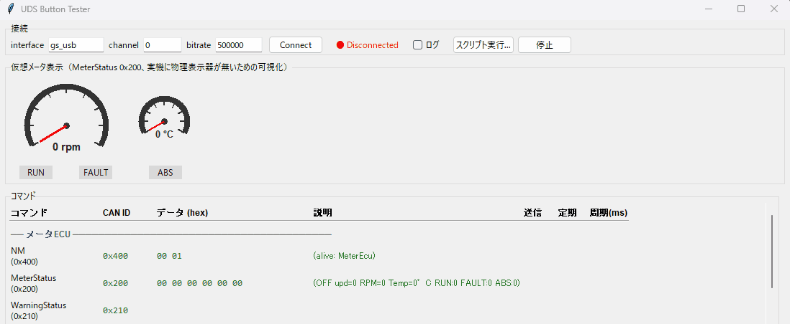
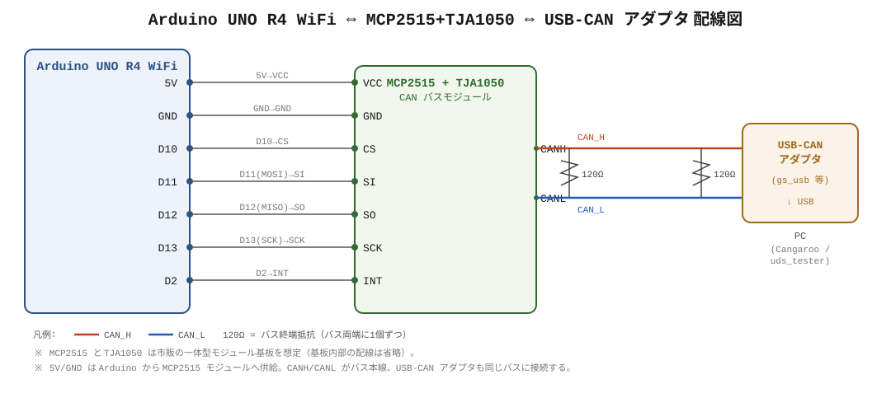

# arduino-autosar-my-study

Arduino UNO R4 WiFi + MCP2515 + TJA1050 を用いて 
AUTOSAR CP の BSW CAN スタックを学習目的で実装したプロジェクトです。
ARXML や設定ツールは使用せず、コードで階層構造・型定義・設定テーブルを再現しています。

## 目次

- [前文](#motivation)
- [概要](#overview)
- [ハードウェア](#hardware)
  - [ハードウェア構成](#hw-configuration)
    - [配線図](#wiring-diagram)
    - [MCP2515 接続（Arduino UNO）](#mcp2515-connection)
  - [ビルド環境・設定](#build-environment)
  - [ビルドと書き込み](#build-and-flash)
  - [ホスト上のテストと静的解析](#host-build)
- [ソフトウェア](#software)
  - [アーキテクチャ](#architecture)
    - [層構造](#layer-structure)
    - [モジュール一覧](#module-list)
    - [ディレクトリ構成](#directory-structure)
  - [CAN 通信スタック（Can_Hw / Can / CanIf / PduR / Com / E2E / E2EXf / E2EMon / Rte）](#can-stack)
  - [診断スタック（CanTp / Dcm / Dem / FiM / NvM）](#diag-stack)
  - [ECU 管理層（EcuM / BswM / WdgM）](#ecu-management)
  - [IO スタック（IoHwAb / Dio / Port / Adc）](#io-stack)
    - [処理の流れ（コールチェーン）](#processing-flow-io)
  - [アプリケーション（App_EngineManager / App_WarningIndicator）](#application)
- [テスト（動作確認）](#testing)
  - [単体テスト（ホスト上でのロジック検証）](#unit-test)
  - [静的解析（MISRA C:2012）](#static-analysis)
  - [実機へのシナリオ送信（tools/can_tool）](#can-tool-scenarios)
- [補足](#appendix)

<a id="motivation"></a>
## 前文

日本語話者が AUTOSAR Classic Platform (CP) を学ぼうとすると、
商用ツールの価格や学習環境の制約から、個人が実際に手を動かして理解することが難しい場面が多くあります。
本プロジェクトは、そうした学習コストを少しでも下げ、
安価なハードウェアで AUTOSAR CP の構造と CAN 通信を体験できる環境を提供するために作成しました。

<a id="overview"></a>
## 概要

本プロジェクトは、学習目的で AUTOSAR CP の ASW / RTE / BSW の 3 層アーキテクチャを
Arduino UNO 上に最小構成で再現しています。
その上でメータ ECU（インストルメントクラスタ）相当のアプリケーションを動作させることを目的としています。



> 上記は `tools/can_tool` の UDS Tester タブにある仮想メータ表示で、PC から CAN
> 経由で送信した EngineInfo/AbsInfo（本物の周辺 ECU が送信しているように
> E2E Profile05 で保護したフレーム）を Arduino が受信し、RPM・RUN/ABS 警告灯へ
> 反映している様子です
> （[デモ用スクリプト](tools/can_tool/capl_scripts/demo_realistic_engine.capl)）。

CAN 経由で受信するエンジン ECU（0x100）・ABS ECU（0x110）からの情報を警告灯制御へ
反映する、以下の入出力を持つメータ ECU です。

| フレーム | CAN ID | Tx<br>Rx | 内容 |
|---------|--------|----------|------|
| EngineInfo | 0x100 | Rx | エンジン ECU から回転数・水温・ON フラグを受信<br>（AUTOSAR E2E Profile 05 保護付き） |
| AbsInfo | 0x110 | Rx | ABS ECU から車速・ブレーキ作動・ABS 作動フラグを受信<br>（AUTOSAR E2E Profile 05 保護付き） |
| MeterStatus | 0x200 | Tx | エンジン状態（OFF / STARTING / RUNNING / FAULT）・回転数・3 本の警告灯状態（RUNNING/FAULT/ABS）を変化時送信＋周期フロア（ComFilterAlgorithm）<br>（AUTOSAR E2E 保護なし） |

<a id="hardware"></a>
## ハードウェア

<a id="hw-configuration"></a>
### ハードウェア構成

| 機器 | 用途 |
|------|------|
| Arduino UNO R4 WiFi | マイコン本体 |
| MCP2515 + TJA1050 | CAN コントローラ + トランシーバ |
| LED + 抵抗（220〜470 Ω）× 3 | RUNNING 灯（D6）/ FAULT 灯（D7）/ ABS 灯（D8）各 1 本 |
| プッシュボタン | 警告確認ボタン（D9 と GND を接続・内部プルアップ使用） |
| USB-CAN アダプタ | PC との CAN バス接続（解析用） |
| Cangaroo 等 | CAN フレーム送受信ツール |
| tools/can_tool（本リポジトリ同梱） | UDS コマンドのボタン送信・FC 自動応答（[詳細](tools/can_tool/README.md)） |

<a id="wiring-diagram"></a>
#### 配線図



<a id="mcp2515-connection"></a>
#### MCP2515 接続（Arduino UNO）

| Arduino ピン | MCP2515 ピン | 備考 |
|-------------|-------------|------|
| D10 | CS | SPI チップセレクト |
| D2 | INT | 受信割り込み（`attachInterrupt`、取りこぼし防止のためポーリングも併用） |
| D13 | SCK | SPI クロック |
| D11 | SI (MOSI) | SPI データ出力 |
| D12 | SO (MISO) | SPI データ入力 |

> **D13 は MCP2515 の SCK と共用されるため LED には使用できません。**
> LED は D6（RUNNING）・D7（FAULT）・D8（ABS）それぞれに 220〜470 Ω の抵抗を直列に挿入して接続してください。

> **警告確認ボタン（D9）** は D9 と GND の間にプッシュボタンを接続するだけです。
> Port が `INPUT_PULLUP` で初期化するため、外部プルアップ抵抗は不要です。
> ボタン押下時に D9 が GND と接続され `DIO_LOW` となり、`IoHwAb_Button_GetLevel()` 内で論理反転して「押下=1」に変換されます。

> CAN バスには両端に終端抵抗（120 Ω）が必要です。

<a id="build-environment"></a>
### ビルド環境・設定

| 項目 | 値 |
|------|-----|
| プラットフォーム | PlatformIO + Renesas RA (`platform = renesas-ra`) |
| ボード | Arduino UNO R4 WiFi (`board = uno_r4_wifi`) |
| フレームワーク | Arduino |
| 外部ライブラリ | coryjfowler/mcp_can @ ^1.5.1 |
| CAN ボーレート | 500 kbps |
| MCP2515 クリスタル | 8 MHz（`Can_CrystalFreqType` で変更可） |
| シリアルモニタ | 115200 bps |

<a id="build-and-flash"></a>
### ビルドと書き込み

```bash
# ビルド
pio run

# 書き込み
pio run --target upload

# シリアルモニタ
pio device monitor
```

<a id="host-build"></a>
### ホスト上のテストと静的解析

実機を使わず、PC 上で単体テストと MISRA C:2012 静的解析を実行できます
（CMake プリセット `native-chain` を使用。事前に環境変数 `LLVM_MINGW_BIN` へ
llvm-mingw の `bin` ディレクトリを設定してください）。

```bash
# 設定とビルド
cmake --preset native-chain
cmake --build --preset native-chain

# 単体テスト（GoogleTest）
build/native_chain/native_chain_tests.exe

# MISRA C:2012 静的解析（Cppcheck + misra アドオン）。レポートは build/native_chain/misra/ に出力
cmake --build --preset native-chain --target misra_check
```

テストの構成は [単体テスト](docs/unit_test.md)、MISRA の運用（逸脱の方針）は
`tools/misra/misra_suppressions.txt` を参照してください。

<a id="software"></a>
## ソフトウェア

<a id="architecture"></a>
### アーキテクチャ

<a id="layer-structure"></a>
#### 層構造

```
ASW ─── App_EngineManager / App_WarningIndicator / App_GptDemo
RTE ─── Rte（ポートベース S/R API + E2E Transformer 呼び出しグルー）
OS  ─── Os（タイムトリガスケジューラ）
BSW ─── EcuM / BswM / WdgM / WdgIf / Wdg / ComM / CanSM / Nm / CanNm / E2EXf / E2E / Com / PduR / SecOC / Csm / CryIf / Crypto / KeyM / CanIf / Can
        CanTp / Dcm / Dem / NvM / MemIf / Fee / IoHwAb / Dio / Port / Adc / SchM / Det / Mcu / Gpt
HAL ─── Can_Hw / Dio_Hw / Port_Hw / Adc_Hw / Mcu_Hw / Fee_Hw / Wdg_Hw / Gpt_Hw（src/Hal/ に集約）
```

各層は上位層のヘッダのみに依存し、下位層の実装詳細を知りません。

<a id="module-list"></a>
#### モジュール一覧

| 層 | モジュール | Id | AUTOSAR 仕様<br>API 実装数 | 概要 |
|---|---|---|---|---|
| ASW | App_<br>EngineManager | — | — | エンジン状態遷移 SWC (RUNNING/FAULT 等)<br>（[詳細](docs/modules/App_EngineManager_Notes.md)） |
|  | App_<br>WarningIndicator | — | — | 警告灯制御 SWC (LED 3灯)<br>（[詳細](docs/modules/App_WarningIndicator_Notes.md)） |
| RTE | Rte | — | — | SWC 間シグナル仲介 (RTE ミラー)・COM コールバック (`Rte_Cbk.h`)<br>（[詳細](docs/modules/Rte_Notes.md)） |
| OS | Os | — | SWS_Os<br>API 数は対象外<br>(協調スケジューラ。OSEK の API は未実装で、カウンタ API のみ実装) | タイムトリガスケジューラ・カウンタ API (`GetCounterValue` / `GetElapsedValue`、BSW の時刻取得窓口)<br>（[詳細](docs/modules/Os_Notes.md)） |
| BSW | Adc | 123 | SWS_Adc<br>API実装: 2 / 18<br>(一部意図的に簡略化) | アナログ入力ドライバ<br>（[詳細](docs/modules/Adc_Notes.md)） |
|  | BswM | 42 | SWS_BswM<br>API実装: 6 / 32<br>(一部意図的に簡略化) | BSW モード管理・状態遷移の一元制御<br>（[詳細](docs/modules/BswM_Notes.md)） |
|  | Can | 80 | SWS_Can<br>API実装: 10 / 16 | CAN コントローラドライバ (MCP2515)<br>（[詳細](docs/modules/Can_Notes.md)） |
|  | CanIf | 60 | SWS_CanIf<br>API実装: 16 / 35 | CAN コントローラ抽象化層<br>（[詳細](docs/modules/CanIf_Notes.md)） |
|  | CanNm | 31 | SWS_CanNM<br>API実装: 14 / 24 | ネットワークマネジメント (CAN NM)<br>（[詳細](docs/modules/CanNm_Notes.md)） |
|  | CanSM | 140 | SWS_CanSM<br>API実装: 8 / 19 | CAN ネットワーク状態管理 (Bus-Off 回復・CanNm 連携)<br>（[詳細](docs/modules/CanSM_Notes.md)） |
|  | CanTp | 35 | SWS_CanTp<br>API実装: 4 / 9<br>(一部意図的に簡略化) | ISO 15765-2 トランスポートプロトコル<br>（[詳細](docs/modules/CanTp_Notes.md)） |
|  | Com | 50 | SWS_Com<br>API実装: 22 / 32 | シグナルベース通信管理<br>（[詳細](docs/modules/Com_Notes.md)） |
|  | ComM | 12 | SWS_ComM<br>API実装: 16 / 28 | 通信マネージャ (チャネル状態集約)<br>（[詳細](docs/modules/ComM_Notes.md)） |
|  | CryIf | 112 | SWS_CryptoInterface<br>API実装: 6 / 17<br>パススルー<br>(下位が1個のため) | 暗号ドライバへのルーティング層<br>（[詳細](docs/modules/CryIf_Notes.md)） |
|  | Crypto | 114 | SWS_CryptoDriver<br>API実装: 6 / 18<br>(一部意図的に簡略化) | 暗号処理ドライバ (AES-128-CMAC)<br>（[詳細](docs/modules/Crypto_Notes.md)） |
|  | Csm | 110 | SWS_CryptoServiceManager<br>API実装: 7 / 74<br>(一部意図的に簡略化) | 暗号サービスマネージャ<br>（[詳細](docs/modules/Csm_Notes.md)） |
|  | Dcm | 53 | SWS_Dcm<br>API実装: 8 / 26<br>(一部意図的に簡略化) | UDS 診断通信マネージャ<br>（[詳細](docs/modules/Dcm_Notes.md)） |
|  | Dem | 54 | SWS_Dem<br>API実装: 11 / 108 | 診断イベント管理 (DTC)<br>（[詳細](docs/modules/Dem_Notes.md)） |
|  | Det | — | SWS_Det<br>API実装: 6 / 6<br>(一部意図的に簡略化) | 開発時エラー検出・ロギング<br>（[詳細](docs/modules/Det_Notes.md)） |
|  | Dio | — | SWS_Dio<br>API実装: 8 / 8<br>(一部意図的に簡略化) | デジタル入出力ドライバ<br>（[詳細](docs/modules/Dio_Notes.md)） |
|  | E2E | — | SWS_E2E<br>API実装: 13 / 43<br>(一部意図的に簡略化) | エンドツーエンド保護ライブラリ (Profile01/05)<br>（[詳細](docs/modules/E2E_Notes.md)） |
|  | E2EXf | 176 | SWS_E2ELibrary 12.4<br>(E2E Transformer)<br>API 数は対象外<br>(一部意図的に簡略化) | E2E トランスフォーマ (Rte⇔E2E ライブラリ統合)<br>（[詳細](docs/modules/E2EXf_Notes.md)） |
|  | E2EMon | — | — (独自 CDD 相当) | ネットワーク健全性モニタ (独自 CDD)<br>（[詳細](docs/modules/E2EMon_Notes.md)） |
|  | EcuM | 10 | SWS_EcuStateManager<br>API実装: 8 / 53 | ECU ステートマネージャ (起動・シャットダウン制御)<br>（[詳細](docs/modules/EcuM_Notes.md)） |
|  | Fee | 21 | SWS_Fee<br>API実装: 9 / 13<br>(一部意図的に簡略化) | フラッシュエミュレーション EEPROM ドライバ<br>（[詳細](docs/modules/Fee_Notes.md)） |
|  | FiM | 11 | SWS_FiM<br>API実装: 4 / 6<br>(一部意図的に簡略化) | 機能抑止マネージャ<br>（[詳細](docs/modules/FiM_Notes.md)） |
|  | Gpt | 100 | SWS_Gpt<br>API実装: 9 / 14<br>(一部意図的に簡略化) | 汎用タイマドライバ<br>（[詳細](docs/modules/Gpt_Notes.md)） |
|  | IoHwAb | 254 | AUTOSAR 抽象化層 | ボタン入力・センサ電圧のハードウェア抽象化<br>（[詳細](docs/modules/IoHwAb_Notes.md)） |
|  | KeyM | 116<br>(仮) | SWS_KeyManager<br>(Release 4.4.0)<br>API 数は対象外<br>(一部意図的に簡略化) | 鍵管理マネージャ<br>（[詳細](docs/modules/KeyM_Notes.md)） |
|  | Mcu | 101 | SWS_Mcu<br>API実装: 5 / 11<br>(一部意図的に簡略化) | マイコン初期化・リセット要因管理<br>（[詳細](docs/modules/Mcu_Notes.md)） |
|  | MemIf | 22 | SWS_MemIf<br>API実装: 7 / 9<br>パススルー<br>(下位が1個のため) | 不揮発メモリ抽象化層<br>（[詳細](docs/modules/MemIf_Notes.md)） |
|  | Nm | 29 | SWS_NetworkManagementInterface<br>API実装: 14 / 30<br>(一部意図的に簡略化) | ネットワークマネジメントインタフェース (ComM と CanNm の中継層。単一ネットワーク構成のため NM Coordinator は対応除外) |
|  | NvM | 20 | SWS_NvM<br>API実装: 7 / 23<br>(一部意図的に簡略化) | 不揮発メモリマネージャ<br>（[詳細](docs/modules/NvM_Notes.md)） |
|  | PduR | 51 | SWS_PduR<br>API 数は対象外<br>(一部意図的に簡略化) | PDU ルーティング層<br>（[詳細](docs/modules/PduR_Notes.md)） |
|  | Port | — | SWS_Port<br>API実装: 5 / 5<br>(一部意図的に簡略化) | ピン設定管理<br>（[詳細](docs/modules/Port_Notes.md)） |
|  | SchM | — | SWS_SchM<br>API 数は対象外<br>(一部意図的に簡略化) | 排他制御 (スケジューラマネージャ)<br>（[詳細](docs/modules/SchM_Notes.md)） |
|  | SecOC | 150 | SWS_SecureOnboard<br>Communication<br>API実装: 7 / 27<br>(一部意図的に簡略化) | メッセージ認証 (改ざん・なりすまし対策)<br>（[詳細](docs/modules/SecOC_Notes.md)） |
|  | Wdg | 102 | SWS_Wdg<br>API実装: 4 / 4<br>(一部意図的に簡略化) | ウォッチドッグドライバ<br>（[詳細](docs/modules/Wdg_Notes.md)） |
|  | WdgIf | 43 | SWS_WdgIf<br>API実装: 3 / 3<br>パススルー<br>(下位が1個のため) | ウォッチドッグ抽象化層<br>（[詳細](docs/modules/WdgIf_Notes.md)） |
|  | WdgM | 13 | SWS_WdgM<br>API実装: 11 / 11 | ウォッチドッグマネージャ (生存監視)<br>（[詳細](docs/modules/WdgM_Notes.md)） |
| HAL | Can_Hw | — | — | MCP2515 SPI ドライバ<br>（[詳細](docs/modules/Can_Notes.md)） |
|  | Dio_Hw | — | — | Arduino `digitalWrite`/`digitalRead` ラッパー |
|  | Port_Hw | — | — | Arduino `pinMode` ラッパー |
|  | Adc_Hw | — | — | Arduino `analogRead` ラッパー |
|  | SchM_Hw | — | — | Arduino `noInterrupts`/`interrupts` ラッパー |
|  | Mcu_Hw | — | — | リセット要因読み取り・起動時ウォッチドッグ無効化 |
|  | Fee_Hw | — | — | フラッシュエミュレーション EEPROM 読み書き |
|  | Wdg_Hw | — | — | 実 HW ウォッチドッグ制御 |
|  | Gpt_Hw | — | — | Renesas RA `FspTimer` ラッパー |

> 「API 実装数」の凡例: **API実装: N / M**=AUTOSAR SWS 4.3.1 が定義する API（コールバック・周期関数を含む）M 個のうち、関数本体を実装済みの数 N。残りはソースに `/* 未実装 */` と明記している／**(一部意図的に簡略化)**=実装済みの API にも、特定のモード・引数を対応除外したものがある（詳細は各モジュールのノート）／**パススルー**=下位ドライバが1個のみのため実質的に素通し／**API 数は対象外**=API 名がテンプレート型・設定依存、または仕様書が無いなどの理由で数えていない／**—**=対応する AUTOSAR 仕様が無い（ASW・RTE・HAL 層、または独自 CDD 相当）。
> 数字は `python tools/api_coverage/api_coverage.py` で集計し（`--update-readme` でこの表を更新、`--check-readme` で一致を検証）、仕様書の API 一覧は [tools/api_coverage/autosar_api_list.json](tools/api_coverage/autosar_api_list.json) に保存している。

ModuleId の出典は `docs/autosar/4.3.1/AUTOSAR_TR_BSWModuleList.pdf`（Release 4.3.1、「List of Basic Software Modules」表）。
AUTOSAR 仕様書 PDF は著作権のためリポジトリに含めていません（`.gitignore` 対象）。公式サイトの Release 4.3.1 から入手して配置してください。

<a id="directory-structure"></a>
#### ディレクトリ構成

```
├── src/                    # 製品コード
│   ├── main.cpp            # EcuM_Init / EcuM_MainFunction を呼ぶだけのエントリポイント
│   ├── Asw/                # アプリケーション SW-C（App_EngineManager / App_WarningIndicator / App_GptDemo）
│   ├── Rte/                # RTE（Rte.c、型定義 Rte_Type.h、COM コールバックのプロトタイプ Rte_Cbk.h）
│   ├── Os/                 # タイムトリガスケジューラ、カウンタ API（GetCounterValue / GetElapsedValue）
│   ├── Bsw/<Module>/       # BSW 各モジュール（<Module>.h/.c、<Module>_Cfg.h、<Module>_PBCfg.h/.c）
│   └── Hal/                # HW 依存部分（Can_Hw / Dio_Hw / Port_Hw / Adc_Hw / Mcu_Hw / Fee_Hw / Wdg_Hw / Gpt_Hw / Det_Hw / SchM_Hw）
├── test/                   # 単体テスト（GoogleTest、ホスト上で実行）
│   ├── test_main.cpp       # GoogleTest の main()（全テストで共通）
│   └── Bsw/<Module>/       # モジュール別のテストファイル（複数モジュールにまたがるものは <X>Stack/ など）
├── stub/                   # テスト用の差し替え（src/ と同じ構成。Fake_*=HW 差し替え、Wrap_*=--wrap による呼び出し記録）
├── tools/
│   ├── can_tool/           # UDS ボタン送信 / CAPL 風スクリプト / 信号エディタ（Python）
│   ├── misra/              # MISRA C:2012 静的解析（run_misra.py、逸脱リスト misra_suppressions.txt）
│   └── api_coverage/       # AUTOSAR API の実装数の集計（api_coverage.py、仕様書の API 一覧 autosar_api_list.json）
├── docs/
│   ├── modules/            # モジュール別ノート（<Module>_Notes.md）
│   ├── autosar/            # AUTOSAR 仕様書 PDF の置き場（.gitignore 対象）
│   ├── images/             # README 用の図
│   └── archive/            # 分割前の README（全文）
├── dbc/                    # CAN の DBC ファイル
├── data/                   # can_signal_editor の信号定義
├── scripts/                # カバレッジレポート生成
├── platformio.ini          # 実機ビルド（env: uno_r4）
├── CMakeLists.txt          # ホスト上のテスト・静的解析（プリセットは CMakePresets.json）
└── CMakePresets.json
```

各モジュールのファイルの役割は、上記「[モジュール一覧](#module-list)」表の各リンク先（`docs/modules/`）を参照してください。

---
<a id="can-stack"></a>
### CAN 通信スタック（Can_Hw / Can / CanIf / PduR / Com / E2E / E2EXf / E2EMon / Rte）

CAN ドライバ（Can / Can_Hw）から CanIf・PduR を経由して COM モジュールへ至るデータパスを担うスタックです。

```
TX（Arduino → 外部、下り）
  Rte → (E2EXf/E2E) → Com → PduR → CanIf → Can → Can_Hw → MCP2515

RX（外部 → Arduino、上り）
  MCP2515 → Can_Hw → Can → CanIf → PduR → Com → (E2EXf/E2E/E2EMon) → Rte
```

このスタックを構成する各モジュール（Rte/E2EMon/E2EXf/E2E/Com/PduR/CanIf/Can/Can_Hw）の
本プロジェクトでの役割は、上記「[モジュール一覧](#module-list)」表の「概要」列（リンク先の
`docs/modules/` 配下の個別ノート）を参照してください。CAN フレームのバイトレイアウトは
「[CAN フレーム仕様](docs/can_frame_spec.md#can-frame-spec)」（補足）を参照してください。

詳細は [CAN 通信スタック 詳細](docs/can_stack.md) を参照してください。

| 内容 | 参照先 |
|---|---|
| Tx 処理（Com → PduR → CanIf → Can） | [docs/can_stack.md](docs/can_stack.md#tx-processing) |
| Rx 処理（Can → CanIf → PduR → Com） | [docs/can_stack.md](docs/can_stack.md#rx-processing) |
| E2E 保護（Profile05） | [docs/can_stack.md](docs/can_stack.md#e2e-p01) |
| I-PDU Group（通信のライフサイクル） | [docs/can_stack.md](docs/can_stack.md#ipdu-group) |
| CAN 通信状態管理（ComM / CanSM / Nm / CanNm） | [docs/can_stack.md](docs/can_stack.md#can-comm-management) |

<a id="diag-stack"></a>
### 診断スタック（CanTp / Dcm / Dem / FiM / NvM）

UDS 診断（ISO 14229-1）を処理するスタックです。
CanTp が ISO 15765-2 のフレーム分割・組立を担い、Dcm が UDS サービスを処理します。
Dem は故障情報を DTC として管理し、NvM 経由で EEPROM に永続化します。
FiM は Dem が確定した DTC をもとにアプリ機能の実行許可を判定します。
診断フレームはアプリデータ（0x100 / 0x110 / 0x200）とは独立した CAN ID（0x7E0 / 0x7E8）で通信します。

このスタックを構成する各モジュール（CanTp/Dcm/Dem/FiM/NvM）の本プロジェクトでの役割は、
上記「[モジュール一覧](#module-list)」表の「概要」列（リンク先の `docs/modules/` 配下の
個別ノート）を参照してください。

UDS 手動送信ツール（`tools/can_tool`）と CAPL 風スクリプトは、[tools/can_tool/README.md](tools/can_tool/README.md) を参照してください。

<a id="ecu-management"></a>
### ECU 管理層（EcuM / BswM / WdgM）

ECU の起動・シャットダウンのライフサイクルと、タスク制御・ソフトウェア監視を担うモジュール群です。
EcuM が状態遷移を決定し、BswM がその状態に応じたタスクの有効・無効を制御し、WdgM がタスク内部の動作を監視します。

このスタックを構成する各モジュール（EcuM/BswM/WdgM）の本プロジェクトでの役割は、上記
「[モジュール一覧](#module-list)」表の「概要」列（リンク先の `docs/modules/` 配下の
個別ノート）を参照してください。

> CAN バス通信の有効・無効（NO_COM/FULL_COM）を管理する ComM・CAN コントローラの
> 状態遷移（Bus-Off 回復・スリープ/ウェイクアップ）を担う CanSM・ネットワーク
> マネジメントを担う CanNm は、実 AUTOSAR では EcuM/BswM/WdgM（System Services）とは
> 別クラスタ（Communication Services、Com/PduR と同じ側）に属します。本プロジェクトの
> 実装でも、`BswM.c` は `BswM_ComM_CurrentMode()` という受動的なコールバックのみで
> ComM/CanSM を呼ばず、`WdgM.c` は ComM/CanSM と一切無関係、`EcuM.c` からの呼び出しも
> Init 時と `ComM_RequestComMode()` の2箇所に限られます。実際のコールグラフの密度は
> CanIf/Can 側にあるため、ComM/CanSM/CanNm は
> 「[CAN 通信状態管理](docs/can_stack.md#can-comm-management)」として CAN 通信スタック側にまとめ、
> EcuM/BswM が関わる箇所はそちらのコールチェーン図中に個別に注釈しています。

---
<a id="io-stack"></a>
### IO スタック（IoHwAb / Dio / Port / Adc）

SW-C はピン番号を直接知りません。RTE の Client/Server ポートを通じて IoHwAb の論理 API を呼び出し、
IoHwAb が Dio / Adc チャネルへ変換します。ピン方向の初期設定は Port が担い、Dio は値の読み書きのみ、
Adc はアナログ入力の読み取りのみを行います。

このスタックを構成する各モジュール（IoHwAb/Dio/Port/Adc）の本プロジェクトでの役割は、
上記「[モジュール一覧](#module-list)」表の「概要」列（リンク先の `docs/modules/` 配下の
個別ノート）を参照してください。

<a id="processing-flow-io"></a>
#### 処理の流れ（コールチェーン）

SW-C から LED/ボタン/ADC それぞれへの関数コールチェーンと、Port による起動時のピン方向設定をまとめます。

```
SW-C (App_EngineManager / App_WarningIndicator)
  │ Rte_Call_LedRunning_SetLevel / Rte_Call_Button_GetLevel / Rte_Call_Adc_GetValue_mV 等
  ↓
IoHwAb（論理 API：LED / ボタン / ADC）
  │ Dio_WriteChannel / Dio_ReadChannel          │ Adc_ReadChannel
  ↓                                              ↓
Dio（値の読み書き）                             Adc（生値読み取り）
  │ Dio_Hw_WriteChannel / Dio_Hw_ReadChannel      │ Adc_Hw_ReadChannel
  ↓                                              ↓
Dio_Hw（Arduino digitalWrite / digitalRead）    Adc_Hw（Arduino analogRead）

Port_Init（起動時 1 回のみ）
  └→ Port_Hw_SetPinDirection(D6/D7/D8, OUTPUT)
     Port_Hw_SetPinDirection(D9, INPUT_PULLUP)
     (A0 はアナログ専用ピンのため Port 設定不要)
```

<a id="application"></a>
### アプリケーション（App_EngineManager / App_WarningIndicator）

ASW（Application Software）層の SW-C（Software Component）2 つで構成されます。
各 SW-C は RTE ポート経由でシグナルを受け取り、IoHwAb ポート経由で LED / ボタンを操作します。
EcuM の POST_RUN 遷移時に Rte_Engine タスクと Rte_Warning タスクが停止し、SW-C も停止します。

このスタックを構成する各モジュール（App_EngineManager/App_WarningIndicator）の本プロジェクト
での役割は、上記「[モジュール一覧](#module-list)」表の「概要」列（リンク先の `docs/modules/`
配下の個別ノート）を参照してください。

---
<a id="testing"></a>
## テスト（動作確認）

ホスト上での単体テスト、MISRA C:2012 静的解析、`tools/can_tool` による実機へのシナリオ送信、
の 3 つの手段で検証します。

<a id="unit-test"></a>
### 単体テスト（ホスト上でのロジック検証）

実 HW を使わず、BSW モジュールのロジックを PC 上で GoogleTest により検証します。
単一モジュールのテストも、複数モジュールにまたがる関数コールチェーンのテストも、
`native_chain_tests` という 1 つのテストバイナリにまとめています（2026-10 時点で 858 件）。

- **ビルド**: PlatformIO ではなく CMake + clang++（llvm-mingw）。手順は
  「[ホスト上のテストと静的解析](#host-build)」を参照
- **配置**: テストは `test/Bsw/<Module>/`、差し替え（HAL の Fake、`--wrap` による呼び出し記録）は
  `src/` と同じ構成で `stub/` に置く
- **粒度**: ファイル名は `Bsw_<Module>_<Scenario>_test.cpp`。1 つの正常系（OK）シナリオにつき
  1 ファイルとし、そのシナリオから派生する異常系（NG）は同じファイルに置く
- **コールチェーンのテスト**: Tx/Rx 処理（通常・E2E・デッドライン監視）、診断（UDS）、ネットワーク
  管理（スリープ協調）などを、実モジュールをリンクして関数呼び出しの連なりごと検証する
- **カバレッジ**: `native-chain-coverage` プリセットで MC/DC を含むカバレッジを計測できる
  （`scripts/generate_coverage_report.sh`）

テスト構成の詳細、初期化状態のリセット、Det エラー報告の NG テストなどは
[docs/unit_test.md](docs/unit_test.md) を参照してください。

<a id="static-analysis"></a>
### 静的解析（MISRA C:2012）

Cppcheck の MISRA アドオンで、`src/` 配下の C ソース（`src/Hal/` と C++ は対象外）を解析します。
実行方法は「[ホスト上のテストと静的解析](#host-build)」を参照してください
（`cmake --build --preset native-chain --target misra_check`）。

- **ツール**: Cppcheck + misra アドオン。PlatformIO のツールパッケージ
  （`pio pkg install -g --tool platformio/tool-cppcheck`）と、その Python を使う
- **結果**: 指摘ごとのルール別件数が標準出力に出る。詳細は `build/native_chain/misra/misra_report.txt`。
  現在の指摘は 0 件で、新しい指摘が出た場合は、修正するか逸脱として記録する
- **逸脱（deviation）**: ルール単位の逸脱は `tools/misra/misra_suppressions.txt`、個別箇所の逸脱は
  該当行の直前に `/* cppcheck-suppress <ルール> */` を置いて記録する。いずれも理由を併記し、判断基準
  （AUTOSAR 仕様で規定されている、ツールの過剰指摘、など）は `misra_suppressions.txt` に書いている
- **注意**: MISRA の規則文は著作権のためツールに含まれず、ルール番号のみが表示される

<a id="can-tool-scenarios"></a>
### 実機へのシナリオ送信（tools/can_tool）

PC から CAN 経由で診断要求や EngineInfo/AbsInfo を送り、実機の挙動をシリアルログで確認します。
ボタン送信や CAPL 風スクリプトによる手順化は [tools/can_tool/README.md](tools/can_tool/README.md) を
参照してください。実機のシリアルログの例は、分割前の README
（[旧 README](docs/archive/README_2026-10-03.md#serial-log-example)）に残しています。

<a id="appendix"></a>
## 補足

- [CAN フレーム仕様](docs/can_frame_spec.md)
- [設計上の注意点](docs/design_notes.md)
- [旧 README（分割前の全文、シリアルモニタ出力例を含む）](docs/archive/README_2026-10-03.md)
