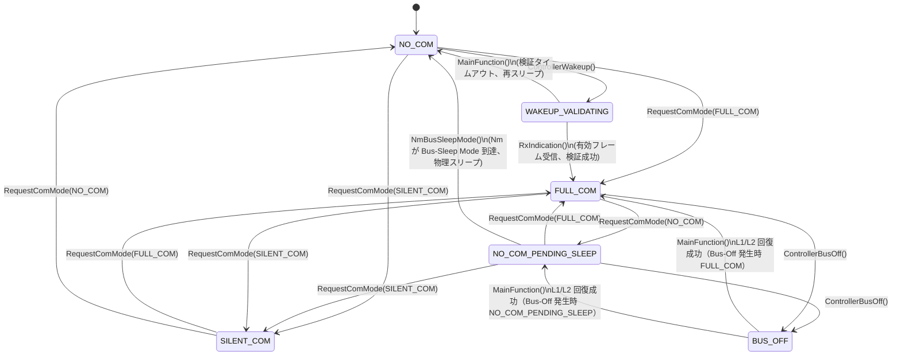

# CanSM

> [README](../../README.md) の「[CAN 通信状態管理](../../README.md#can-comm-management)」節から分離
> （旧「ECU 管理層」節から移動。実 AUTOSAR では EcuM/BswM/WdgM とは別クラスタ
> [Communication Services] に属するため）。

Bus-Off 検出直後（回復試行の前）に `ComM_BusSM_ModeIndication(SILENT_COMMUNICATION)` を
呼び、ComM のチャネル状態が回復完了まで FULL_COM のまま古い情報として残ることを
防ぐ（SWS_CanSM_00521。SILENT_COM は EcuM の RUN を維持するため回復中も RUN は
落ちない）。受け付ける Bus-Off はコントローラが物理的に稼働中の状態（FULL_COM、
および Nm の Bus-Sleep Mode 到達待ちで HW が稼働継続する NO_COM_PENDING_SLEEP）
のみで、回復シーケンスは L1/L2 バックオフ（SWS_CanSM_00514/00515 準拠）で実施し、
試行回数が `CANSM_BUSOFF_L1_TO_L2_COUNT` を超えるまでは短い周期（L1）でリトライし、
超えたら Dem へ DTC を報告（limit=1 のため即座に確定）した上で長い周期（L2）へ
切り替えて無期限にリトライを継続する（回復を諦めて停止する状態は存在しない）。
再起動試行のたびに、Bus-Off 発生時点の状態（FULL_COM か NO_COM_PENDING_SLEEP か）
へ復帰させる（`CanSM_BusOffFromPendingSleep`、後者の場合は誤って FULL_COM へ
戻さない）。ComM の NO_COM 要求によるボランタリスリープでは即座にはスリープせず、
Nm（CanNm 状態機械）が Bus-Sleep Mode へ到達した通知（`CanSM_NmBusSleepMode()`）を
受けてから `Can_SetControllerMode(CAN_T_SLEEP)` で実 HW を実際にスリープさせる
（協調スリープ、詳細は [`Nm_Notes.md`](./Nm_Notes.md) 参照）。`CanSM_ControllerWakeup()`
による復帰経路を持ち、復帰は即座に確定せず、ウェイクアップ検証（Wakeup Validation
Protocol 相当）により有効な CAN フレーム受信を確認してから FULL_COM へ確定する。

## 状態遷移

`CanSM_InternalStateType`（`CanSM.c`）が持つ6状態と、意図された遷移を図示します
（実装上到達可能な、図にない遷移が1点あります。図の直後の注記を参照）。
`NO_COM` と `NO_COM_PENDING_SLEEP` は見た目が近いですが別状態です。前者は
コントローラが物理的にスリープ済み（または未起動）、後者は NO_COM 要求済みだが
Nm が Bus-Sleep Mode に到達するまでコントローラが稼働継続中、という違いがあります
（詳細は上記本文および [`Nm_Notes.md`](./Nm_Notes.md) 参照）。`BUS_OFF` 中は
`CanSM_RequestComMode()` 冒頭のガードにより ComM からの要求を一切受け付けません
（`RequestComMode` からの遷移元に `BUS_OFF` が登場しないのはそのため）。

> **図にない遷移（`WAKEUP_VALIDATING` からの `RequestComMode()`）**: `CanSM_RequestComMode()`
> 冒頭のガードは `BUS_OFF` しかチェックしておらず、`WAKEUP_VALIDATING` 中に呼ばれても
> 素通りする。`RequestComMode(FULL_COM)` は `CanSM_RxIndication()` による検証を経ずに
> 直接 `FULL_COM` へ、`RequestComMode(NO_COM)` は `Can_SetControllerMode(CAN_T_SLEEP)`
> を呼ばないまま状態だけ `NO_COM` にしてしまい、コントローラが Listen-Only
> （`CAN_CS_STOPPED`）のまま起きた状態で残る（`NO_COM` の「物理的にスリープ済み」
> という不変条件と矛盾する）。ただし `ComM_RequestComMode()` の呼び出し元
> （`App_EngineManager.c`/`Dcm_Cbk.c`）はいずれも `BswM_Cfg.h` の
> `BSWM_TASK_MASK_SHUTDOWN` により SHUTDOWN 中（`WAKEUP_VALIDATING` が
> 発生しうる唯一の期間）は駆動タスクごと無効化されるため、現状この経路は
> 実機到達不能である（2026-08 のレビューで発見。コード側のガードは、この
> 到達不能性が CanSM 自身の設計ではなく BswM 側のスケジューリングという
> 別モジュールの都合に依存しているため、あえて追加していない）。

## 開発の経緯（実機で見つかった不具合・設計変更）

> 現在の仕様を理解するだけなら読む必要はありません。実機検証で見つかった
> 不具合や、その結果としての設計変更の経緯を時系列でまとめています。

### Bus-Off 回復断念設計の撤去

以前は Bus-Off の回復リトライを一定回数（既定 3 回）で断念し、専用の恒久
スリープ（AUTOSAR 標準外の `Can_EnterFinalSleep()`）へ落とす設計だった。
外部レビューで AUTOSAR 仕様（SWS_CanSM_00514/00515/00636）を確認したところ、
「回復を諦めて二度と復帰しない」状態はそもそも仕様に存在しないことが判明した。
仕様が定めるのは L1（短い間隔）→ L2（長い間隔）の二段階バックオフのみで、
無期限にリトライを継続する設計である。

これを受けて `Can_EnterFinalSleep()` とその呼び出し経路（`Can.c`/`Can.h`/
`Can_Hw.h`/`Can_Hw.cpp` の `CAN_HW_MODE_SLEEP_FINAL` を含む）を全て撤去し、
`CANSM_BUSOFF_RECOVERY_L1_MS`/`_L2_MS`/`CANSM_BUSOFF_L1_TO_L2_COUNT` による
L1/L2 バックオフに置き換えた。あわせて Bus-Off 検出直後（回復試行の前）に
`ComM_BusSM_ModeIndication(SILENT_COMMUNICATION)` を呼ぶようにし（SWS_CanSM_00521）、
ComM のチャネル状態が回復完了まで FULL_COM のまま古い情報として残ることを
防いだ。

この設計変更は EcuM 側にも影響した。EcuM に「同一ユーザからの重複 RUN 要求」
検知（SWS_EcuM_04125/04127）を追加したところ、CanSM の Bus-Off L1/L2
バックオフがリトライ成功のたびに `ComM_BusSM_ModeIndication(FULL_COM)` を呼ぶ
（RUN を解放していないため）ことと衝突し、重複要求ログが頻発する状態に
なった。これを避けるため `ComM_BusSM_ModeIndication()` はチャネルモードが実際に
変化した時のみ `EcuM_RequestRUN()`/`EcuM_ReleaseRUN()` を呼ぶよう修正した。

（README 該当箇所: [CAN コントローラの実スリープ](../../README.md#can-コントローラの実スリープcan_setcontrollermodecan_t_sleep)）

### NO_COM_PENDING_SLEEP 中の Bus-Off 見逃し

AUTOSAR 仕様書（SWS_CanSM）とのスペック監査で、`CanSM_ControllerBusOff()` が
`CANSM_STATE_FULL_COM` からの Bus-Off しか受け付けていないことが判明した。
Nm 協調スリープ導入時に追加された `CANSM_STATE_NO_COM_PENDING_SLEEP`（「もう
通信は不要だが Nm が Bus-Sleep Mode へ到達するまでコントローラは稼働継続」する
状態）は、コントローラが物理的に稼働中でありうる点で FULL_COM と同じなのに、
このガードの対象に含まれていなかった。この状態中に実際に Bus-Off が発生すると、
回復シーケンスが一切起動しないまま HW が Bus-Off し続ける不具合だった。

単純にガードを緩めるだけでは別の不具合を誘発することも判明した。Bus-Off 回復
（`CanSM_MainFunction()`）は無条件に `CANSM_STATE_FULL_COM` へ復帰させる実装
だったため、NO_COM_PENDING_SLEEP 中に発生した Bus-Off から回復すると「もう
通信不要」だった意図を上書きしてしまい、誰も再要求しないため二度と NO_COM
（ボランタリスリープ）へ戻れず FULL_COM に取り残される。これを避けるため、
Bus-Off 発生時点の状態を `CanSM_BusOffFromPendingSleep` フラグで記憶し、回復後
も元の意図（FULL_COM か NO_COM_PENDING_SLEEP か）を復元するようにした。

この修正の検証中、`ComM_BusSM_ModeIndication()` の重複呼び出し防止ロジック
（`Mode != prevMode` 判定）にも別の潜在バグが見つかった。Bus-Off 検出時に
一時的に挟まる `COMM_SILENT_COMMUNICATION`（EcuM の RUN 状態には無関係）を
経由すると、回復時の FULL_COM/NO_COM 通知が「SILENT_COM からの変化」として
見えてしまい、`EcuM_RequestRUN()`/`EcuM_ReleaseRUN()` が不要に再度呼ばれ、
`ECUM_E_MULTIPLE_RUN_REQUESTS`/`ECUM_E_MISMATCHED_RUN_RELEASE` を誤検知する
（FULL_COM 経由でも元々存在した不具合で、今回の修正は NO_COM_PENDING_SLEEP
側にも同じクラスの問題を広げただけだった）。`ComM_EcuMRunMode` という専用の
内部状態（EcuM へ最後に伝えた FULL/NO_COM の別。SILENT_COM では更新しない）
で判定するよう修正し、あわせて解消した。

さらに、`CanSM_ControllerBusOff()` のガードが `CANSM_STATE_SILENT_COM` を
「コントローラは必ず停止済み」という前提で除外していたが、`CanSM_RequestComMode()`
の SILENT_COMMUNICATION 分岐は元々 `CANSM_STATE_FULL_COM` からの遷移でしか
コントローラを停止していなかった。NO_COM_PENDING_SLEEP から SILENT_COM への
遷移が公開 API `ComM_RequestComMode()` 経由で到達可能な経路として残っていたため、
この分岐も NO_COM_PENDING_SLEEP を含むよう修正し、不変条件を実際に成立させた
（現状のアプリケーションコードはこの経路を使わないため潜在バグの段階だった）。

**実機検証の顛末**: NO_COM_PENDING_SLEEP 中の Bus-Off パスは、狙って実機で
直接再現させるのが難しかった。CAN-USB アダプタを物理的に外して相手ノードを
完全に消しても Bus-Off が発生しなかった理由は、`Nm_MainFunction()` の
`NM_STATE_READY_SLEEP` ケース（`Nm.c`）が送信を一切行わない設計（ログの
"Ready Sleep State (tx stopped)" の通り）であり、かつ Com の TX I-PDU
グループも `Com_IpduGroupStop()` で停止済みのため、NO_COM_PENDING_SLEEP から
実際のスリープまでの数秒間はほぼ何も送信されないためだった。TX 連続失敗を
トリガとする Bus-Off（一次検出の EFLG.TXBO も、送信しなければ TEC が上がら
ないため同様）は、この区間内では構造的にほぼ発生しえない。最終的に、
FULL_COM 経路（相手ノード不在による自然発生 Bus-Off、実機で 10 回以上反復
実証済み。EcuM 側の DET 誤検知なしも確認）と同一のコードパスを通ることに
よる間接的な検証と、コードレビューをもって十分と判断した。

（README 該当箇所: [CAN 通信状態管理（ComM / CanSM / Nm）](../../README.md#can-comm-management)）
